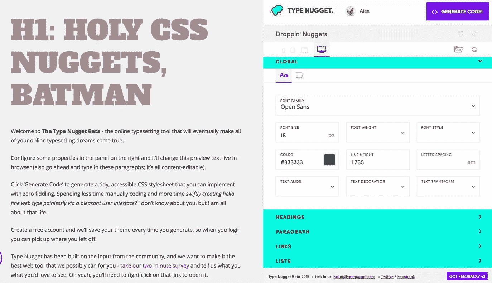
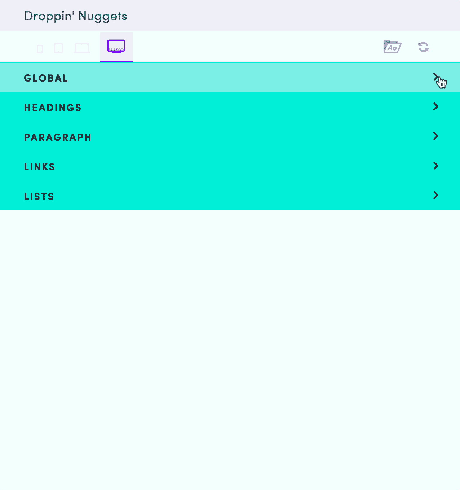
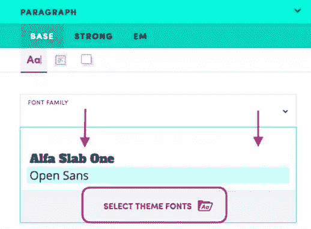
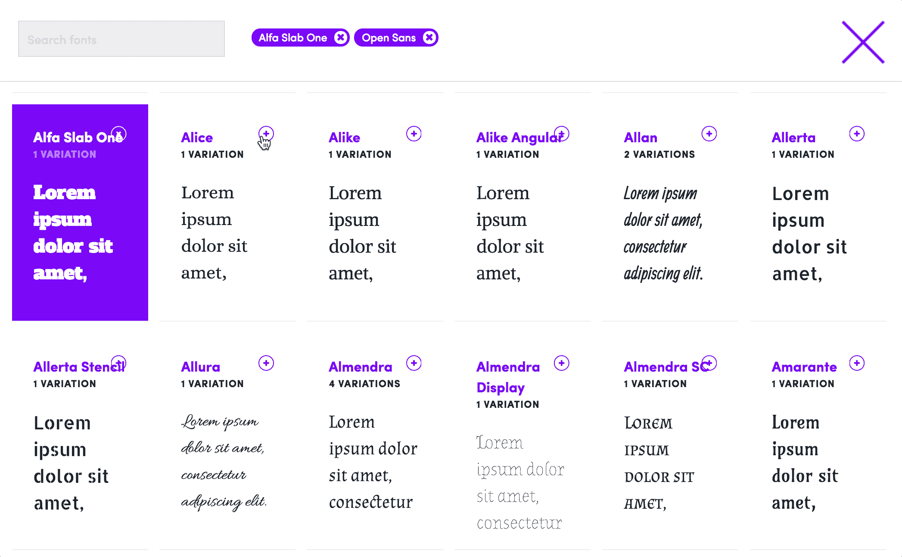
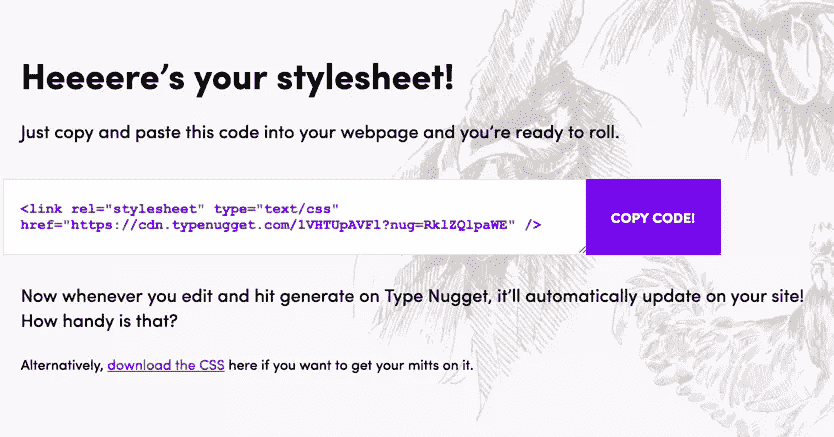

# 类型金块:好的排版是关于找到正确的操场

> 原文：<https://www.sitepoint.com/type-nugget-good-typography-finding-right-playground/>

这是网络排版的黄金时代——至少相对而言是这样。

在花了近 20 年的时间在时代、Helvetica、Arial 和 Courier 的小设计沙坑中工作后，我们现在有能力在页面或应用程序上嵌入几乎任何我们喜欢的字体(也不需要华丽的黑客)。

我们的工具跟上了吗？我认为可能不会。

虽然在线字体服务提供了数千种免费的可嵌入字体，但在 Sketch、Illustrator、Photoshop 甚至 XD 中尝试这些字体很难做到天衣无缝。

好的字体设计往往是反复试验的结果。虽然合理的排版原则总是有助于指导你，但许多奇妙的字体组合在理论上不应该这么好。

因此，这里有一个有前途的新的免费工具，以帮助您的排版调整。

## 熔核类型

Type Nugget 是一个方便的网络应用程序，旨在成为游戏和实验的地方。它将一个广泛的外部字体列表与强大的 CSS 控件结合在一起，让你调整自己的方式，以吸引人的类型。

## 用户界面

Type Nugget UI 分为左右两半——左边是实时预览，右边是控件。你的字体样式有五个相当合理的类别，很好地组织成一个可折叠的菜单。

1.  **全局字体样式**:包括背景色
2.  **标题**:H1-H6
3.  **段落**:基本文本，强调
4.  **链接**:悬停、活动、已访问
5.  **列表**:有序列表，无序列表&列表项

每个折叠面板都提供了您想要访问的所有相关 CSS 文本属性，包括`font-style`到`letter-spacing`到`text-align`到`text-transform`。

## 导入外部字体

对我来说，Type Nugget 最有趣的部分是能够玩字体。将字体添加到收藏中很容易。点击“字体系列”下拉菜单，打开“*选择主题字体*”选项。

这将启动一个滚动模式窗口，让您浏览数百种字体，并收集您喜欢的字体。据我所知，Type Nugget 目前只提供谷歌字体——尽管没有什么能阻止他们在未来增加其他字体服务。你的字体聚集在顶部。

类型选择屏幕与谷歌字体最近的用户界面重新设计有很多相似之处。这不是一件坏事——这是一个很好的用户界面。

## 生成您的 CSS

当你对文本的外观感到满意时，点击“生成代码”按钮，你就会看到这样的屏幕。

如你所见，底部的链接允许你获取 CSS 的副本。

更有趣的是，掘金类型还在他们的 CDN 上提供了你的 CSS 的链接。你可以把链接直接粘贴到你的 HTML 的顶部，并立即看到它的运行。

实际上，我怀疑你会希望你的 CSS 是本地的——回到 Type Nugget 来做一些小的调整似乎是不必要的。尽管如此，这是一个很好的信仰展示。我们不仅会帮你设计发型，还会帮你上菜！’。

## 总结

掘金型并不完美。它仍处于测试阶段，并暗示未来它可以根据不同的屏幕尺寸重新设计你的字体。虽然这很酷，但我还是宁愿现在不知道这件事。然后当它到达的时候，它是一个'*哇！*‘而不是’*关于时间！*’。

但是我很挑剔。即使在这个测试阶段，我认为掘金类型对设计师来说也有一些真正的价值。检查一下，让我知道你的想法。

*原载于 [SitePoint 设计简讯](https://www.sitepoint.com/newsletter/)* 。

## 分享这篇文章