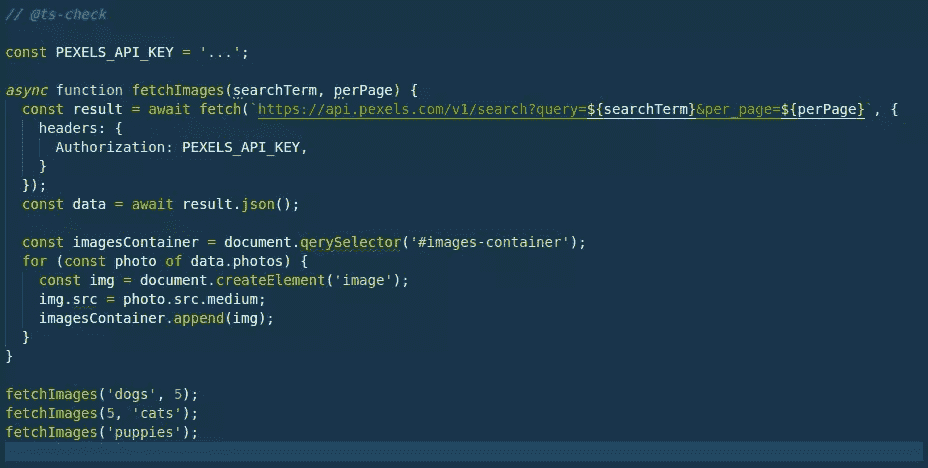
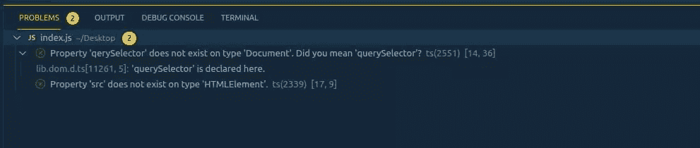

# 初学者的一步一步打字教程

> 原文：<https://www.sitepoint.com/typescript-tutorial-for-beginners/>

你可能听说过 TypeScript——这种由微软创建和维护的语言对网络产生了巨大的影响，许多著名的项目都采用了 TypeScript 并将其代码移植到 TypeScript 上。TypeScript 是 JavaScript 的类型化超集。换句话说，它给 JavaScript 添加了*类型*——因此得名。但是你为什么想要这些类型的呢？它们带来了什么好处？你需要重写你的整个代码库来利用它们吗？这些问题，以及更多的问题，都将在这本面向初学者的 TypeScript 教程中得到解答。

我们假设您对 JavaScript 及其工具有基本的了解，但是您不需要了解任何关于 TypeScript 的知识。

## 一些错误的 JavaScript 代码

首先，让我们看一些您可能在任何给定代码库中遇到的相当标准的普通 JavaScript 代码。它从 [Pexels API](https://www.pexels.com/api/) 获取一些图像，并将它们插入 DOM。

然而，这段代码中有几个会导致问题的错别字。看看你是否能认出他们:

```
const PEXELS_API_KEY = '...';

async function fetchImages(searchTerm, perPage) {
  const result = await fetch(`https://api.pexels.com/v1/search?query=${searchTerm}&per_page=${perPage}`, {
    headers: {
      Authorization: PEXELS_API_KEY,
    }
  });
  const data = await result.json();

  const imagesContainer = document.qerySelector('#images-container');
  for (const photo of data.photos) {
    const img = document.createElement('image');
    img.src = photo.src.medium;
    imagesContainer.append(img);
  }
}

fetchImages('dogs', 5);
fetchImages(5, 'cats');
fetchImages('puppies'); 
```

你能发现上面例子中的问题吗？当然，如果您在浏览器中运行这段代码，您会立即得到错误，但是通过利用 TypeScript，我们可以通过让 TypeScript 在我们的编辑器中发现这些问题来更快地得到错误。

缩短这个反馈循环是有价值的——而且随着项目规模的增长，它变得更有价值。在这 30 行代码中发现错误是很容易的，但是如果你在一个有数千行代码的代码库中工作呢？你会很容易发现任何潜在的问题吗？

*注意:没有必要从 Pexels 获得 API 密匙来跟随本 TypeScript 教程。然而，如果你想运行代码，API 密匙是完全免费的:你只需要[注册一个账户](https://www.pexels.com/onboarding/)，然后生成一个。*

## 从编辑器运行 TypeScript

曾几何时，TypeScript 要求所有文件都写成`.ts`文件。但如今，入职的过程更加顺畅了。您不需要一个 TypeScript 文件来编写 TypeScript 代码:相反，我们可以在任何我们喜欢的 JavaScript 文件上运行 TypeScript！

如果您是 VS 代码用户(如果不是，请不要惊慌——我们会找到您的！)，这将在没有任何额外要求的情况下解决这个问题。我们可以通过将它添加到 JavaScript 文件的最顶端来启用 TypeScript 检查(重要的是它是第一行):

```
// @ts-check 
```

然后你会在编辑器中看到一些红色的错误，突出我们的错误，如下图所示。



您还应该看到左下角有一个十字，旁边有一个 2。点击这个就会发现已经发现的问题。



仅仅因为你没有使用 VS 代码并不意味着你不能获得同样的处理 TypeScript 高亮错误的经验。如今，大多数编辑器都支持语言服务器协议(通常称为 LSP)，这是 VS 代码用来支持其 TypeScript 集成的。

很值得在网上搜索找到你的编辑器和推荐的插件来设置它。

## 在本地安装和运行 TypeScript

如果您没有使用 VS 代码，或者您想要一个通用的解决方案，您也可以在命令行上运行 TypeScript。在这一节中，我将向您展示如何操作。

首先，让我们生成一个新项目。该步骤假设您已经在机器上安装了[节点和 npm:](https://www.sitepoint.com/quick-tip-multiple-versions-node-nvm/)

```
mkdir typescript-demo
cd typescript demo
npm init -y 
```

接下来，将 TypeScript 添加到项目中:

```
npm install --save-dev typescript 
```

注意:你可以在你的机器上全局安装 TypeScript，但是我喜欢按项目安装。这样，我确保我可以准确地控制每个项目使用的 TypeScript 版本。如果你有一个你已经有一段时间没有接触的项目，这是很有用的；您可以在该项目中继续使用较旧的 TS 版本，同时让较新的项目使用较新的版本。

安装完成后，您可以运行 TypeScript 编译器(`tsc`)来获得相同的错误(不要担心这些额外的标志，因为我们很快就会谈到它们):

```
npx tsc index.js --allowJs --noEmit --target es2015
index.js:13:36 - error TS2551: Property 'qerySelector' does not exist on type 'Document'. Did you mean 'querySelector'?

13   const imagesContainer = document.qerySelector('#images-container');
                                      ~~~~~~~~~~~~

  node_modules/typescript/lib/lib.dom.d.ts:11261:5
    11261     querySelector<K extends keyof HTMLElementTagNameMap>(selectors: K): HTMLElementTagNameMap[K] | null;
              ~~~~~~~~~~~~~~~~~~~~~~~~~~~~~~~~~~~~~~~~~~~~~~~~~~~~~~~~~~~~~~~~~~~~~~~~~~~~~~~~~~~~~~~~~~~~~~~~~~~~
    'querySelector' is declared here.

index.js:16:9 - error TS2339: Property 'src' does not exist on type 'HTMLElement'.

16     img.src = photo.src.medium;
           ~~~

Found 2 errors. 
```

您可以看到命令行上的 TypeScript 突出显示了与上面截图中 VS 代码突出显示的相同的 JavaScript 代码错误。

## 修复 JavaScript 代码中的错误

现在我们已经启动并运行了 TypeScript，让我们看看如何理解并纠正 TypeScript 标记的错误。

让我们来看看我们的第一个错误。

### 类型`Document`上不存在属性`qerySelector`

```
index.js:13:36 - error TS2551: Property 'qerySelector' does not exist on type 'Document'. Did you mean 'querySelector'?

13   const imagesContainer = document.qerySelector('#images-container');

  node_modules/typescript/lib/lib.dom.d.ts:11261:5
    11261     querySelector<K extends keyof HTMLElementTagNameMap>(selectors: K): HTMLElementTagNameMap[K] | null;
              ~~~~~~~~~~~~~~~~~~~~~~~~~~~~~~~~~~~~~~~~~~~~~~~~~~~~~~~~~~~~~~~~~~~~~~~~~~~~~~~~~~~~~~~~~~~~~~~~~~~~
    'querySelector' is declared here. 
```

如果您不习惯阅读类型脚本错误，这看起来可能会令人不知所措，所以如果它看起来有点奇怪，请不要惊慌！TypeScript 发现，在第`13`行，我们调用了一个方法`document.qerySelector`。我们的意思是`document.querySelector`,但是在打字时出错了。当我们试图在浏览器中运行我们的代码时，我们会发现这一点，但是 TypeScript 能够让我们更快地意识到这一点。

下一部分重点介绍了`lib.dom.d.ts`和`querySelector<K...>`函数，深入到更高级的 TypeScript 代码中，所以现在还不用担心，但是从高层次上来说，TypeScript 向我们展示了它理解有一个名为`querySelector`的方法，并且它怀疑我们可能需要这个方法。

现在让我们放大上面错误消息的最后一部分:

```
index.js:13:36 - error TS2551: Property 'qerySelector' does not exist on type 'Document'. Did you mean 'querySelector'? 
```

具体要看正文`did not exist on type 'Document'`。在 TypeScript 中(以及广泛地在每种类型语言中)，项目有一个所谓的`type`。

在 TypeScript 中，像`1`或`2.5`这样的数字具有类型`number`，像`"hello world"`这样的字符串具有类型`string`，HTML 元素的实例具有类型`HTMLElement`。这使得 TypeScript 的编译器能够检查我们的代码是否正确。一旦它知道了某个东西的类型，它就知道你可以调用什么函数来获取这个东西，或者在这个东西上存在什么方法。

*注意:如果你想了解更多关于数据类型的知识，请参考“[数据类型简介:静态、动态、强&弱](https://www.sitepoint.com/typing-versus-dynamic-typing/)”。*

在我们的代码中，TypeScript 已经看到我们引用了`document`。这是浏览器中的一个全局变量，TypeScript 知道这一点，并且知道它的类型是`Document`。这种类型的文档(如果你原谅这个双关语！)所有我们可以调用的方法。这就是为什么 TypeScript 知道`querySelector`是一个方法，而拼写错误的`qerySelector`不是。

随着我们进一步阅读 TypeScript 教程，我们将会看到更多这种类型的内容，但这也是 TypeScript 所有功能的来源。很快，我们将定义自己的类型，这意味着我们可以扩展类型系统，以了解我们所有的代码，以及我们可以和不可以对代码库中的任何特定对象做什么。

现在让我们把注意力转向下一个错误，这个错误稍微不太清楚。

### 类型`HTMLElement`上不存在属性`src`

```
index.js:16:9 - error TS2339: Property 'src' does not exist on type 'HTMLElement'.

16     img.src = photo.src.medium; 
```

这是其中的一个错误，有时您必须稍微看一下错误上方才能找到问题。我们知道一个 HTML 图像元素确实有一个`src`属性，那么 TypeScript 为什么没有呢？

```
const img = document.createElement('image');
img.src = photo.src.medium; 
```

这里的错误在第一行:当你创建一个新的图像元素时，你必须调用`document.createElement('img')`(因为 HTML 标签是``，而不是`<image>`)。一旦我们这样做了，错误就消失了，因为 TypeScript 知道，当您调用`document.createElement('img')`时，您会得到一个具有`src`属性的元素。而这一切都归结于*型*。

当您调用`document.createElement('div')`时，返回的对象是类型`HTMLDivElement`。当你调用`document.createElement('img')`时，返回的对象是类型`HTMLImageElement`。`HTMLImageElement`上声明了一个`src`属性，因此 TypeScript 知道您可以调用`img.src`。但是`HTMLDivElement`没有，所以 TypeScript 会出错。

在`document.createElement('image')`的例子中，因为 TypeScript 不知道任何带有标签`image`的 HTML 元素，所以它将返回一个`HTMLElement`类型的对象(一个通用的 HTML 元素，不特定于一个标签)，它也缺少`src`属性。

一旦我们修复了这两个错误并重新运行 TypeScript，您将看到我们什么也没有得到，这表明没有错误。如果您已经将编辑器配置为显示错误，希望现在没有错误显示。

## 如何配置 TypeScript

必须给每个文件添加`// @ts-check`有点麻烦，当我们在终端中运行命令时，必须添加这些额外的标志。TypeScript 允许您通过创建一个`jsconfig.json`文件在 JavaScript 项目上启用它。

在我们项目的根目录中创建`jsconfig.json`,并将它放入其中:

```
{
  "compilerOptions": {
    "checkJs": true,
    "noEmit": true,
    "target": "es2015"
  },
  "include": ["*.js"]
} 
```

这将 TypeScript 编译器(以及您的编辑器的 TS 集成)配置为:

1.  检查 JavaScript 文件(`checkJs`选项)。
2.  假设我们正在 ES2015 环境中构建(`target`选项)。默认为 ES2015 意味着我们可以使用像承诺这样的东西，而不会出现 TypeScript 给我们的错误。
3.  不输出任何编译文件(`noEmit`选项)。当您在 TypeScript 源文件中编写 TypeScript 代码时，您需要编译器为您生成在浏览器中运行的 JavaScript 代码。当我们编写运行在浏览器中的 JavaScript 代码时，我们不需要编译器为我们生成任何文件。
4.  最后，`include: ["*.js"]`指示 TypeScript 查看根目录中的任何 JavaScript 文件。

现在我们有了这个文件，您可以将命令行指令更新为:

```
npx tsc -p jsconfig.json 
```

这将使用我们的配置文件运行编译器(这里的`-p`是“project”的缩写)，因此在运行 TypeScript 时不再需要传递所有这些标志。

### 在严格模式下工作

现在我们在这里，让我们看看如何在检查代码时使 TypeScript 更彻底。TypeScript 支持被称为“严格模式”的东西，它指示 TypeScript 更彻底地检查我们的代码，并确保我们处理任何潜在的时间，例如，一个对象可能是`undefined`。为了更清楚，让我们打开它，看看我们得到了什么错误。将`"strict": true`添加到`jsconfig.json`的`"compilerOptions"`部分，然后在命令行上重新运行 TypeScript。

*当您对`jsconfig.json`文件进行更改时，您可能会发现您需要重新启动您的编辑器以使其生效。所以，如果你没有看到和我一样的错误，那就试试吧。*

```
npx tsc -p jsconfig.json
index.js:3:28 - error TS7006: Parameter 'searchTerm' implicitly has an 'any' type.

3 async function fetchImages(searchTerm, perPage) {
                             ~~~~~~~~~~

index.js:3:40 - error TS7006: Parameter 'perPage' implicitly has an 'any' type.

3 async function fetchImages(searchTerm, perPage) {
                                         ~~~~~~~

index.js:15:5 - error TS2531: Object is possibly 'null'.

15     imagesContainer.append(img);
       ~~~~~~~~~~~~~~~

Found 3 errors. 
```

让我们先从最后一个错误开始，然后再回到其他错误:

```
index.js:15:5 - error TS2531: Object is possibly 'null'.

15     imagesContainer.append(img);
       ~~~~~~~~~~~~~~~ 
```

让我们看看`imagesContainer`是如何定义的:

```
const imagesContainer = document.querySelector('#images-container'); 
```

打开`strict`模式使得 TypeScript 在确保我们期望存在的值确实存在方面更加严格。在这种情况下，不能保证`document.querySelector('#images-container')`实际上会返回一个元素；如果找不到呢？如果没有找到元素，`document.querySelector`将返回`null`，现在我们已经启用了严格模式，TypeScript 告诉我们`imagesContainer`实际上可能是`null`。

### 工会类型

在开启严格模式之前，`imagesContainer`的类型是`Element`，但是现在我们开启了严格模式，`imagesContainer`的类型是`Element | null`。`|`(管道)操作符创建联合类型——您可以读为“或”——所以这里的`imagesContainer`是类型`Element`或`null`。当 TypeScript 对我们说`Object is possibly 'null'`时，这正是它在告诉我们的，它希望我们在使用对象之前确保它确实存在。

如果我们找不到 images 容器元素，让我们通过抛出一个错误来解决这个问题:

```
const imagesContainer = document.querySelector('#images-container');
if (imagesContainer === null) {
  throw new Error('Could not find images-container element.')
}

for (const photo of data.photos) {
  const img = document.createElement('img');
  img.src = photo.src.medium;
  imagesContainer.append(img);
} 
```

TypeScript 现在高兴了；我们已经通过抛出一个错误处理了`null`的情况。TypeScript 足够聪明，现在可以理解，如果我们的代码不在上面代码片段的第三行抛出错误，`imagesContainer`不是`null`，因此必须存在，并且必须是类型`Element`。

它的类型是`Element | null`，但是如果它是`null`我们就会抛出一个错误，所以现在它必须是`Element`。这种功能被称为[类型收缩](https://www.typescriptlang.org/docs/handbook/2/narrowing.html)，是一个非常有用的概念。

### 隐式 any

现在让我们把注意力转向剩下的两个错误:

```
index.js:3:28 - error TS7006: Parameter 'searchTerm' implicitly has an 'any' type.

3 async function fetchImages(searchTerm, perPage) {
                             ~~~~~~~~~~

index.js:3:40 - error TS7006: Parameter 'perPage' implicitly has an 'any' type.

3 async function fetchImages(searchTerm, perPage) { 
```

开启严格模式的一个含义是它开启了一个叫做 [`noImplicitAny`](https://www.typescriptlang.org/tsconfig#noImplicitAny) 的规则。默认情况下，当 TypeScript 不知道某个东西的类型时，会默认给它一个特殊的 TypeScript 类型，叫做`any`。`any`在你的代码中不是一个很好的类型，因为就编译器将检查什么而言，没有与它相关联的规则。它会允许任何事情发生。

我喜欢把它想象成编译器举起双手说“我在这里帮不了你！”使用`any`会禁用对该特定变量的任何有用的类型检查，所以我强烈建议避免使用。

## 用 JSDoc 描述函数签名

上面的两个错误是 TypeScript 告诉我们，我们没有告诉它我们的函数采用的两个变量是什么类型，它将它们默认回`any`。好消息是，向 TypeScript 提供这些信息过去意味着将您的文件重写为 TypeScript 代码，但是 TypeScript 现在支持大量的 [JSDoc 语法](https://www.typescriptlang.org/docs/handbook/jsdoc-supported-types.html)，允许您通过 JavaScript 注释向 TypeScript 提供类型信息。

例如，下面是我们如何向我们的`fetchImages`函数提供类型信息:

```
/**
 * @param {string} searchTerm
 * @param {number} perPage
 *
 * @return void
 */
async function fetchImages(searchTerm, perPage) {
  // function body here
} 
```

所有 JSDoc 注释都必须以`/**`开头(注意开头多了一个`*`),在注释中我们使用特殊的标签，以`@`开头，来表示类型属性。这里我们声明两个参数(`@param`，然后我们把它们的类型放在花括号里(就像普通的 JavaScript 对象一样)。

这里我们明确了`searchTerm`是一个`string`，`perPage`是一个数字。同时，我们还使用`@return`来声明该函数返回的内容。在我们的例子中，它不返回任何东西，我们在 TypeScript 中使用的类型是`void`。

现在让我们重新运行编译器，看看它会说什么:

```
npx tsc -p jsconfig.json
index.js:30:13 - error TS2345: Argument of type 'number' is not assignable to parameter of type 'string'.

30 fetchImages(5, 'cats')
               ~

index.js:31:1 - error TS2554: Expected 2 arguments, but got 1.

31 fetchImages('puppies')
   ~~~~~~~~~~~~~~~~~~~~~~

  index.js:9:40
    9 async function fetchImages(searchTerm, perPage) {
                                             ~~~~~~~
    An argument for 'perPage' was not provided.

Found 2 errors. 
```

这就是打字稿的妙处。给编译器额外的信息，它现在可以发现我们调用代码时的错误，这在以前是不可能的。在这种情况下，它发现了两个对`fetchImages`的调用，其中我们得到了错误顺序的参数，第二个调用中我们忘记了`perPage`参数(无论是`searchTerm`、`perPage`都不是可选参数)。

让我们删除这些调用，但我希望它有助于展示编译器的强大功能以及为编译器提供额外类型信息的好处。

## 使用接口声明数据类型

尽管编译器没有标记，但我们的代码仍然存在的一个问题在这行中:

```
const data = await result.json(); 
```

这里的问题是`await result.json()`的返回类型是`any`。这是因为，当您获取一个 API 响应并将其转换为 JSON 时，TypeScript 不知道其中有什么数据，所以它默认为`any`。但是因为我们知道 Pexels API 返回什么，我们可以通过使用[类型脚本接口](https://www.typescriptlang.org/docs/handbook/2/objects.html)给它一些类型信息。这些让我们告诉 TypeScript 关于一个对象的*形状*:它有什么属性，以及那些属性有什么值。

让我们再次使用 JSDoc 语法声明一个接口，它表示从 Pexels API 返回的数据。我使用[Pexels API 引用](https://www.pexels.com/api/documentation/#photos-search)来计算返回什么数据。在这种情况下，我们将实际定义两个接口:一个将声明 Pexels API 返回的单个`photo`的形状，另一个将声明来自 API 的响应的整体形状。

为了使用 JSDoc 定义这些接口，我们使用了`@typedef`，这让我们可以声明更复杂的类型。然后，我们使用`@property`在该接口上声明单个属性。例如，这是我为个人`Photo`创建的类型。字体应该总是以大写字母开头。

*如果你想查看所有支持的 JSDoc 功能的完整参考，那么 [TypeScript 站点有一个完整的列表，包括示例](https://www.typescriptlang.org/docs/handbook/jsdoc-supported-types.html)* 。

```
/**
 * @typedef {Object} Photo
 * @property {{medium: string, large: string, thumbnail: string}} src
 */ 
```

这种类型表示任何被类型化为`Photo`的对象都有一个属性`src`，它本身是一个具有三个字符串属性的对象:`medium`、`large`和`thumbnail`。您会注意到 Pexels API 返回更多；如果你不想的话，你不必声明一个对象的所有属性，只需声明你需要的子集即可。在这里，我们的应用程序目前只使用了`medium`图像，但是我已经声明了一些我们将来可能需要的额外尺寸。

现在我们已经有了那个类型，我们可以声明类型`PexelsSearchResponse`，它将代表我们从 API 得到的内容:

```
/**
 * @typedef {Object} PexelsSearchResponse
 * @property {Array<Photo>} photos
 */ 
```

在这里，您可以看到声明自己的类型的价值；我们声明这个对象有一个属性`photos`，然后声明它的值是一个数组，其中每一项的类型都是`Photo`。这就是`Array<X>`语法的含义:这是一个数组，数组中的每一项都是`X`类型。例如，`[1, 2, 3]`可能是一个`Array<number>`。

一旦我们完成了这些，我们就可以使用`@type` JSDoc 注释告诉 TypeScript 我们从`result.json()`返回的数据属于`PexelsSearchResponse`类型:

```
/** @type {PexelsSearchResponse} */
const data = await result.json(); 
```

不是你应该一直伸手去够的东西。通常，您希望编译器智能地判断出事物的类型，而不是直截了当地告诉它。但是因为`result.json()`返回`any`，我们可以用我们的类型覆盖它。

### 测试是否一切正常

为了证明这是有效的，我在引用照片的 URL 时故意拼错了`medium`:

```
for (const photo of data.photos) {
  const img = document.createElement('img');
  img.src = photo.src.mediun; // typo!
  imagesContainer.append(img);
} 
```

如果我们再次运行 TypeScript，我们将看到如果我们没有完成刚才声明接口的工作，TypeScript 不会发现的问题:

```
index.js:35:25 - error TS2551: Property 'mediun' does not exist on type '{ medium: string; large: string; thumbnail: string; }'. Did you mean 'medium'?

35     img.src = photo.src.mediun;
                           ~~~~~~

  index.js:18:18
    18    * @property {{medium: string, large: string, thumbnail: string}} src
                        ~~~~~~
    'medium' is declared here.

Found 1 error. 
```

## 结论

TypeScript 为开发复杂代码库的开发人员提供了很多东西。它能够缩短反馈循环，并在你不得不重新编译和加载浏览器之前向你显示错误。我们已经看到了如何在任何现有的 JavaScript 项目上使用它(避免了将代码重写到`.ts`文件中的需要),以及它是多么容易上手。

我希望你喜欢这篇初学者的 TypeScript 教程。在这个由三部分组成的教程系列的其余部分中，我们将开始将这些知识付诸实践，并展示如何使用 TypeScript 从头构建一个充分利用 TypeScript 生态系统的真实应用程序。这将包括动态呈现标记和使用第三方 API，允许用户搜索照片或视频并将它们作为收藏夹，并将这些收藏夹存储在本地存储中。

## 分享这篇文章