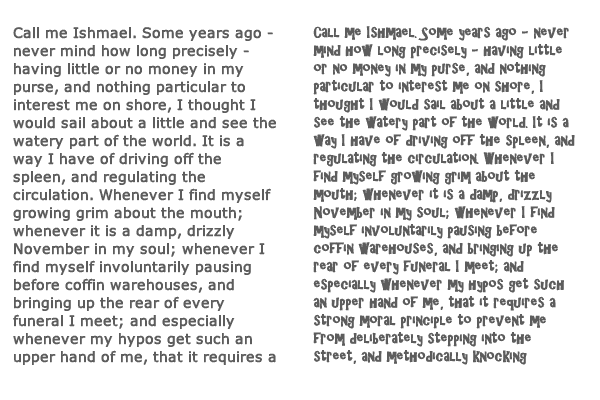
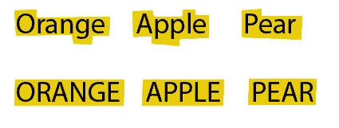
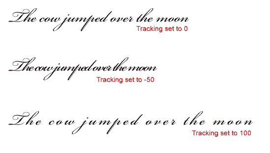

# 排版:可读性和易读性(第一部分)

> 原文：<https://www.sitepoint.com/typography-readability-and-legibility-part-1/>

可读性和易读性是每个设计师在选择字体时需要考虑的两个因素。**可读性**是指阅读单词、短语、文本块(如一本书、一个网页或一篇文章)的难易程度。**易读性**衡量的是在特定字体中区分一个字母与另一个字母的难易程度。在本帖中，我们将关注可读性，下周，在第 2 部分中，我们将关注易读性。随着越来越多的字体可以在网上使用，选择一种不会让你的读者疲惫的字体是很重要的。

有几个因素决定了文本是否可读，其中最重要的一个因素是印刷工所说的透明度或不可见性。这个想法是，如果一种字体引人注目，它可能很难阅读。如果你发现自己停下来欣赏一种字体，而不是阅读文本，那是**而不是**一种特别易读的字体。如果一种字体引起人们对它本身的注意，这种情况就会发生，因为它有一些极端的特征，如花体、扭曲、非常粗和细的笔画、非常高或非常短。看看下面的例子，左边的段落是用 Verdana 字体写的——在网上非常易读。右边的段落使用了更具装饰性的字体，很快就会让你的眼睛疲劳。

**正文字体**

正文有两种选择——[旧式衬线字体](https://www.sitepoint.com/the-old-style-typeface/)和[无衬线字体](https://www.sitepoint.com/the-sans-serif-typeface/)。大多数其他类别的字体太分散注意力。在纸上，衬线字体通常是最易读的，这就是为什么大多数报纸和书籍的正文使用衬线字体。衬线有助于将视线从一个字符转移到下一个字符。然而在屏幕上，无衬线字体(如 Arial，Verdana)被认为更具可读性。无衬线字体的 x 高度较大，笔画宽度变化不大。这并不意味着你不应该在网页上使用衬线字体，你当然可以，但测试一下阅读文本的容易程度总是一个好主意。

还有其他因素会影响文本块的可读性。

**小写和全部大写**

小写的文本更容易阅读。当我们阅读时，我们是在阅读短语，而不是一个字母接一个字母，单词的形状是我们识别和阅读速度的一个因素。当文本全部大写时，每个单词看起来都像一个矩形。如果你曾经收到一封全是大写字母的电子邮件，我敢肯定你已经发现它不仅难以阅读，而且给人的印象是发件人在大喊大叫。所有的大写字母都适用于短串文本，如标题或强调单个单词，但为了正文的可读性，请避免使用。

**字母间距和单词间距**

字母间距是字母之间的间距(在此阅读更多关于[跟踪](https://www.sitepoint.com/spaced-out-tracking-in-typography/)和[字距调整](https://www.sitepoint.com/spaced-out-part-2-kerning-in-typography/)的信息)和单词间距，顾名思义就是单词之间的间距。两者都是决定正文可读性的主要因素。

**线路长度和对齐方式**

无论是在网页上还是在印刷页面上，如果一行太长，可能很难找到下一行的开头。如果一行太短，就会打断我们认识的短语。一个非常简单的经验法则是，使用无衬线字体时，使用较短的行，单词之间留有额外的空间。

**反转类型和轻重重量**

白色或浅色背景上的黑色字体看起来比深色背景上的白色字体大(反过来)。为了弥补这一点，请使用更大或更粗的字体，并避免笔画粗细变化太大的字体。当反过来时，细笔画往往会消失。

 

当你选择字体的时候，有几点要记住，以保持你的文字清晰可辨。你还有什么要补充的建议吗？在下周的排版文章中，我们将看看易读性。

## 分享这篇文章