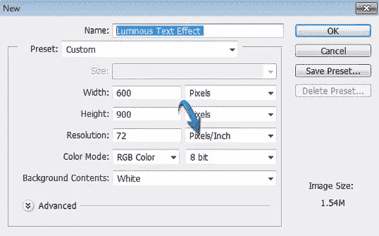
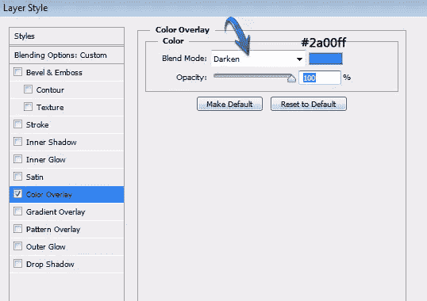
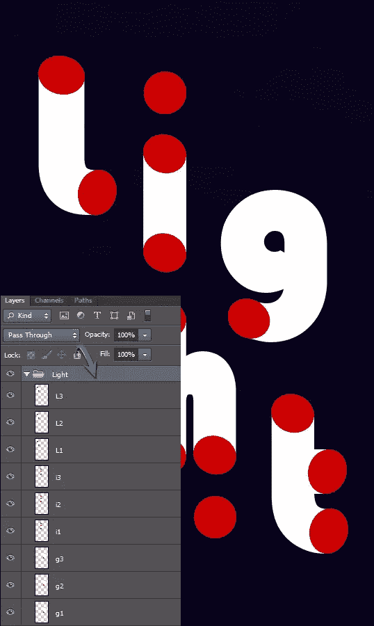

# Ubuntu 12.04 LTS 精确穿山甲:发现一个 PPAs 的世界

> 原文：<https://www.sitepoint.com/ubuntu-12-04-lts-precise-pangolin-discovering-a-world-of-ppas/>

如果你想要最新的软件或最新的调整，那么“个人包存档”(PPA)是最简单和最有效的方式让它在你的电脑上运行。PPAs 是位于 Launchpad 上的存储库，您可以使用它来安装或升级官方存储库中当前不可用的软件包。PPA 可以从命令行或使用图形用户界面添加，在本文中，我们将展示如何开始使用 Ubuntu 12.04 LTS 精确穿山甲。

所以让我们开始吧…

## 安装 PPA

个人包存档并不新鲜。它们已经存在了一段时间，大多数 PPAs 是偶然发现的，或者是通过在网上搜索特定需求而发现的。每个 PPA 通常服务于一个特定的软件版本(所以随着时间的推移，你可能会发现自己安装了多个 PPAs ),当你发现有几种不同的方法可以安装它们。

> **注:**
> 如果你正在使用服务器，享受预先测试软件的好处或者需要绝对的桌面稳定性，那么我不会使用 PPA。“前沿”软件有它的优势，但它也有“前沿”问题…

### 方法 1:用 Ubuntu 软件中心添加一个 PPA

打开 Ubuntu 软件中心，从顶部面板应用程序菜单中，选择“编辑”并选择“软件源”。从“软件来源”对话框中选择“其他软件”:

单击“添加”以启动“软件-属性-gtk”对话框，在显示“APT 行”的地方，您应该键入相关 PPA 的地址:

完成后，选择“添加来源”并以常规方式验证您自己。

现在关闭相关的“软件来源”对话框，让 Ubuntu 自我更新。

> 现在，您可以像软件中心提供的任何其他应用程序一样，从相应的 PPA 中自由搜索和安装应用程序。但是，由于 PPA 特定于您要安装的特定软件，您应该知道特定的搜索结果将仅限于该特定的存储库。通过使用这个过程，软件中心不搜索自己的发射台…

### 方法 2:使用命令行

要使用命令行安装 PPA，该过程将要求您打开终端并键入:

```
sudo add-apt-repository ppa:repository_details_here
```

按照屏幕上的说明验证您的身份并接受存储库。

```
sudo apt-get update
```

在以常规方式安装所选软件之前，让您的电脑使用新的 PPA 信息更新您的软件源:

```
sudo apt-get install software_name_here
```

### 方法 3:使用 Y PPA 管理器

与软件中心相比，使用 Y PPA 管理器的优势可以在搜索工具中找到，它允许您找到您需要的特定软件或更新。我想你也会发现，它是一个非常简单好用的工具:


您可以从‘Dash’访问该程序，并像打开任何其他软件一样打开它，通过选择适当的图标，添加 PPA 很简单:


除此之外，您还可以在整个 Launchpad 数据库中搜索其他 PPAs:


不过，在你开始之前，我会快速双击“设置”图标，设置你的首选项，其中包括一个你正在使用的 Ubuntu 版本的指示器:


> 在上面讨论的三种方法中，我建议使用方法 3，但这最终取决于个人偏好，因此我会让你决定什么最适合你。

## 正在安装 Y PPA 管理器…

要安装 Y PPA 管理器，你需要使用命令行，但是不要担心，这并不困难，只要按照这些简单的步骤开始。
打开端子并键入:

```
sudo add-apt-repository ppa:webupd8team/y-ppa-manager
```

您的计算机现在将做出如下响应:

```
You are about to add the following PPA to your system:
Y PPA Manager

Info and feedback: http://www.webupd8.org/2010/11/y-ppa-manager-easily-search-add-remove.html

This PPA is for Y PPA Manager and also includes the latest YAD for Ubuntu Karmic, Lucid, Maverick and Natty (YAD is a dependency for Y PPA Manager): http://code.google.com/p/yad/

More info: https://launchpad.net/~webupd8team/+archive/y-ppa-manager
Press [ENTER] to continue or ctrl-c to cancel adding it
```

当询问时，按“回车”继续。
终端现在将执行您的请求并添加存储库，如下所示:

```
Executing: gpg --ignore-time-conflict --no-options --no-default-keyring --secret-keyring /tmp/tmp.xC7tBkCTF6 --trustdb-name /etc/apt/trustdb.gpg --keyring /etc/apt/trusted.gpg --primary-keyring /etc/apt/trusted.gpg --keyserver hkp://keyserver.ubuntu.com:80/ --recv 7B2C3B0889BF5709A105D03AC2518248EEA14886
gpg: requesting key EEA14886 from hkp server keyserver.ubuntu.com
gpg: key EEA14886: public key "Launchpad VLC" imported
gpg: Total number processed: 1
gpg:               imported: 1  (RSA: 1)
```

现在键入:

```
sudo apt-get update
```

当该过程完成时，您的计算机现在将更新其存储库信息，请键入:

```
sudo apt-get install y-ppa-manager
```

这个过程会像这样结束:

```
Reading package lists... Done
Building dependency tree
Reading state information... Done
The following extra packages will be installed:
  aptitude launchpad-getkeys libboost-iostreams1.46.1 libcwidget3 ppa-purge
  yad
Suggested packages:
  aptitude-doc-en aptitude-doc tasksel debtags libcwidget-dev
The following NEW packages will be installed
  aptitude launchpad-getkeys libboost-iostreams1.46.1 libcwidget3 ppa-purge
  y-ppa-manager yad
0 upgraded, 7 newly installed, 0 to remove and 18 not upgraded.
Need to get 3,027 kB of archives.
After this operation, 9,369 kB of additional disk space will be used.
Do you want to continue [Y/n]?
```

选择“是”继续。做得好，您现在已经安装了 Y PPA 管理器。

## 不乱不乱的 PPA 之旅

有了以上信息，你可能会问我可以寻找什么，我可以扩展什么？

好吧，一个很好的起点是在[https://launchpad.net/ubuntu-tweak](https://launchpad.net/ubuntu-tweak)找到的 Ubuntu Tweak，这是一个“让你轻松配置系统和桌面设置”的工具:

通过 PPA 发布(取决于你喜欢的方法)，你可以这样安装它:

```
sudo add-apt-repository ppa:tualatrix/ppa
sudo apt-get update
sudo apt-get install ubuntu-tweak
```

紧随其后的是“肉桂”桌面。可以说它是 Gnome-Shell 桌面的一个分支，但是无论你如何描述它，它都有一个不断增长的“粉丝群”,开发者们正在做一个更简单、更传统的桌面界面

我个人认为 Cinnamon 非常好，你可以这样安装它(安装后，你可以从登录界面选择它):

```
sudo add-apt-repository ppa:gwendal-lebihan-dev/cinnamon-stable
sudo apt-get update
sudo apt-get install cinnamon
```

除此之外，你会发现 GIMP 令人兴奋的新更新；口径；自由办公室；大量的“Gnome 3 ware”增强功能和设备的选择；Unity“指示器”和“通知”工具；还有一些相当有趣的发展，如:Sublime Text，Geary(一个全功能的 SMTP 电子邮件客户端),可以这样安装:

```
sudo apt-add-repository ppa:yorba/ppa
sudo apt-get update && sudo apt-get install geary
```

因此，有很多东西需要关注，就像互联网上的一切一样，“搜索引擎仍然是你的朋友”。所以在我结束之前，为什么不尝试发现一些新的特性和样式来增强 Gedit:

```
sudo apt-add-repository ppa:ubuntu-on-rails/ppa
sudo apt-get update
sudo apt-get install gedit-gmate
```

安装完成后，只需查看 Gedit 首选项即可查看新增内容并根据需要激活。

## 警告

在我离开之前，对于那些想在加入之前做更多研究的人来说，你可以在[上阅读一篇关于这个主题的非常好的帖子，http://askubuntu . com/questions/35629/ppas-safe-to-add-to-to-my-system-and-is-safe-to-add-safe-to-the-safe-the-safe-the-safe-the-safe-the-safe-the-safe-the-safe-add-the-safe-safe-the-safe-the-safe-the-the-safe-the-safe-the-safe-the-safe-](http://askubuntu.com/questions/35629/are-ppas-safe-to-add-to-my-system-and-what-are-some-red-flags-to-watch-out)

> 请记住:
> “前沿”软件有它的优势，但它也有“前沿”问题……
> 所以为了安全起见，要有选择性

所以直到下次…
我希望你继续享受使用 Ubuntu 12.04 LTS 精确穿山甲。

## 分享这篇文章