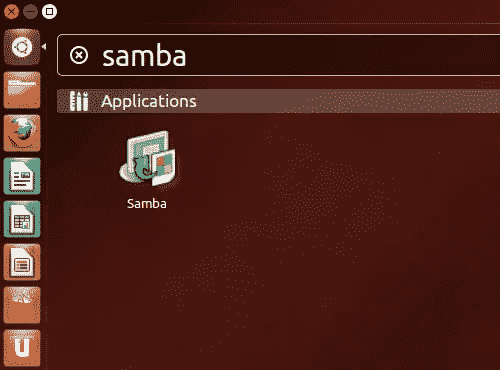
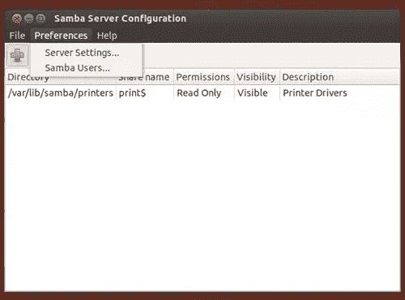
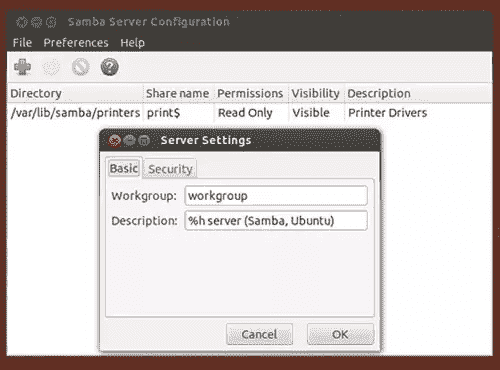
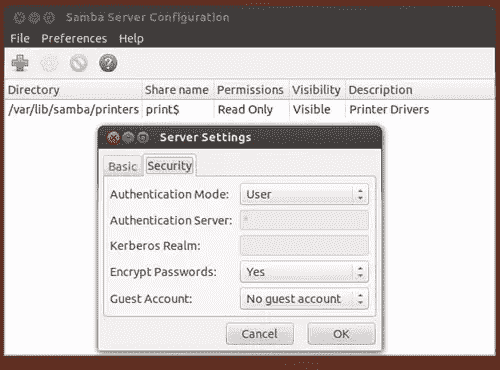
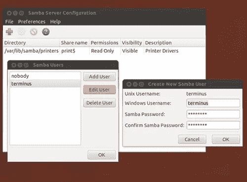
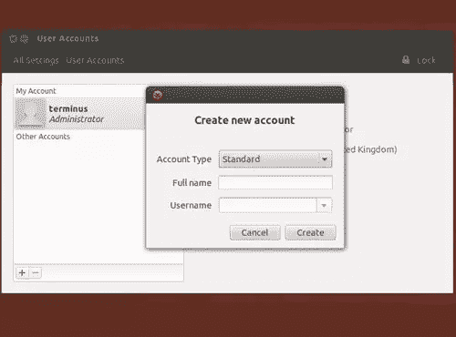
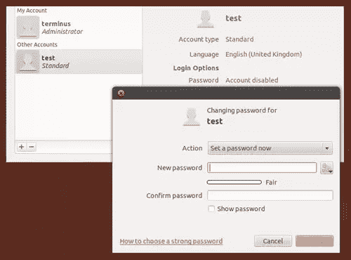
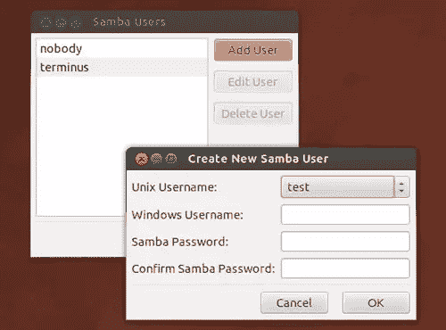
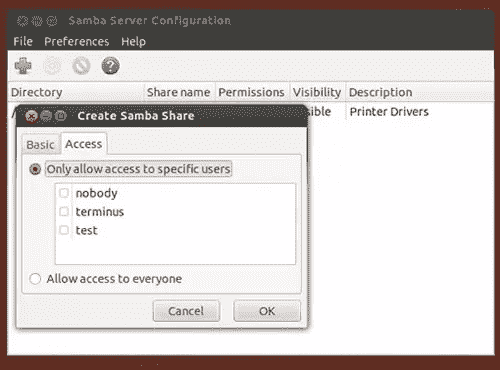
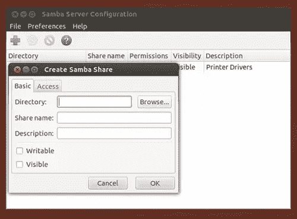

# Ubuntu 12.04 LTS 精确穿山甲:文件共享与桑巴。

> 原文：<https://www.sitepoint.com/ubuntu-12-04-lts-precise-pangolin-file-sharing-with-samba/>

Samba 是一个软件包，它允许你通过网络共享文件、打印机和其他公共资源。提供与 Windows 工作组的完全连接，它被认为是世界各地家庭和办公室的宝贵工具，在本文中，我将向您展示如何在 Ubuntu 12.04 LTS Precise 穿山甲上安装、设置和管理 Samba 服务器。那么让我们开始吧…

## 先决条件

为了充分利用 Samba，您的系统应该运行一个静态 IP 地址，如果您碰巧运行防火墙，您应该打开相关端口，让 Samba 服务完全访问您的网络。

是的，您可以使用 DHCP，但是您需要确保您的 DHCP 服务器或路由器为您提供“固定的”DHCP 许可证；但是对于那些希望学习如何在 Ubuntu 12.04 上实现静态 IP 地址的人来说，你可以阅读我以前的一篇关于[网络技巧和窍门](https://www.sitepoint.com/ubuntu-12-04-lts-precise-pangolin-networking-tips-and-tricks)的文章

## 更新您的系统

安装 Samba 是一个非常直接的过程，所以我们将从更新系统开始。
在终端或您的控制台中键入:

```
sudo apt-get update && apt-get upgrade
```

如果您有任何可用的更新，请在我们继续之前更新:-)

## 安装 Samba

出于本文的目的，我将为您提供三种不同的安装 Samba 的方法:
**1。对于桌面用户**，他们想要利用‘winbind’(winbin)并使用图形工具(system-config-samba)，打开终端并键入:

```
sudo apt-get install samba samba-common system-config-samba winbind
```

**2。对于希望利用“winbind”(winbind)但不希望使用图形工具的桌面用户**，打开终端并键入:

```
sudo apt-get install samba samba-common winbind
```

**3。对于服务器用户**，在您的控制台中键入:

```
sudo apt-get install samba samba-common
```

## 正在配置 Winbind

在我们讨论 Samba 本身之前，桌面用户会注意到我们已经安装了 Winbin。这样做的目的是为了确保 Ubuntu 在查看您的本地网络时能够提供完整的主机名解析，所以我们希望在继续之前进行配置。不要担心，这非常简单，因为我们需要做的只是对“nsswitch.conf”文件进行快速的“顺序更改”。
首先，打开终端并键入:

```
sudo gedit /etc/nsswitch.conf
```

找到如下所示的行:

```
osts:          files mdns4_minimal [NOTFOUND=return] dns mdns4
```

现在将其更改为如下所示:

```
hosts:          files mdns4_minimal [NOTFOUND=return] dns wins mdns4
```

您的 nsswitch.conf 文件现在应该看起来像这样:

```
passwd:         compat
group:          compat
shadow:         compat
hosts:          files mdns4_minimal [NOTFOUND=return] dns wins mdns4
networks:       files
protocols:      db files
services:       db files
ethers:         db files
rpc:            db files
netgroup:       nis
```

完成后，只需在重启前“保存”并关闭文件，如下所示:

```
sudo reboot
```

完成此操作后，您现在应该能够从桌面菜单中选择“GO > Network ”,并查看整个基于 Windows 和 Linux 的网络。然而，话虽如此，我还是注意到了一些关于 32 位版本的 Winbind 的问题。因此，如果您在使用 Winbind 时遇到困难，只需颠倒上述说明，直到发布更新。我敢肯定他们正在解决这个问题:-)好的

> 从这一点开始，本文将作为一个指南，根据您的需要，它不应该被视为一个有序的过程或解决方案。例如，您可能希望在完成任何配置工作之前添加系统用户，或者您甚至可能需要重复一些过程来添加多个用户。请记住，每个人的网络需求都是独特的:-)

## 使用桌面图形工具。

在您开始使用图形工具(system-config-samba)之前，我们需要“微调”samba 服务器设置。

为此，打开 dash 并使用搜索栏查找 Samba，如下所示:



启动 Samba 配置工具，选择“首选项>服务器设置”，如下所示:



在大多数情况下,“默认设置”可能正是您所需要的，但在某些情况下，您可能需要进行一些更改。

完成“基本”选项卡设置，完成后单击“确定”:

*   **工作组。**该字段应与您的 WIndows 工作组使用的值相同，即如果您的 Windows 用户是“家庭”工作组的成员，请在该字段中输入“家庭”。
*   **描述。**这是 Windows 用户看到的您计算机的名称。即
    保持简单，使用与您实际计算机名称相似的名称，不要在非互联网友好字符上使用空格。



因为不建议允许“客人”进入，所以没有理由更改“安全”设置选项卡，除非您希望这样做:



现在单击“确定”关闭“服务器设置”窗口。
要管理您当前的用户，只需选择“首选项> Samba 用户”,如下所示:


现在启动“Samba 用户”对话框。选择您的用户名并单击“编辑用户”以启动“创建新的 Samab 用户”对话框。



根据需要填写字段:

*   **Windows 用户名。**确认 Windows 用户访问您的共享文件夹时使用的用户名。
*   **桑巴密码。**使用此字段确认 Windows 用户访问您的共享文件夹时使用的密码。
*   **确认桑巴密码。**使用此字段重新确认 Windows 用户访问您的共享文件夹时使用的密码。

> 尽管在此之前，您可能会在密码字段中看到“星号”。删除它们并重新输入密码。

完成后，单击“OK”关闭两个对话框，然后像这样重新启动 Samba 服务。

打开终端并键入:

```
sudo restart smbd && sudo restart nmbd
```

## 使用桌面图形工具添加新的(Linux)用户帐户。

如果您想添加一个新的 Linux 用户帐户，只需:

*   打开“系统设置”。
*   选择“用户帐户”并使用您的管理密码解锁面板。
*   使用+(加号)图标创建新用户。
*   输入新用户的全名(用户名将根据全名自动填写)。

由于此文件夹仅用于“共享”，请不要为此用户帐户分配“管理权限”。



完成后，点击<create>。
由于帐户最初被禁用，我们现在需要设置用户密码。</create>

要做到这一点，只需:

*   确保“用户帐户”面板仍处于解锁状态。
*   单击“帐户已禁用”,完成出现的对话框。



完成后，点击“更改”。
如果您返回到“Samba 用户”对话框并点击“添加用户”,您的新用户帐户应该会出现在 Unix 用户名下拉框中，如下所示:



只需填写相关细节，点击<ok>即可完成。
完成后，您可以将该用户帐户分配到特定的文件夹，如下所示:</ok>



关于用户帐户的更多信息可以在这里找到[https://help . Ubuntu . com/12.04/Ubuntu-help/user-accounts . html](https://help.ubuntu.com/12.04/ubuntu-help/user-accounts.html)。

## 用图形工具共享文件夹。

要与 Samba 共享一个文件夹，单击绿色的“+”(加号)图标打开一个名为“创建 Samba 共享”的对话框，如下所示:



用所需信息填写“基本”选项卡。

*   **目录。**点击“浏览”找到您希望共享的相关文件夹。
*   **共享名称。**使用此字段为您的共享文件夹指定一个“人性化”的名称。
*   **描述。**在本栏位输入“共享文件夹”的描述。
*   **可写。**默认情况下，共享文件夹是“只读”的，所以如果您想启用“写”权限，请在此框中打勾。
*   **可见。如果您希望您的共享文件夹在网络上“可见”,请在此框中打勾。**

接下来，我们需要为您的新共享文件夹设置权限。

为此，只需在同一个对话框中单击“访问”选项卡，如下所示:


**如果您想限制对此文件夹的访问:**

*   选择“仅允许特定用户访问”。
*   使用勾选框确认哪些用户可以访问相关文件夹。

**如果您希望每个人都可以访问该文件夹:**

*   选择“允许所有人访问”。

完成后，单击“确定”关闭对话框。

> 要从 Samba 中删除任何共享文件夹，只需在配置工具中选择相关的文件夹，然后单击“红色图标”。别担心，此操作不会删除文件夹或其内容。

就这样，您的共享文件夹现在处于活动状态。

## 在命令行上配置 Samba

使用图形工具有其优势，但是如果您真的想控制 Samba 服务器的各个方面，没有什么比命令行更好的了。

因此，让我们从备份原始配置文件开始:

```
cp /etc/samba/smb.conf /etc/samba/smb.conf.bak
```

并打开当前配置文件的内容，如下所示:

```
sudo nano /etc/samba/smb.conf
```

我们现在将通过使用一个基本示例来配置 Samba 服务器，以便让您入门…

我不打算解释 Samba 的每一个方面(因为大多数服务器管理员都想阅读在[http://www.samba.org/](http://www.samba.org/)找到的官方文档),所以我给你提供了一个模板，以便让你很快上手并运行。您应该认为这只是一个基本模板。无论如何，这都不是决定性的，我也不期望您复制它，但是如果您确实使用它，请记住将显示的值更改为与您的特定需求或网络要求相关的值:
以下是模板:

```
[global]
    unix charset = UTF-8
    # -------------------------------------------
    # DEFINE YOUR WORKGROUP AND COMPUTER NAME HERE
    workgroup = YOUR-WORKGROUP-NAME
    server string = YOUR-COMPUTER-NAME
	  netbios name = YOUR-COMPUTER-NAME
    # -------------------------------------------
    dns proxy = no
    name resolve order = lmhosts wins bcast host
    # -------------------------------------------
    # IF YOU SET BIND INTERFACES TO YES, TO AVOID LOG ERRORS,
	  # MAKE SURE YOUR SAMBA SERVICE STARTS AFTER THE ETHERNET CARD IS SWITCHED ON
    # bind interfaces only = no
    # bind interfaces only = yes
    bind interfaces only = no

    # ADD THE ETHERNET CARD AND IP ADDRESSES YOU ALLOW
    interfaces = eth0 127.0.0.0/8 192.168.1.0/24
    # -------------------------------------------
    # SAMBA LOG FILES
    log file = /var/log/samba/log.%m
    max log size = 1000
    syslog only = no
    syslog = 0
    # -------------------------------------------
    panic action = /usr/share/samba/panic-action %d
    # LIMIT ACCESS TO USERS ONLY
    security = user
    # USING TDBSAM
    encrypt passwords = true
    passdb backend = tdbsam
    obey pam restrictions = yes
    unix password sync = yes
    passwd program = /usr/bin/passwd %u
    passwd chat = *Entersnews*spassword:* %nn *Retypesnews*spassword:* %nn *passwordsupdatedssuccessfully* .
    pam password change = yes
    map to guest = bad user
    usershare allow guests = no
    # -------------------------------------------
    # INCLUDE THIS SECTION TO DISABLE PRINTERS/CUPS ONLY
    #load printers = no
    #printing = bsd
    #printcap name = /dev/null
    #disable spoolss = yes
    # -------------------------------------------
    # DIRECTORIES
    # -------------------------------------------
    # ENABLE HOME FOLDER ACCESS
    [homes]
        comment = Home Directories
        browseable = no
        writable = yes
        valid users = %S
        valid users = MYDOMAIN%S
        create mask =0755
        directory mask =0755
    # -------------------------------------------
    # EXAMPLE FOLDER WITH LIMITED ACCESS, UNCOMMENT AND CUSTOMISE AS NECESSARY
    #[example]
    #   comment = example share folder on my-computer-name
    #   path = /foldername/foldername/
    #   browseable = yes
    #   guest ok = no
    #   writable = yes
    #   create mask = 0755
    #   directory mask = 0755
    #   valid users = @your-username
    #   force group = your-username-or-group
    #   force create mode = 0755
    # -------------------------------------------
```

要取消注释一行，只需删除#(散列)符号。

要么将该文件的内容复制到 **/etc/samba/smb.conf** 中，要么使用我的模板作为指导，简单地完成 samba 配置文件。别担心，不着急…

完成后，“保存”文件，“关闭”文件并重新启动 Samba 服务，以便它可以使用以下命令应用新设置:

```
sudo service smbd restart && sudo service nmbd restart
```

## 在命令行上创建(Linux)用户和主文件夹

尽管关于“使用文件、目录和用户”的完整教程超出了本文的范围，但是添加一个新的用户帐户和创建一个主文件夹是一个相对简单的任务——只要记住用与您的需求相关的内容替换我的值就行了。

若要在您的服务器或桌面上创建具有关联个人文件夹的新用户，请使用:

```
sudo adduser new-username-here
```

Ubuntu 现在会问你几个基本问题，然后完成任务[a]创建新用户，[b]为该用户创建一个特定的组，然后

 `为有问题的用户创建个人文件夹。

所有这些都只需要一个命令:-)

为了解释这一点，下面是一个分步示例，并给出了结果输出。我将创建一个名为“新用户名”的新用户。

在我键入以下命令后，该过程开始:

```
sudo adduser new-username-here
```

Ubuntu 现在将开始这个过程:

```
Adding user `new-username-here' ...
Adding new group `new-username-here' (1004) ...
Adding new user `new-username-here' (1004) with group `new-username-here' ...
Creating home directory `/home/new-username-here' ...
Copying files from `/etc/skel' ...
```

此时，您将被要求创建一个密码:

```
Enter new UNIX password:
Retype new UNIX password:
passwd: password updated successfully
Changing the user information for new-username-here
```

此时，您将被要求完成一些基于用户的详细信息:
(要将某个字段留空，只需按下<回车键>)

```
Enter the new value, or press ENTER for the default
	Full Name []: new-username-here
	Room Number []:
	Work Phone []:
	Home Phone []:
	Other []:
```

此时，将要求您确认您的指令:

```
Is the information correct? [Y/n]
```

那不是很容易吗:-)不

## 在命令行上添加(Samba)用户

最后，让我们用下面的命令基于上面的例子创建一个 Samba 用户。

```
smbpasswd -a new-username-here
```

您将被要求确认密码，但就是这么简单…

> 请记住，您需要向您的网络用户提供相关的用户名和密码。

所以直到下次…
我希望你继续享受使用 Ubuntu 12.04 LTS 精确穿山甲。

如果你喜欢读这篇文章，你会喜欢[可学的](https://learnable.com/)；向大师们学习新技能和技术的地方。会员可以即时访问 SitePoint 的所有电子书和互动在线课程，如 [Ubuntu Linux](https://learnable.com/courses/ubuntu-linux-65) 。

## 分享这篇文章`