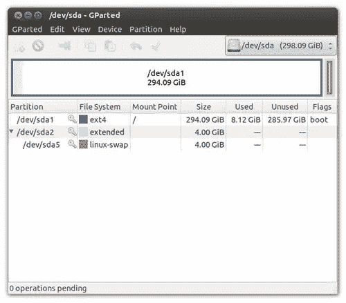
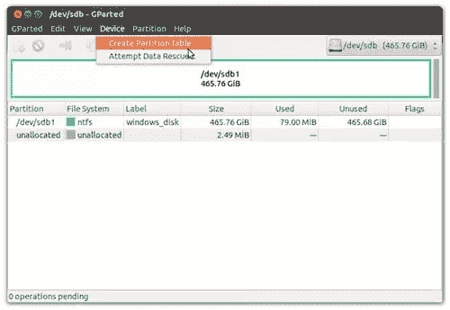
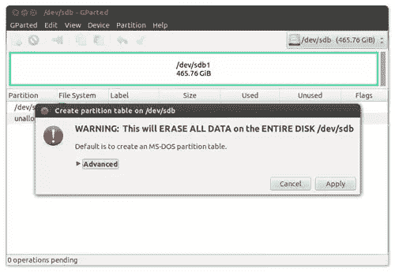
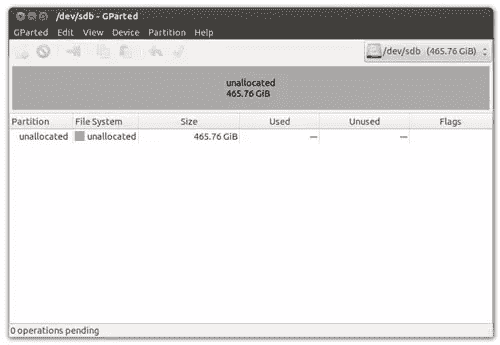
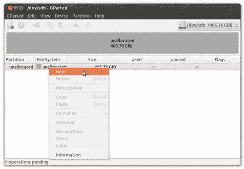
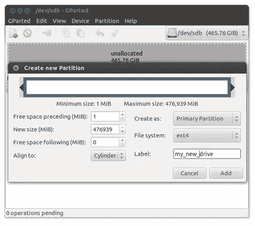
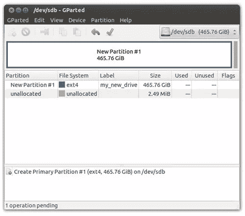
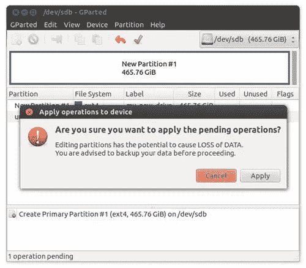
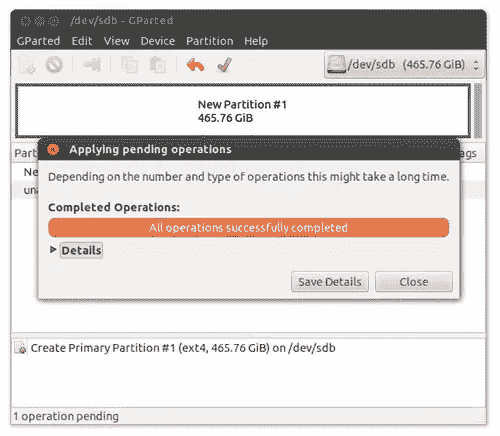
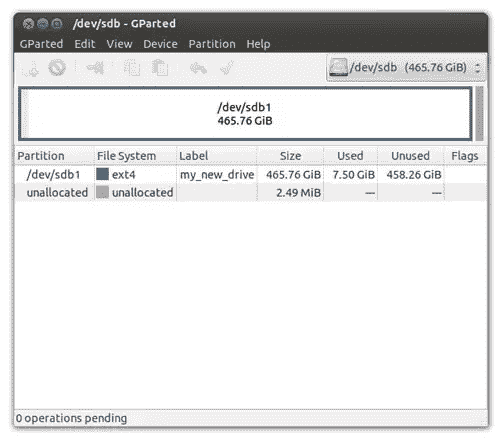

# Ubuntu 12.04 LTS 精确穿山甲:使用 GParted 对硬盘进行分区

> 原文：<https://www.sitepoint.com/ubuntu-12-04-lts-precise-pangolin-using-gparted-to-partition-a-hard-disk/>

这可能不是你经常做的事情，但大多数 Linux 用户都会同意，能够控制存储设备上的分区可能是掌握操作系统最重要的方面之一。因此，无论你是想要更多的空间来存储你的媒体文件，还是仅仅想重新格式化一个笔驱动器，在这篇文章中，我将向你介绍 GParted 的强大和简单，以便充分利用 Ubuntu 12.04 LTS 精确穿山甲。

所以让我们开始吧…

## 使用 GParted

GParted 是目前 Linux 上最流行的分区工具之一。这是一个非常强大和易于使用的图形工具，它的优势在于它不仅避免了过度复杂化，而且可以被新来者和长期专业人士充分利用。它在所有的 Linux 发行版中都很常见，你甚至可以把它作为一个 Live CD 来使用。

如果尚未安装，只需打开终端并键入:

```
sudo apt-get install gparted
```

该工具将需要“root”权限才能运行，但从这一点开始，您可以像对待任何其他软件一样对待它，并从 Dash 启动 GParted。

主界面将如下所示:


通常情况下，GParted 读取的第一个磁盘是您的主硬盘，从上面的示例中，您会注意到主硬盘显示为:

*   总可用存储空间高达 298.09GB(或根据硬盘规格为 320GB)。
*   使用 4.00GB 交换分区
*   使用格式化为 EXT4 的 294.09GB“根”分区。标识为/dev/sda/根分区被标记为“可引导”,并且仅使用了 8.12GB 的空间。

当然，您的硬盘可能会与示例中的有所不同，是的，您可以使用 GParted 来修改现有的分区。然而，由于我只是用这个来说明如何读取 GParted 接口，所以我现在将向您展示如何对一个新的 500GB SATA 内置驱动器进行分区。

### 第一步。选择正确的设备

GParted 适用于所有类型的存储设备，但在执行任何操作之前，选择正确的设备至关重要。

> 记住，简单地胡乱删除分区会导致重要数据的丢失。

在 GParted 界面的右上角，使用下拉列表选择相关的存储设备:


我已经安装了新的 500GB 内置 SATA 硬盘(从上面的例子中可以看到)，它被标识为 **/dev/sdb** ，通过更改到这个设备，GParted 接口现在可以报告:


在 GParted 中，任何硬盘的典型符号如下:

*   基于 IDE 的驱动器通常标记为 hdX，其中 X 是四个字母 a-d 中的一个，hda 是第一主机，hdb 是第一从机，hdc 是第二主机，hdd 是第二从机，等等。
*   基于 SATA/SCSI 的驱动器由 sdX 标记。其中 X 是字母表中的一个字母，sda 通常被认为是主系统盘。

确保选择了正确的硬盘后，我们现在必须考虑初始化设备的任务(也称为创建新的分区表)。

### 第二步。初始化设备

“分区表”位于每个硬盘的第一个扇区。它的目的是记忆关于任何硬盘上每个分区的大小和位置的信息，通常它被限制为最多四个条目(或四个分区)，尽管可以在扩展分区中创建更多条目。

> 最近购买的硬盘不包含分区表，而旧硬盘可能包含一个不需要的分区表，该分区表曾在不同的系统上使用过，不再需要，因此无论如何，我们都需要创建一个新的分区表，这样做我们将销毁任何现有的数据，并“将整个驱动器擦除干净”。

因此，为了混淆一下，假设我的内部驱动器来自一台旧的基于 Windows 的机器，因此它将包含对我不再有用的现有 NTFS 分区。

要重新初始化磁盘并将其擦除干净，您可以选择**设备** > **创建分区表**，如下所示:



将要求您确认此操作:



准备就绪后，选择**应用**继续。

GParted 现在将完成磁盘初始化过程，完成后它将报告可供您使用的未分配(或未格式化)空间量:



### 第三步。格式化您的设备

正如我们已经提到的，您的硬盘可以维护许多不同的分区，但是出于本文的目的，我只需要一个分区——一个单独的分区来保存我的数据。

为此，只需右键单击“未分配空间”并选择**新建**，如下所示:



在出现的“**创建新分区**”对话框中，您将被要求定义新分区的相关设置:



在上面显示的示例中，GParted 显示最大可用空间为 476，939 MB(将近 477GB ),由于我打算只为数据创建一个分区，因此我希望进行以下更改:

*   创建为:主分区。
*   文件系统:EXT4。
*   标签:(选择一个合适的名称，如 my_new_drive、my_data、data-disk 等)

其他区域可以保持“原样”,除非您打算创建多个分区。但是你可能会问为什么我把默认的 **MiB** 值改为**柱面**。

在不太专业的情况下，使用柱面选项是“老派”的，如果(a)你的硬盘是一些人所说的“旧的”或者(b)你打算继续使用 **fdisk** “不关闭 DOS 兼容模式’”，它仍然是一个很好的选择。对我的推理的完整解释超出了本文的范围，但作为一个简单的建议或“经验法则”:如果您使用的是 **SSD 驱动器**，那么您将希望消除分区之间的任何间隙，并从磁盘中挤出每一英寸的空间，因此选择“**对齐 MiB** ”，但如果您像我一样，仍然使用典型的 SATA 磁盘(或基于 IDE 的旧磁盘)，那么为了避免以后与 **fdisk** 混淆，请选择“**对齐柱面**

 **完成后，选择**添加**将返回主界面:



GParted 在获得授权之前不会执行任何操作。因此，为了继续操作，您应该**点击绿色的“勾选”图标“应用所有操作”。**

完成此操作后，GParted 将要求您像这样确认操作:



点击**应用**继续，GParted 现在将执行格式化设备的操作:



当 GParted 完成后，只需选择**关闭**，工具将报告新的分区布局:



与分区表不同，单个分区由任意三个字母组合后的数字来标记。例如，在本文中，我刚刚创建了“sdb1 ”,这是第二个 SATA/SCSI 驱动器上的第一个分区。其中“SD”表示磁盘是 SATA/SCSI *设备，字母“B”表示它是系统的第二个驱动器，“1”表示它是第一个分区。*

 *仅此而已。我的新 500GB 硬盘已经准备就绪，但在我离开之前，您应该知道，您可以将相同的技术应用于任何类型的存储设备(笔驱动器、外部硬盘驱动器等),对于那些喜欢使用图形工具的人，我相信 GParted 将很快成为一个无价的朋友:-)

所以玩得开心，直到下次我希望你继续享受使用 Ubuntu 12.04 LTS 精确穿山甲。

如果你喜欢读这篇文章，你会喜欢[可学的](https://learnable.com/)；向大师们学习新技能和技术的地方。会员可以即时访问 SitePoint 的所有电子书和互动在线课程，如 [Ubuntu Linux](https://learnable.com/courses/ubuntu-linux-65) 。*** 

## ***分享这篇文章***