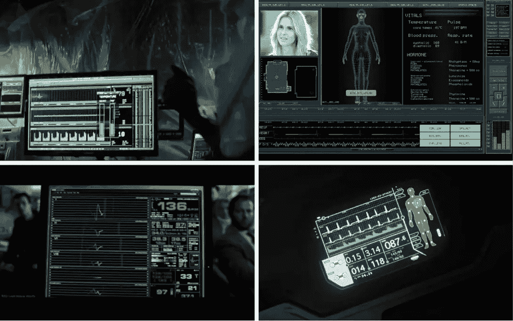

# UI 代码挑战# 1–心跳

> 原文：<https://www.sitepoint.com/ui-code-challenge-1-heartbeats/>

你有没有发现我们在大片、电视和游戏中看到的用户界面屏幕比我们在工作中构建的用户界面有趣得多？这是你编写有趣代码的机会，甚至可能赢得一张 100 美元的亚马逊礼品卡。

从今天开始，我们有 4 个两周一次的快速 UI 编码挑战来测试你的技能和解决问题的能力。你有机会展示你的技能，同时从别人那里学到一两个技巧。应对这些挑战没有单一的“正确”方法。

在本周末(下周三)，我们将发布一篇关于提交的最佳解决方案的帖子，并选出我们最喜欢的全能奖。获胜者将获得:

*   被判定为我们最喜欢的解决方案的荣耀
*   一张 100 美元的亚马逊礼品卡

我们还将向亚军赠送两个高级会员资格和一些非常受欢迎的 SitePoint t 恤。

让我们开始第一个挑战吧！

## 挑战 1:制作心电图/EKG*心率用户界面动画

从左上顺时针依次为:卢克·凯奇( [S01E10](https://getyarn.io/yarn-clip/f3390661-fc76-4ecc-a08e-0ce458bd99ab) )、林中小屋( [2012](https://www.youtube.com/watch?v=E4LBIs87F68) )、遗忘( [2013](https://en.wikipedia.org/wiki/Oblivion_(2013_film)) )、&皇家赌场( [2006](https://www.youtube.com/watch?v=LGYLe01oT6s) )。

我们都见过这个常见的电影、电视和游戏比喻——“实时心率监测器/心电图仪”。有时是当代医疗剧(即《实习医生格蕾》、《急诊室》等)的剧情点。更多时候，我们将它视为精英超级间谍(如《詹姆斯·邦德》或《碟中谍》)的尖端技术，或科幻太空陆战队的遥远未来生物监测(如《异形》或《湮没》)。设计团队花费数千小时精心制作这些[fulis](https://www.hudsandguis.com/)(未来/幻想/虚构的用户界面)，尽可能看起来真实可信。现在轮到你了。

## 任务

你的任务是*制作一个动态心电图/EKG 生物监护仪显示面板。你可以使用任何你喜欢的技术——**，只要你能把你的解决方案作为代码笔**。这包括但不限于:*

*   HTML/CSS
*   帆布
*   挽救（saving 的简写）
*   WebGL
*   D3
*   任何其他网络技术

通常，这些 UI 屏幕以“黑暗模式”显示，并由至少一条(但通常更多)从左到右循环的图形线描绘出心率。随意扩展 UI 以包含其他酷元素(核心温度、血压等)，但弯曲跳动的图形线是我们感兴趣的核心元素。

在下面的 CodePen 中，我放入了一个临时的动画 GIF 作为粗略的视觉指南，但是请从你喜欢的任何电影、电视节目或游戏中获取你的灵感。

### 分叉此代码笔以开始

看到笔 [的机器就乒！](https://codepen.io/SitePoint/pen/JqxyNY/)by site point([@ site point](https://codepen.io/SitePoint))
on[code pen](https://codepen.io)。