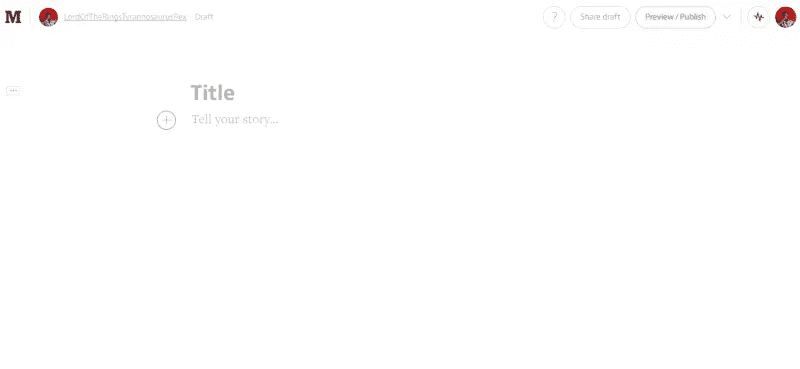
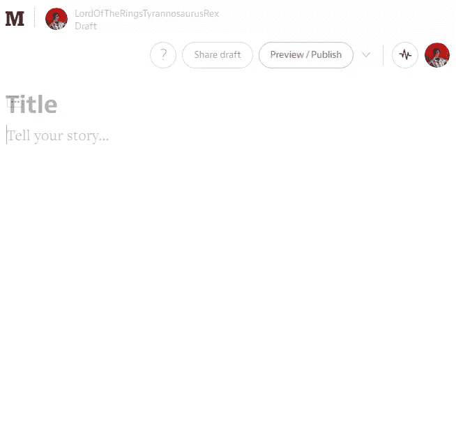
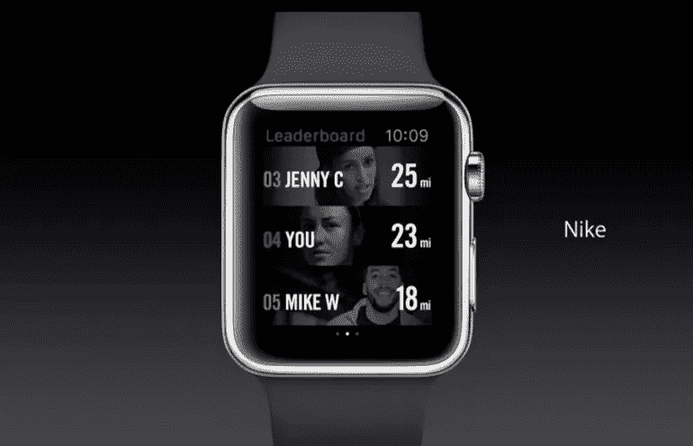

# UI 模式:(用户)名称中有什么？

> 原文：<https://www.sitepoint.com/ui-patterns-whats-username/>

图片: [JD Hancock](http://www.flickr.com/photos/83346641@N00/3175205407) 

当学习网页设计时，有两个课程我认为非常重要。

第一个是——***一切*都是长方形**。

把一切都想象成长方形会有所帮助。拿任何一个网页来说，如果你能模糊内容并寻找矩形，你就能立刻看到网格。这个原则帮助我更好地理解和设计网站。

另一个原则值得先讨论一下。

## 应用程序栏中的名称模式

在 web 和移动应用程序中的应用程序栏上显示用户名是一个常见且有趣的分析问题。许多网络最大的应用程序的前端团队已经接受了它——通常采用非常不同的方法。

很明显，屏幕尺寸决定了用户名占用有限的屏幕空间。这个问题在较小尺寸的设备中明显加剧。

然而，我们也知道用户名的长度会有很大的不同。可能是一个字母——詹姆斯·邦德的“M”或“Q”用过脸书吗？—最长[更长、更有雄心的创作](http://www.ndtv.com/offbeat/swedish-mans-63-word-name-may-be-worlds-longest-584757 "Article detail man with 63 word name.")。

这个问题有多种解决方案。让我们看看一些大公司是如何解决这个问题的。

### 脸谱网

我决定从脸书开始，因为用户名是这个应用程序的核心组成部分。如果不是因为脸书，我怀疑我会知道我许多朋友的姓。对于一个以使用真实全名为基本理念的应用程序来说，有趣的是它只在应用程序栏上显示用户的名字。

目的可能是个性化。直呼某人的名字会使交流更加私人化。这也很方便，因为对于较长的用户名来说，这个空间可能不太实用。

脸书是这样处理这个设计问题的:

*   他们只在桌面主屏幕上显示名字，这很奇怪
*   他们不会在手机主屏幕上显示用户名，但会在设置屏幕上显示完整的用户名
*   可以在桌面上显示相当长的名字(24 个字符，在我的 1366px 屏幕上最大宽度为 175)

### 中等

当提到截断用户名时，我的第一反应是，*用户名在哪里如此重要以至于不能被截断*？当然是出版业。

所有的文章都是作者的作品，它们的名字和内容本身一样重要。它是应用程序的核心，我继续研究一种日益流行的发布媒介(wink)将如何处理这种情况。

事实证明，Medium 以一种非常有趣的方式处理这个问题。

*   应用程序栏的右上角根本不使用用户名。只有头像。这是你在阅读内容时会注意到的。
*   但是，在写文章的时候，头像会在应用栏显示两次。在左边，它还包括用户名。
*   这里的用户名被赋予了足够的空间，可以自由地长到让人发疯。
*   在较小的屏幕上，用户名优先，其余的菜单项被踢下来。

### OneDrive

我还看了一眼 OneDrive，因为他们以一种令人惊喜的方式处理这个问题。它不仅显示完整的用户名，而且还能很好地处理不寻常的用例。

OneDrive 便于在宽屏上显示完整的用户名。事实上，这些名字可能很长，而且有很大的空间。

在手机上，整个应用程序栏变得最小化，包括徽标和菜单选项。

但令人惊讶的是，我故意把用户名做得特别长，只是为了看看会发生什么。它巧妙地隐藏了菜单选项，为用户名腾出了空间。

另一方面，重要的菜单选项如**创建**和**上传**被隐藏在省略号后面，因为空间是用来容纳这些超长用户名的。虽然这是一个边缘案例，我对解决方案感到兴奋，但我忍不住对为什么做出这个决定吹毛求疵。

### 其他解决方案

不显示用户名是大多数其他网站的首选。当人们已经习惯于独自扮演阿凡达的时候，为什么还要浪费精力去解决这个问题呢？

此外，当屏幕变小时，你会怎么做？手机，手表，眼镜。可穿戴技术将创造一些有趣的问题，并提供同样有趣的解决方案。

> 不幸的是，在现实世界中，并不是每个人都是珍妮或麦克。

[来源](http://www.ibtimes.com/apple-watch-features-10-really-useful-apps-worth-waiting-1687368)

Ted.com 选择在应用程序栏显示用户姓名首字母。这是一种不常见的方法，我必须承认，我花了一些时间才弄清楚它们实际上是我的*首字母——这种模式在现实世界中很少有人会认识，因为它很少被使用。*

一些网站选择只显示头像或图标。但是，当单击它时，它们仍然在下拉列表中显示完整的用户名。较长的用户名在这种方法中也是一个挑战。

其他网站通过限制注册页面中用户名的长度来解决这个问题。Disqus 在他们最近的 UI 改造之前就这么做了。这是我尝试使用长名字时得到的表单验证结果。

> 确保该值最多有 30 个字符(它有 50 个字符)。

这看起来是设计师和开发者合作的一个很好的用例。让我们决定用户名的最大长度，并在此基础上推动所有进一步的设计决策。

对数据库有好处，是的。对设计和 UX 整体有好处吗？也许不是。

### 你会问，名字里有什么？

我做了一些初步的(非正式的)研究，以了解实际用户对他们在应用栏中的名字的看法。大多数人并不介意触发账户设置的按钮中出现用户名。

我还做了一些研究，假设什么是合理的长用户名。我的大部分社交图谱都没有亚历山大或伊丽莎白那么长。

我还碰巧了解到，名字长的人往往习惯于名字被截短。那里没问题。

这并不意味着当文本被无意中删除时没有问题。举例来说，当你在杂货店购买“蓝湖黄油”时，就会发生这种情况。

“Land o Lakes Butter”在一些收银机上成了一个不幸的缩写。[来源](http://www.reddit.com/r/funny/comments/1k197c/what_happens_when_you_ring_up_land_o_lakes_butter/)

但是，截断不仅限于用户名。

你如何在不破坏设计的情况下容纳数字？当数字变成 6 位数时，为 3 位数设计的布局可能不起作用。脸书和推特通过将数字截短为 k 和 m 来处理这些问题。

### 另一个教训

这让我想到了我认为在网页设计中非常重要的第二课——内容与表现。

当呈现和内容齐头并进时，就会出现上面提到的设计问题。具有相同高度的列和简洁的用户名的漂亮设计在现实生活中很容易被打破。它有助于使用实际的数据样本，而不是到处使用“lipsum”。

这当然不是网络独有的问题。自报纸时代以来，这种做法就一直存在，当时标题需要根据专栏布局的空间进行定制。

CSS 区域等规范旨在帮助将布局从内容中分离出来。这对于一些用例来说可能很棒，比如讲故事。然而，它在其他情况下可能不起作用。

语境决定一切。

在特定的环境中，名字变得越来越重要，比如出版和讨论系统。网络正在成熟为一个生态系统，其中包括大量的小型设备。设计者应该考虑给定的信息，不管它看起来多么微不足道，在给定的上下文中是否重要。

在讨论中，我很想知道你遇到过的最长的用户名是什么，以及你是如何选择解决 app-bar 用户名问题的。

## 分享这篇文章