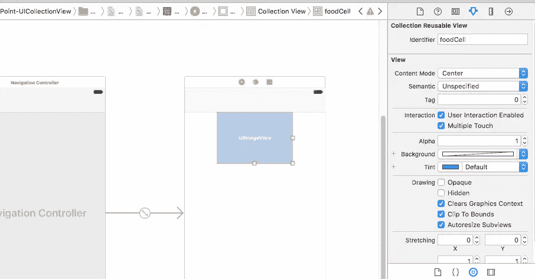
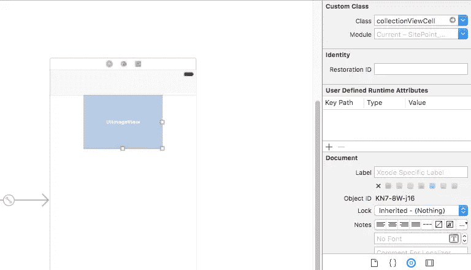
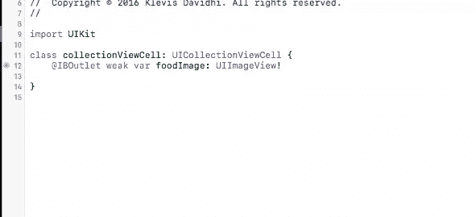
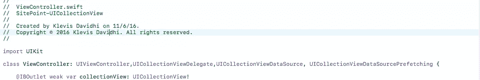

# uicollectionview 数据源引用示例和说明

> 原文：<https://www.sitepoint.com/uicollectionview-datasourceprefetching-example-and-explanation/>

# UICollectionView 数据源检索

最近，苹果宣布了一个新的`UICollectionViewDataSource`协议扩展，名为`UICollectionViewDataSourcePrefetching`。这个扩展使得实现两个新功能成为可能，这两个新功能提供了完全平滑的滚动性能。本教程将向您展示如何使用它。

你可以在 [GitHub](https://github.com/sitepoint-editors/UICollectionViewDataSourcePrefetching) 上找到源代码。

## 设置 Xcode 项目

打开 **Xcode** ，基于 ***单视图应用*** 模板新建一个项目。在您做任何事情之前，为了改善我们应用程序的外观，选择*视图*并选择*编辑器* - > *嵌入* - > *导航控制器。*现在从*对象库*拖动一个`Collection View`到*视图*画布上并调整其大小。

注意到进入`Collection View`的是一个可重用的`cell`，所以在*属性检查器*下点击，并给这个单元格一个*标识符*，姑且称之为`foodCell`。将一个`UIImageView`拖到它上面，并调整其大小以适应内容。



创建一个新文件，类型为 *Cocoa Touch Class* ，子类为`UICollectionViewCell`，将其命名为`collectionViewCell`，并将其分配给`cell`。



将`UIImageView`连接到 *collectionViewCell.swift* 代码，并将其命名为“ *foodImage* ”。此外，将`collectionView`连接到 *ViewController.swift* 。



## 符合协议并写一些行

现在，是时候在 *viewController.swift* 中写一些代码了。
首先要做的是使类符合`UICollectionViewDelegate`、`UICollectionViewDataSource`和`UICollectionViewDataSourcePrefetching`协议。



由于所需的方法尚未实现，您可能会在侧栏中看到一些错误。我们很快会谈到这一点，但让我们先完成一点设置。

我们需要这个`UICollectionView`的数据源，所以让我们创建一个名为`imageArray`的数组，为了便于说明，它将存储 30 张图片。在任何方法之外，像这样创建数组:

```
var imageArray = [UIImage?](repeating: nil, count: 30)
```

和一个变量来存储图片的基本 url，如下所示:

```
var baseUrl = URL(string: "https://placehold.it")!
```

同上创建另一个类型为`URLSessionDataTask`的数组:

```
var tasks = [URLSessionDataTask?](repeating: nil, count: 30)
```

下一步是创建两个独立的函数，以便从动态生成的 URL 生成图像。第一个函数需要一个参数，在我们的例子中，这个参数将是每个`cell`的索引，并将返回一个 url。

```
 func urlComponents(index: Int) -> URL {

        var baseUrlComponents = URLComponents(url: baseUrl, resolvingAgainstBaseURL: true)
        baseUrlComponents?.path = "/\(screenSize.width)x\(screenSize.height * 0.3)"
        baseUrlComponents?.query = "text=food \(index)"
        return (baseUrlComponents?.url)!
    }
```

第二个是执行下载过程的地方，它需要每个`cell`的`indexPath`作为参数。这个函数的返回类型将是`URLSessionDataTask`。

```
 func getTask(forIndex: IndexPath) -> URLSessionDataTask {
        let imgURL = urlComponents(index: forIndex.row)
        return URLSession.shared.dataTask(with: imgURL) { data, response, error in
            guard let data = data, error == nil else { return }

            DispatchQueue.main.async() {
                let image = UIImage(data: data)!
                self.imageArray[forIndex.row] = image
                self.collectionView.reloadItems(at: [forIndex])
            }
        }
    }
```

确保您已经在`viewDidLoad()`方法中添加了这些行:

```
collectionView.dataSource = self
collectionView.delegate = self
collectionView.prefetchDataSource = self
```

## 实施所需的方法

现在，我们必须实现 3 个必需的方法:

*   `collectionView(_:numberOfItemsInSection:)`
*   `collectionView(_:cellForItemAt:)`
*   `collectionView(_:prefetchItemsAt:)`

`UICollectionView`必须知道该节中有多少行，所以我们将返回数组中元素的计数:

```
func collectionView(_ collectionView: UICollectionView, numberOfItemsInSection section: Int) -> Int {
    return imageArray.count
}
```

在介绍最重要的方法之前，还有一件事要做。让我们创建一个可以监控下载过程的方法。
同样需要的参数是`cell`的`indexPath`。

```
 func requestImage(forIndex: IndexPath) {
        var task: URLSessionDataTask

        if imageArray[forIndex.row] != nil {
            // Image is already loaded
            return
        }

        if tasks[forIndex.row] != nil
            && tasks[forIndex.row]!.state == URLSessionTask.State.running {
            // Wait for task to finish
            return
        }

        task = getTask(forIndex: forIndex)
        tasks[forIndex.row] = task
        task.resume()
    }
}
```

最后，是构建和返回每个`cell`的时候了。所以在这个方法中:

```
 func collectionView(_ collectionView: UICollectionView, cellForItemAt indexPath: IndexPath) -> UICollectionViewCell {

        let foodCell = collectionView.dequeueReusableCell(withReuseIdentifier: "foodCell", for: indexPath) as! collectionViewCell

        if let img = imageArray[indexPath.row] {
            foodCell.foodImage.image = img
        }
        else {
            requestImage(forIndex: indexPath)
        }

        return foodCell
    }
```

正如我们看到的,`requestImage(forIndex: IndexPath)`方法帮助我们观察一个图像是已经下载了，正在下载还是根本没有下载。

## 预取

为了让你的应用程序有“非常流畅”的性能，你必须努力让应用程序动画达到每秒 60 帧。这意味着用户界面的给定帧必须在 16.67 毫秒内显示，以使动画看起来“流畅”否则，当帧速率下降到低于这个值时，用户会明显感觉到动画的起伏。

**预取**是一种机制，通过这种机制，在集合视图需要显示单元格之前，您会提前得到通知，从而有机会在实际创建单元格之前准备好单元格的数据源。 ***预取*** 由`UICollectionViewDataSourcePrefetching`协议提供，包含两个实例函数:

```
public protocol UICollectionViewDataSourcePrefetching : NSObjectProtocol {

// indexPaths are ordered ascending by geometric distance from the collection view

@available(iOS 10.0, *)
public func collectionView(_ collectionView: UICollectionView, prefetchItemsAt indexPaths: [IndexPath])

// indexPaths that previously were considered as candidates for pre-fetching, but were not actually used; may be a subset of the previous call to -collectionView:prefetchItemsAtIndexPaths:

@available(iOS 10.0, *)
optional public func collectionView(_ collectionView: UICollectionView, cancelPrefetchingForItemsAt indexPaths: [IndexPath])
} 
```

## 实现数据源预取

当`Collection View`甚至在单元格出现在屏幕上之前就准备好开始构建单元格时，调用第一个也是必需的方法。一个由`NSIndexPath`对象组成的数组被传递给函数，用于准备数据源。在我们的代码中，我们会这样写:

```
 func collectionView(_ collectionView: UICollectionView, prefetchItemsAt indexPaths: [IndexPath]) {

        for indexPath in indexPaths{

            requestImage(forIndex: indexPath)
        }

    }
```

## 实现预取取消

如上所述，第二种方法`collectionView(_:cancelPrefetchingForItemsAt:)`是一个可选特性，当`Collection View`取消了对单元格数组的预取时，它允许您恢复或清理数据源。当滚动改变方向或变得太快以至于*预取*无法有效实施时，就会发生这种情况。因此，让我们在代码中实现最后一个函数:

```
 func collectionView(_ collectionView: UICollectionView, cancelPrefetchingForItemsAt indexPaths: [IndexPath]) {
        for indexPath in indexPaths{
            if let task = tasks[indexPath.row] {
                if task.state != URLSessionTask.State.canceling {
                    task.cancel()
                }
            }
        }
    }
```

有时，您可能希望禁用集合视图预取。这可以通过将`UICollectionView isPrefetchingEnabled`属性设置为`false`来实现。

这些新功能也可以通过实现`UITableViewDataSourcePrefetching`协议在`UITableView`中使用。

## 结论

使用这个协议及其功能是一个不错的选择。不再需要担心单元格的性能，因为它们在被看到之前就已经准备好出现在屏幕上，并且有了平滑的滚动性能，我们的应用程序感觉更好。

## 分享这篇文章