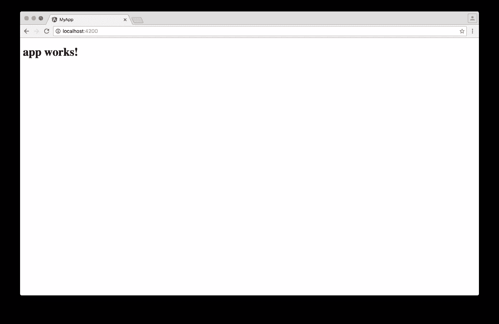
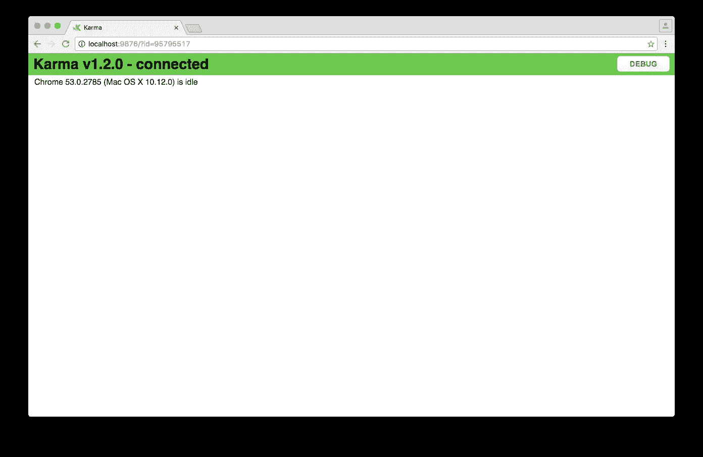
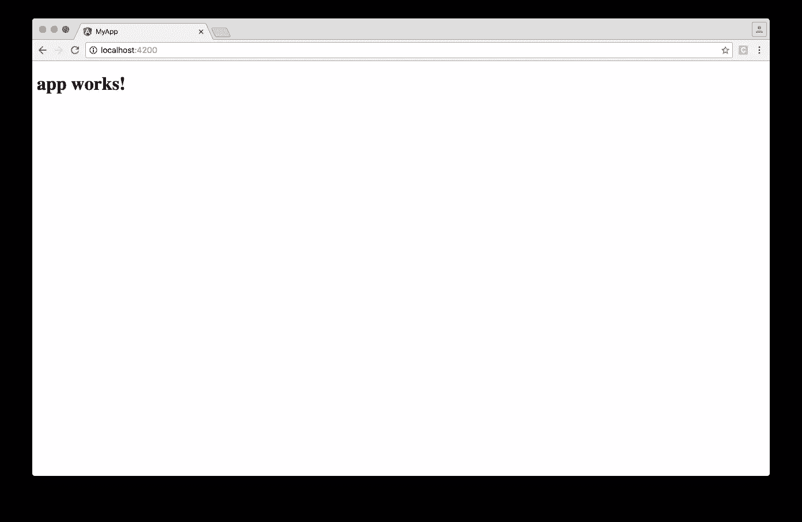

# 终极角度 CLI 参考指南

> 原文：<https://www.sitepoint.com/ultimate-angular-cli-reference/>

在本文中，我们将了解什么是 Angular CLI，它能为您做什么，以及它如何在幕后施展一些魔法。即使您已经使用了 Angular CLI，本文也可以作为更好地理解其内部工作方式的参考。

从技术上讲，您不需要使用 Angular CLI 来开发 Angular 应用程序，但是它的许多特性可以极大地提高代码的质量，并在开发过程中节省大量时间。

*更喜欢用循序渐进的视频课程学习 Angular？在 SitePoint Premium 上查看* [学习 Angular 5](https://www.sitepoint.com/premium/courses/learn-angular-5-3000?ref_source=sitepoint&ref_medium=article-copy&ref_campaign=angular-5-course) *。*


这是关于如何用 Angular 编写 Todo 应用程序的 4 篇系列文章中的第一篇。

1.  **第 0 部分—极限角度 CLI 参考指南**
2.  [第 1 部分—启动并运行我们的第一个 Todo 应用程序版本](https://www.sitepoint.com/angular-2-tutorial/)
3.  [第 2 部分—创建单独的组件来显示待办事项列表和单个待办事项](https://www.sitepoint.com/understanding-component-architecture-angular/)
4.  [第 3 部分—更新 Todo 服务以与 REST API 通信](https://www.sitepoint.com/angular-rxjs-create-api-service-rest-backend/)
5.  [第 4 部分—使用角度路由器解析数据](https://www.sitepoint.com/component-routing-angular-router/)。

### 一些历史

2016 年 9 月 15 日 [Angular Final 发布](http://angularjs.blogspot.be/2016/09/angular2-final.html)。

当 [AngularJS 1.x](https://angularjs.org/) 被局限于一个框架时， [Angular](https://angular.io/) 已经成长为一个雄心勃勃的平台，允许你开发跨所有平台的快速和可扩展的应用，例如 web、移动 web、本地移动甚至本地桌面。

随着向平台的转变，工具变得比以往更加重要。然而，设置和配置工具并不总是容易的。为了确保 Angular 开发人员能够专注于尽可能少地构建应用程序，Angular 团队投入了大量精力为开发人员提供高质量的开发工具集。

该工具集一部分是与各种 ide 和编辑器的紧密集成。该工具集的另一部分是 [Angular CLI](https://cli.angular.io/) 。

所以让我们开始吧！

* * *

**2017.04.25:** 截至 3 月 24 日，Angular CLI v1.0 发布。这篇文章已经更新，以反映最新的变化。如果您想将 Angular CLI v1.0 的最新功能添加到您现有的 Angular 项目中，该项目是使用 Angular CLI 的早期版本生成的，请查看 [Angular CLI v1.0 迁移指南](https://github.com/angular/angular-cli/wiki/stories-1.0-update)。

**2017.02.17:** 自 2017 年 2 月 9 日起，`ng deploy`命令已从 Angular CLI 的核心中移除。在这里阅读更多。

**2017.01.27:** 截至 2017 年 1 月 27 日，官方建议任何 1.x 版本使用名称 *AngularJS* ，任何 2+版本使用名称 *Angular* 。这篇文章已经更新，以反映[官方品牌指南](http://angularjs.blogspot.be/2017/01/branding-guidelines-for-angular-and.html)。

* * *

## 什么是 Angular CLI？

Angular CLI 是一个命令行界面(CLI ),用于自动化您的开发工作流程。它允许您:

*   创建新的角度应用程序
*   运行支持 LiveReload 的开发服务器，在开发过程中预览您的应用程序
*   向现有的角度应用程序添加功能
*   运行应用程序的单元测试
*   运行应用程序的端到端(E2E)测试
*   构建应用程序以部署到生产环境中。

在我们详细了解以上每一项之前，让我们先来看看如何安装 Angular CLI。

## 先决条件

在使用 Angular CLI 之前，您必须在系统上安装 Node.js 6.9.0 和 npm 3.0.0 或更高版本。

您可以下载适用于您的操作系统的 Node.js 最新版本，并在[官方 Node.js 网站](https://nodejs.org)上查阅最新的安装说明。

如果已经安装了 Node.js 和 npm，可以通过运行以下命令来验证它们的版本:

```
$ node -v # => displays your Node.js version
$ npm -v # => displays your npm version 
```

一旦安装了 Node.js，就可以使用`npm`命令来安装[类型脚本](http://www.typescriptlang.org/):

```
$ npm install -g typescript@2.2.0 
```

虽然 TypeScript 在技术上不是一个绝对的要求，但是 Angular 团队强烈推荐它，所以我建议您安装它，以便尽可能舒适地使用 Angular。

现在已经安装了 Node.js 和 TypeScript，可以安装 Angular CLI 了。

## 安装角度 CLI

要安装 Angular CLI，请运行:

```
$ npm install -g @angular/cli 
```

这将在您的系统上全局安装`ng`命令。

要验证安装是否成功完成，您可以运行以下命令:

```
$ ng version 
```

这将显示您已安装的版本:

```
@angular/cli: 1.0.0
node: 6.10.0
os: darwin x64 
```

现在您已经安装了 Angular CLI，让我们用它来创建一个新的应用程序。

## 创建新的角度应用

使用 Angular CLI 创建新应用程序有两种方式:

*   `ng init`:在当前目录下新建一个应用程序
*   `ng new`:新建一个目录，在新目录下运行`ng init`。

所以`ng new`类似于`ng init`，除了它也为你创建一个目录。

假设您还没有创建目录，让我们使用`ng new`创建一个新项目:

```
$ ng new my-app 
```

在幕后，会发生以下情况:

*   创建一个新目录`my-app`
*   您的新 Angular 应用程序的所有源文件和目录都是基于您指定的名称(`my-app`)和来自[官方 Angular 风格指南](https://angular.io/styleguide)的最佳实践创建的
*   npm 依赖项已安装
*   已经为您配置了 TypeScript
*   已经为您配置好了 [Karma](https://karma-runner.github.io) 单元测试运行程序
*   [量角器](http://www.protractortest.org/)端到端测试框架已经为您配置好了
*   创建具有默认设置的环境文件。

在接下来的几节中，您将了解更多关于这些方面的内容。

此时，您有了一个工作的 Angular 应用程序，您的新目录`my-app`如下所示:

```
.
├── README.md
├── e2e
│   ├── app.e2e-spec.ts
│   ├── app.po.ts
│   └── tsconfig.e2e.json
├── karma.conf.js
├── package.json
├── protractor.conf.js
├── src
│   ├── app
│   │   ├── app.component.css
│   │   ├── app.component.html
│   │   ├── app.component.spec.ts
│   │   ├── app.component.ts
│   │   └── app.module.ts
│   ├── assets
│   ├── environments
│   │   ├── environment.prod.ts
│   │   └── environment.ts
│   ├── favicon.ico
│   ├── index.html
│   ├── main.ts
│   ├── polyfills.ts
│   ├── styles.css
│   ├── test.ts
│   ├── tsconfig.app.json
│   ├── tsconfig.spec.json
│   └── typings.d.ts
├── tsconfig.json
└── tslint.json 
```

### 可用选项

*   `--dry-run` : boolean，默认为`false`，执行模拟运行，因此不会向文件系统写入任何更改
*   `--verbose`:布尔型，默认`false`
*   `--link-cli` : boolean，默认`false`，自动链接`@angular/cli`包([更多信息](https://github.com/angular/angular-cli#development-hints-for-hacking-on-angular-cli)
*   `--skip-install`:布尔型，默认`false`，跳过`npm install`
*   `--skip-git`:布尔型，默认`false`，不初始化 git 库
*   `--skip-tests`:布尔型，默认`false`，跳过创建测试
*   `--skip-commit`:布尔值，默认`false`，跳过第一次 git 提交
*   `--directory`:字符串，创建目录的名称，默认与应用程序名称相同
*   `--source-dir`:字符串，默认`'src'`，源目录名称
*   `--style`:字符串，默认`'css'`，要使用的风格语言(`'css'`、`'less'`或`'scss'`)
*   `--prefix`:字符串，默认`'app'`，生成新组件时使用的前缀
*   `--mobile` : boolean，默认`false`，生成一个渐进式 Web 应用程序(参见[即将推出的功能](#aglimpseintothefuture)一节)
*   `--routing` : boolean，默认`false`，添加带路由信息的模块，导入到主 app 模块中
*   `--inline-style` : boolean，默认`false`，生成新应用程序时使用内嵌样式
*   `--inline-template` : boolean，默认`false`，生成新应用时使用内嵌模板。

运行`$ ng generate --help`查看本地安装的 Angular CLI 的所有可用选项。

让我们来看看如何启动您的应用程序，以便您可以看到它的实际运行。

## 运行您的应用

要在浏览器中预览新应用程序，请导航到其目录:

```
$ cd my-app 
```

并运行:

```
$ ng serve 
```

要在端口 4200 上启动内置开发服务器:

```
** NG Live Development Server is running on http://localhost:4200 **
Hash: 09fb2ad840c1472e5885
Time: 6230ms
chunk    {0} polyfills.bundle.js, polyfills.bundle.js.map (polyfills) 158 kB {4} [initial] [rendered]
chunk    {1} main.bundle.js, main.bundle.js.map (main) 3.62 kB {3} [initial] [rendered]
chunk    {2} styles.bundle.js, styles.bundle.js.map (styles) 9.77 kB {4} [initial] [rendered]
chunk    {3} vendor.bundle.js, vendor.bundle.js.map (vendor) 2.37 MB [initial] [rendered]
chunk    {4} inline.bundle.js, inline.bundle.js.map (inline) 0 bytes [entry] [rendered]
webpack: Compiled successfully. 
```

现在，您可以将您最喜欢的浏览器导航到 http://localhost:4200/



在幕后，会发生以下情况:

1.  Angular CLI 从`.angular-cli.json`加载其配置
2.  Angular CLI 运行 Webpack 来构建和捆绑所有 JavaScript 和 CSS 代码
3.  Angular CLI 启动 [Webpack 开发服务器](https://webpack.github.io/docs/webpack-dev-server.html)在`localhost:4200`上预览结果。

请注意，在步骤 3 之后,`ng serve`命令没有退出并返回到您的终端提示符。

相反，因为它包括 LiveReload 支持，所以该进程会主动监视您的`src`目录中的文件变化。当检测到文件更改时，将重复步骤 2，并向您的浏览器发送通知，以便它可以自动刷新。

要停止该过程并返回到您的提示，请按`ctrl-c`。

## 向您的角度应用添加功能

您可以使用`ng generate`命令向现有应用程序添加功能:

*   向您的应用程序添加一个类
*   `ng generate component my-new-component`:向您的应用程序添加一个组件
*   向您的应用程序添加一个指令
*   `ng generate enum my-new-enum`:在应用程序中添加一个枚举
*   `ng generate module my-new-module`:给你的应用程序添加一个模块
*   向您的应用程序添加一个管道
*   `ng generate service my-new-service`:向您的应用程序添加服务

`generate`命令和不同的子命令也有快捷符号，因此以下命令是相似的:

*   向您的应用程序添加一个类
*   `ng g c my-new-component`:向您的应用程序添加一个组件
*   向您的应用程序添加一个指令
*   `ng g e my-new-enum`:在应用程序中添加一个枚举
*   `ng g m my-new-module`:给你的应用程序添加一个模块
*   向您的应用程序添加一个管道
*   向您的应用程序添加服务。

每个不同的子命令执行不同的任务，并提供不同的选项和参数。

让我们逐一看看。

### 添加新类别

要添加名为`UserProfile`的类，运行:

```
$ ng generate class user-profile
installing component
  create src/app/user-profile.ts 
```

Angular CLI 将自动为您调整文件名和类名的字母大小写，因此以下命令具有相同的效果:

```
# All three commands are equivalent
$ ng generate class user-profile
$ ng generate class userProfile
$ ng generate class UserProfile 
```

在幕后，会发生以下情况:

*   创建一个文件`src/app/user-profile.ts`，它导出一个名为`UserProfile`的空类

#### 可用选项

*   `--spec` : boolean，默认`false`，用单元测试生成规格文件

运行`$ ng generate --help`查看本地安装的 Angular CLI 的所有可用选项。

#### 示例:

```
# Generate class 'UserProfile'
$ ng generate class user-profile

# Generate class 'UserProfile' with unit test
$ ng generate class user-profile --spec 
```

### 添加新组件

要添加带有选择器`app-site-header`的组件，运行:

```
$ ng generate component site-header
installing component
  create src/app/site-header/site-header.component.css
  create src/app/site-header/site-header.component.html
  create src/app/site-header/site-header.component.spec.ts
  create src/app/site-header/site-header.component.ts
  update src/app/app.module.ts 
```

Angular CLI 将自动调整文件名和组件名的字母大小写，并将前缀应用于组件选择器，因此以下命令具有相同的效果:

```
# All three commands are equivalent
$ ng generate component site-header
$ ng generate component siteHeader
$ ng generate component SiteHeader 
```

在幕后，会发生以下情况:

*   创建一个目录`src/app/site-header`
*   在该目录中生成了四个文件:
    *   组件样式的 CSS 文件
    *   组件模板的 HTML 文件
    *   一个带有名为`SiteHeaderComponent`的组件类和选择器`app-site-header`的类型脚本文件
    *   一个包含新组件单元测试样本的规格文件
*   `SiteHeaderComponent`作为声明被添加到最近模块的`@NgModule`装饰器中，在本例中是`src/app/app.module.ts`中的`AppModule`。

#### 可用选项

*   `--flat` : boolean，默认`false`，在`src/app`而不是`src/app/site-header`生成组件文件
*   `--inline-template` : boolean，默认`false`，使用内嵌模板而不是单独的 HTML 文件
*   `--inline-style` : boolean，默认`false`，使用内联样式而不是单独的 CSS 文件
*   `--prefix`:布尔型，默认`true`，使用组件选择器中`.angular-cli.json`指定的前缀
*   `--spec` : boolean，默认`true`，用单元测试生成规格文件
*   `--view-encapsulation`:字符串，指定视图封装策略
*   `--change-detection`:字符串，指定变化检测策略。

运行`$ ng generate --help`查看本地安装的 Angular CLI 的所有可用选项。

#### 示例:

```
# Generate component 'site-header'
$ ng generate component site-header

# Generate component 'site-header' with inline template and inline styles
$ ng generate component site-header --inline-template --inline-style 
```

### 添加新指令

要添加带有选择器`appAdminLink`的指令，请运行:

```
$ ng generate directive admin-link
installing directive
  create src/app/admin-link.directive.spec.ts
  create src/app/admin-link.directive.ts
  update src/app/app.module.ts 
```

Angular CLI 将自动调整文件名和指令名的字母大小写，并将前缀应用于指令选择器，因此以下命令具有相同的效果:

```
# All three commands are equivalent
$ ng generate directive admin-link
$ ng generate directive adminLink
$ ng generate directive AdminLink 
```

在幕后，会发生以下情况:

*   创建一个文件`src/app/admin-link.directive.ts`,该文件导出一个名为`AdminLinkDirective`的指令，并带有一个选择器`appAdminLink`
*   使用指令的单元测试创建文件`src/app/admin-link.directive.spec.ts`
*   `AdminLinkDirective`作为声明被添加到最近模块的`@NgModule`装饰器中，在本例中是`src/app/app.module.ts`中的`AppModule`。

#### 可用选项

*   `--flat` : boolean，默认`true`，在`src/app`而不是`src/app/admin-link`生成指令文件
*   `--prefix`:布尔型，默认`true`，使用指令选择器中`.angular-cli.json`指定的前缀
*   `--spec` : boolean，默认`true`，用单元测试生成规格文件

运行`$ ng generate --help`查看本地安装的 Angular CLI 的所有可用选项。

#### 示例:

```
# Generate directive 'adminLink'
$ ng generate directive admin-link

# Generate directive 'adminLink' without unit test
$ ng generate directive admin-link --spec=false 
```

### 添加新的枚举

要添加一个名为`Direction`的[枚举](https://www.typescriptlang.org/docs/handbook/enums.html)，运行:

```
$ ng generate enum direction
installing enum
  create src/app/direction.enum.ts 
```

Angular CLI 将自动为您调整文件名和枚举名的字母大小写，因此以下命令具有相同的效果:

```
# Both commands are equivalent
$ ng generate enum direction
$ ng generate enum Direction 
```

在幕后，会发生以下情况:

*   创建一个文件`src/app/direction.enum.ts`，它导出一个名为`Direction`的枚举

#### 可用选项

该命令没有命令行选项。

### 添加新模块

要向应用程序添加新模块，请运行:

```
$ ng generate module admin
installing module
  create src/app/admin/admin.module.ts 
```

在幕后，会发生以下情况:

*   创建一个目录`src/app/admin`
*   在`src/app/admin/admin.module.ts`中创建了一个`AdminModule`模块。

请注意，`AdminModule`模块不会自动添加到`src/app/app.module.ts`中的主模块`AppModule`中。由您决定将模块导入到您需要的地方。

要在另一个模块中导入您的新模块，您可以在一个`@NgModule`定义中指定 is 作为导入。例如:

```
import { AdminModule } from './admin/admin.module';

@NgModule({
  // ...
  imports: [
    AdminModule
  ]
})
export class AppModule { } 
```

#### 可用选项

*   `--routing` : boolean，缺省值`false`，生成一个附加模块`AdminRoutingModule`，只包含路由信息，并将其作为导入添加到新模块中
*   `--spec` : boolean，默认`false`，添加`src/app/admin/admin.module.spec.ts`，通过单元测试检查模块是否存在。

运行`$ ng generate --help`查看本地安装的 Angular CLI 的所有可用选项。

#### 示例:

```
# Add module 'admin'
$ ng generate module admin

# Add module 'admin' with additional module containing routing information
$ ng generate module admin --routing 
```

### 添加新管道

一个[管道](https://angular.io/docs/ts/latest/guide/pipes.html)是 AngularJS 1.x 中一个过滤器的角度等价物，它允许你在一个模板中转换一个显示值。

要添加名为`convertToEuro`的管道，运行:

```
$ ng generate pipe convert-to-euro
installing pipe
  create src/app/convert-to-euro.pipe.spec.ts
  create src/app/convert-to-euro.pipe.ts
  update src/app/app.module.ts 
```

Angular CLI 将自动为您调整文件名和管道名的字母大小写，因此以下命令具有相同的效果:

```
# All three commands are equivalent
$ ng generate pipe convert-to-euro
$ ng generate pipe convertToEuro
$ ng generate pipe ConvertToEuro 
```

在幕后，会发生以下情况:

*   创建一个文件`src/app/convert-to-euro.pipe.ts`,它导出一个名为`ConvertToEuroPipe`的管道类
*   使用管道的单元测试创建一个文件`src/app/convert-to-euro.pipe.spec.ts`
*   `ConvertToEuroPipe`作为声明被添加到最近模块的`@NgModule`装饰器中，在本例中是`src/app/app.module.ts`中的`AppModule`。

#### 可用选项

*   `--flat` : boolean，默认`true`，在`src/app`而不是`src/app/site-header`生成组件文件
*   `--spec` : boolean，默认`true`，用单元测试生成 spec 文件。

运行`$ ng generate --help`查看本地安装的 Angular CLI 的所有可用选项。

#### 示例:

```
# Generate pipe 'convertToEuro' with spec and in /src/app directory
$ ng generate pipe convert-to-euro

# Generate pipe 'convertToEuro' without spec and in /src/app/convert-to-euro directory
$ ng generate pipe convert-to-euro --spec=false --flat=false 
```

### 添加新服务

要添加带有依赖注入令牌`BackendApiService`的服务，请运行:

```
$ ng generate service backend-api
installing service
  create src/app/backend-api.service.spec.ts
  create src/app/backend-api.service.ts
  WARNING Service is generated but not provided, it must be provided to be used 
```

Angular CLI 将自动为您调整文件名和管道名的字母大小写，因此以下命令具有相同的效果:

```
# All three commands are equivalent
$ ng generate service backend-api
$ ng generate service backendApi
$ ng generate service BackendApi 
```

在幕后，会发生以下情况:

*   创建一个文件`src/app/backend-api.service.ts`，它导出一个名为`BackendApiService`的服务类
*   为您的新服务创建一个包含单元测试的文件`src/app/backend-api.service.spec.ts`。

请注意 Angular CLI 是如何警告服务已经生成，但还没有在任何地方提供。通过将服务添加到需要它的`providers: []`数组中(例如，在一个模块或组件中)，由您决定是否将服务注册为提供者。例如:

```
import { BackendApiService } from './backend-api.service';

@NgModule({
  // ...
  providers: [BackendApiService],
  bootstrap: [AppComponent]
}) 
```

#### 可用选项

*   `--flat` : boolean，默认`true`，在`src/app`而不是`src/app/backend-api`生成服务文件
*   `--spec` : boolean，默认`true`，用单元测试生成规格文件

运行`$ ng generate --help`查看本地安装的 Angular CLI 的所有可用选项。

#### 示例:

```
# Generate service with DI token 'BackendApiService' in /src/app directory
$ ng generate service backend-api

# Generate service with DI token 'BackendApiService' in /src/app/backend-api directory
$ ng generate service backend-api --flat=false 
```

### 记名票据

Angular CLI 并不只是盲目地为你生成代码。它使用静态分析来更好地理解应用程序的语义。

例如，当使用`ng generate component`添加新组件时，Angular CLI 会在应用程序的模块树中找到最近的模块，并在该模块中集成新功能。

因此，如果您的应用程序有多个模块，Angular CLI 将根据您运行命令的目录，自动将新功能集成到正确的模块中。

## 运行您的单元测试

在最初创建应用程序时，Angular CLI 会自动为您配置 [Karma 测试运行器](https://karma-runner.github.io)。

当向您的应用程序添加一个特性时，您可以使用`--spec`选项来指定您是否希望 Angular CLI 也为您的新特性创建一个相应的带有示例单元测试的`.spec.ts`文件。

规格文件创建在与`src`目录中相应特征相同的目录中。这允许您在处理特征时轻松定位它们。

因此，运行应用程序的所有单元测试意味着运行`src`目录中所有以`.spec.ts`结尾的文件中指定的所有单元测试。

若要运行所有单元测试，请运行:

```
$ ng test 
```

您的控制台中将出现以下输出:

```
$ ng test
[karma]: No captured browser, open http://localhost:9876/
[karma]: Karma v1.4.1 server started at http://0.0.0.0:9876/
[launcher]: Launching browser Chrome with unlimited concurrency
[launcher]: Starting browser Chrome
[Chrome 57.0.2987 (Mac OS X 10.12.0)]: Connected on socket 4OBzlsVyIPZyE1AYAAAA with id 41455596
Chrome 57.0.2987 (Mac OS X 10.12.0): Executed 3 of 3 SUCCESS (0.132 secs / 0.121 secs) 
```

还将启动一个特殊的浏览器实例:



以下是幕后发生的事情:

1.  角载荷`.angular-cli.json`。
2.  Angular CLI 使用`.angular-cli.json`中指定的配置运行 Karma。默认情况下，这是位于应用程序根目录下的`karma.conf.js`。
3.  Karma 打开 Karma 配置中指定的浏览器。默认情况下，浏览器设置为[谷歌浏览器](https://www.google.com/chrome/)。
4.  Karma 然后指示浏览器(Chrome)使用 Karma 配置中指定的测试框架运行`src/test.ts`。默认情况下，这是 [Jasmine 框架](http://jasmine.github.io/)。当创建应用程序时，会自动创建文件`src/test.ts`。它被预先配置为加载和配置测试 Angular 应用程序所需的代码，并运行您的`src`目录中所有以`.spec.ts`结尾的规范文件。
5.  Karma 向控制台报告测试运行的结果。
6.  Karma 观察`src`文件的变化，并在检测到文件变化时重复步骤 4 和 5。

要结束该过程，可以按`ctrl-c`。

如果你想了解更多关于测试你的角度代码，你可以查看[官方角度测试指南](https://angular.io/docs/ts/latest/guide/testing.html)。

## 运行您的端到端(E2E)测试

最初创建应用程序时，Angular CLI 会自动为您配置[量角器](http://www.protractortest.org/)。

要运行 E2E 测试，请运行:

```
$ ng e2e 
```

您的控制台中将出现以下输出:

```
** NG Live Development Server is running on http://localhost:49152 **
Hash: e570d23ac26086496e1d
Time: 6087ms
chunk    {0} polyfills.bundle.js, polyfills.bundle.js.map (polyfills) 158 kB {4} [initial] [rendered]
chunk    {1} main.bundle.js, main.bundle.js.map (main) 3.62 kB {3} [initial] [rendered]
chunk    {2} styles.bundle.js, styles.bundle.js.map (styles) 9.77 kB {4} [initial] [rendered]
chunk    {3} vendor.bundle.js, vendor.bundle.js.map (vendor) 2.37 MB [initial] [rendered]
chunk    {4} inline.bundle.js, inline.bundle.js.map (inline) 0 bytes [entry] [rendered]
webpack: Compiled successfully.
I/file_manager - creating folder /Users/jvandemo/Projects/test/my-app/node_modules/protractor/node_modules/webdriver-manager/selenium
I/downloader - curl -o /Users/jvandemo/Projects/test/my-app/node_modules/protractor/node_modules/webdriver-manager/selenium/chromedriver_2.29.zip https://chromedriver.storage.googleapis.com/2.29/chromedriver_mac64.zip
I/update - chromedriver: unzipping chromedriver_2.29.zip
I/update - chromedriver: setting permissions to 0755 for /Users/jvandemo/Projects/test/my-app/node_modules/protractor/node_modules/webdriver-manager/selenium/chromedriver_2.29
I/launcher - Running 1 instances of WebDriver
I/direct - Using ChromeDriver directly...
Spec started

  my-app App
    ✓ should display message saying app works

Executed 1 of 1 spec SUCCESS in 0.523 sec.
I/launcher - 0 instance(s) of WebDriver still running
I/launcher - chrome #01 passed 
```

还将启动一个特殊的浏览器实例:



以下是幕后发生的事情:

1.  角载荷`.angular-cli.json`。
2.  Angular CLI 使用`.angular-cli.json`中指定的配置运行量角器。默认情况下，这是位于应用程序根目录下的`protractor.conf.js`文件。
3.  量角器打开量角器配置中指定的浏览器。默认情况下，浏览器设置为[谷歌浏览器](https://www.google.com/chrome/)。
4.  量角器然后指示浏览器(Chrome)运行您的`e2e`目录中所有以`.e2e-spec.ts`结尾的规格文件。
5.  量角器向控制台报告测试运行的结果。

在步骤 5 之后，该过程自动退出。

如果你想了解更多关于 E2E 测试你的角度代码，你可以查看[官方角度测试指南](https://angular.io/docs/ts/latest/guide/testing.html)和[量角器](http://www.protractortest.org/)文档。

## 构建用于生产的应用程序

在开发过程中，运行`ng serve`自动构建并捆绑您的 Angular 应用程序到一个虚拟文件系统。

然而，当您的应用程序为生产做好准备时，您将需要可以部署到您的服务器或云的真实文件。

要为部署构建和捆绑您的应用程序，请运行:

```
$ ng build 
```

该命令的输出被发送到您的控制台:

```
Hash: 59aaa9ef8eac5d46cdf8
Time: 5433ms
chunk    {0} polyfills.bundle.js, polyfills.bundle.js.map (polyfills) 158 kB {4} [initial] [rendered]
chunk    {1} main.bundle.js, main.bundle.js.map (main) 3.61 kB {3} [initial] [rendered]
chunk    {2} styles.bundle.js, styles.bundle.js.map (styles) 9.77 kB {4} [initial] [rendered]
chunk    {3} vendor.bundle.js, vendor.bundle.js.map (vendor) 2.07 MB [initial] [rendered]
chunk    {4} inline.bundle.js, inline.bundle.js.map (inline) 0 bytes [entry] [rendered] 
```

这是幕后发生的事情:

1.  Angular CLI 从`.angular-cli.json`开始加载其配置。
2.  Angular CLI 运行 Webpack 来构建和捆绑所有 JavaScript 和 CSS 代码。
3.  结果被写入您的 Angular CLI 配置中指定的`outDir`目录。默认情况下，这是`dist`目录。

### 可用选项

*   `--aot`:启用提前编译
*   `--base-href`:字符串，索引文件中使用的基本 href
*   `--environment`:字符串，默认`dev`，使用环境
*   `--output-path`:字符串，输出写入的目录
*   `--target`:字符串，默认`development`，使用环境
*   `--watch` : boolean，默认`false`，观察文件变化，并在检测到变化时重建。

### 目标

指定目标会影响构建过程的操作方式。它的值可以是下列值之一:

*   `development`:默认模式，不要缩小或篡改代码
*   `production`:缩小和丑化代码。

在生产模式下构建应用程序:

```
$ ng build --target=production 
```

这会导致捆绑包变小、变丑，并且名称中有哈希:

```
Hash: 4dea6adc9ac01de3c11b
Time: 5588ms
chunk    {0} polyfills.2d45a4c73c85e24fe474.bundle.js (polyfills) 158 kB {4} [initial] [rendered]
chunk    {1} main.a64b48e56248eb808195.bundle.js (main) 20.8 kB {3} [initial] [rendered]
chunk    {2} styles.d41d8cd98f00b204e980.bundle.css (styles) 69 bytes {4} [initial] [rendered]
chunk    {3} vendor.205c7417e47c580a2c34.bundle.js (vendor) 1.1 MB [initial] [rendered]
chunk    {4} inline.310ccba0fff49a724c8f.bundle.js (inline) 0 bytes [entry] [rendered] 
```

### 环境

环境允许您指定设置来定制您的应用程序行为。

您可以在`.angular-cli.json`文件中定义自己的环境。默认的有:

*   `source`:使用`environments/environment.ts`中定义的设置
*   `dev`:使用`environments/environment.ts`中定义的设置
*   `prod`:使用`environments/environment.prod.ts`中定义的设置。

在这里，`environments/environment.ts`等于:

```
export const environment = {
  production: false
}; 
```

并且`environments/environment.prod.ts`等于:

```
export const environment = {
  production: true
}; 
```

默认情况下，构建过程将使用`dev`环境。

如果指定不同的环境，构建过程将使用相应的环境:

```
# Uses environments/environment.ts
$ ng build

# Also uses environments/environment.ts
$ ng build --environment=dev

# Uses environments/environment.prod.ts
$ ng build --environment=prod 
```

正如您在`src/main.ts`中看到的，您可以通过导入`environments/environment`从代码中访问环境设置:

```
import { enableProdMode } from '@angular/core';
import { platformBrowserDynamic } from '@angular/platform-browser-dynamic';

import { AppModule } from './app/app.module';
import { environment } from './environments/environment';

if (environment.production) {
  enableProdMode();
}

platformBrowserDynamic().bootstrapModule(AppModule); 
```

构建过程将确保在导入时提供正确的环境。

## 部署应用程序

截至 2017 年 2 月 9 日，`ng deploy`命令已经从 Angular CLI 的核心中移除。点击阅读更多[。](https://github.com/angular/angular-cli/pull/4385)

## 弹出您的应用程序

从 1.0 版开始，Angular CLI 提供了一个命令来分离您的应用程序和 Angular CLI。

默认情况下，Angular CLI 为您管理底层 webpack 配置，因此您不必处理它的复杂性。

如果在任何给定时间，您希望手动配置 Webpack，并且不再希望将 Angular CLI 用于 Angular 应用程序，您可以运行:

```
$ ng eject 
```

这将在您的控制台中生成以下输出:

```
==========================================================================================
Ejection was successful.

To run your builds, you now need to do the following commands:
   - "npm run build" to build.
   - "npm run test" to run unit tests.
   - "npm start" to serve the app using webpack-dev-server.
   - "npm run e2e" to run protractor.

Running the equivalent CLI commands will result in an error.

==========================================================================================
Some packages were added. Please run "npm install". 
```

这是幕后发生的事情:

1.  属性`ejected: true`被添加到`.angular-cli.json`文件中
2.  使用独立的 Webpack 配置在应用程序的根目录下生成一个`webpack.config.js`文件，因此您可以在没有 Angular CLI 的情况下构建您的项目
3.  您的`package.json`中的`build`脚本被更新，因此您可以运行`npm run build`来构建您的项目
4.  您的`package.json`中的`test`脚本被更新，因此您可以运行`npm run test`或`npm test`来运行您的单元测试
5.  您的`package.json`中的`start`脚本被更新，因此您可以运行`npm run start`或`npm start`来启动开发服务器
6.  您的`package.json`中的`e2e`脚本被更新，因此您可以运行`npm run e2e`来运行您的端到端测试。

退出应用程序后，您可以根据自己的喜好手动更新 Webpack 配置，Angular CLI 命令将不再起作用。

因此，如果出于某种原因，您想离开 Angular CLI，弹出命令可以满足您的需求。

## 未来的一瞥

Angular CLI 的路线图包含许多激动人心的新功能:

*   **渐进式 web 应用程序(PWA)支持**
    Angular CLI 将能够为您创建 Web 应用程序清单，生成应用程序外壳，并提供服务工作者脚本来缓存您的应用程序数据。
    [在此了解更多有关移动支持的信息](https://github.com/angular/mobile-toolkit/blob/master/guides/cli-setup.md)。
*   **重构支持**
*   **升级支持**
    Angular CLI 将能够帮助您进行角度升级。因为 Angular CLI 对您的应用程序有语义理解，所以它将能够帮助您在升级到 Angular 的新版本时进行所需的代码更改。
*   **可扩展性**
    改进的可扩展性支持，让您可以创建自己的定制插件和部署脚本。
*   **性能提升**
    性能提升，Angular CLI 变得更快。
*   **库开发者模式**
    除了创建一个新的应用，Angular CLI 还会让你创建一个可以被其他人消费的新库。

其中一些功能已经部分可用。如果你想和他们一起玩，可以看看 GitHub 库。

## 摘要

Angular CLI 是一个命令行界面(CLI ),用于自动化您的开发工作流程。

如今，您已经可以使用 Angular CLI 来:

*   创建新的角度应用程序
*   运行支持 LiveReload 的开发服务器，在开发过程中预览您的应用程序
*   向现有的角度应用程序添加功能
*   运行应用程序的单元测试
*   运行应用程序的端到端(E2E)测试
*   构建部署到生产环境的应用程序
*   将应用程序部署到服务器。

虽然从技术上来说，不需要使用 Angular CLI 来开发 Angular 应用程序，但它肯定可以提高代码的质量，并为您节省大量时间和精力。

由于随着时间的推移，将会添加许多令人兴奋的功能，Angular CLI 可能会成为开发 Angular 应用程序不可或缺的工具。

要了解 Angular CLI 的更多信息，请查看[官网](https://cli.angular.io/)和 [GitHub 资源库](https://github.com/angular/angular-cli)。

最终的角度 CLI 参考指南由[蒂姆·塞韦里恩](https://www.sitepoint.com/author/tseverien/)、[维尔丹·索蒂奇](https://www.sitepoint.com/author/vildansoftic/)和[琼·尹](https://github.com/newjs)进行同行评审。感谢 SitePoint 的所有同行评审员使 SitePoint 的内容尽可能做到最好！

## 分享这篇文章