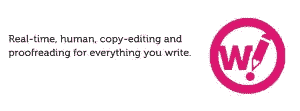

# 终极内容营销工具包

> 原文：<https://www.sitepoint.com/ultimate-content-marketing-toolkit/>

你有没有想过这个问题:是什么让别人选择你的内容，而不是同一主题的竞争文章？答案很简单。如果你想在内容营销的世界里有竞争力，你需要确切地了解读者想要什么。你必须以一种吸引人的、令人愉快的方式来满足这些需求。然后，你需要把内容直接放在读者面前。内容营销过程可能非常耗时且难以实施。这就是为什么使用正确的工具是至关重要的。

幸运的是，今天有大量的应用程序和工具可以指导你完成整个过程，从内容发现和分发到使你的写作和营销阶段更容易和更有效。人们再也没有借口就没人想看的无聊话题写低质量的文章了。

这里有 20 个工具被认为是当今流行的，并被证明是成功作家和内容营销者的有效助手。我按照目的、内容类型和内容创建过程的阶段对它们进行了分类。

## 寻找内容创意

在传达信息之前，你必须了解情况。没有人愿意提供过时的、观众不感兴趣的内容。所以，你应该首先查看那些能识别最新趋势的网站、网络和资源。在以下网站的帮助下，找出你的受众真正感兴趣的是什么，以及目前哪些话题是热门话题:

### [冰帽](http://buzzsumo.com/)

BuzzSumo 是一个工具，它可以帮助你确定给定主题的哪些领域是当前的趋势。你可以输入一个关键词，然后查看它在各种社交媒体平台上被分享的频率。您甚至可以设置提醒，以了解给定主题在未来是否会变得流行。

### [Quora](http://www.quora.com/)

Quora 是一个独特的社交媒体平台。成员参与问答论坛。使用 Quora 的知识库进行内容研究，或者通过记录最常被问到的问题来识别当前的趋势。

### [饲料地](http://feedly.com/)

在一个地方收集所有你喜欢的博客。对最近的帖子进行分类，以了解什么是流行的。由于用户友好的界面，它很容易实现和使用。

## 保持思路有条理

所以，你已经收集了内容和想法，现在重要的是组织你的写作过程。用以下工具组织你所有的资源、想法和研究发现。

### [Evernote](https://evernote.com/)

Evernote 是最受欢迎的组织应用之一。在你进行研究的时候使用它，你所有的笔记都会在同一个地方。此外，您可以添加您的编辑日历，并监控即将到来的截止日期。要开始使用 Evernote ,你只需创建一个免费账户。

### [还记得牛奶吗](http://www.rememberthemilk.com/)

这个应用程序就像类固醇上的待办事项列表！合并 Outlook、Twitter、Google Calendar 等中记录的所有即将完成的任务。你甚至可以从 Evernote 中整合你的写作任务。

### [口袋](https://getpocket.com/)

很多时候，我们读到一些东西，会想“我想以后再回到那个”，但是当*以后*到来的时候，你却找不到你想要的出处。现在，你可以把所有东西放进口袋里。存储您在 Twitter、Flipboard、Pulse 和大量其他应用程序上发现的所有喜爱的资源。您存储的内容创意将在您的手机、平板电脑和台式机上可用。

### [明米斯特](http://www.mindmeister.com/)

这是一款独一无二的思维导图工具。邀请你的作者和编辑在头脑风暴过程中合作。该应用程序有一个免费的计划，为个人用户和公司提供基本的功能和付费计划。这个工具的主要好处是它很直观，所以你不会花太多时间去弄清楚如何使用它。

## 发短信，检查，编辑

现在，你已经收集和组织了你的想法，是时候开始创作内容了。每个人都用不同的方式写作，这些工具中只有一部分可能对你有用。希望你能找到一个能改变你写作方式的方法，变得更好。

### [作者](http://www.iawriter.com/ipad/)

消除写作过程中的所有干扰。这个应用程序通过删除除了你当前正在写的三行文本之外的所有内容，帮助你将你当前的想法保持在你思维过程的最前沿。没有拼写检查。没有工具栏。只是写作。

### [牟](http://25.io/mou/)

如果你需要在 markdown 中写一篇文章，这是一个很好的编辑器。牟让这个过程完全没有痛苦。它有一些有用的工具，比如字数统计、输入单词时的自动补全和一个字符转换器(中文、日文和韩文)。

一旦你完成了写作，你需要用这些编辑和校对工具来润色它:

#### [字典和辞典](http://dictionary.reference.com/)

Dictionary.com 是最受欢迎的在线搜索工具之一。现在，他们有了一个移动应用程序。在旅途中搜索单词及其定义。作为一个额外的(也许是不必要的)好处，你可以进行语音搜索。同义词词典有助于找到完美的同义词。此外，您可以根据相关性、复杂性、长度等对结果进行排序。

#### [姜](http://www.gingersoftware.com/)

Ginger 声称它可以帮助你像说母语的人一样写作。它不仅能检查语法错误，还能帮助你重组句子。Ginger 还有一个翻译工具。

#### [啰嗦](https://wordy.com/)

该工具提供实时的文本编辑和校对。不要担心质量；你写的东西会有真人审核。你可以直接联系编辑。该应用程序需要一次性费用，但它允许添加多个用户，所以你可以单独使用该应用程序或与你的同事分享。

#### [贴片架](http://www.plagtracker.com/)

用这个工具检查任何抄袭错误。PlagTracker 还会告诉你某项索赔是否需要引用。该应用程序是免费的，但是如果你需要额外的高级功能，你可以购买付费订阅。随着保费计划，你不仅会得到抄袭，而且语法检查。PlagTracker 被认为比现在其他的剽窃检查工具更准确，并且提供关于你写作的详细报告。

## 想象它

内容不再仅仅指文字，而且已经很久没有了。现在，有很多方法可以将信息可视化，这种内容在表达你的观点时更有效，也更有趣。[研究表明](http://blog.hubspot.com/blog/tabid/6307/bid/33423/19-Reasons-You-Should-Include-Visual-Content-in-Your-Marketing-Data.aspx)传输到大脑的 90%的信息是视觉信息，40%的读者对视觉信息的反应会比文本更好。让我们来看看可以帮助我们制作视频、信息图、演示文稿等的工具。

### [知识视野](http://www.knowledgevision.com/)

这个工具对任何想用在线演示来解释、宣传、销售、教授、推销或阐释的人都很有帮助。这款应用非常容易使用，你根本不需要精通技术，也不需要有任何演示经验。您可以出于个人目的免费使用该工具，也可以选择为企业客户提供的付费版本。

### [Prezi](https://prezi.com/)

这个在线工具可以创建令人难忘的演示文稿。使用您选择的图像和视频对其进行定制。你甚至可以与其他作家和编辑合作完成这个项目。如今有各种各样的演示工具可用，所以如果 Prezi 不是完美的匹配，你总是可以尝试 Prezi 的一些[替代品。](https://www.sitepoint.com/top-5-web-presentation-tools-compared/)

### 美国

这款多任务内容创建工具将帮助您制作在线杂志、目录和样书。请注意，Issuu 非常适合处理 PDF 文件，并且能够将纯文本转换为精美的出版物。它还允许你通过社交媒体分享内容。像今天的大多数应用程序一样，Issuu 提供灵活的定价系统，基本免费计划。

### [皮科](http://piktochart.com/)

Piktochart 背后的策划者说，让信息变得美丽从未如此容易。选择他们的一个信息图表模板，自定义它，然后与您的读者分享。

如果你喜欢信息图表，看看这些创建你自己的的[其他选项。](https://www.sitepoint.com/easily-make-infographics/)

### [重复](http://www.powtoon.com/)

制作自己的动画视频。这个循序渐进的教程将帮助你做出完美的视觉效果。作为额外的奖励，它是免费的！

## 传播消息

太好了，你的内容准备好了。现在你的任务是通过在正确的地方分享来传播给你的目标受众。这里有一些工具可以帮助你推广和分发你的内容。

### [缓冲器](https://bufferapp.com/)

Buffer 可以让你在一个地方进行所有的社交分享，顾名思义，你可以安排你的帖子在你指定的发布时间发布。您可以使用内置的帖子分析来确定哪些帖子运行良好，以及应该在什么时间发布。

“Awesome”计划每月 10 美元，而“Business”计划有 7 天的免费试用期，每月 50-250 美元不等，具体取决于你需要的帖子和用户数量。

### [SlideShare](http://www.slideshare.net/)

由于 SlideShare 被列入世界上访问量最大的 120 个网站，它是一个分享你的内容的非常好的地方！上传演示文稿、信息图表、文章、视频等。你可以免费使用 SlideShare，你需要做的只是花几分钟创建一个帐户。

### [Outbrain](http://www.outbrain.com/)

Outbrain 是最大的内容发现平台之一。渴求内容的读者会从你这里寻找个性化的内容，以便他们参与和分享。该平台根据点击付费模式工作，因此您可以根据自己的需求调整定价。

## 准备好了吗？走吧。

正如你所看到的，有许多工具可以帮助你将大量的内容转化为一个高效的过程，并让你为你所写和分享的内容感到自豪。内容营销可能很耗时，但是使用正确的工具，你可以简化这个过程，使之比你想象的更简单，从而生产出高质量的内容，并提供给那些对阅读感兴趣的人。

如果你有任何你使用的其他工具或者对我提到的工具有任何反馈，请在评论中分享！

## 分享这篇文章