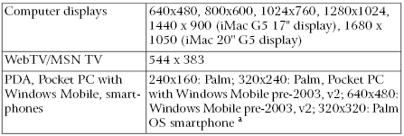
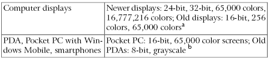
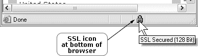
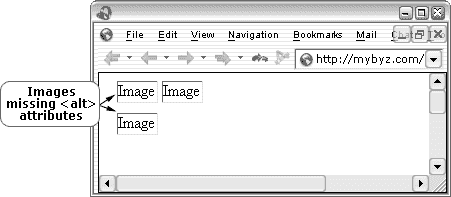
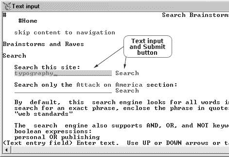

# 终极测试清单

> 原文：<https://www.sitepoint.com/ultimate-testing-checklist/>

测试在网站的开发和长期维护中扮演着重要的角色。虽然小型网站——尤其是那些预算有限的网站——可能不需要遵循大型商业网站所需的正式测试程序，但每个网站都需要经过彻底的测试，以确保没有错误、用户友好、易于访问并且符合标准。

测试应该在网站开发的每个阶段完成。两个代价最大的 web 项目错误是将测试推迟到发布之前，或者根本不测试。生产期间的测试使定位和解决错误变得更加容易，并最大限度地减少了现有错误在开发后期被复制的机会。早期和持续的测试可以消除昂贵的重新设计和其他主要修复的需要，这些都是由被忽略的错误引起的。

这一章的清单，摘自 SitePoint 的新版本 [*交付一流网站:101 个基本清单*](https://www.sitepoint.com/books/checklists1/) ，将帮助你在开发期间和之后测试你的网站。[下载这份清单，以及涵盖 SEO 和内容管理的其他清单](https://www.sitepoint.com/show-modal-popup-after-time-delay/)——你还会收到。pdf 版本的文档，可立即在您的 web 项目中使用。

##### 入门指南

记录你的基线网站测试需求。

利用您在第 2 章中收集的初步数据来帮助确定和记录您的基线现场测试要求。例如，你收集的关于你的访问者将使用的浏览器和连接速度的信息，以及这些访问者的技能和年龄组，可以作为你的测试计划的基础。

***寻找并安装所有必要的工具。***

您可以使用免费和低成本的测试工具非常便宜地进行测试。大多数浏览器都是免费的或者提供有条件的免费版本，你可以在一台电脑上下载并安装多个浏览器，包括几个版本的 Internet Explorer for Windows。可供选择的设备模拟器和仿真器，例如那些用于手机和 PDA 的，也可以免费下载和使用，并且大多数共享软件和商业软件创建者允许对他们的产品进行 30 天的试用以进行测试。一些网页设计相关的讨论列表，以及 SitePoint 论坛，欢迎测试请求和请求 bug 报告和反馈的帖子。

***提供可接受的测试协议。***

最终，网站每个页面的设计和布局必须既美观又能跨多个平台和浏览器运行。

在不同平台上测试设计元素的困难之一是测试结果可能是主观的。例如，一个设计者可能创建了一个 CSS 驱动的站点，它可以在新的浏览器上完美地工作，但是在旧的浏览器如 Netscape 4 上就不那么受欢迎了。测试人员可能会将其解释为故障点，而不是可接受的“设计退化”

为了避免重新提交页面进行测试所花费的时间和精力，请提前说明可接受的跨浏览器、跨平台差异——包括支持旧浏览器的协议。

*使用带注释的截图确定显示协议
在最终原型阶段的最后，要求设计师提供一系列带注释的截图，以确定网站在不同浏览器和平台上显示方式的差异。这些屏幕截图可以在以后的测试中使用，以确定每个平台上被认为是可接受的显示器。然后，测试人员可以将协议和截图与他们的发现进行比较。*

***设置暂存服务器。***

在您的网站发布之前，应该使用与您的网站的实时服务器环境相同的临时或测试服务器来进行测试和开发。

大型网站的自动化程序大型网站通常需要更强大的测试程序来测试大量的记录、值和内容。你可以考虑使用自动化程序，比如 [Badboy](http://www.badboy.com.au/) 、 [eValid](http://www.soft.com/eValid/) 或 [TestComplete](http://www.automatedqa.com/products/testcomplete/) 来实现这些目的。

##### 良好的测试实践

***系统地测试单个页面。***

一次一页地彻底测试你的网站，确保每一页都是可靠的。用同样的方法对网站的最终版本进行全面的测试。

***跟踪 bug，确认修复。***
记录发现的 bug 的细节及其解决方法。

***回归测试，尤其是修复 bug 的时候。***

回归测试，也称为验证测试，是对网站的页面或部分进行重新测试的过程，以确保最近的错误修复没有破坏网站的其他方面，或者恢复以前修复的错误。进行并记录回归测试将允许您识别站点中任何损坏的部分，并记录这些错误的原因以及您是如何解决它们的。如果某个 bug 在某个时候重新出现，它会被立即发现并迅速解决。(参见[回归测试，Webopedia 计算机词典](http://www.webopedia.com/TERM/R/regression_testing.html))。

***验证每个单独网页的标记。***

验证所有网页的标记，确保每个网页都使用结构化的、符合规范的标记。这将允许您确认您已经为指定的 DOCTYPE 使用了正确的标记，修复您可能犯的任何打字错误，并解决任何语法错误。在构建页面时验证标记，而不是等到创建了整个页面(或者更糟的是，整个网站)后再验证，这样可以更容易地隔离、查找和纠正标记问题。

一些 HTML 编辑器集成了验证工具，如 W3C 的 HTML 和 CSS 验证器、WDG HTML 验证器和 CSE HTML 验证器(一种 HTML/XHTML 语法检查器和验证器)，允许你在工作时方便地验证你的标记。

CSE 和 WDG HTML 验证器还包括有用的批处理功能。例如，虽然我在工作时用 CSE HTML 验证器和 W3C 的验证器来验证每个页面，但是我使用 CSE HTML 验证器的批处理来同时重新检查多个页面。当我开发完网站的所有页面时，我还使用批处理作为最终检查。

确保您使用的验证工具是基于 W3C 推荐的。

***验证所有 CSS。***

验证你在网站上使用的所有 CSS，包括每个外部样式表，以及所有嵌入和内嵌的 CSS。

***进行负载测试，对编程技术和服务器硬件能力进行压力测试。***

你需要确保你所使用的编程技术，以及你的服务器硬件的能力，能够满足比你所期望的网站更高的流量水平。采用这种方法将有助于您确保您的网站始终保持在线和完全正常运行。负载测试过程应该包括试运行——测试通常涉及使用模拟多个并发用户会话的自动化脚本。试运行将揭示你所使用的编程技术和服务器硬件将如何应对流量高峰。

*根据预计的服务器负载匹配主机服务
如果你正在使用虚拟主机服务，你的 ISP 应该根据预计的服务器负载匹配你的主机服务包，所以你应该让他们知道你的负载是多少。如果您的负载测试显示，随着流量水平的增加，您的现有设置有可能出现问题，您的 web 主机可能会推荐一个不同的提供更大容量的 web 主机包。*

如果你管理你自己的服务器，检查你的服务器软件提供商是否提供免费的负载测试软件——很多都提供。你也可以考虑使用专用的负载测试软件产品，比如由 [WebPerformance](http://www.webperformanceinc.com/) 和 [NetMechanic](http://netmechanic.com/monitor.htm) 提供的产品。此外，众多的[开源性能分析软件工具](http://www.opensourcetesting.org/performance.php)可以帮助您评估、监控和管理您网站的性能。(另请参见[测试 Web 服务器的压力工具](http://support.microsoft.com/kb/231282/en-us)，Microsoft.com。)

##### 一般测试

在多种浏览器和平台上测试你的网站。

事实上，你的网站在一种浏览器上看起来很好并且运行良好，并不意味着它在其他浏览器和/或平台上也会看起来很好或者运行良好。即使你正在为一个员工使用相同的浏览器和操作系统的组织开发一个内部网网站，这些员工使用的硬件和软件也会有所不同。从长远来看，最好在 W3C 建议的基础上开发您的网站，然后进行广泛的跨浏览器、跨平台测试。随时了解新的或更新的浏览器和操作系统的发布，以便您能够保持跨浏览器、跨平台测试的最新状态。

*测试哪些浏览器和平台？
检查您的服务器日志——以及其他在线和离线资源——包括浏览器统计数据、操作系统和新兴的网络使用趋势，以便您了解您的网站访问者现在使用的以及将来可能使用的浏览器、版本和操作系统。作为网站长期维护方法的一部分，计划每周检查一次服务器日志(如果您运行的是流量较低的小型网站，每月检查一次也可以),以跟踪浏览器统计数据的变化和趋势。在你进行跨浏览器、跨平台的测试程序时，要考虑到这些数据，以确保你测试的是你的访问者使用的所有浏览器和操作系统。这里有一个流行的操作系统和浏览器的列表，你可以在上面测试你的站点。*

**操作系统**

*   麦金塔 OS X
*   麦金塔操作系统 9
*   Windows XP SP1 和 SP2
*   Windows 2000
*   视窗 98
*   Linux 操作系统

用于 OS X 麦金塔电脑的浏览器

*   Safari 1.2
*   Mozilla 1.6
*   火狐 1.0
*   歌剧 9
*   歌剧 8
*   歌剧 7
*   Internet Explorer 5.2

**麦金塔操作系统 9 的浏览器**

*   iCab
*   Internet Explorer 5

【Windows XP 浏览器

*   歌剧 9
*   歌剧 8
*   歌剧 7
*   Mozilla 1.7
*   火狐 1.0
*   网景 7.1
*   互联网
*   浏览器 6.0
*   Lynx 浏览器

【Windows 2000 浏览器

*   歌剧 9
*   歌剧 8
*   歌剧 7
*   Mozilla 1.7.3
*   火狐 1.0
*   网景 7.1
*   网景 7.0
*   网景 6.2
*   网景 4.78
*   Internet Explorer 6
*   Internet Explorer 5.5
*   Internet Explorer 5.0
*   Lynx 浏览器

【Windows 98 浏览器

*   Internet Explorer 4.0
*   Lynx 浏览器

【Linux 浏览器

*   Konqueror 3.0.5
*   Mozilla 1.6
*   歌剧 8
*   歌剧 7
*   Emacs/W3
*   网景 7
*   网景 4.8

***每次更新都测试页面优化。***

从一开始就优化您的页面有助于确保您的网站设计和图像支持快速页面加载时间，以及网站的开发是顺利和有效的。每当你在你的网站上添加新内容、新图片或新网页时，检查内容的优化以帮助保持网站的流线型。如果你还不熟悉网站优化，请看第 11 章，网站优化。

*文档重量和加载时间工具
一些 HTML 编辑器包括告诉您文档重量或页面在各种连接速度下的加载时间的功能，大多数图像编辑软件产品会指示文件大小在各种连接速度下的加载时间。*

还有免费的在线工具可以计算文档重量、排版和页面加载时间，甚至提供优化 web 文档的建议。Siteoptimization.com 的有用的[网页分析器](http://www.webpageanalyzer.com/)就是这样一个工具。

***在多种显示器上查看页面。***

你可能会发现你漂亮的设计，在液晶显示器上有着惊人的对比度，但在 CRT 显示器上却无法阅读，在其他设备上也完全无法使用。不同的显示器不会总是一致地解释你的网站的设计和颜色，所以用各种各样的显示器来测试你的初始设计以及网站正在进行的开发是值得的。

***以不同的屏幕分辨率和各种颜色设置查看页面。***

一些 HTML 编辑器提供了一个特性，允许你在不同的屏幕分辨率和一系列的颜色设置下检查你的页面。类似的工具也可以作为一些浏览器的插件下载。例如，强烈推荐的 Firefox 的 Web Developer 工具栏扩展包括一个可定制的窗口大小调整工具，以及许多其他有用的功能。(关于 Firefox 为 web 开发人员提供的工具的更多信息，请参阅 Chris Pederick 的文章，[Firefox 和 Mozilla 的 Web Developer Extensions】。)](http://www.chrispederick.com/work/firefox/webdeveloper/)

*考虑非标准分辨率
屏幕显示尺寸可能反映也可能不反映可视网页的实际尺寸。许多用户不会将浏览器窗口扩展到整个屏幕(尤其是在较大的显示器上)，各种工具栏和侧面板会占据部分屏幕宽度和高度。例如，在 800×600 的显示器上，一个带有侧面板和几个自定义工具栏的浏览器只能显示 500×400 像素的网页——如果浏览器窗口没有最大化，显示的像素会更少。请确保进行测试时考虑到这种大范围的可变性，而不仅仅是标准的最大屏幕分辨率。表 14.1 显示了各种设备的屏幕分辨率，表 14.2 显示了不同显示器的色深设置，这应该有助于您的测试。*

*表 14.1。典型的屏幕分辨率和显示(像素)*

【a】丽莎·盖德， [palmOne Treo 650 Palm OS 智能手机](http://www.mobiletechreview.com/Treo_650.htm)，《移动技术评论》(2004 年 12 月 10 日)。

*表 14.2。典型显示色深设置*

【a】[浏览器统计:浏览器使用情况、操作系统、屏幕分辨率趋势如何？W3Schools(2005 年 1 月)。什么是掌上电脑(PPC)？有哪些模型？](http://www.w3schools.com/browsers/browsers_stats.asp)移动技术评论(无日期)。

除了表 14.1 和表 14.2 中提到的显示器之外，还有一些独立的工具，如在线订阅服务 [BrowserCam](http://browsercam.com/) ，它们可以提供屏幕截图，描述您的内容在各种屏幕分辨率和浏览器中的显示方式。

***检查颜色对比度是否足够。***

检查颜色对比度的一个好方法是将浏览器显示改为灰度显示，或者以黑白方式打印网页。一个非常有助于检查设计色彩对比度的工具是 [Vischeck](http://www.vischeck.com/) ，它模拟色盲视觉，让您像色盲用户一样查看页面。

***测试外部和嵌入式脚本和函数的功能。***

一些脚本和函数可能在一种浏览器中运行良好，但在其他浏览器或设备中可能无法正常运行。微小的调整可以解决许多跨浏览器、跨平台的功能问题。如果较旧的浏览器或替代和适应性技术不支持某些功能，您可能希望提供替代方法，以允许这些用户通过其他方式访问这些功能。

***测试所有链接，包括导航。***

确保所有链接正常工作，并指向正确的位置。链接检查软件可以检查有效的、断开的和重定向的链接。一些 HTML 编辑器，如 [Macromedia Dreamweaver](http://www.macromedia.com/software/dreamweaver/) 和 [HomeSite](http://www.macromedia.com/software/homesite/) ，提供链接检查功能。免费工具也是可用的——试试 [Xenu 的 links euth](http://home.snafu.de/tilman/xenulink.html)和 [W3C 链接检查器](http://validator.w3.org/checklink)。更多信息，请参见 WebsiteTips.com 的“T8”部分“链接检查器，维护”。但是，请注意，链接检查器不够直观，无法检查链接是否指向正确的位置——请务必手动检查。

***检查错误页面。***

故意在浏览器的地址栏中输入不正确的 URL，以检查相应的错误页面(404 错误等。)都到位了。

确保错误页面包含有用的信息和链接，帮助用户找到他们想要的内容。请记住，有时，访问者会错误地猜测域名或稍微拼错网址。通过接受常见的拼写错误、输入错误、不正确的大小写、相同项目的不同术语以及可预见的域名错误来帮助这些访问者:提供建议，将用户重定向到正确的页面。(马修·林德曼和杰森·弗里德合著，《网络防御设计:如何改善错误信息、帮助、表单和其他危机点》(印第安纳波利斯:新骑手出版社，2004 年)，99，224 页。)

***测试所有下载。***

检查以确保所有下载链接都指向正确的文件，并且下载文件存在。

***测试搜索功能***

确保搜索功能正常运行，并且搜索结果准确且有用。

**坚实的安全保障**

*清空您的缓存！
每次测试前，确保清除浏览器缓存，包括 cookies。*

***检查数字证书和 SSL URLs 是否正常工作。***

您的 SSL URLs 应该以 https://开头。此外，当访问者访问受 SSL 保护的网页时，大多数浏览器会在浏览器底部显示一个“锁”图标，如图 14.1 中 IE 6 for Windows 所示。

*图 14.1。浏览器窗口下方显示*
的“锁定”图标

SSL 通常用于加密在线交易和其他敏感数据，以及内部网和外部网。Verisign 和 Thawte 是两家发行 SSL 证书的流行公司。

***检查所有需要 SSL 访问的页面是否只能通过 SSL 访问。***

***测试禁区的安全性。***

用户可能会分享或试图猜测网站受保护区域的内容和下载的 URL。受限制的内容 URL 可能会出现在公开的推荐人日志中。人们甚至可能未经授权或许可就共享用户名和密码。因此，预测可能发生的安全违规行为并测试预防方法至关重要。

入侵你的网站:终极安全测试下载流行的黑客工具用于测试，看看你的保护区域是否能被轻易攻破。那些管理大型网站的人甚至会考虑外包或者雇佣黑客专家进行测试。

确保安全性和数据完整性——尤其是您的机密数据，包括客户信用卡信息——对于促进和维护网站访问者的信任至关重要。不要想当然地认为你的网站总是安全的。定期测试以确保其安全。

***测试表单和表单控件。***

检查以确保表单正确提交，并且只有在输入了正确的信息并完成了必填字段后才提交。检查表单错误消息，以确保它们在表单本身的上下文中是有帮助的和信息丰富的。

***测试网购设施。***

如果您的网站包含购物车或类似的功能，请彻底测试后端操作，以确保所有交易都是安全的，并且一切运行顺利。

##### 可访问性测试

如果您计划使您的站点具有可访问性，并在项目的每个阶段都包括可访问性测试，那么当您的站点准备好发布时，它很可能会满足 W3C 的 WCAG 指南，以及它必须解决的任何其他可访问性指南。

**进行初步审查**

W3C 推荐了一个两阶段的过程来测试网站的可访问性。首先，开发人员应该对网站进行初步审查，包括测试几个页面，以了解网站的可访问性。然后，他们应该进行彻底、全面的审查，包括使用各种工具和残疾用户对每个网页(或大型网站上的代表性网页)进行评估。(W3C，[评估网站的可访问性](https://www.w3.org/WAI/eval/)，W3C 网络可访问性倡议(2002 年 11 月 14 日)。)下面的清单是进行初步可访问性审查的指南。

***选择一个随机抽样的页面进行测试。***

你应该测试一个小网站的每一页。对于较大的网站，选择一个随机的页面样本，包括你的主页，每个部分至少一两个页面，特别重要或受欢迎的页面，如联系页面和站点地图。

***使用图形浏览器测试样本页面。***

***使用语音或纯文本浏览器测试样本页面。***

纯文本浏览器，如免费的 Lynx 纯文本浏览器，可以提供对网站可访问性的宝贵见解。

***使用两种评估工具。***

表 14.1 和表 14.2 列出了你可以用来评估你的站点的工具。

***使用 WCAG 1.0 的检查点、您的政府可访问性指南或其他要求手动检查代表性页面。***

***总结结果。***

如果您的结果摘要指出了一些可访问性问题，您可能希望在进行全面检查之前进行站点范围的更改。实现这些更改后，再进行一次初步测试。

**进行全面审查**

全面审查比初步审查更彻底和详细。这里有一份清单，可以帮助你确保不会遗漏任何东西！

***识别、确定并记录整个现场的一致性要求和水平。***

例如，您可以在文档中包含 WCAG 1.0 级别 1、当地政府要求和公司准则。

***测试站点的可访问性符合性。***

测试小网站的每一页。对于较大的网站，测试一个有代表性的样本，包括主页和所有特别重要或受欢迎的页面，每个部分的页面，每个不同布局的页面，以及从数据库生成的页面。

***使用至少两种不同的易访问性评估工具。***

使用 WCAG 1.0 的检查点、政府的可访问性指南或其他建议手动检查代表性页面。

***使用图形浏览器测试样本页面。***

***使用纯文本浏览器和语音浏览器测试页面。***

***确保界面元素可与多个输入设备一起操作。***

例如，用鼠标、仅用键盘和自适应技术测试所有界面元素。如果您使用 JavaScript 创建导航翻转效果，请确保链接在没有 JavaScript 的情况下也能工作，提供 HTML 文本链接，或者两者都实现。

***校对所有内容。***

通读网站的每一页，检查所有文本是否清晰、简单，是否适合网站的目标受众，以及那些有认知或学习障碍的细分市场。

确保你的文字清晰、简单，并且是为网络而写的，然后通过允许残疾人使用来提高它的可访问性。

你的写作有多复杂？
Clear Language and Design (CLAD)提供了一个很棒的[阅读效率工具](http://www.eastendliteracy.on.ca/ClearLanguageAndDesign/readingeffectivenesstool/)，旨在评估用户理解文本所需的读写技能。

有关认知和学习障碍的有益见解，请参见 Roger Hudson、Russ Weakley 和 Peter Firminger 的文章[a Accessibility Frontier:Cognitive Disabilities and Learning dilements](http://www.usability.com.au/resources/cognitive.cfm)。

与不同的参与者一起进行可用性测试。

如果可能的话，与有各种残疾、技术专长和对网站熟悉程度不同的人一起进行可用性测试。如果可能的话，使用多种适应性技术。

没有比让残疾用户测试网站更好的评估网站可访问性的方法了。应该注意的是，例如，一个视力正常的人不会像一个盲人那样每天使用 JAWS 这样的屏幕阅读器。

**使用图形浏览器进行测试**

你可以用你的浏览器做大量的可访问性测试。Opera 尤其有利于可访问性测试，因为浏览器使得关闭图像、动画、样式表、JavaScript、框架等变得非常简单。Ian Lloyd 写了一篇很棒的关于使用 Opera 测试网站可访问性的教程。

对于其他图形浏览器，包括 Mozilla、Firefox 和 Internet Explorer，也有有用的可访问性测试扩展、侧边栏面板和工具栏。除了访问你最喜欢的浏览器网站之外，还可以看看 Derek Featherstone 的[开发可访问网站的测试工具](http://www.wats.ca/show.php?contentid=46)——一个有用的带注释的浏览器链接列表。

***查看没有图片的页面。***

只要您已经为每个图像包含了`<alt>`属性(供不支持图像的浏览器使用，或者在关闭图像的情况下浏览的访问者使用)，浏览器将隐藏具有空白`<alt>`属性的装饰图像。然而，如果你不包括`<alt>`属性，浏览器将不会隐藏图像，屏幕阅读器将会阅读单词“图像”，如图 14.2 所示。

*图 14.2。在 Opera 7 for Windows*
中查看带有空白`<alt>`属性的图像

***查看没有样式表的页面。***

检查你的页面是否允许用户改变显示的字体大小。

***在禁用表格的情况下或在不支持表格的浏览器中查看表格数据。***

这一过程将表明您的表格数据对于使用屏幕阅读器、纯文本浏览器(如 Lynx)和老式 PDA 的访问者的有用程度。

***查看关闭新技术的网站。***

这些“新技术”包括 JavaScript、Java、声音功能和插件。当这些技术不可用时，您的页面应该保持功能性和可访问性。

**使用语音或纯文本浏览器进行测试**

如果你不能方便地使用语音浏览器，你可以使用 Lynx，一个免费的纯文本浏览器，或者 Delorie 的在线 Lynx 浏览器进行初步测试。对于全面的测试，W3C 建议使用纯文本浏览器和语音浏览器进行测试。(W3C，[评估网站的可访问性](https://www.w3.org/WAI/eval/)，Web Accessibility Initiative，W3C(2002 年 11 月 14 日)。)

***检查网站导航是否可用并正常工作。***

如果您的网站使用图像(包括图像地图)进行导航，文本超链接应该出现在它们的位置(通过`<alt>`属性文本，如果需要，也可能出现在`<title>`属性文本中)。如果您使用 Flash 或 Java 小程序进行导航，您的站点应该包含替代文本导航链接，以帮助确保可访问性。

*帮助每个人出行
记住，这种方法也有助于搜索引擎机器人抓取和索引你的网站。关于为搜索引擎爬虫优化你的网站的更多信息，参见第 11 章，网站优化。*

***检查所有超链接。***

***检查装饰图像是否不出现在纯文本浏览器中，也不被语音浏览器读取。***

正如我们上面讨论的，所有的装饰性图像，比如项目符号和设计相关的图像，都应该有空白的`<alt>`属性，这样纯文本浏览器和语音浏览器就可以忽略它们。

检查信息是否以连续阅读时可以理解的方式呈现。

Lynx 允许您模拟串行访问，这样您就可以确保语音和纯文本浏览器的用户能够理解您所呈现的信息。(乔·克拉克，《构建无障碍网站》(印第安纳波利斯:新骑手出版社，2003 年)，第 236 页。)

***测试表单控件。***

图 14.3 描述了用 Lynx 2.85 测试一个易访问性友好的表单。

*图 14.3。在 Lynx 中测试表单*

##### 可用性测试

如果你发现自己资金短缺，时间短缺，或者两者都短缺，你可能会考虑跳过可用性测试阶段。与其完全跳过这个过程，不如在一个简短的、非正式的规模上进行测试。最好在开发过程中进行一些小的、快速的测试，而不是在最后进行一个大的测试——特别是如果最后的可用性测试被安排在网站发布之前。

可用性测试的主要目标是确保你的最终版本，实时网站是用户友好的，并且对你的访问者来说工作良好。可用性测试的三个主要维度是有效性(测试用户是否能完成预期的任务)、效率(测试完成预期的任务需要多少努力)和满意度(测试用户是否有满意的体验并会回来)。(戴伊·亚历山大，《可用性测试的速赢》(演示，莫纳什大学网络研讨会系列，墨尔本，2002 年)，幻灯片 3)。)使用下面的清单作为确定和进行可用性测试的指南。

***列出测试目标和关注点。***

具体一点，记下网站上可能需要关注的任务和区域，例如，可能难以完成或使用的表单，或者用户期望找到某些产品的方法。请务必指定您希望测试的年龄组和计算机技能水平。

为了帮助确定您的目标和关注点，请与您的客户、管理层、设计师、开发商和其他参与项目的人员进行核实。

***选择测试方法。***

已经开发了许多方法来测试网站可用性的各个方面。在计划可用性测试时，根据可用的资源和时间来研究和考虑可用的方法是很重要的。

例如，你可以选择使用人物角色或者卡片分类来帮助测试你的网站的信息架构——这是你的网站可用性的一个重要方面。通过创建人物角色，您可以记录典型访问者为实现特定目标而采取的步骤，然后测试这些步骤——例如，特别关注人物角色可能用来实现该目标的信息架构、导航和表单。

卡片分类有助于了解网站访问者如何理解和浏览网站上的信息。

*进行卡片分类测试
为了进行卡片分类测试，给用户写有内容、特征或类别标题的索引卡片。在每张卡片上包括简短的描述，但不要暗示任何信息结构或分类。如果您计划在未来的阶段向您的网站添加更多的内容，如果可以的话，将这些特定的元素添加到卡片上会有所帮助。*

确保向您的测试用户简要介绍，解释没有正确或错误的答案。请他们仔细阅读每张卡片，并将其分组，让他们觉得有意义。如果用户对一张卡不确定，他们可以把它放在一边，在他们希望的任何时候回来。当他们完成后，让他们给每一堆贴上标签。

将结果与您网站的信息架构进行比较，作为确定是否需要进一步调整或更改的一种方法。

***根据你的目标市场招募用户进行测试。***

测试用户应该代表你的目标受众。例如，如果您的典型用户不是很懂技术，但是您与懂技术的用户一起测试，您的测试结果将不会发现潜在的技术相关问题，例如下拉菜单或多个浏览器窗口的混淆。

五个用户组成的测试组被认为足够提供有助于提高网站可用性的信息。

在开始测试之前，准备一份 NDA(保密协议)供用户签署。

***确定测试位置。***

Jakob Nielsen 和其他可用性专家谈论在可用性实验室进行测试。事实上，当您测试一个高度敏感和安全的网站，您有重要的硬件组件或特定的硬件必须用于测试，您预计长时间的测试会话(超过几个小时左右)，并且您有一个项目，您希望一组观察员观看测试时，实验室会很有帮助。(Julia Houck-Whitaker，[远程测试与实验室测试](http://boltpeters.com/articles/versus.html)，Bolt | Peters，Inc .(2005 年 2 月 3 日)。)

或者，“现场”测试也有好处——在办公室或家里测试网站，在这些地方使用测试人员自己的电脑。这种方法消除了可用性实验室的成本，同时允许你观察你的网站如何为典型的访问者服务。此外，测试人员使用他们自己的电脑可能会更加舒适和放松。然而，Jakob Nielsen 报告说，实地研究往往是昂贵的，而且很难获得在公司所在地进行实地研究的许可。(Elizabeth Neal，[为什么你不需要一个可用性实验室](https://www.sitepoint.com/article/dont-need-usability-lab)，SitePoint(2004 年 10 月 8 日)。)

还要考虑进行远程测试的可能性。例如，您可以在办公室使用电话口头传达指令，获得用户反馈，并参与讨论。但是，除非你在测试人员的电脑上安装了在线摄像机，否则你会错过测试中重要的观察部分。你需要鼓励他们“大声思考”，记住在回答和提问时要尽量保持中立。远程测试对于大型网站、具有电子商务功能的网站、web 应用程序和内部网来说非常有效。(Houck-Whitaker、Velda Bartek 和 Deane Cheatham，[体验远程可用性测试，第 1 部分](http://www-106.ibm.com/developerworks/web/library/wa-rmusts1/)，IBM developer works(2003 年 1 月 1 日)。)

对测试进行录像
对测试进行录像会有所帮助，因为录像有助于以后的回顾，让你看到测试过程中可能没有注意到的细节，并向项目团队的其他人展示测试。给视频打上时间标记将便于日后参考关键发现。

关于测试方法的更多信息，请参见贾尼斯·弗雷泽的[的《可用性文化:如何花更少的钱从你的可用性测试项目中获得更多的东西](http://www.ddj.com/dept/architect/184411669)，以及莱恩·贝克尔的 [90%的可用性测试是无用的](http://www.adaptivepath.com/publications/essays/archives/000328.php)。

***为测试人员营造轻松的氛围。***

不要让人们认为他们是在一个被评估的实验室里，把你的测试区域装饰成一个典型的办公室环境或者一个起居室。SitePoint 的文章[为什么你不需要一个可用性实验室](https://www.sitepoint.com/article/dont-need-usability-lab)，有更多关于这个的内容。

***为用户建立现实的任务来执行，并明确你将测量什么。***

例如，要测试提供大量按主题分类的文章的网站，您可以设置要求用户查找特定文章或主题的任务。从这些测试中，你可以收集测试对象完成每项任务所需的时间、导航是否有帮助、是否使用了本地搜索以及结果是否准确和有帮助的数据。

***只提供简单明了的说明。***

为了获得准确的测试结果，不要提供任何提示。

***除了您预定义的任务之外，允许用户执行他们自己的任务。***

用户经常会提出你没有想到的任务，通过追求这些任务，可以发现网站的重要微妙之处和问题。(卡洛琳·斯奈德，《纸上原型:设计和改进用户界面的快捷方式》(阿姆斯特丹:摩根·考夫曼出版社，2003 年)，第 330 页。)

***创建后测问卷。***

考虑一下你特别希望得到什么样的反馈，然后制作一份调查问卷来回答这些问题。此外，包括评论和建议的领域。您可以选择制作一份 1-5 等级系统的调查问卷(1 为差，5 为优)，要求用户对以下内容进行评级:

*   他们对网站的总体满意度
*   他们对设计和布局的总体满意度
*   完成特定任务的难易程度
*   找到特定信息的容易程度
*   导航标签、页面标题、标题和其他术语是否容易理解和准确
*   图标和其他图像是否有用，是否容易理解
*   可下载项目下载是否迅速和令人满意
*   密码保护区域是否易于登录和使用
*   是否发生了错误，如果发生了错误，是否遇到了合适且有用的错误消息
*   产品信息是否足够，或者信息太少或太多
*   他们完成电子商务交易的轻松程度
*   用户是否会返回网站
*   用户是否会向其他人推荐该网站
*   建议的改进

使用带有评论区的排名系统会给你提供有价值的数据。您可以分析已排名的回答，并使用评论和解释来获得进一步的有用见解。

***分析测试结果。***

您可能决定有必要在每次测试会议后与整个网站项目团队开会，讨论什么可行，什么不可行，以及可能的解决方案是什么。

首先关注高级功能问题，例如全局导航、链接和页面布局；然后关注具体领域和建议。(Kelly Goto 和 Emily Cotler，Web 重新设计 2.0:工作流(印第安纳波利斯:新骑手/伯克利:Peachpit 出版社，2005 年)，230 页。)

您可能还希望创建一个关于结果和建议的报告，以提交给设计人员和开发人员，如果适用的话，还可以提交给客户。

##### 摘要

本章强调了在网站开发和长期维护的每个阶段检查和测试工作的重要性。有清单可以帮助你测试你的设计、内容和标记；跨浏览器、跨平台测试的程序；以及关于测试标签、功能、安全性、可访问性和可用性的讨论。

你可以[下载这一章](https://www.sitepoint.com/show-modal-popup-after-time-delay/)的 [*交付一流网站:101 个基本清单*](https://www.sitepoint.com/books/checklists1/) ，连同所有的 SEO 清单。pdf 格式，可用于您的下一个项目。要了解这本书的更多信息，请查看 [*目录*](https://www.sitepoint.com/books/checklists1/toc/) 。

## 分享这篇文章