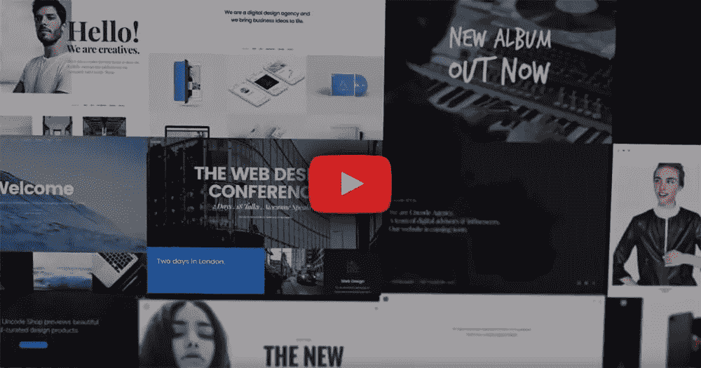
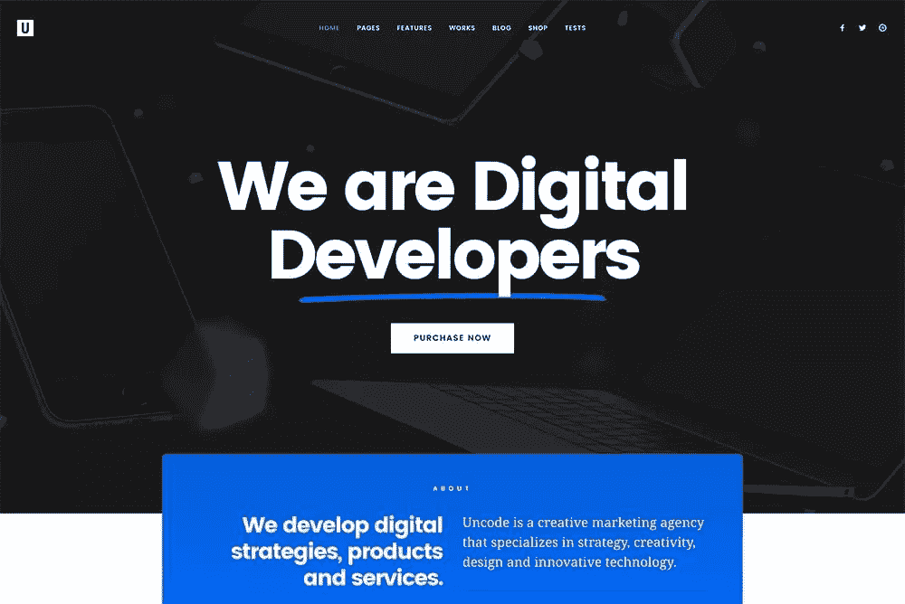
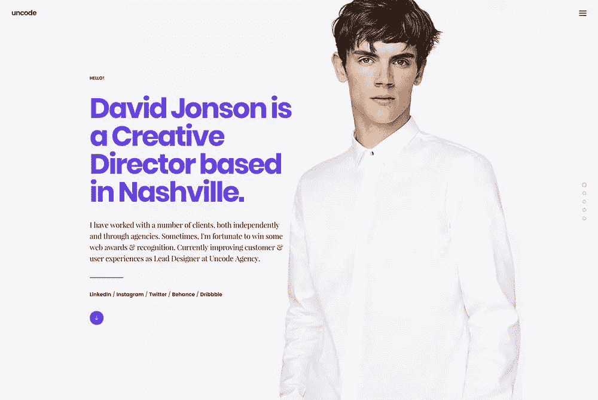
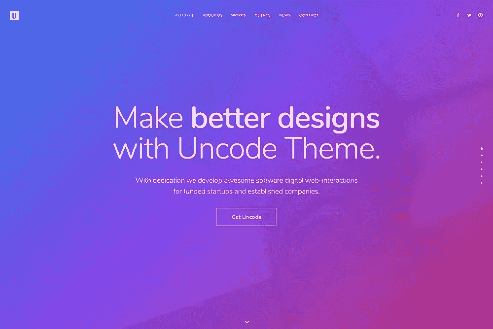
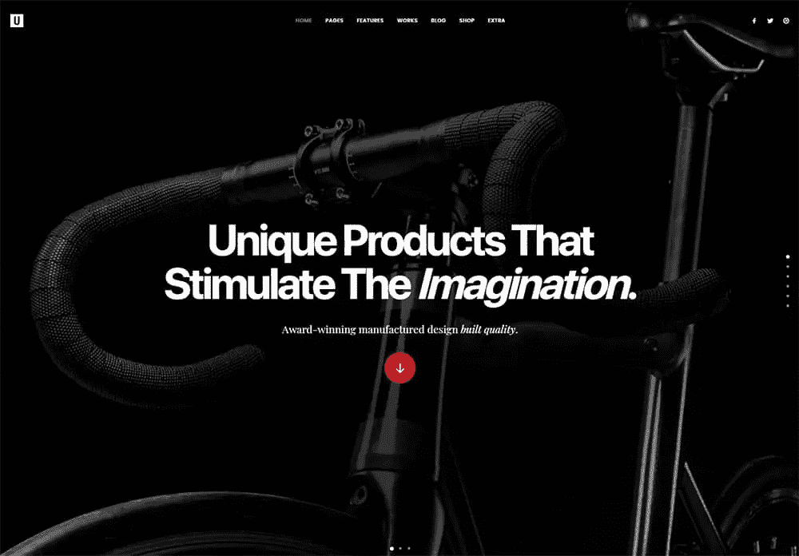
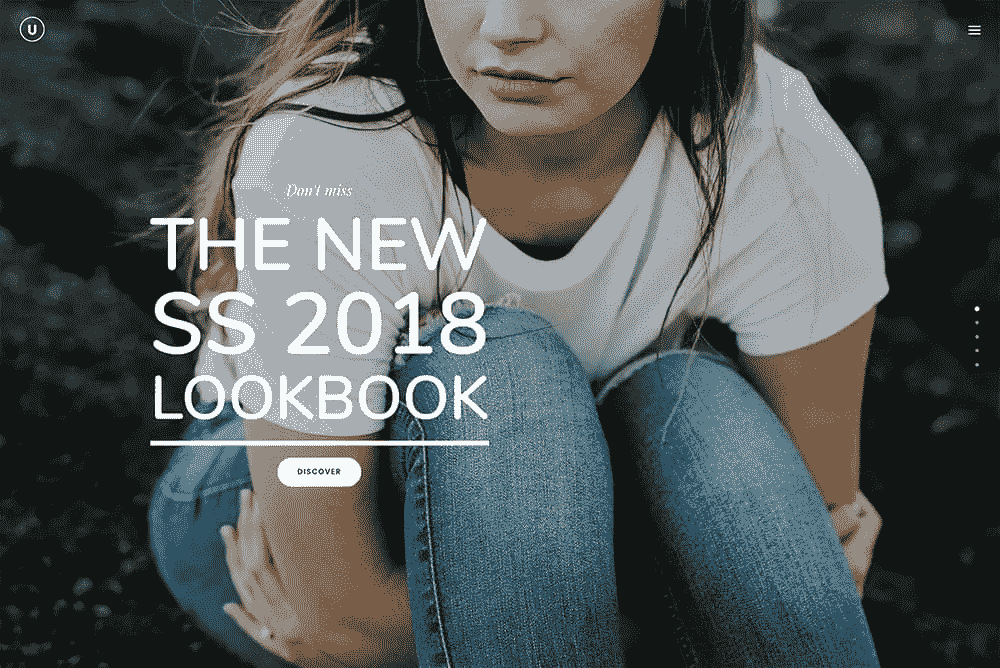
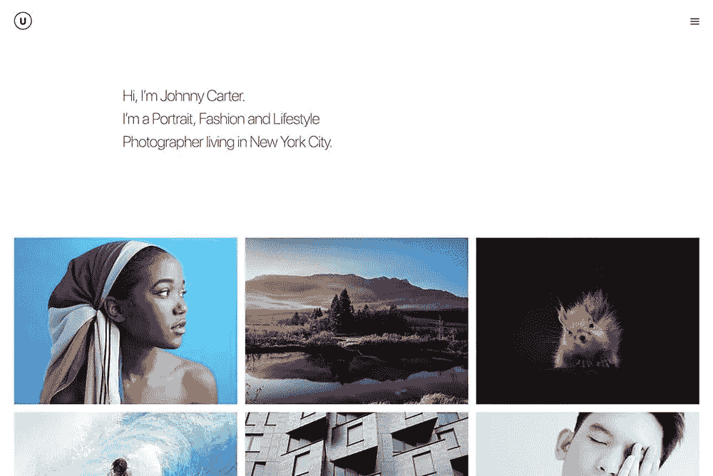

# Uncode WordPress 主题:与世界分享你的创造力

> 原文：<https://www.sitepoint.com/uncode-wordpress-theme-share-your-creativity-with-the-world/>

*本文是与 [BAWMedia](https://bawmedia.com/) 合作创作的。感谢您对使 SitePoint 成为可能的合作伙伴的支持。*

我们生活的世界是一个视觉世界。我们处理图像中包含的信息比阅读文本时更快。创意网站在很大程度上依赖于能够吸引注意力的惊人视觉体验。这些视觉效果通常会给访问者留下深刻的印象。

制作一个能做出强有力声明的网站需要大量的计划。这一过程还需要对细节的仔细关注。

如果你的目标是充分利用视觉的力量，Uncode 是理想的选择。你需要的建站工具和功能将唾手可得。所以，你不必成为网站设计的专家来应用它们。

## 为什么不编码？

[**Uncode**](https://undsgn.com/uncode?utm_campaign=bawmar18) 拥有一个创意类型创建网站、博客或作品集所需的一切。他们将能够吸引访客的注意力，让访客参与进来并寻找更多内容。

不需要特殊的技术或编码技能。Uncode 非常容易使用。只需选择一个模板并上传你的内容。然后，剩下的唯一事情就是点击发布按钮。如果你对模板有自己的想法，你可以建立自己的模板；你需要的所有工具都在那里。

Uncode 精选的演示本身就是令人难忘的视觉体验。它们旨在帮助您向访问者提供相同的体验。一个很酷的电子商务设计，一个点击式画廊，或者一个催眠的视差图像合你的意吗？一切都在那里，甚至更多。

## Uncode 的新功能和改进功能

在未编码的 1.7 版本中，引入了一系列又酷又刺激的新特性。有了这些功能，您可以创建更加难忘的视觉体验。

### 幻灯片滚动和快照滚动

就你能在一个单页网站上做什么而言，幻灯片滚动是一个令人惊讶的事情。不要试图创建一个吸引人但又有些乏味的页面。相反，您可以应用此功能来完成以下任务:

*   您可以混合搭配图库、幻灯片和内容部分。这样做可以获得最大的效果——没有约束。
*   在构建单个可滚动页面时，您可以在空白画布上的任意位置放置视觉效果。
*   您的网站访问者可以毫不费力地从一个部分移动到另一个部分。当他们这样做的时候，他们可以体验你创造的令人敬畏的转变。

### 使用图库管理器和相册图库功能获得额外的亮点

使用 Gallery Manager，您只需点击几下鼠标，就可以安排您的作品展示或作品集。这使你更容易获得最令人印象深刻的视觉效果。你可以在最短的时间内完成。

当您有大量资料要展示时，您会发现相册库很有帮助。您可以在父图库中放置和定位独立图库或分类图库。

### 一名新管理员，等等

新的管理面板不是升级。它被彻底重新设计了。它拥有一个吸引人的新用户界面和增强的演示布局安装程序。不要忘记重组主题选项。

流行的自适应图像功能也经历了改进。作为一个额外的接触，Uncode 的整个用户界面已经返工，改进，并很好地匹配一个光滑的新皮肤。

### 你会发现很棒的新概念

新概念永远在增加。像往常一样，以下新概念基于用户反馈。

[创意总监](https://undsgn.com/uncode/homepages/creative-director/?utm_campaign=bawmar18)

你一直渴望告诉世界你能创造什么吗？然后，引人注目的创意总监布局就是你要找的。

[经典坚定](https://undsgn.com/uncode/homepages/classic-firm/?utm_campaign=bawmar18)

创建 Classic 公司的目的是满足艺术家群体的需求。它也非常适合当代艺术工作室。

[商店技术人员](https://undsgn.com/uncode/homepages/shop-techie/?utm_campaign=bawmar18)

这张图片并不能说明全部情况。商店技术人员充分利用了滑动滚动功能。它创造了令人惊叹和兴奋的电子商务体验。

[购物视差](https://undsgn.com/uncode/homepages/shop-parallax/?utm_campaign=bawmar18)

探索商店视差体验全屏幻灯片的催眠效果。用户在浏览网上商店的商品时，正在享受这一功能。

[作品集专辑](https://undsgn.com/uncode/homepages/portfolio-albums/?utm_campaign=bawmar18)

这并不奇怪。组合相册是创建令人惊叹的摄影作品集的理想起点。

### 展示更新

未编码用户有理由为他们的工作感到自豪。他们网站创作的这个展示提供了为什么会这样的视觉证据。书面证明很好。但是这数百幅创意视觉效果说明了更多。

花时间浏览它们。你一定会为你未来的努力找到灵感。

## 旧的最爱

新功能令人兴奋，总是受欢迎的。尤其是当他们为你创造新的机会的时候。与此同时，Uncode 久经考验和最受欢迎的功能还没有消失。有些得到了改进，有些则原封未动。

### 视觉作曲家:量身定制，更好地满足您的需求

Uncode 定制版的 Visual Composer 一直很受欢迎。使用 Uncode 的内容块，它使组织你的内容变得特别容易。定制版还消除了将媒体整合到您的网站的任何限制。

### 寻找最有效的:6 种以上的菜单风格

当你有一些好的选择时，很难做出决定。另一方面，当你把注意力放在最适合你的情况时，事情就简单多了。无论您最终选择哪一款，都将支持直观、无故障的导航。

### 最受欢迎的赢家是:自适应图像功能

您是否遇到过让内容适合移动设备屏幕的问题？Uncode 的 Adaptive Images 自动图像缩放功能会解决这个问题。

自适应图像只是众多未编码的“最流行”特性之一。

### 专业外观的博客和作品集布局

这是另一个最喜欢的特性(也许是大写的 F)。事实证明，这些布局非常受创意专业人士的欢迎。因为它们很容易修改，所以你可以使用它们中的任何一个。这样做，直到你得到你想要的。

### WooCommerce 单品特色

定制你的网上商店，给它一些额外的销售能力。Uncode 的单一产品特性将帮助你做到这一点。这些包括自定义宽度布局控件、转盘和堆栈布局选项。他们还提供产品缩放功能，为您的演示增添一些活力。此外，您可以定制您的产品页面的细节。

## 总结一下:为什么非编码对创意人员来说是理想的？

*   [**Uncode**](https://undsgn.com/uncode/?utm_campaign=bawmar18) 的重点是创造令人惊叹的视觉体验。这些自然会导致惊人的网站。
*   你需要的一切都在那里，帮助你以脱颖而出的方式展示你的作品。
*   Uncode 做了这么多，这么容易。你甚至不必是一个网页设计师来创造惊人的视觉效果。你也不一定要做程序员；一切都随着鼠标点击而发生。
*   创建一个博客或建立一个可怕的投资组合在短短几个小时内。然后你可以坐下来，决定如何度过剩下的一天。

## 分享这篇文章