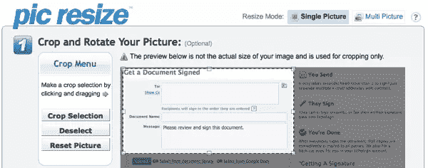
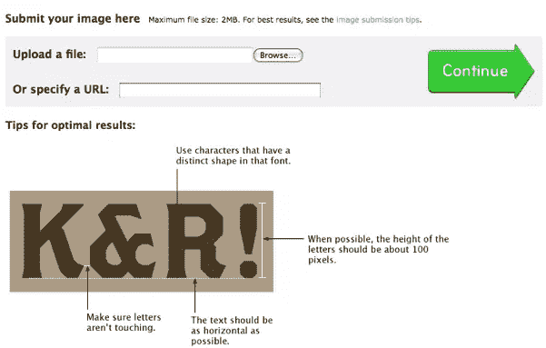

# 7 个不常见的应用程序可以提高您的工作效率

> 原文：<https://www.sitepoint.com/uncommon-productivity-apps/>

在我不断寻求提高生产率的过程中，我发现其中一个秘密就是探索哪些捷径可以让你更快到达终点。有许多我们大多数人每天都在使用的应用程序和工具——各种浏览器插件、移动应用程序、软件——可以帮助我们在工作中尽快从 A 点到达 B 点。

但是也有很多不太为人所知的工具，你可能不经常使用，但是如果你把它们添加到你的日常流程中，有可能节省你的时间。这里有七个不同寻常的提高生产力的工具，帮助我更快更有效地工作。

## [回声定位](http://echosign.com)

如果你在工作中使用书面合同(你应该这样做！)，准备文件、发送文件，然后跟进以确保您获得所有必需的签名，这可能会花费很多时间。这通常会导致项目启动延迟。EchoSign 是一种在线电子签名服务，让您可以在合同上快速获得电子签名，跟踪回复并归档文件。

## [编辑板](http://www.editpad.org/)

无论你是在编写代码、编写内容，还是从文字处理器复制粘贴到 HTML，手边有一个纯文本应用程序都很有用。通过创建文本文件，然后将它们保存到您的本地计算机，Edit Pad 使您能够像处理记事本或文本编辑一样处理您的 Web 浏览器。这个工具最有用的部分之一是字数和字符数功能。

## [字体浏览器](http://www.stcassociates.com/lab/fontbrowser.html)

如果你和我一样，你的电脑上安装了太多的字体，你要花很长时间才能找到适合一个项目的字体。fontBROWSER 允许您以任意两种大小输入任何文本，然后滚动已安装字体的列表，查看每种字体的快速预览。您甚至可以通过点击查看每种字体中的所有标准键和特殊字符。

## [列表](http://listhings.com/)

我喜欢用粘在电脑上的便利贴来记录我每天的首要任务。但是当我不在办公桌旁，想偷看我的清单时，或者当我想到需要尽快添加到清单中的东西时，这个方法就失效了。Listhings 是一个简单的在线便利贴应用程序，它让我抛弃我的实体便利贴，在线创建一个便利贴，然后从任何地方访问它——其他电脑，我的黑莓手机，等等。

## [图片调整大小](http://picresize.com/)

## 

如果你不总是想启动 Photoshop 或其他全面的图像编辑应用程序来快速裁剪图像和调整大小，那么 Pic Resize 是最好的生产力工具之一。你可以在网上上传你的图片，并且可以在几秒钟内进行裁剪、调整大小和应用一些特殊效果。如果你在移动设备上或者远离你的主计算机和所有的普通软件，这也是一个完美的工具。

## [打印出类似于](http://www.printwhatyoulike.com/)的东西

你有没有浪费时间，试图打印网站的正确部分？然后，浪费更多的时间试图摆脱广告和其他多余的信息，你不需要的印刷文本？真是浪费时间，浪费办公用品，浪费树木。PrintWhatYouLike 是一个免费的在线编辑器，可以让你在几秒钟内格式化任何网页进行打印。您可以删除广告，更改字体大小，合并多个页面，并将修改后的页面保存为 PDF 或 HTML 文档。

## [什么东西](http://new.myfonts.com/WhatTheFont/)

## 

回到我的字体瘾，伴随着我丰富的收藏而来的是我无法记住我在哪里使用了哪种字体。所以有时候，我最终得到的是一个平面图形，却不记得是用什么字体创建的。WhatTheFont 让你上传一张图片或指定一个 URL，然后它会引导你选择一系列的字符，然后给出一些可能匹配的字体名称。

### 轮到你了

你使用了什么不寻常的、不寻常的或其他非常规的工具来帮助你提高效率？

## 分享这篇文章