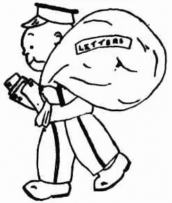
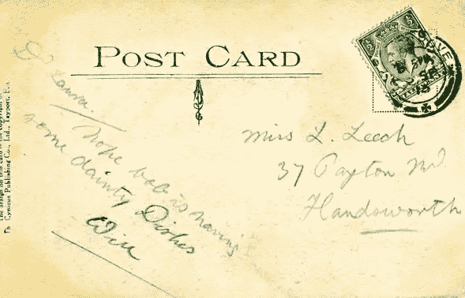
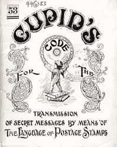
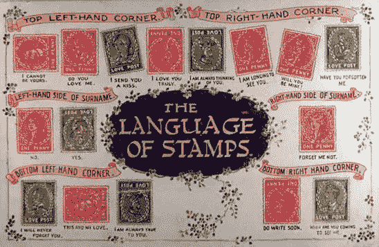
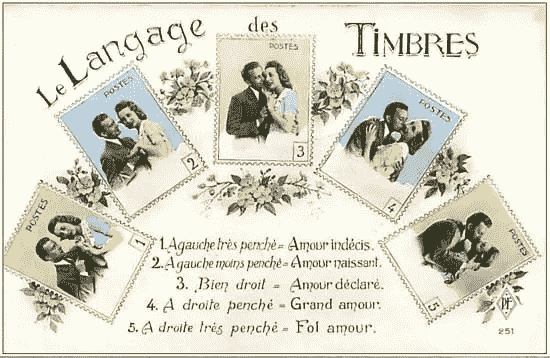

# 揭开邮票的秘密编码语言

> 原文：<https://www.sitepoint.com/uncovering-secret-coded-language-postage-stamps/>

我们不像以前那样经常聊天了，是吗？

五年前，感觉每一秒的 TXT、IM 或脸书邮报都会包含一个小写的 LOL，如果不是一个完全成熟的' [ROFL](http://idioms.thefreedictionary.com/rolling+on+the+floor+laughing+my+ass+off) '的话。

最近的一项脸书研究声称，超过一半的人使用“哈哈”,而“哈哈”的使用率下降到了 1.9%。可怜的 LOL 在 2011 年才进入牛津英语词典，但它的黄金时代已经过去了。

但在 2016 年，我们似乎只关注表情符号。

*   厚颜无耻的眨眼`;-)`，
*   `:ಠ_ಠ`怀疑的目光
*   单撕`:'(`
*   饱满的'[皱巴巴的](http://emojipedia.org/shrug/) ' `¯\_(ツ)_/¯`

我们都学会了*破解文本界面的工作方式*来传达文字本身无法传达的信息。你妈妈可能会这么做。也许你的孩子或侄子侄女也是。

当然，从理论上讲，输入单词“*我在向你使眼色*”传达了基本的意思，但不知何故这更正式，同时也更令人毛骨悚然。a；)既是少又是多。

所以，在某种程度上，我们都是 UI 黑客。但是我们不是第一代这样做的人。

## 1840 年:当邮件成为热门社交平台时

对于生活在 19 世纪中期的任何人来说，我们可能很难理解邮政服务是一个怎样的技术奇迹。虽然皇室和政府已经运营了几个世纪的信息网络，但这些系统一直都很昂贵、不可靠且难以理解。邮费与每封信的里程数紧密相连——就像出租车费一样——除了收件人*必须支付递送费用。*

 *我想，如果我们都必须为我们收到的每个俄罗斯垃圾邮件发送者或尼日利亚王子的垃圾邮件支付一大笔费用，那么电子邮件就不会那么有吸引力了**。这就是 1840 年前所有公共邮件服务的运作方式，因此，一个工人阶级的人可以花一分钱在全国任何地方发送邮件的想法是令人困惑的！**

 **不出所料，这项服务获得了巨大的成功，到 19 世纪 50 年代，每天多达三次运送大量邮件。

## 爱的密码信息

邮政投递对任何家庭来说都是一件大事，无论是富人还是穷人，所以几乎不可能在全家人都不知道的情况下把邮件送到某个人手中。在那个“维多利亚时代的道德”是核心而隐私不是核心的时代，这使得夫妻之间的个人隐私信息传递变得非常困难。

那么，他们是如何在不写的情况下说出自己的感受的呢？

他们将其编码到邮票的*定位*中。

显然，“秘密邮票代码”实际上是在“收件人付费”的邮件时代出现的，作为一种逃避高昂邮政费用的方式。寄信人可以将一个简单的答案编码到信封上他们的邮票上——可能是“是”、“否”或“马上来”。然后，收件人可以检查信封，提取信息，然后拒绝支付未拆封信件的投递费。

显然，这在“便士邮政”时代变得多余，但后来夫妇们为了自己的需要采用了这一系统。这里有一个例子。

威尔写信给劳拉·里奇小姐

上面的明信片对任何扫描它的人来说都是完全无辜的。威尔正在问劳拉鲍勃是否正在吃一些美味的菜肴。有点拐弯抹角——也许是“玩笑”——但没什么不合适的。

事实上，这枚邮票讲述了另一个故事。威尔告诉劳拉:“我渴望见到你”。我希望鲍勃不是劳拉的丈夫。

这种邮票信息系统在世界各地的邮政系统中广泛使用，尽管各国之间有很大的差异。一些系统依赖于邮票在明信片上的位置，而另一些系统只关心它在页面上的方向。

这个系统非常微妙和复杂。信息可以简单到“是”或“否”，也可以复杂到:

*   “我可以要你的肖像吗？”
*   “保重。我们被监视了。”
*   “我觉得你很忘恩负义。”
*   “我的心是别人的”
*   "我发现了你的骗局。"

事实上，在一本“如何做”的小册子中，介绍页声称能够对 ***270，000 种信息变体*** 进行编码。这让你怀疑我们是否真的还需要完整的字母表。

当然，明信片公司通常把这个代码视为销售更多明信片的大好机会。从 19 世纪 90 年代开始，他们印刷了数百万份这样的邮票信息指南，尽管从来没有一个集中的机构对各个地区的代码进行标准化。变异和突变是自然发生的。

因此，一些导游规定向右旋转 90 度的邮票意味着充满希望的"*立即回复！*”，而其他导游会将同样的邮票解释为“*我希望你的友谊，但没有更多的*”。

我怀疑一定有成千上万的不幸的恋人，他们的梦想被一个潜在伴侣误读的密码信息打碎了。谁会想到在信上贴邮票这种平凡的行为会带来如此大的社会危害？

你要 LOL 吧？

*原载于 [SitePoint 设计简讯](https://www.sitepoint.com/newsletter/)* 。

## 分享这篇文章***