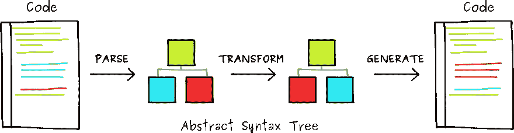
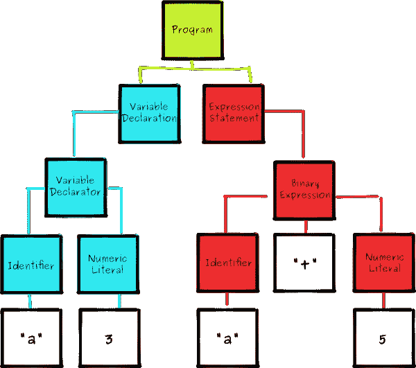
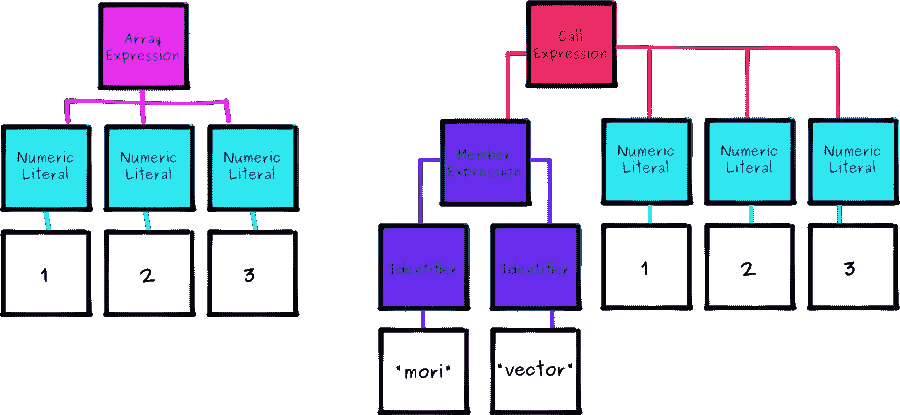
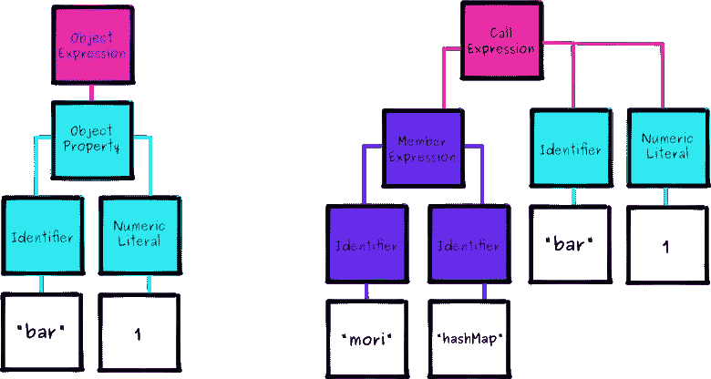
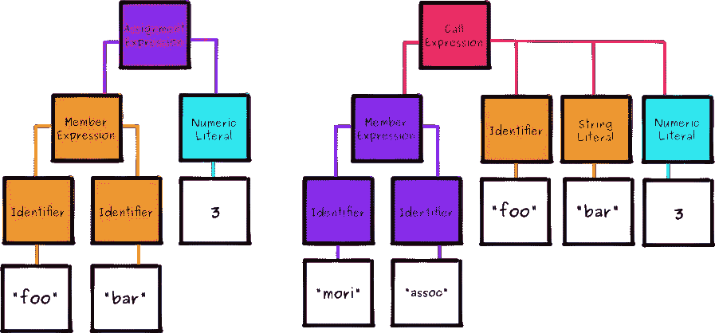
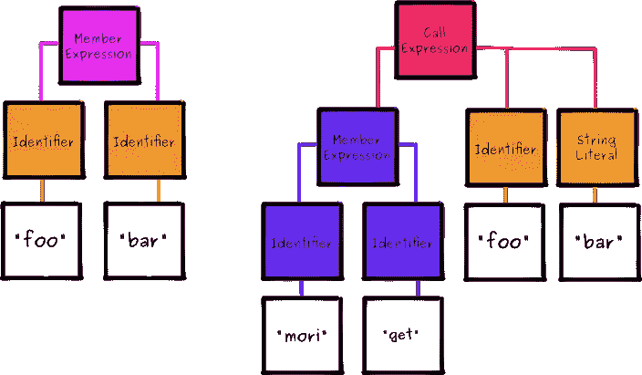

# 通过构建自己的 Babel 插件来理解 ASTs

> 原文：<https://www.sitepoint.com/understanding-asts-building-babel-plugin/>

*这篇文章由[蒂姆·塞韦里安](https://www.sitepoint.com/author/tseverien)进行了同行评审。感谢 SitePoint 的所有同行评审员使 SitePoint 的内容尽可能做到最好！*

每天，成千上万的 JavaScript 开发人员使用浏览器供应商尚未实现的语言版本。他们中的许多人使用的语言特性只不过是一些建议，并不能保证它们会成为规范。所有这些都是由巴别塔项目实现的。

Babel 最著名的是能够将 ES6 代码翻译成我们今天可以安全运行的 ES5 代码，但是它也允许开发人员编写插件，在编译时转换 JavaScript 程序的结构。

今天，我们将看看如何编写一个 Babel 插件，在默认情况下将**不可变数据**添加到 JavaScript。本教程的代码可以从我们的 [GitHub repo](https://github.com/sitepoint-editors/moriscript) 下载。

## 语言概述

我们希望设计一个插件，允许我们使用常规的对象和数组文字，它们将通过使用 [Mori](https://www.sitepoint.com/immutable-data-functional-javascript-mori/) 转换成持久的数据结构。

我们想写这样的代码:

```
var foo = { a: 1 };
var baz = foo.a = 2;
foo.a === 1;
baz.a === 2; 
```

并将其转换成如下代码:

```
var foo = mori.hashMap('a', 1);
var baz = mori.assoc(foo, 'a', 2);
mori.get(foo, 'a') === 1;
mori.get(baz, 'a') === 2; 
```

让我们从 *MoriScript* 开始吧！

## 巴别塔概述

如果我们深入巴别塔的表面，我们会发现处理大部分过程的三个重要工具。



### 从语法上分析

Babylon 是一个解析器，它知道如何获取一串 JavaScript 代码，并将其转换成一种计算机友好的表示，称为抽象语法树(AST)。

### 改变

[babel-traverse](https://www.npmjs.com/package/babel-traverse) 模块允许您探索、分析并可能修改 AST。

### 产生

最后， [babel-generator](https://www.npmjs.com/package/babel-generator) 模块用于将转换后的 AST 转换回常规代码。

## 什么是 AST？

在继续本教程之前，我们必须理解 AST 的目的。因此，让我们深入了解它们是什么以及我们为什么需要它们。

JavaScript 程序通常由一系列字符组成，每个字符对我们的大脑都有一些视觉意义。这对我们真的很有用，因为它允许我们使用匹配字符(`[]`、`{}`、`()`)、成对字符(`''`、`""`)和缩进来使我们的程序更容易解释。

然而，这对计算机没有太大帮助。对他们来说，这些字符中的每一个都只是内存中的一个数值，他们不能用它们来问高层次的问题，比如“这个声明中有多少个变量？”。相反，我们需要妥协，找到一种方法把我们的代码变成我们可以编程的东西，让 T2 的计算机能够理解。

看看下面的代码。

```
var a = 3;
a + 5 
```

当我们为这个程序生成一个 AST 时，我们最终得到一个如下所示的结构:



所有的 ast 都以树根处的一个`Program`节点开始，它包含了我们程序中所有的顶级语句。在这种情况下，我们只有两个:

1.  一个带有一个`VariableDeclarator`的`VariableDeclaration`，将`Identifier``a`分配给`NumericLiteral``3`。
2.  一个`ExpressionStatement`依次由一个`BinaryExpression`组成，分别描述为一个`Identifier``a`、一个操作符`+`和另一个`NumericLiteral``5`。

尽管事实上它们是由简单的构件组成的，但是 ASTs 的大小意味着它们通常是相当复杂的，尤其是对于重要的程序。我们可以使用[astexplorer.net](https://astexplorer.net)，而不是试图自己找出 AST，它允许我们在左边输入 JavaScript，然后在右边输出 AST 的可探索表示。随着我们的继续，我们将专门使用这个工具来理解和试验代码。

为了与 Babel 保持一致，请确保选择“babylon6”作为解析器。

当编写一个 Babel 插件时，我们的工作是获取一个 AST，然后插入/移动/替换/删除一些节点来创建一个新的 AST，它可以用来生成代码。

## 设置

开始之前，确保您已经安装了`node`和`npm`。然后为项目创建一个文件夹，创建一个`package.json`文件并安装以下开发依赖项。

```
mkdir moriscript && cd moriscript
npm init -y
npm install --save-dev babel-core 
```

然后我们将为插件创建一个文件，并在里面导出一个默认函数。

```
// moriscript.js
module.exports = function(babel) {
  var t = babel.types;
  return {
    visitor: {

    }
  };
}; 
```

这个函数为[访问者模式](https://en.wikipedia.org/wiki/Visitor_pattern)公开了一个接口，我们稍后将会回到这个接口。

最后，我们将创建一个 runner，我们可以用它来测试我们的插件。

```
// run.js
var fs = require('fs');
var babel = require('babel-core');
var moriscript = require('./moriscript');

// read the filename from the command line arguments
var fileName = process.argv[2];

// read the code from this file
fs.readFile(fileName, function(err, data) {
  if(err) throw err;

  // convert from a buffer to a string
  var src = data.toString();

  // use our plugin to transform the source
  var out = babel.transform(src, {
    plugins: [moriscript]
  });

  // print the generated code to screen
  console.log(out.code);
}); 
```

我们可以用一个示例 MoriScript 文件的名称调用这个脚本，以检查它是否生成了我们期望的 JavaScript。比如`node run.js example.ms`。

## 数组

MoriScript 的首要目标是将对象和数组文字转换成它们的 Mori 对应物:HashMaps 和 Vectors。我们将首先处理数组，因为它们稍微简单一些。

```
var bar = [1, 2, 3];
// should become
var bar = mori.vector(1, 2, 3); 
```

将上面的代码粘贴到[as explorer](https://astexplorer.net)中，并突出显示数组文字`[1, 2, 3]`以查看相应的 AST 节点。

为了可读性，我们将省略不需要担心的元数据字段。

```
{
  "type": "ArrayExpression",
  "elements": [
    {
      "type": "NumericLiteral",
      "value": 1
    },
    {
      "type": "NumericLiteral",
      "value": 2
    },
    {
      "type": "NumericLiteral",
      "value": 3
    }
  ]
} 
```

现在让我们对调用`mori.vector(1, 2, 3)`做同样的事情。

```
{
  "type": "CallExpression",
  "callee": {
    "type": "MemberExpression",
    "object": {
      "type": "Identifier",
      "name": "mori"
    },
    "property": {
      "type": "Identifier",
      "name": "vector"
    }
  },
  "arguments": [
    {
      "type": "NumericLiteral",
      "value": 1
    },
    {
      "type": "NumericLiteral",
      "value": 2
    },
    {
      "type": "NumericLiteral",
      "value": 3
    }
  ]
} 
```

如果我们直观地表达这一点，我们会更好地理解这两棵树之间需要改变什么。



现在我们可以清楚地看到，我们需要替换顶层表达式，但是我们可以在两棵树之间共享数值。

让我们从在 visitor 对象上添加一个`ArrayExpression`方法开始。

```
module.exports = function(babel) {
  var t = babel.types;
  return {
    visitor: {
      ArrayExpression: function(path) {

      }
    }
  };
}; 
```

当 Babel 遍历 AST 时，它会查看每个节点，如果它在插件的 visitor 对象中找到相应的方法，它会将上下文传递给该方法，以便我们可以分析或操作它。

```
ArrayExpression: function(path) {
  path.replaceWith(
    t.callExpression(
      t.memberExpression(t.identifier('mori'), t.identifier('vector')),
      path.node.elements
    )
  );
} 
```

我们可以在 babel-types 包中找到每种类型的表达式的文档。在这种情况下，我们将用一个`CallExpression`来替换`ArrayExpression`，我们可以用`t.callExpression(callee, arguments)`来创建它。我们要称之为*的东西*是一个`MemberExpression`，我们可以用`t.memberExpression(object, property)`创建它。

*你也可以在[浏览器](https://astexplorer.net)中通过点击“转换”下拉菜单并选择“babelv6”来进行实时测试。*

## 目标

接下来让我们看看对象。

```
var foo = { bar: 1 };
// should become
var foo = mori.hashMap('bar', 1); 
```

对象文字与我们之前看到的`ArrayExpression`有相似的结构。

```
{
  "type": "ObjectExpression",
  "properties": [
    {
      "type": "ObjectProperty",
      "key": {
        "type": "Identifier",
        "name": "bar"
      },
      "value": {
        "type": "NumericLiteral",
        "value": 1
      }
    }
  ]
} 
```

这很简单。有一个属性数组，每个属性都有一个键和值。现在，让我们突出显示对`mori.hashMap('bar', 1)`的相应 Mori 调用，并看看它们之间的比较。

```
{
  "type": "CallExpression",
  "callee": {
    "type": "MemberExpression",
    "object": {
      "type": "Identifier",
      "name": "mori"
    },
    "property": {
      "type": "Identifier",
      "name": "hashMap"
    }
  },
  "arguments": [
    {
      "type": "StringLiteral",
      "value": "bar"
    },
    {
      "type": "NumericLiteral",
      "value": 1
    }
  ]
} 
```

同样，让我们看看这些 ast 的可视化表示。



像以前一样，我们用一个`CallExpression`包装一个`MemberExpression`，我们可以从数组代码中借用它，但是我们必须做一些更复杂的事情来将属性和值放入一个平面数组中。

```
ObjectExpression: function(path) {
  var props = [];

  path.node.properties.forEach(function(prop) {
    props.push(
      t.stringLiteral(prop.key.name),
      prop.value
    );
  });

  path.replaceWith(
    t.callExpression(
      t.memberExpression(t.identifier('mori'), t.identifier('hashMap')),
      props
    )
  );
} 
```

这与数组的实现非常相似，除了我们必须将`Identifier`转换成`StringLiteral`以防止我们以如下所示的代码结束:

```
// before
var foo = { bar: 1 };
// after
var foo = mori.hashMap(bar, 1); 
```

最后，我们将创建一个 helper 函数来创建我们将继续使用的 Mori `MemberExpressions`。

```
function moriMethod(name) {
  return t.memberExpression(
    t.identifier('mori'),
    t.identifier(name)
  );
}

// now rewrite
t.memberExpression(t.identifier('mori'), t.identifier('methodName'));
// as
moriMethod('methodName'); 
```

现在我们可以创建一些测试用例，并运行它们来看看我们的插件是否在工作:

```
mkdir test
echo -e "var foo = { a: 1 };\nvar baz = foo.a = 2;" > test/case.ms
node run.js test/case.ms 
```

您应该会在终端上看到以下输出:

```
var foo = mori.hashMap("a", 1);
var baz = foo.a = 2; 
```

## 分配

为了使我们的新 Mori 数据结构有效，我们还必须覆盖为它们分配新属性的原生语法。

```
foo.bar = 3;
// needs to become
mori.assoc(foo, 'bar', 3); 
```

与其继续包含简化的 AST，我们现在只使用图表和插件代码，但是可以自由地通过[浏览器](https://astexplorer.net)继续运行这些例子。



我们必须从`AssignmentExpression`的每一侧提取并转换节点，以创建所需的`CallExpression`。

```
AssignmentExpression: function(path) {
  var lhs = path.node.left;
  var rhs = path.node.right;

  if(t.isMemberExpression(lhs)) {
    if(t.isIdentifier(lhs.property)) {
      lhs.property = t.stringLiteral(lhs.property.name);
    }

    path.replaceWith(
      t.callExpression(
        moriMethod('assoc'),
        [lhs.object, lhs.property, rhs]
      )
    );
  }
} 
```

我们的`AssignmentExpressions`处理程序做了一个初步的检查，看看左边的表达式是否是一个`MemberExpression`(因为我们不想弄乱像`var a = 3`这样的东西)。然后我们使用森的`assoc`方法，用一个新的`CallExpression`代替。

像以前一样，我们还必须处理使用`Identifier`的情况，并将其转换为`StringLiteral`。

现在创建另一个测试用例并运行代码，看看它是否有效:

```
echo -e "foo.bar = 3;" >> test/case.ms
node run.js test/case.ms

$ mori.assoc(foo, "bar", 3); 
```

## 成员资格

最后，我们还必须覆盖访问对象成员的本机语法。

```
foo.bar;
// needs to become
mori.get(foo, 'bar'); 
```

这是两个 ast 的可视化表示。



我们几乎可以直接使用`MemberExpression`的属性，但是属性部分将作为`Identifier`出现，所以我们需要转换它。

```
MemberExpression: function(path) {
  if(t.isAssignmentExpression(path.parent)) return;

  if(t.isIdentifier(path.node.property)) {
    path.node.property = t.stringLiteral(path.node.property.name);
  }

  path.replaceWith(
    t.callExpression(
      moriMethod('get'),
      [path.node.object, path.node.property]
    )
  );
} 
```

要注意的第一个重要区别是，如果这个节点的父节点是一个`AssignmentExpression`，我们将提前退出函数。这是因为我们想让我们的`AssignmentExpression` visitor 方法处理这些情况。

这看起来很好，但是如果您运行这段代码，您实际上会发现自己遇到了堆栈溢出错误。这是因为当我们替换一个给定的`MemberExpression` ( `foo.bar`)时，我们用另一个(`mori.get`)替换它。然后 Babel 遍历这个新节点，并递归地将其传递回我们的 visitor 方法。

嗯。

为了解决这个问题，我们可以标记来自`moriMethod`的返回值，并选择在我们的`MemberExpression`方法中忽略它们。

```
function moriMethod(name) {
  var expr = t.memberExpression(
    t.identifier('mori'),
    t.identifier(name)
  );

  expr.isClean = true;
  return expr;
} 
```

一旦它被标记，我们可以在函数中添加另一个 return 子句。

```
MemberExpression: function(path) {
  if(path.node.isClean) return;
  if(t.isAssignmentExpression(path.parent)) return;

  // ...
} 
```

创建一个最终的测试用例，并编译您的代码来检查它是否工作。

```
echo -e "foo.bar" >> test/case.ms
node run.js test/case.ms

$ mori.get(foo, "bar"); 
```

一切都好，现在你有了一个看起来像 JavaScript 的语言，但是默认情况下有不可变的数据结构，没有损害原始的表达语法。

## 结论

这是一篇代码量很大的文章，但是我们已经介绍了设计和构建一个 Babel 插件的所有基础知识，这个插件可以用来以一种有用的方式转换 JavaScript 文件。你可以在 REPL [这里](https://danprince.github.io/moriscript/)玩 MoriScript，你可以在 GitHub 上找到完整的源代码[。](https://github.com/sitepoint-editors/moriscript)

如果你有兴趣更进一步，你想阅读更多关于巴别塔插件的内容，那就去看看神奇的[巴别塔手册](https://github.com/thejameskyle/babel-handbook)并参考 GitHub 上的[巴别塔插件-hello-world](https://github.com/RReverser/babel-plugin-hello-world) 库。或者只是通读已经在 npm 上的任何 [700+巴别塔插件的源代码。还有一个用于搭建新插件的约曼生成器。](https://www.npmjs.com/search?q=babel-plugin)

希望这篇文章已经启发了你去写一个巴别塔插件！但是在你开始实现下一个伟大的 transpile-to 语言之前，有一些基本规则需要了解。Babel 是一个 JavaScript 到 JavaScript 的编译器。这意味着我们*不能*将 CoffeeScript 这样的语言作为巴别塔插件来实现。**我们只能转换[巴别塔的解析器](https://github.com/babel/babylon)能理解**的 JavaScript 的轻微超集。

这里有一个新颖的插件让你开始。您可以滥用按位`|` OR 操作符来创建函数管道，就像您在 F#、Elm 和 LiveScript 中发现的那样。

```
2 | double | square

// would become

square(double(2)) 
```

例如，在箭头函数中:

```
const doubleAndSquare = x => x | double | square

// would become

const doubleAndSquare = x => square(double(x));

// then use babel-preset-es2015

var doubleAndSquare = function doubleAndSquare(x) {
  return square(double(x));
}; 
```

一旦你理解了规则，唯一的限制就是解析器和你的想象力。

你做了一个想分享的巴别塔插件吗？请在评论中告诉我。

## 分享这篇文章