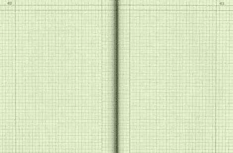

# 了解 Bootstrap 的网格系统

> 原文：<https://www.sitepoint.com/understanding-bootstrap-grid-system/>

[Bootstrap](http://getbootstrap.com/) 无疑是最流行的前端框架之一。Bootstrap 拥有超过 73k 的 stars 和 27k 的 forks，也是最受欢迎的 GitHub 库之一。在我的上一篇文章“Bootstrap 的 CSS 中的[响应式 Web 设计技巧”中，我解释了 Bootstrap 如何作为一个响应式框架工作。在本文中，我们将讨论一个相关的主题:**网格系统**，Bootstrap 中最重要的概念之一。](https://www.sitepoint.com/responsive-web-design-tips-bootstrap-css/)

## 什么是自举网格系统？

像任何网格系统一样，Bootstrap grid 是一个 HTML/CSS 组件库，它允许您构建一个网站，并轻松地将网站内容放置在所需的位置。

想想绘图纸，每一页都有一组垂直和水平的线条。当这些线相交时，我们得到正方形或矩形空间。

由 Sfoerster(自己的作品) [CC-BY-SA-3.0](http://creativecommons.org/licenses/by-sa/3.0) ，[通过维基共享资源](http://commons.wikimedia.org/wiki/File%3ABlank_Notebook.jpg)

嗯，Bootstrap 的网格系统也是如此。它允许您创建行和列，然后将内容放在“相交”区域。

现在的问题是，使用 Bootstrap 的网格系统可以创建多少行和列？Bootstrap 允许你创建多达 **12 列**和**无限行**——因此得名 **12 网格系统**。那么，让我们看看如何利用这个网格系统来创建各种类型的布局。

## Bootstrap 网格系统入门

首先，自然地，您需要在您的页面中有必要的资产来让 Bootstrap 工作。如果你是 Bootstrap 新手，可以参考我们之前的文章[Bootstrap 入门](https://www.sitepoint.com/twitter-bootstrap-3-javascript-components/)或者我的书 [Jump Start Bootstrap](https://learnable.com/books/jump-start-bootstrap) ，深入了解。

Bootstrap 的网格系统由三部分组成:

1.  一个容器
2.  行
3.  列

让我们详细探讨一下上面的每一项。

## 创建容器

Bootstrap 的网格系统需要一个容器来保存行和列。容器是一个简单的`
`元素，带有一个类`.container`。容器用于为布局提供适当的宽度，充当内容的包装。

看看下面的 CodePen 演示:

参见 [CodePen](http://codepen.io) 上 SitePoint ( [@SitePoint](http://codepen.io/SitePoint) )的 Pen [Bootstrap 网格容器演示](http://codepen.io/SitePoint/pen/xbKMGN/)。