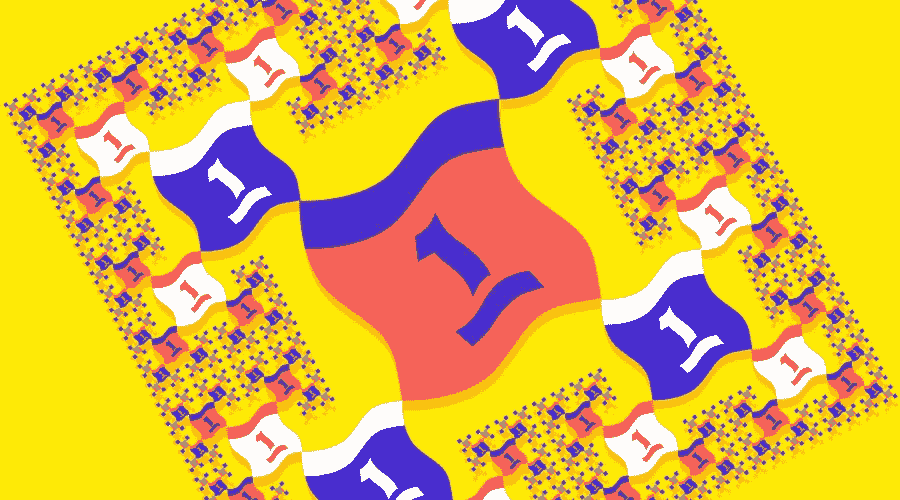
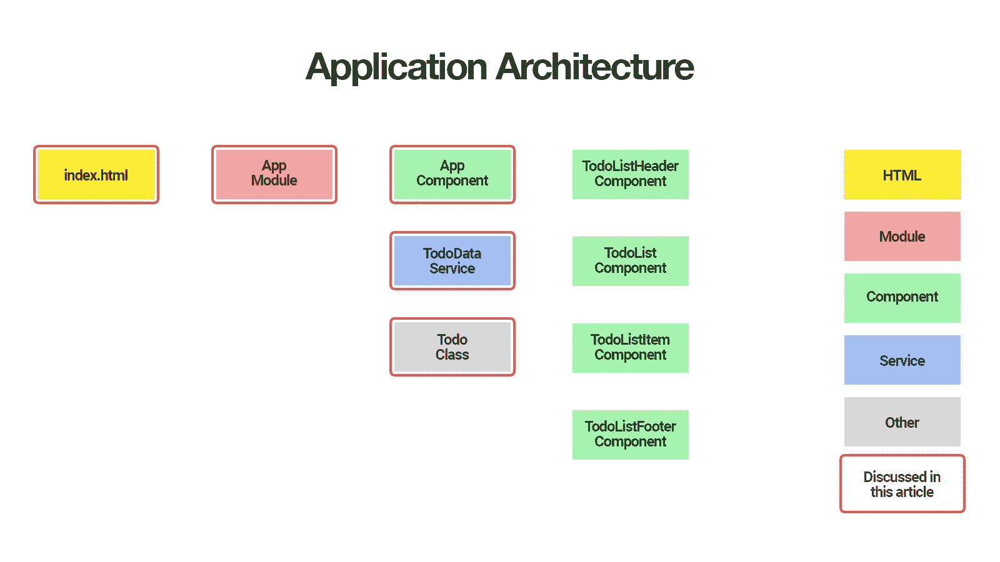
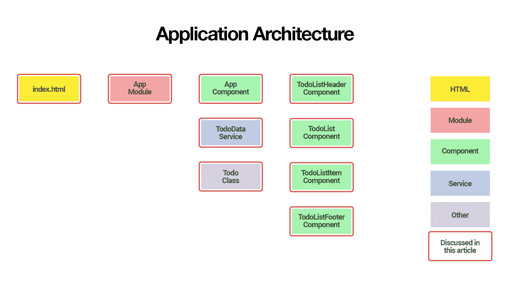

# 理解组件架构:重构 Angular 应用程序

> 原文：<https://www.sitepoint.com/understanding-component-architecture-angular/>

在本系列的第一部分中，我们学习了如何启动并运行我们的 Todo 应用程序，并将其部署到 GitHub 页面。这工作得很好，但不幸的是，整个应用程序被塞进了一个组件。在本文中，我们将研究一个更加模块化的组件架构。我们将看看如何将这个单一的组件分解成更小的组件的结构化树，以便于理解、重用和维护。

本文是 SitePoint [Angular 2+教程](https://www.sitepoint.com/angular-2-tutorial/)的第 2 部分，讲述如何用 [Angular CLI](https://github.com/angular/angular-cli) 创建 CRUD 应用。

1.  [第 0 部分—极限角度 CLI 参考指南](https://www.sitepoint.com/ultimate-angular-cli-reference/)
2.  [第 1 部分—启动并运行我们的第一个 Todo 应用程序版本](https://www.sitepoint.com/angular-2-tutorial/)
3.  **第 2 部分—创建单独的组件来显示待办事项列表和单个待办事项**
4.  [第 3 部分—更新 Todo 服务以与 REST API 通信](https://www.sitepoint.com/angular-rxjs-create-api-service-rest-backend/)
5.  [第 4 部分—使用角度路由器解析数据](https://www.sitepoint.com/component-routing-angular-router/)。
6.  [第 5 部分—添加身份验证以保护私人内容](https://www.sitepoint.com/angular-2-authentication-protecting-private-content/)
7.  第 6 部分——如何将 Angular 项目更新到最新版本。

你不需要遵循本教程的第一部分，第二部分才有意义。您可以简单地获取我们的回购副本，检查第一部分的代码，并以此为起点。这将在下面更详细地解释。



## 快速回顾一下

因此，让我们稍微详细地看看我们在第一部分中所涉及的内容。我们学习了如何:

*   使用 Angular CLI 初始化我们的 Todo 应用程序
*   创建一个`Todo`类来表示个人待办事项
*   创建一个`TodoDataService`服务来创建、更新和删除 todos
*   使用`AppComponent`组件显示用户界面
*   将我们的应用程序部署到 GitHub 页面。

第 1 部分的应用程序架构如下所示:



我们讨论的组件标有红色边框。

在第二篇文章中，我们将把`AppComponent`正在做的一些工作委托给更小的组件，这些组件更容易理解、重用和维护。

我们将创建:

*   显示待办事项列表
*   显示单个待办事项的`TodoListItemComponent`
*   创建新待办事项的`TodoListHeaderComponent`
*   显示还剩多少待办事项。



到本文结束时，您会明白:

*   角度组件架构的基础
*   如何使用属性绑定将数据传递给组件
*   如何使用事件侦听器来侦听组件发出的事件
*   为什么将组件分成更小的可重用组件是一个好的实践
*   *智能*和*哑*组件的区别，以及为什么保持组件*哑*是一个好的实践。

所以让我们开始吧！

## 运行正常的

阅读本文首先需要了解的是 Angular CLI 的最新版本。您可以使用以下命令进行安装:

```
npm install -g @angular/cli@latest 
```

如果您需要删除以前版本的 Angular CLI，以下是方法:

```
npm uninstall -g @angular/cli angular-cli
npm cache clean
npm install -g @angular/cli@latest 
```

之后，您将需要第一部分代码的副本。这在[https://github.com/sitepoint-editors/angular-todo-app](https://github.com/sitepoint-editors/angular-todo-app)有售。本系列中的每篇文章在存储库中都有一个相应的标记，因此您可以在应用程序的不同状态之间来回切换。

我们在[第一部分](https://www.sitepoint.com/angular-2-tutorial/)中结束的代码和我们在本文中开始的代码被标记为[第一部分](https://github.com/sitepoint-editors/angular-todo-app/tree/part-1)。我们结束这篇文章的代码被标记为[第二部分](https://github.com/sitepoint-editors/angular-todo-app/tree/part-2)。

您可以将标签想象成特定提交 id 的别名。您可以使用`git checkout`在它们之间切换。你可以在这里了解更多。

因此，要启动并运行(安装了最新版本的 Angular CLI ),我们需要:

```
git clone git@github.com:sitepoint-editors/angular-todo-app.git
cd angular-todo-app
npm install
git checkout part-1
ng serve 
```

然后访问 [http://localhost:4200/](http://localhost:4200/) 。如果一切正常，你应该看到工作的应用程序。

## 原始 AppComponent

让我们打开`src/app/app.component.html`，看看我们在第一部分中完成的`AppComponent`:

```
<section class="todoapp">
  <header class="header">
    <h1>Todos</h1>
    <input class="new-todo" placeholder="What needs to be done?" autofocus="" [(ngModel)]="newTodo.title" (keyup.enter)="addTodo()">
  </header>
  <section class="main" *ngIf="todos.length > 0">
    <ul class="todo-list">
      <li *ngFor="let todo of todos" [class.completed]="todo.complete">
        <div class="view">
          <input class="toggle" type="checkbox" (click)="toggleTodoComplete(todo)" [checked]="todo.complete">
          <label>{{todo.title}}</label>
          <button class="destroy" (click)="removeTodo(todo)"></button>
        </div>
      </li>
    </ul>
  </section>
  <footer class="footer" *ngIf="todos.length > 0">
    <span class="todo-count"><strong>{{todos.length}}</strong> {{todos.length == 1 ? 'item' : 'items'}} left</span>
  </footer>
</section> 
```

下面是它在`src/app/app.component.ts`中对应的类:

```
import {Component} from '@angular/core';
import {Todo} from './todo';
import {TodoDataService} from './todo-data.service';

@Component({
  selector: 'app-root',
  templateUrl: './app.component.html',
  styleUrls: ['./app.component.css'],
  providers: [TodoDataService]
})
export class AppComponent {

  newTodo: Todo = new Todo();

  constructor(private todoDataService: TodoDataService) {
  }

  addTodo() {
    this.todoDataService.addTodo(this.newTodo);
    this.newTodo = new Todo();
  }

  toggleTodoComplete(todo: Todo) {
    this.todoDataService.toggleTodoComplete(todo);
  }

  removeTodo(todo: Todo) {
    this.todoDataService.deleteTodoById(todo.id);
  }

  get todos() {
    return this.todoDataService.getAllTodos();
  }

} 
```

虽然我们的`AppComponent`在技术上工作得很好，但是将所有代码保存在一个大的组件中并不能很好地伸缩，也不推荐这样做。

向我们的 Todo 应用程序添加更多的特性会使`AppComponent`变得更大更复杂，更难理解和维护。

因此，建议将功能委托给较小的组件。理想情况下，较小的组件应该是可配置的，这样当业务逻辑改变时，我们就不必重写它们的代码。

例如，在本系列的第三部分中，我们将更新`TodoDataService`以与 REST API 通信，并且我们希望确保在重构`TodoDataService`时，我们不必更改任何较小的组件。

如果我们看一下`AppComponent`模板，我们可以提取它的底层结构如下:

```
<!-- header that lets us create new todo -->
<header></header>

<!-- list that displays todos -->
<ul class="todo-list">

    <!-- list item that displays single todo -->
    <li>Todo 1</li>

    <!-- list item that displays single todo -->
    <li>Todo 2</li>
</ul>

<!-- footer that displays statistics -->
<footer></footer> 
```

如果我们将此结构转换为角度组件名称，我们会得到:

```
<!-- TodoListHeaderComponent that lets us create new todo -->
<app-todo-list-header></app-todo-list-header>

<!-- TodoListComponent that displays todos -->
<app-todo-list>

    <!-- TodoListItemComponent that displays single todo -->
    <app-todo-list-item></app-todo-list-item>

    <!-- TodoListItemComponent that displays single todo -->
    <app-todo-list-item></app-todo-list-item>
</app-todo-list>

<!-- TodoListFooterComponent that displays statistics -->
<app-todo-list-footer></app-todo-list-footer> 
```

让我们看看如何使用 Angular 的组件驱动开发的力量来实现这一点。

## 更加模块化的组件架构——创建 todolistheader 组件

让我们从创建`TodoListHeader`组件开始。

从我们项目的根开始，我们使用 Angular CLI 为我们生成组件:

```
$ ng generate component todo-list-header 
```

这会为我们生成以下文件:

```
create src/app/todo-list-header/todo-list-header.component.css
create src/app/todo-list-header/todo-list-header.component.html
create src/app/todo-list-header/todo-list-header.component.spec.ts
create src/app/todo-list-header/todo-list-header.component.ts 
```

它自动将`TodoListHeaderComponent`添加到`AppModule`声明中:

```
import { BrowserModule } from '@angular/platform-browser';
import { NgModule } from '@angular/core';
import { FormsModule } from '@angular/forms';
import { HttpModule } from '@angular/http';

import { AppComponent } from './app.component';

// Automatically imported by Angular CLI
import { TodoListHeaderComponent } from './todo-list-header/todo-list-header.component';

@NgModule({
  declarations: [
    AppComponent,

    // Automatically added by Angular CLI
    TodoListHeaderComponent
  ],
  imports: [
    BrowserModule,
    FormsModule,
    HttpModule
  ],
  providers: [],
  bootstrap: [AppComponent]
})
export class AppModule { } 
```

将组件添加到模块声明中是必需的，以确保模块中的所有视图模板都可以使用该组件。Angular CLI 方便地为我们添加了`TodoListHeaderComponent`，这样我们就不用手动添加了。

如果`TodoListHeaderComponent`不在声明中，而我们在视图模板中使用了它，Angular 将抛出以下错误:

```
Error: Uncaught (in promise): Error: Template parse errors:
'app-todo-list-header' is not a known element:
1\. If 'app-todo-list-header' is an Angular component, then verify that it is part of this module.
2\. If 'app-todo-list-header' is a Web Component then add "CUSTOM_ELEMENTS_SCHEMA" to the '@NgModule.schemas' of this component to suppress this message. 
```

*要了解更多关于模块声明的信息，请务必查看[角度模块常见问题](https://angular.io/docs/ts/latest/cookbook/ngmodule-faq.html)。*

现在我们已经为新的`TodoListHeaderComponent`生成了所有文件，我们可以将`<header>`元素从`src/app/app.component.html`移动到`src/app/todo-list-header/todo-list-header.component.html`:

```
<header class="header">
  <h1>Todos</h1>
  <input class="new-todo" placeholder="What needs to be done?" autofocus="" [(ngModel)]="newTodo.title"
         (keyup.enter)="addTodo()">
</header> 
```

还要给`src/app/todo-list-header/todo-list-header.component.ts`加上相应的逻辑:

```
import { Component, Output, EventEmitter } from '@angular/core';
import { Todo } from '../todo';

@Component({
  selector: 'app-todo-list-header',
  templateUrl: './todo-list-header.component.html',
  styleUrls: ['./todo-list-header.component.css']
})
export class TodoListHeaderComponent {

  newTodo: Todo = new Todo();

  @Output()
  add: EventEmitter<Todo> = new EventEmitter();

  constructor() {
  }

  addTodo() {
    this.add.emit(this.newTodo);
    this.newTodo = new Todo();
  }

} 
```

我们没有在新的`TodoListHeaderComponent`中注入`TodoDataService`来保存新的 todo，而是发出一个`add`事件并将新的 todo 作为参数传递。

我们已经知道，Angular 模板语法允许我们将一个处理程序附加到一个事件上。例如，考虑以下代码:

```
<input (keyup.enter)="addTodo()"> 
```

这告诉 Angular 在输入中按下 *enter* 键时运行`addTodo()`方法。这是因为`keyup.enter`事件是由 Angular 框架定义的事件。

然而，我们也可以让一个组件发出它自己的定制事件，通过创建一个 [EventEmitter](https://angular.io/docs/ts/latest/api/core/index/EventEmitter-class.html) 并用 [@Output()](https://angular.io/docs/ts/latest/api/core/index/Output-interface.html) decorator 来修饰它:

```
import { Component, Output, EventEmitter } from '@angular/core';
import { Todo } from '../todo';

@Component({
  // ...
})
export class TodoListHeaderComponent {

  // ...

  @Output()
  add: EventEmitter<Todo> = new EventEmitter();

  addTodo() {
    this.add.emit(this.newTodo);
    this.newTodo = new Todo();
  }

} 
```

所以我们现在可以使用 Angular 的[事件绑定语法](https://angular.io/docs/ts/latest/guide/template-syntax.html#!#event-binding)在视图模板中分配一个事件处理程序:

```
<app-todo-list-header (add)="onAddTodo($event)"></app-todo-list-header> 
```

每次我们调用`TodoListHeaderComponent`中的`add.emit(value)`，就会调用`onAddTodo($event)`句柄，`$event`等于`value`。

这将我们的`TodoListHeaderComponent`从`TodoDataService`中分离出来，并允许父组件决定在创建新的 todo 时需要发生什么。

当我们在第三部分中更新`TodoDataService`来与 REST API 通信时，我们不必担心`TodoListHeaderComponent`，因为它甚至不知道`TodoDataService`的存在。

### 智能与非智能组件

你可能已经听说过 [*智能*和*哑*组件](https://medium.com/@dan_abramov/smart-and-dumb-components-7ca2f9a7c7d0#.dne4iv88g)。将`TodoListHeaderComponent`与`TodoDataService`解耦使得`TodoListHeaderComponent`成为*哑*组件。一个哑组件不知道外部发生了什么。它仅通过属性绑定接收输入，并且仅将输出数据作为事件发出。

使用*智能*和*非智能*组件是一个很好的实践。它极大地改善了关注点的分离，使您的应用程序更容易理解和维护。如果您的数据库或后端 API 发生变化，您不必担心您的哑组件。它还使您的哑组件更加灵活，允许您在不同的情况下更容易地重用它们。如果您的应用程序需要同一个组件两次，一次它需要写入后端数据库，另一次它需要写入内存数据库，那么哑组件可以让您准确地完成这一任务。

现在我们已经创建了我们的`TodoListHeaderComponent`，让我们更新我们的`AppComponent`模板来使用它:

```
<section class="todoapp">

  <!-- header is now replaced with app-todo-list-header -->
  <app-todo-list-header (add)="onAddTodo($event)"></app-todo-list-header>

  <section class="main" *ngIf="todos.length > 0">
    <ul class="todo-list">
      <li *ngFor="let todo of todos" [class.completed]="todo.complete">
        <div class="view">
          <input class="toggle" type="checkbox" (click)="toggleTodoComplete(todo)" [checked]="todo.complete">
          <label>{{todo.title}}</label>
          <button class="destroy" (click)="removeTodo(todo)"></button>
        </div>
      </li>
    </ul>
  </section>

  <footer class="footer" *ngIf="todos.length > 0">
    <span class="todo-count"><strong>{{todos.length}}</strong> {{todos.length == 1 ? 'item' : 'items'}} left</span>
  </footer>

</section> 
```

请注意我们如何使用`onAddTodo($event)`处理程序来捕获当用户输入新的 todo 标题时由`TodoListHeaderComponent`发出的`add`事件:

```
<app-todo-list-header (add)="onAddTodo($event)"></app-todo-list-header> 
```

我们将`onAddTodo()`处理程序添加到`AppComponent`类中，并删除我们不再需要的逻辑:

```
import {Component} from '@angular/core';
import {Todo} from './todo';
import {TodoDataService} from './todo-data.service';

@Component({
  selector: 'app-root',
  templateUrl: './app.component.html',
  styleUrls: ['./app.component.css'],
  providers: [TodoDataService]
})
export class AppComponent {

  // No longer needed, now handled by TodoListHeaderComponent
  // newTodo: Todo = new Todo();

  constructor(private todoDataService: TodoDataService) {
  }

  // No longer needed, now handled by TodoListHeaderComponent
  // addTodo() {
  //   this.todoDataService.addTodo(this.newTodo);
  //   this.newTodo = new Todo();
  // }

  // Add new method to handle event emitted by TodoListHeaderComponent
  onAddTodo(todo: Todo) {
    this.todoDataService.addTodo(todo);
  }

  toggleTodoComplete(todo: Todo) {
    this.todoDataService.toggleTodoComplete(todo);
  }

  removeTodo(todo: Todo) {
    this.todoDataService.deleteTodoById(todo.id);
  }

  get todos() {
    return this.todoDataService.getAllTodos();
  }

} 
```

我们现在成功地将`<header>`元素和所有底层逻辑从`AppComponent`移动到它自己的`TodoListHeaderComponent`。

`TodoListHeaderComponent`是一个哑组件，而`AppComponent`仍然负责使用`TodoDataService`存储 todo。

接下来，我们来攻克`TodoListComponent`。

## 创建 TodoListComponent

让我们再次使用 Angular CLI 来生成我们的`TodoListComponent`:

```
$ ng generate component todo-list 
```

这会为我们生成以下文件:

```
create src/app/todo-list/todo-list.component.css
create src/app/todo-list/todo-list.component.html
create src/app/todo-list/todo-list.component.spec.ts
create src/app/todo-list/todo-list.component.ts 
```

它还自动将`TodoListComponent`添加到`AppModule`声明中:

```
// ...
import { TodoListComponent } from './todo-list/todo-list.component';

@NgModule({
  declarations: [
    // ...
    TodoListComponent
  ],
  // ...
})
export class AppModule { } 
```

我们现在从`src/app/app.component.html`获取与待办事项列表相关的 HTML:

```
<section class="main" *ngIf="todos.length > 0">
  <ul class="todo-list">
    <li *ngFor="let todo of todos" [class.completed]="todo.complete">
      <div class="view">
        <input class="toggle" type="checkbox" (click)="toggleTodoComplete(todo)" [checked]="todo.complete">
        <label>{{todo.title}}</label>
        <button class="destroy" (click)="removeTodo(todo)"></button>
      </div>
    </li>
  </ul>
</section> 
```

我们也把它移到`src/app/todo-list/todo-list.component.html`:

```
<section class="main" *ngIf="todos.length > 0">
  <ul class="todo-list">
    <li *ngFor="let todo of todos" [class.completed]="todo.complete">
      <app-todo-list-item
        [todo]="todo"
        (toggleComplete)="onToggleTodoComplete($event)"
        (remove)="onRemoveTodo($event)"></app-todo-list-item>
    </li>
  </ul>
</section> 
```

请注意，我们引入了一个尚不存在的`TodoListItemComponent`。然而，将它添加到模板中已经允许我们探索`TodoListItemComponent`应该提供什么 API。这使得我们在下一节中编写`TodoListItemComponent`更加容易，因为我们现在知道了我们期望`TodoListItemComponent`有什么输入和输出。

我们使用`[todo]` [输入属性语法](https://angular.io/docs/ts/latest/guide/attribute-directives.html#!#input)通过`todo`属性传入`todo`项，并将事件处理程序附加到我们期望`TodoListItemComponent`发出的事件，例如`toggleComplete`事件和`remove`事件。

让我们打开`src/app/todo-list/todo-list.component.ts`，为我们的视图模板添加所需的逻辑:

```
import { Component, EventEmitter, Input, Output } from '@angular/core';
import { Todo } from '../todo';

@Component({
  selector: 'app-todo-list',
  templateUrl: './todo-list.component.html',
  styleUrls: ['./todo-list.component.css']
})
export class TodoListComponent {

  @Input()
  todos: Todo[];

  @Output()
  remove: EventEmitter<Todo> = new EventEmitter();

  @Output()
  toggleComplete: EventEmitter<Todo> = new EventEmitter();

  constructor() {
  }

  onToggleTodoComplete(todo: Todo) {
    this.toggleComplete.emit(todo);
  }

  onRemoveTodo(todo: Todo) {
    this.remove.emit(todo);
  }

} 
```

为了进一步展示*智能*和*非智能*组件之间的区别，我们还将把`TodoListComponent`做成一个*非智能*组件。

首先，我们通过用`@Input()`装饰器标记来定义一个[输入属性](https://angular.io/docs/ts/latest/guide/attribute-directives.html#!#input) `todos`。这允许我们从父组件中注入`todos`。

接下来，我们使用`@Output()`装饰器定义两个输出事件`remove`和`toggleComplete`。注意我们是如何将它们的类型设置为`EventEmitter<Todo>`并给它们分配一个新的`EventEmitter`实例的。

`EventEmitter<Todo>`类型注释是一个[类型脚本泛型](http://www.typescriptlang.org/docs/handbook/generics.html)，它告诉类型脚本`remove`和`toggleComplete`都是`EventEmitter`实例，它们发出的值是`Todo`实例。

最后，我们使用`(toggleComplete)="onToggleTodoComplete($event)"`和`(remove)="onRemoveTodo($event)"`定义我们在视图中指定的`onToggleTodoComplete(todo)`和`onRemoveTodo(todo)`事件处理程序。

注意我们如何在视图模板中使用`$event`作为参数名，在方法定义中使用`todo`作为参数名。要访问角度模板中事件的有效载荷(发射值)，我们必须始终使用`$event`作为参数名。

因此，通过在我们的视图模板中指定`(toggleComplete)="onToggleTodoComplete($event)"`，我们告诉 Angular 在调用`onToggleTodoComplete`方法时使用事件有效负载作为第一个参数，这将匹配`onToggleTodoComplete`方法的第一个参数，即`todo`。

我们知道有效载荷将是一个`todo`实例，所以我们将`onToggleTodoComplete`方法定义为`onToggleTodoComplete(todo: Todo)`，使得我们的代码更容易阅读、理解和维护。

最后，我们定义了我们的事件处理程序，当它们接收到一个传入的有效负载时也发出一个`toggleComplete`和`remove`事件，并将`todo`指定为事件有效负载。

本质上，我们让`TodoListComponent`从其子`TodoListItemComponent`实例中冒泡事件。

这允许我们在`TodoListComponent`之外处理业务逻辑，保持`TodoListComponent`*、灵活和轻量级。*

 *我们还需要重命名`AppComponent`中的两个方法来反映这一点:

```
...
export class AppComponent {

  // rename from toggleTodoComplete
  onToggleTodoComplete(todo: Todo) {
    this.todoDataService.toggleTodoComplete(todo);
  }

  // rename from removeTodo
  onRemoveTodo(todo: Todo) {
    this.todoDataService.deleteTodoById(todo.id);
  }

} 
```

如果我们试图在这个阶段运行我们的应用程序，Angular 将抛出一个错误:

```
Unhandled Promise rejection: Template parse errors:
Can't bind to 'todo' since it isn't a known property of 'app-todo-list-item'.
1\. If 'app-todo-list-item' is an Angular component and it has 'todo' input, then verify that it is part of this module.
2\. If 'app-todo-list-item' is a Web Component then add "CUSTOM_ELEMENTS_SCHEMA" to the '@NgModule.schemas' of this component to suppress this message. 
```

那是因为我们还没有创造出`TodoListItemComponent`。

接下来让我们开始吧。

## 创建 TodoListItemComponent

同样，我们使用 Angular CLI 来生成我们的`TodoListItemComponent`:

```
$ ng generate component todo-list-item 
```

这会生成以下文件:

```
create src/app/todo-list-item/todo-list-item.component.css
create src/app/todo-list-item/todo-list-item.component.html
create src/app/todo-list-item/todo-list-item.component.spec.ts
create src/app/todo-list-item/todo-list-item.component.ts 
```

它自动将`TodoListItemComponent`添加到`AppModule`声明中:

```
// ...
import { TodoListItemComponent } from './todo-list-item/todo-list-item.component';

@NgModule({
  declarations: [
    // ...
    TodoListItemComponent
  ],
  // ...
})
export class AppModule { } 
```

我们现在可以将原始标记从`<li>`移动到`src/app/todo-list-item.component.html`:

```
<div class="view">
  <input class="toggle" type="checkbox" (click)="toggleTodoComplete(todo)" [checked]="todo.complete">
  <label>{{todo.title}}</label>
  <button class="destroy" (click)="removeTodo(todo)"></button>
</div> 
```

我们不必对标记做任何修改，但我们必须确保事件得到正确处理，所以让我们在`src/app/todo-list-item/todo-list-item.component.ts`中添加必要的代码:

```
import { Component, Input, Output, EventEmitter } from '@angular/core';
import { Todo } from '../todo';

@Component({
  selector: 'app-todo-list-item',
  templateUrl: './todo-list-item.component.html',
  styleUrls: ['./todo-list-item.component.css']
})
export class TodoListItemComponent {

  @Input() todo: Todo;

  @Output()
  remove: EventEmitter<Todo> = new EventEmitter();

  @Output()
  toggleComplete: EventEmitter<Todo> = new EventEmitter();

  constructor() {
  }

  toggleTodoComplete(todo: Todo) {
    this.toggleComplete.emit(todo);
  }

  removeTodo(todo: Todo) {
    this.remove.emit(todo);
  }

} 
```

其中的逻辑与我们在`TodoListComponent`中的逻辑非常相似。

首先我们定义一个`@Input()`，这样我们就可以传入一个`Todo`实例:

```
@Input() todo: Todo; 
```

然后，我们为模板定义 click 事件处理程序，当复选框被单击时发出一个`toggleComplete`事件，当‘X’被单击时发出一个`remove`事件:

```
@Output()
remove: EventEmitter<Todo> = new EventEmitter();

@Output()
toggleComplete: EventEmitter<Todo> = new EventEmitter();

toggleTodoComplete(todo: Todo) {
  this.toggleComplete.emit(todo);
}

removeTodo(todo: Todo) {
  this.remove.emit(todo);
} 
```

请注意，我们实际上并没有更新或删除数据。当用户点击一个链接来完成或删除一个 todo 时，我们仅仅从`TodoListItemComponent`发出事件，使我们的`TodoListItemComponent`也成为一个*哑*组件。

还记得我们如何在`TodoListComponent`模板中将事件处理程序附加到这些事件上吗:

```
<section class="main" *ngIf="todos.length > 0">
  <ul class="todo-list">
    <li *ngFor="let todo of todos" [class.completed]="todo.complete">
      <app-todo-list-item
        [todo]="todo"
        (toggleComplete)="onToggleTodoComplete($event)"
        (remove)="onRemoveTodo($event)"></app-todo-list-item>
    </li>
  </ul>
</section> 
```

然后，`TodoListComponent`简单地重新发出来自`TodoListItemComponent`的事件。

从`TodoListItemComponent`到`TodoListComponent`的冒泡事件允许我们保持两个组件*都是哑的*，并确保我们在本系列第三部分中重构`TodoDataService`与 REST API 通信时不必更新它们。

多酷啊！

在我们继续之前，让我们更新我们的`AppComponent`模板以使用我们的新`TodoListComponent`:

```
<section class="todoapp">

  <app-todo-list-header (add)="onAddTodo($event)"></app-todo-list-header>

  <!-- section is now replaced with app-todo-list -->
  <app-todo-list [todos]="todos" (toggleComplete)="onToggleTodoComplete($event)"
                 (remove)="onRemoveTodo($event)"></app-todo-list>

  <footer class="footer" *ngIf="todos.length > 0">
    <span class="todo-count"><strong>{{todos.length}}</strong> {{todos.length == 1 ? 'item' : 'items'}} left</span>
  </footer>

</section> 
```

最后，让我们来解决`TodoListFooterComponent`。

## 创建 TodoListFooterComponent

同样，从我们项目的根开始，我们使用 Angular CLI 为我们生成`TodoListFooterComponent`:

```
$ ng generate component todo-list-footer 
```

这会生成以下文件:

```
create src/app/todo-list-footer/todo-list-footer.component.css
create src/app/todo-list-footer/todo-list-footer.component.html
create src/app/todo-list-footer/todo-list-footer.component.spec.ts
create src/app/todo-list-footer/todo-list-footer.component.ts 
```

它自动将`TodoListFooterComponent`添加到`AppModule`声明中:

```
// ...
import { TodoListFooterComponent } from './todo-list-footer/todo-list-footer.component';

@NgModule({
  declarations: [
    // ...
    TodoListFooterComponent
  ],
  // ...
})
export class AppModule { } 
```

现在我们将`<footer>`元素从`src/app/app.component.html`移动到`src/app/todo-list-footer/todo-list-footer.component.html`:

```
<footer class="footer" *ngIf="todos.length > 0">
  <span class="todo-count"><strong>{{todos.length}}</strong> {{todos.length == 1 ? 'item' : 'items'}} left</span>
</footer> 
```

我们也给`src/app/todo-list-footer/todo-list-footer.component.ts`加上相应的逻辑:

```
import { Component, Input } from '@angular/core';
import { Todo } from '../todo';

@Component({
  selector: 'app-todo-list-footer',
  templateUrl: './todo-list-footer.component.html',
  styleUrls: ['./todo-list-footer.component.css']
})
export class TodoListFooterComponent {

  @Input()
  todos: Todo[];

  constructor() {
  }

} 
```

`TodoListFooterComponent`不需要任何方法。我们只使用`@Input()`装饰器定义了`todos`属性，所以我们可以使用`todos`属性传入 todos。

最后，让我们更新我们的`AppComponent`模板，也使用我们的新`TodoListFooterComponent`:

```
<section class="todoapp">
  <app-todo-list-header (add)="onAddTodo($event)"></app-todo-list-header>
  <app-todo-list [todos]="todos" (toggleComplete)="onToggleTodoComplete($event)"
                 (remove)="onRemoveTodo($event)"></app-todo-list>
  <app-todo-list-footer [todos]="todos"></app-todo-list-footer>
</section> 
```

我们现在已经成功地重构了我们的`AppComponent`，将其功能委托给`TodoListHeaderComponent`、`TodoListComponent`和`TodoListFooterComponent`。

在我们结束这篇文章之前，我们还需要做一个修改。

## 移动 TodoDataService 提供程序

在第 1 部分中，我们将`TodoDataService`注册为`AppComponent`中的提供者:

```
import {Component} from '@angular/core';
import {Todo} from './todo';
import {TodoDataService} from './todo-data.service';

@Component({
  selector: 'app-root',
  templateUrl: './app.component.html',
  styleUrls: ['./app.component.css'],
  providers: [TodoDataService]
})
export class AppComponent {

  newTodo: Todo = new Todo();

  constructor(private todoDataService: TodoDataService) {
  }

  addTodo() {
    this.todoDataService.addTodo(this.newTodo);
    this.newTodo = new Todo();
  }

  toggleTodoComplete(todo: Todo) {
    this.todoDataService.toggleTodoComplete(todo);
  }

  removeTodo(todo: Todo) {
    this.todoDataService.deleteTodoById(todo.id);
  }

  get todos() {
    return this.todoDataService.getAllTodos();
  }

} 
```

尽管这对我们的 Todo 应用程序来说很好，Angular 团队[建议将应用程序范围的提供者添加到根`AppModule`](https://angular.io/docs/ts/latest/cookbook/ngmodule-faq.html#!#q-root-component-or-module) ，而不是根`AppComponent`。

在`AppComponent`中注册的服务仅对`AppComponent`及其组件树可用。在`AppModule`注册的服务可用于整个应用程序中的所有组件。

如果我们的 Todo 应用程序在某个时候增长并引入了惰性加载的模块，惰性加载的模块将不能访问`TodoDataService`，因为`TodoDataService`将只对`AppComponent`及其组件树可用，而不是在整个应用程序中。

因此，我们在`AppComponent`中删除了作为提供者的`TodoDataService`:

```
import {Component} from '@angular/core';
import {Todo} from './todo';
import {TodoDataService} from './todo-data.service';

@Component({
  selector: 'app-root',
  templateUrl: './app.component.html',
  styleUrls: ['./app.component.css'],
  providers: []
})
export class AppComponent {

  newTodo: Todo = new Todo();

  constructor(private todoDataService: TodoDataService) {
  }

  addTodo() {
    this.todoDataService.addTodo(this.newTodo);
    this.newTodo = new Todo();
  }

  toggleTodoComplete(todo: Todo) {
    this.todoDataService.toggleTodoComplete(todo);
  }

  removeTodo(todo: Todo) {
    this.todoDataService.deleteTodoById(todo.id);
  }

  get todos() {
    return this.todoDataService.getAllTodos();
  }

} 
```

接下来，将其作为提供者添加到`AppModule`中:

```
import { BrowserModule } from '@angular/platform-browser';
import { NgModule } from '@angular/core';
import { FormsModule } from '@angular/forms';
import { HttpModule } from '@angular/http';

import { AppComponent } from './app.component';
import { TodoDataService } from './todo-data.service';
import { TodoListComponent } from './todo-list/todo-list.component';
import { TodoListFooterComponent } from './todo-list-footer/todo-list-footer.component';
import { TodoListHeaderComponent } from './todo-list-header/todo-list-header.component';
import { TodoListItemComponent } from './todo-list-item/todo-list-item.component';

@NgModule({
  declarations: [
    AppComponent,
    TodoListComponent,
    TodoListFooterComponent,
    TodoListHeaderComponent,
    TodoListItemComponent
  ],
  imports: [
    BrowserModule,
    FormsModule,
    HttpModule
  ],
  providers: [TodoDataService],
  bootstrap: [AppComponent]
})
export class AppModule { } 
```

本系列的第二部分到此结束。

## 摘要

在第[篇文章](https://www.sitepoint.com/angular-2-tutorial/)中，我们学习了如何:

*   使用 Angular CLI 初始化我们的 Todo 应用程序
*   创建一个`Todo`类来表示个人待办事项
*   创建一个`TodoDataService`服务来创建、更新和删除 todos
*   使用`AppComponent`组件显示用户界面
*   将我们的应用程序部署到 GitHub 页面。

在第二篇文章中，我们重构了`AppComponent`,将其大部分工作委托给:

*   显示待办事项列表
*   显示单个待办事项的`TodoListItemComponent`
*   创建新待办事项的`TodoListHeaderComponent`
*   显示还剩多少待办事项。

在这个过程中，我们了解到:

*   角度组件架构的基础
*   如何使用属性绑定将数据传递给组件
*   如何使用事件侦听器侦听组件发出的事件
*   如何将组件分割成更小的可重用组件，使我们的代码更容易重用和维护
*   当我们需要重构应用程序的业务逻辑时，我们如何使用*聪明的*和*愚蠢的*来使我们的生活变得更加容易。

这篇文章的所有代码都可以在 https://github.com/sitepoint-editors/angular-todo-app 获得。

在下一部分中，我们将重构`TodoService`来与 REST API 通信。

所以请继续关注第三部分！

* * *

*这篇文章由[维尔丹·索蒂奇](https://www.sitepoint.com/author/vildansoftic)进行了同行评审。感谢 SitePoint 的所有同行评审员使 SitePoint 的内容尽可能做到最好！*

对于专家指导的在线角度训练课程，你不能错过托德座右铭的终极角度。 [**在**](https://ultimateangular.com/) 尝试他的课程，并使用代码 **SITEPOINT_SPECIAL** 获得 **50%的折扣**并帮助支持 SITEPOINT。

## 分享这篇文章*