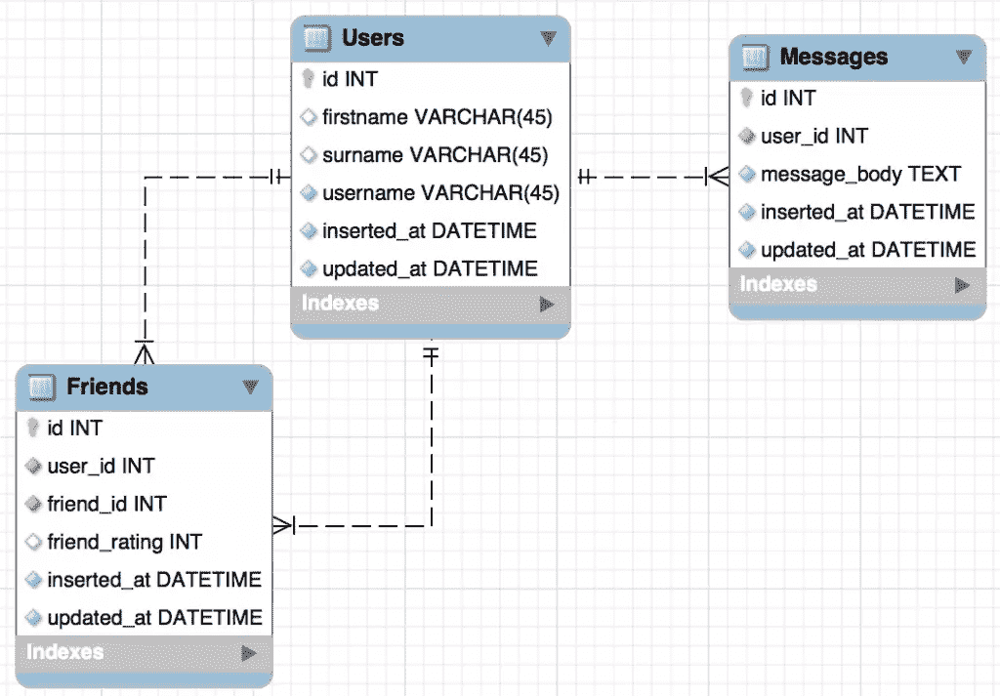

# 了解 Elixir 的 Ecto 查询 DSL:基础知识

> 原文：<https://www.sitepoint.com/understanding-elixirs-ecto-querying-dsl-the-basics/>


本文将介绍使用 Ecto 进行查询的基础知识，这是一种用于编写查询并与 Elixir 中的数据库进行交互的领域特定语言 (DSL)。这将涉及到连接、关联、聚合函数等等。

假设有关于长生不老药的[基础知识，并且事先了解艾克托](http://elixir-lang.org/getting-started/introduction.html)的[基础知识也会有所帮助。](https://www.sitepoint.com/introduction-to-elixirs-ecto-library/)

## 回显应用程序

本系列文章中的所有例子都可以在我的演示性教育应用程序上运行。我强烈建议您进行设置(如下所述),并在阅读过程中运行所有的查询。这将有助于巩固你的理解，通过摆弄这些例子，看看什么可行，什么不可行。

让我们快速设置应用程序:

```
git clone https://github.com/tpunt/ectoing
cd ectoing
mix deps.get

# don't forget to update the credentials in config/config.exs
mix ecto.create
mix ecto.migrate

# populate the database with some dummy data
mix run priv/repo/seeds.exs 
```

(我已经选择使用 MySQL 来实现这一点。本文中的例子应该在所有受支持的数据库中统一工作，因此虽然可以将 [Mariaex](https://github.com/xerions/mariaex) 依赖项切换到另一个数据库，但我建议不要这样做。这是因为下一篇文章中的一些例子将包含依赖于 MySQL 的代码。)

数据库结构如下:



## 基本查询

让我们从一些基本的查询开始，感受一下 Ecto 的查询 DSL。

请注意，虽然所有示例都可以在 Elixir shell 中执行(通过`ectoing`基目录中的`iex -S mix`),但是必须首先导入`Ecto.Query`模块。这将使我们在 shell 中工作时可以使用所有的查询 DSL 宏(如`from`)。

让我们从最简单的查询开始—选择所有用户及其完整记录:

```
SELECT * FROM users; 
```

```
query = Ectoing.User

Ectoing.Repo.all query 
```

(所有示例将首先显示 SQL 语法，然后显示如何将其转换为 Ecto 查询语法。)

为了获得所有用户的完整记录，我们只需对所需的模型执行查询(在本例中，它是`Ectoing.User`)。这是可行的，因为默认情况下，如果省略了`select`子句，Ecto 将返回相应模型的模式定义中定义的所有字段。然后，使用 Ecto 的 [`Repo.all/2`](https://hexdocs.pm/ecto/Ecto.Repo.html#c:all/2) 函数来执行查询，并获取一个结果列表(因为我们期望查询得到多个结果)。让我们快速看一下这些返回的记录中的一个:

```
[%Ectoing.User{__meta__: #Ecto.Schema.Metadata<:loaded>,
  firstname: "Thomas",
  friends_of: #Ecto.Association.NotLoaded<association :friends_of is not loaded>,
  friends_with: #Ecto.Association.NotLoaded<association :friends_with is not loaded>,
  id: 1,
  inserted_at: #Ecto.DateTime<2016-05-15T20:23:58Z>,
  messages: #Ecto.Association.NotLoaded<association :messages is not loaded>,
  surname: "Punt",
  updated_at: #Ecto.DateTime<2016-05-15T20:23:58Z>,
  username: "tpunt"},
  ...
] 
```

返回了一个类型为`Ectoing.User`的结构，该结构的成员与`Ectoing.User`模型的字段名称相匹配。值得注意的是，我们还有一些没有加载的关联(`friend`、`friends`和`messages`)已经嵌入在那里。稍后我们将更详细地讨论 Ecto 的关联，但现在只需注意它们是 Ecto 的解决方案，用于管理跨模型的外键关系的加载。

但是，我们通常不想获取整个记录。因此，让我们只选择用户的名字和姓氏:

```
SELECT firstname, surname FROM users; 
```

```
query = from u in Ectoing.User,
  select: [u.firstname, u.surname]

Ectoing.Repo.all query 
```

在`from`宏中，我们指定从中选择数据的模型(`Ectoing.User`)并使用一个便利变量(`u`)来引用它。然后使用`select`子句选择列`u.firstname`和`u.surname`作为列表，使结果值成为两个元素列表的列表:

```
[["Thomas", "Punt"], ["Liam", "Mann"], ["John", "Doe"], ["Jane", "Doe"],
 ["Bruno", "Škvorc"]] 
```

`select`子句使我们能够在其中进行模式匹配，因此虽然上面使用了方括号将列作为列表返回，但我们可以很容易地返回元组列表或映射列表:

```
query = from u in Ectoing.User,
  select: {u.firstname, u.surname}

Ectoing.Repo.all query

# result
[{"Thomas", "Punt"}, {"Liam", "Mann"}, {"John", "Doe"}, {"Jane", "Doe"},
 {"Bruno", "Škvorc"}]

query = from u in Ectoing.User,
  select: %{firstname: u.firstname, surname: u.surname}

Ectoing.Repo.all query

# result
[%{firstname: "Thomas", surname: "Punt"}, %{firstname: "Liam", surname: "Mann"},
 %{firstname: "John", surname: "Doe"}, %{firstname: "Jane", surname: "Doe"},
 %{firstname: "Bruno", surname: "Škvorc"}] 
```

## 查询 API 样式

到目前为止，我们一直使用关键字查询语法进行查询。这通常是最流行的语法，但偶尔您会看到 Ecto 的替代查询 API 语法:宏语法。让我们通过翻译上面的查询来选择所有用户的名字和姓氏，来看看这个替代语法:

```
query = (Ectoing.User                   
|> select([u], [u.firstname, u.surname]))

Ectoing.Repo.all query 
```

(封装整个查询的括号并不是必需的，但包含在内是因为它们使代码能够容易地直接复制和粘贴到 IEx 中。)

这一次，我们将模型作为第一个参数传递给 [`select/3`](https://hexdocs.pm/ecto/Ecto.Query.html#select/3) ，其中第二个参数指定了模型的绑定变量(在本例中，它是`u`)。第三个参数选择列，可以(再次)进行模式匹配以返回元组或映射，而不是列表。

为了让我们能够习惯这两种语法风格，从现在开始，我将在每个查询的 SQL 代码旁边演示这两种语法风格。

## 限制性查询和定制结果集

几乎总是，我们希望从数据库中只选择记录的子集。这可以通过一系列函数来完成，这些函数与 SQL 中的子句非常相似。其中包括`where`(结合比较运算符`in`和`like`(有一个`ilike`，虽然在 Ecto 2.0 中已被弃用))、`limit`、`offset`和`distinct`。

例如，我们可以使用以下选项选择姓氏等于“doe”的所有用户:

```
SELECT * FROM users WHERE surname = "doe"; 
```

```
surname = "doe"

# Keywords query syntax
query = from u in Ectoing.User,
  where: u.surname == ^surname

# Macro syntax
query = (Ectoing.User
|> where([u], u.surname == ^surname))

Ectoing.Repo.all query 
```

上面的比较不区分大小写，并且返回 John Doe 和 Jane Doe 用户。注意 [pin 操作符](http://elixir-lang.org/getting-started/pattern-matching.html#the-pin-operator)在`surname`变量上的用法:这是(显式地)将变量插入到查询中。这种插值变量的值会自动转换为模型的模式定义中定义的基础列类型。

让我们尝试一些更复杂的方法，选择所有不同的姓氏，对它们进行排序，然后限制结果集:

```
SELECT DISTINCT surname FROM users LIMIT 3 ORDER BY surname; 
```

```
# Keywords query syntax
query = from u in Ectoing.User,
  select: u.surname,
  distinct: true,
  limit: 3,
  order_by: u.surname

# Macro syntax
query = (Ectoing.User
|> select([u], u.surname)
|> distinct(true)
|> limit(3)
|> order_by([u], u.surname))

Ectoing.Repo.all query
# ["Doe", "Mann", "Punt"] 
```

上面的 [`distinct/3`](https://hexdocs.pm/ecto/Ecto.Query.html#distinct/3) 函数将根据`select/3`函数中指定的列选择不同的值。`distinct/3`还允许将列直接传递给它(即`distinct: u.surname`)，使得某些列可以被明确地选择，然后返回可替换的列(通过`select/3`)。然而，由于 MySQL 不支持`DISTINCT ON`语法，我们在使用 MySQL 适配器时无法做到这一点(例如，Postgres 适配器允许这样做)。最后的 [`order_by/3`](https://hexdocs.pm/ecto/Ecto.Query.html#order_by/3) 然后根据传递的列对结果集进行排序(默认情况下按升序)。

关于在 Ecto 的查询 API 中支持的操作符和函数的完整列表，[查看它的文档](https://hexdocs.pm/ecto/Ecto.Query.API.html)。另外，关于可以在 Ecto 查询中使用的文字的完整列表，[参见其查询表达式文档](https://hexdocs.pm/ecto/Ecto.Query.html#distinct/3)。

## 聚合查询

Ecto 为我们提供了许多 SQL 中常见的聚合函数，包括:`group_by`、`having`、`count`、`avg`、`sum`、`min`和`max`。

让我们通过选择朋友平均评分为 4 或更高的用户来尝试其中的几个:

```
SELECT friend_id, avg(friend_rating) AS avg_rating
FROM friends
GROUP BY friend_id
    HAVING avg_rating >= 4
ORDER BY avg_rating DESC; 
```

```
# Keywords query syntax
query = from f in Ectoing.Friend,
  select: %{friend_id: f.friend_id, avg_rating: avg(f.friend_rating)},
  group_by: f.friend_id,
  having: avg(f.friend_rating) >= 4,
  order_by: [desc: avg(f.friend_rating)]

# Macro syntax
query = (Ectoing.Friend
|> select([f], %{friend_id: f.friend_id, avg_rating: avg(f.friend_rating)})
|> group_by([f], f.friend_id)
|> having([f], avg(f.friend_rating) >= 4)
|> order_by([f], [desc: avg(f.friend_rating)]))

Ectoing.Repo.all query
# [%{avg_rating: #Decimal<4.0000>, friend_id: 3},
#  %{avg_rating: #Decimal<4.0000>, friend_id: 5}] 
```

从 Ecto 的角度来看，这样做不太好，因为我们不能为 average rating 列起别名，这要求我们在查询中使用相同的列计算三次。但是和前面的例子一样，Ecto 的查询 DSL 非常接近原始 SQL，这使得它非常容易使用。

## 结论

我们已经在本文中介绍了 Ecto 查询 DSL 的基本原理，展示了它与原始 SQL 的紧密映射。在下一篇文章中， [Elixir 的 Ecto Querying DSL:超越基础知识](https://www.sitepoint.com/elixirs-ecto-querying-dsl-beyond-the-basics/)，我们将讨论一些更复杂的主题，包括连接、组合查询、SQL 片段注入、加载关联和查询前缀。

## 分享这篇文章