# 什么是平面设计(以及我如何做)？

> 原文：<https://www.sitepoint.com/understanding-flat-design/>

去年，设计界出现了许多全新的趋势。一些趋势一枝独秀，特别是吸引人的扁平化和几乎扁平化的设计趋势，这种趋势在从图标设计到移动界面到经典网页设计的所有领域都很明显。

虽然扁平化设计远非新趋势，但它显然有很强的持久力。今天的文章不仅对扁平化趋势进行了分析，而且我们还将通过两个小教程来帮助你正确理解(扁平化？)脚踏 Photoshop。

## 那么，这个扁平化设计的东西到底是什么*？*

正如我们前面提到的，使用平面颜色和简单的几何图形当然不是什么新鲜事。一百年前，德国包豪斯的设计师们对占主导地位的[艺术和工艺运动](http://en.wikipedia.org/wiki/Arts_and_Crafts_Movement)过于挑剔、复杂的装饰颇有微词。

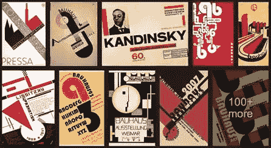

可以说，2014 年，他们大胆的字体和平淡的颜色看起来比以往任何时候都更清新、更现代。同样，苹果公司在 21 世纪初的著名 iPod 广告也围绕着平面设计元素。

微软是第一批在数字界面中实现这一趋势的人之一，他们重新设计了 Windows 8。

据报道，他们最初的地铁 UI 设计灵感来自伦敦地铁标志的简单形状和颜色。

这里有一个明显的教训:像那些火车站一样，数字景观是一个繁忙、复杂的地方，通常需要简单、直接的设计元素来穿过混乱。

## 平与*几乎*平

在平面设计领域，你有两种风格。首先，当然是经典的“扁平”设计。任何元素都没有深度——没有渐变，没有阴影——它们看起来完全融入了背景。

微软的 Windows 8 UI 就是这种方法的一个非常纯粹的例子。

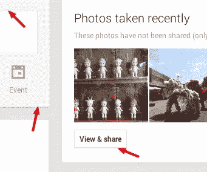

Google Plus 使用微妙的阴影给用户界面一种卡片般的感觉。

“扁平”的一个变体是使用“几乎扁平”的外观。谷歌支持这种设计美学，最初是通过 Gmail 界面，现在是通过 Google Plus 用户界面。

几乎平坦的外观通常具有渐变、轮廓、半透明面板、发光效果和阴影，这些都实现得非常巧妙。典型的几乎扁平的设计看起来像是由切割的纸板制成的。虽然微妙，但几乎平面的设计元素提供了元素本身和背景之间的区别。

虽然扁平和几乎扁平的设计都有自己的外观，但它们通常都使用明亮诱人的颜色。它们通常呈现均匀间隔和大小的几何形状，以使页面流动并补充设计主题。

保持元素的线条清晰明了，可以保持大多数设计师追求的简约外观。

## 我应该如何以及何时使用它？

像大多数新趋势一样，你可能会问，当涉及到你的设计项目时，为什么要使用平面设计——特别是当更多的装饰性 3D 元素在技术中占据如此重要的地位时。

当你这样想的时候，你为什么不想朝不同的方向迈出一步呢？无论你是支持潮流还是反对潮流，扁平化设计对设计界来说都是一个令人耳目一新的方向。

你可能已经注意到，越来越多的设计师正在拥抱这一趋势，并在他们的个人作品集、设计机构网站、手机导航菜单和许多其他领域实施这一趋势，并获得了积极的回应。

扁平化设计确实有它的问题和弊端。如果所有的界面元素都是*真正的*平面，我们如何识别哪些部分是交互的，哪些是装饰？按钮和面板可以看起来一样。

这绝不应该成为一种阻碍——您可以围绕这些潜在的限制进行设计。使用扁平元素的好处在于，它会给你的最终造型一种干净简约的感觉。平面设计看起来也很简单，你经常能够结合各种趋势，而你的设计不会显得杂乱。

它通常还会减少开发时间，使内容更具可读性和可导航性。不仅能够阅读内容，而且能够轻松地在页面之间和内容之间导航，从而增强了整体用户体验。

现在你已经了解了平面设计，让我们来看两个简短的教程，让你创建自己的平面元素。

## 制作平面应用程序图标

这个快速教程将带你创建一个真正扁平的应用程序图标设计。

#### 第一步:新画布

创建一个新的画布，尺寸为 512 像素 x 512px 像素。按“确定”以显示画布。

#### 第二步:背景色

我们想添加颜色到我们的背景，所以改变你的前景颜色为# 424d56，并填写你的画布。

#### 步骤 3:安装相机机身

我们的平面应用程序图标将是一个摄像头设计，这意味着我们需要首先创建身体。选择圆角矩形工具，给角落一个 20px 的半径。使用颜色#efe8e7 在画布中央创建相机机身。

#### 第四步:长方形

改变你的前景色为## 4a6b8a，用矩形工具在相机机身的中心画一个长矩形，就像这样。
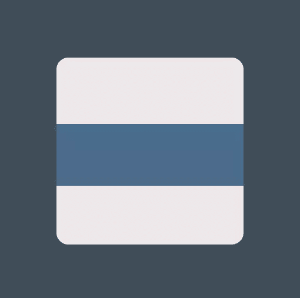

#### 第五步:闪光灯/灯光

使用椭圆和矩形工具来创建你的闪光灯和橙色光。橙色的是#ff6528，白色的是#ffffff。

#### 镜头

现在是时候创造我们的镜头了。透镜由几个简单的椭圆组成。下面你会发现每个椭圆及其颜色从大到小排列。当然，你可以根据自己的口味随意调整。这就是你学习的方式。

*   椭圆 1: #cdcdcd
*   椭圆 2: #515151
*   椭圆 3: #7b7b7b
*   椭圆 4: #343434

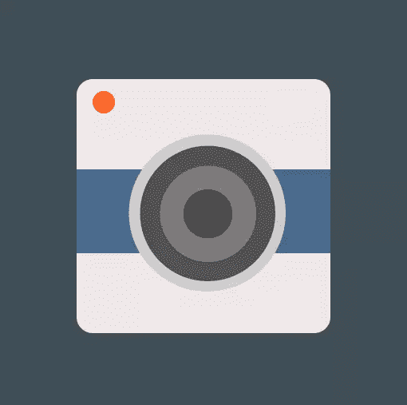

#### 步骤 7:添加镜头反射

完成你的设计，用椭圆工具添加两个白色的镜头反射，不透明度都降低到 50%。我们很想让镜头的反射变得柔和、有层次感，但是对于平面设计，我们必须坚持简单。

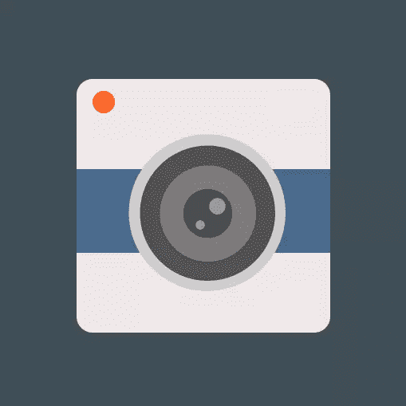

这就是了。

## *几乎*平历

在本教程中，你将学习如何通过创建一个日历图标来实现*几乎*的平面样式。

#### 第一步:新画布

与第一个例子一样，您需要创建一个新的画布，其尺寸为 512px x 512px。

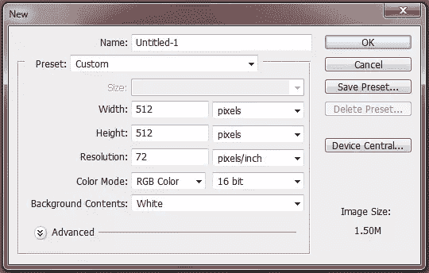

#### 第二步:背景色

把你的前景色改成#5a4e5f，用油漆桶工具填充画布。

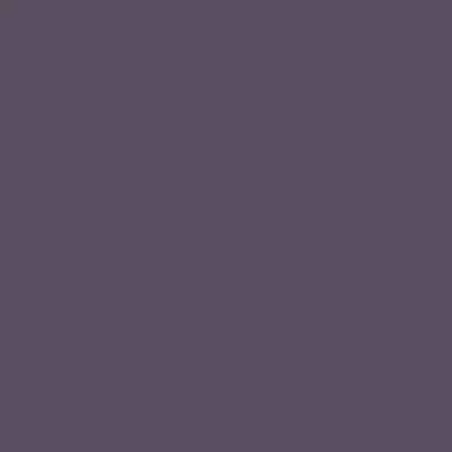

#### 第三步:日历单

设置前景色为#fffffff，选择圆角矩形工具。将角的半径改为 10px，然后创建一张纸。

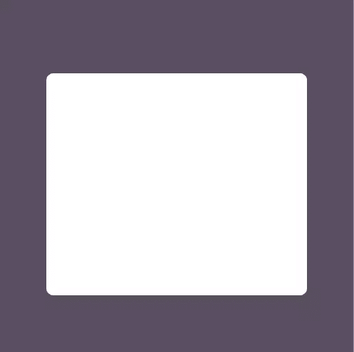

#### 第四步:额外的日历页

我们想给我们的日历增加一些微妙的深度，以匹配几乎平面的风格。为此，我们将创建两张不同颜色的纸。只需将顶层复制两次，然后将它们一个放在另一个下面。第二页应该是#dadada，第三页应该是#bababa。

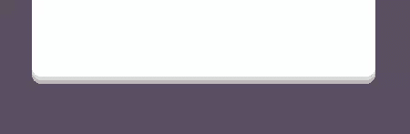

#### 阴影

现在我们想在日历后面添加一个阴影。使用#777777 创建你的阴影，确保改变图层模式为叠加，不透明度为 22%。

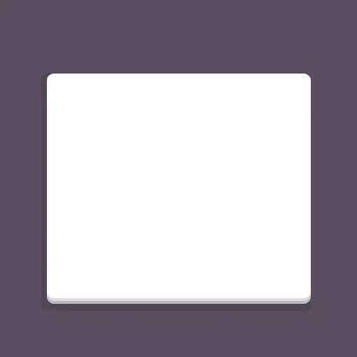

#### 第六步:顶部阴影

我们还想在纸的顶部添加一个阴影。使用矩形工具，用#b4b4b4 颜色创建一个矩形，覆盖顶部工作表的一半多一点。降低不透明度到 8%。

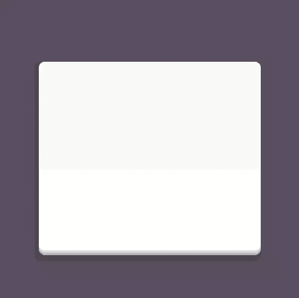

#### 第七步:绑定

将装订的前景色改为#ff6130。使用圆角矩形工具将绑定添加到日历的上半部分。一旦它在适当的位置，光栅化层，并切断下半部分，所以你有角度的角落，而不是圆形的。

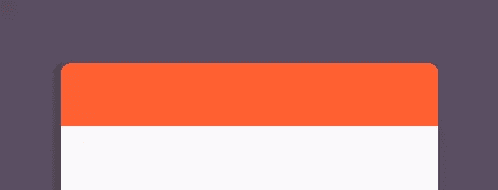

#### 第八步:环孔

使用椭圆工具和颜色#858585 创建两个小孔日历环去。

#### 戒指

现在切换到圆角矩形工具，用# b7b7b7 创建两个高矩形。确保将它们放在环孔的中心，如下图所示。

#### 第十步:约会！

添加您的日期，完成您的日历。我在这里用的是 160 磅的 Impact，颜色是# f95d2d。

#### 结论

扁平设计，虽然不是一种新趋势，但仍然是一种令人耳目一新的设计，不管你是不是它的粉丝。扁平化设计带来了一些问题，但极简主义和简约主义的粉丝肯定会欣赏这种趋势所提供的东西，并希望找到一种解决方法。即使你只是想从设计中常见的更细致的工作中休息一下，你也应该尝试一下这种趋势。

你对平面设计有什么看法？你是潮流的粉丝吗？为什么或为什么不。

## 分享这篇文章