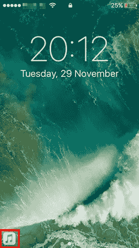
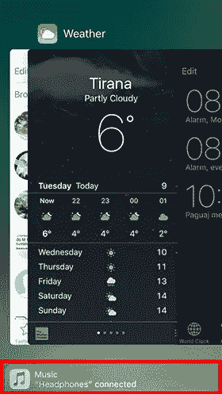
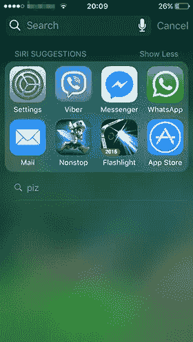
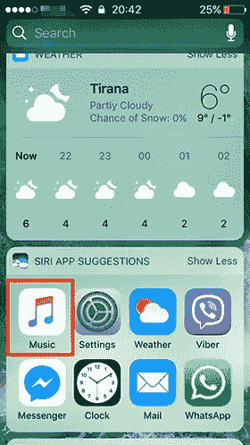
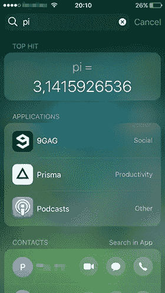
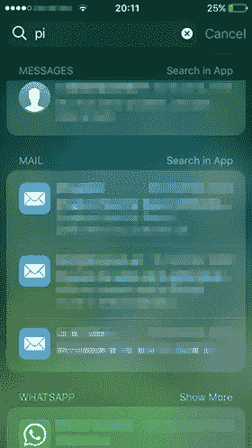
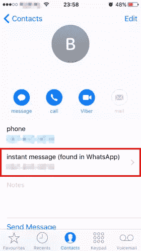

# 了解 iOS 主动建议

> 原文：<https://www.sitepoint.com/understanding-ios-proactive-suggestions/>

随着 iOS 9 中“主动”功能的引入，苹果正试图*主动*协助你。系统从你的行为中学习并试图预测它们。它开始显示建议、推荐、您经常使用的应用程序等。

## 手递手传球

切换功能没有改变，但通常在锁定屏幕中为其保留的空间被用于*建议的*应用程序。锁定屏幕左下角和应用程序切换器中显示的应用程序基于您的位置或习惯。以下截图显示了当我插入耳机时快速访问音乐应用程序。

 

iOS 已经注意到，当我插上耳机时，我会立即进入音乐应用程序，因此它现在可以让我更快地访问它。使用位置的应用程序也会发生同样的情况。例如，当你在你最喜欢的餐馆附近时，它就会出现。

## 聚光灯搜索

Spotlight 搜索可以从主页菜单进入；向下滑动或向左滑动。首先要注意的是搜索栏下方的 Siri 建议。默认情况下，你会看到在给定的*时间*(白天或晚上)你可能会使用的 4 个应用程序，但它可以扩展到 8 个应用程序。这也取决于你的位置，或者你的耳机是否插上了。所以 Siri 会根据你之前的行为或者一天中的时间来推荐应用。

在下面左侧的截图中，Siri 已经推荐了消息应用程序和我目前正在玩的一个游戏。请注意，在右边的截图中，当我插入耳机时，建议会发生变化。就像前面的例子一样，系统试图帮助更快地访问音乐应用程序。

 

当搜索一个单词时，结果根据它们被发现的位置进行分组。我试着搜索“pi ”,列出了许多结果，包括最热门的号码、应用程序、包含“Pi”的联系人姓名、消息、电子邮件等。任何使用 spotlight 搜索 API 的第三方应用程序也会在结果列表中显示其内容。

 

您可以随时在“设置”->“通用”->“Spotlight 搜索”中关闭 spot light 搜索。

## 带上下文的 Siri

在 iOS 10 中，Siri 对开发者更加开放。这意味着与第三方应用的更多互动。现在，Siri 可以感知你在设备上做什么和看什么。例如，如果你正在写一封电子邮件，并要求 Siri“提醒我今天下午发送*这个*”，Siri 就会知道“这个”是什么，并为你创建一个提醒。提醒会有一个链接，链接到邮件应用程序和你正在查看的当前电子邮件，所以当时间合适时，它会带你到同一个地方。

## 地图

提供位置的应用程序现在可以与系统共享它们的信息。让我们假设你正在你最喜欢的应用程序中搜索一个餐馆的位置。如果你打开应用程序切换器，你将能够立即获得该餐厅的位置。即使您手动打开地图应用程序，它也会提示您这个位置。或者如果你在给朋友写信约定见面地点，会建议你去餐馆。最后，即使在聚光灯下搜索，该位置也是可用的。

## 键盘建议

QuickType 在 iOS 10 中提供了增强的自动更正功能。系统会根据字段所需的输入类型自动选择键盘。因此，系统将检测你是否在写电话号码、电子邮件地址或街道地址，键盘将只显示你需要的字符。此外，知道什么类型的输入可以显示更好的建议。如果您正在与“地图”应用程序进行交互，并查看一家餐馆或您的联系人，则建议将基于该交互。这也是通过将第三方应用程序与系统更好地集成来实现的。

## 接触互动

当给一群大学或同学写电子邮件时，积极主动的建议使选择收件人变得容易。基于你最近的对话，基于你倾向于加入同一组的人，它给出了一些选择。这非常方便，尤其是当你很急，不想浪费时间写长邮件地址的时候。它还可以提醒你添加忘记添加的人。

对于第三方应用程序，与联系人应用程序的集成使得共享联系人信息成为可能，如下所示。

## 结论

Apple 希望通过预测您的需求和愿望为您提供最佳体验。要做到这一点，系统需要时间来学习和适应你的习惯和偏好。苹果公司已经清楚地表明了这一点:你使用手机越多，手机为你服务越好。

*愿法典与你同在！*

## 分享这篇文章