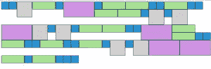
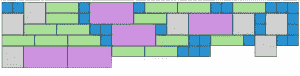
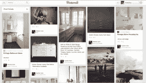
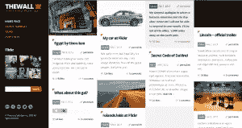
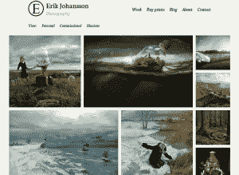

# 了解砖石布局

> 原文：<https://www.sitepoint.com/understanding-masonry-layout/>

现代网页设计世界是一个创新的世界。带有偏移分页的基于表格的列表正在迅速失宠，而带有无限滚动的砖石布局正在成为新的规范。这篇文章深入介绍了砖石布局及其用法。

## 定义砖石布局

砖石布局这个术语的名字可能源于用来生成这种布局的流行的 jQuery 砖石插件。砖石布局也被称为 Pinterest 风格布局，因为[www.pinterest.com](http://www.pinterest.com)是第一个使用这种布局风格的主要网站。

砌体是基于柱的网格布局。与其他网格布局不同，它没有固定高度的行。基本上，砖石布局通过减少任何不必要的间隙来优化网页内部空间的使用。如果没有这种类型的布局，则需要某些限制来维护布局的结构。

开发人员和设计人员习惯于看到用 CSS 浮动布局的网页。但是这种常见的布局没有考虑元素的大小。相反，它一个接一个地添加元素，首先在水平方向，然后在垂直方向。下图显示了一个使用浮动进行布局的典型网页:



正如你所看到的，拥有动态尺寸的盒子很难设计出没有不必要的间隙的布局。这种布局对用户来说也很困难，因为额外的空间会增加页面高度。导航到页面底部需要不必要的滚动。在这种情况下，我们必须在每行中使用一个固定大小的盒子。

使用砖石布局是这个问题的最终解决方案，因为它减少了空间，并试图将最大数量的盒子放入行和列中。考虑下面的截图，看看前面的设计在砖石布局中看起来如何。请注意，页面的高度降低了，布局也更加美观。



## 腹板周围的砌体布局

让我们看看砖石风格的布局在 Web 上的一些不同用途:

*   [Pinterest](http://www.pinterest.com/)



*   [城墙](http://thewall.sofarider.com/)



*   [埃里克·约翰松摄影](http://erikjohanssonphoto.com/work/imagecats/personal/)



*   [Theresa son . us](http://thereason.us/)


## 砌体布局的实际用途

砌体布局可以装备一个网站更好的功能，以及加强网站的设计。以下是砌体布局使用的实例:

*   **图片库**–砖石布局最常用于图片库。图库是使用不同尺寸的不同类型的图像构建的。创建一组具有相同尺寸的图像而不损失其质量可能是一项挑战。因此，砖石布局是使用不同尺寸的图像创建画廊的绝佳选择。
*   **博客文章**——通常，博客的主页会列出最新的博客文章，以及简短的摘要。只要我们用一栏列出帖子，就不会有什么问题。然而，对于多列，不可能列出具有不同长度摘要的帖子。为了保持版面的一致性，有必要限制摘要的长度。使用砖石布局，我们可以在多列中列出最新的帖子，而不必截断帖子摘要。
*   **投资组合**–砖石布局对于展示投资组合项目非常有用。它可用于展示项目、设计、图像或任何与您的个人资料相关的内容。

## 选择砌体布局–注意事项

到目前为止，我们已经讨论了一些砖石布局的实际使用案例，但是还有无数的其他方式来利用这种布局风格。如果你正在考虑在你的网站上使用砖石布局，在做决定之前考虑以下几点:

*   通常，您需要使用基于网格的布局。
*   网格上显示的项目应该有不同的尺寸。
*   为了体验砖石布局的真实效果，应该有相当多的项目。

## 生成砖石布局

生成砖石布局涉及一些高级计算，所以使用插件是明智的，而不是从头开始构建。有许多流行的生成砖石布局的插件，具有广泛的特性。以下是顶级砖石布局插件列表:

*   [砌筑](http://masonry.desandro.com/)
*   伍克马克
*   [同位素](http://isotope.metafizzy.co/)
*   [嵌套](http://suprb.com/apps/nested/)
*   [Freetile.js](http://yconst.com/web/freetile/)

## 砖石布局插件的功能

除了通用特性集之外，上一节中列出的插件还包含一些独特的特性。仅仅通过查看每个插件生成的砖石布局，很难理解每个插件之间的区别。所有的布局看起来都很相似。在选择插件之前，考虑可用的特性是很重要的。一般来说，大多数插件都提供了 API 和文档来识别它们的特性。

我建议在做出选择之前先看看每个插件的可用特性。我从上一节列出的插件中编译了下面的通用特性列表。这些是一些主要的特性，但是每个插件也有自己独特的地方。您可以根据自己的应用需求选择最好的插件。

*   **柱尺寸**–砌体布局可以有固定尺寸的柱或动态柱。固定大小的列是标准的。最好选择允许动态列的插件，因为它增强了灵活性。
*   **排序和过滤**–像 Isotope 这样的插件允许你在不丢失布局结构的情况下对元素进行排序和过滤。当您需要动态砖石布局时，这是一个很好的特性。
*   **动画**–与普通布局不同，砖石布局会随着元素的添加或移除而完全改变。正因为如此，最好有调整元素的动画效果——这创造了令人敬畏的用户体验。
*   **动态元素**–通常，我们使用可用的元素在页面加载时创建布局。但是有些站点可能需要无需刷新就能添加或删除元素。在这种情况下，插件应该能够自动调整布局，以提供最佳的结构。
*   布局选项–插件应该允许你设置列宽、装订线大小、对齐方式等。

## 通过插件创建砖石布局

由[www.desandro.com](http://www.desandro.com)开发的砖石是上一个列表中最受欢迎的插件。以下是快速构建简单砌体布局的分步指南:

*   **步骤 1**——下载 [masonry.pkgd.min.js](http://masonry.desandro.com/) 文件并将其包含在页面末尾，如以下代码所示:

```
<html>
  <head>
    <title>Masonry Layout with Masonry Plugin</title>
  </head>
  <body>
    <script src='masonry.pkgd.min.js'></script>
  </body>
</html>
```

*   第二步–创建一个宽度和高度可变的元素列表。每个元素都应该有一个公共类。考虑以下代码:

```
<html>
  <head>
    <title>Masonry Layout with Masonry Plugin</title>
    <style>
      * {
        -webkit-box-sizing: border-box;
        -moz-box-sizing: border-box;
        box-sizing: border-box;
      }

      .item {
        width:  50px;
        height: 50px;
        float: left;
        background: #2296DD;
        border: 2px solid #333;
      }

      .item.thumbnail {
        width:  100px;
        height: 100px;
        background: #cfcfcf
      }

      .item.medium {
        width:  150px;
        height: 50px;
        background: #A6E392
      }

      .item.large {
        width:  200px;
        height: 100px;
        background: #D092E3
      }
    </style>
  </head>
  <body>
    <div id='masonry'>
      <div class="item"></div>
      <div class="item"></div>
      <div class="item thumbnail"></div>
      <div class="item medium"></div>
      <div class="item"></div>
      <div class="item large"></div>
      <div class="item"></div>
      <div class="item medium"></div>
    </div>

    <script src='masonry.pkgd.min.js'></script>
  </body>
</html>
```

如您所见，我们有一个名为`item`的公共类，用于标识网格布局中的元素。然后，我们有三个额外的类来改变元素的维度。最后，我们将所有元素包含在一个名为`masonry`的容器中。

*   **步骤 3**–初始化砖石插件是流程中的最后一项任务。我们用它来重组元素和构建布局。考虑以下初始化代码:

```
<script>
  var container = document.querySelector('#masonry');
  var masonry = new Masonry(container, {
    columnWidth: 50,
    itemSelector: '.item'
  });
</script>
```

我们可以通过提供容器、项目选择器和列宽来初始化 Masonry 插件。我们通过将元素宽度定义为列宽的倍数来获得最佳布局。

## 结论

如你所见，使用插件构建砖石布局很简单。尝试用其他插件和它们的各种设置来看看砖石布局的变化。实验之后，回答下面的一些问题。请随意与我们的观众分享您的体验。

*   你找到的最好的砖石布局插件是什么，为什么？
*   有没有砌体布局的实际使用案例？
*   你希望在砖石插件中看到什么特性？

使用本文的[演示链接](http://www.innovativephp.com/demo/masonry_layout)，您可以看到一个实际的砖石布局。你也可以在这里下载[的代码](http://www.innovativephp.com/demo/masonry_layout.zip)。

期待收到你的来信。

## 分享这篇文章