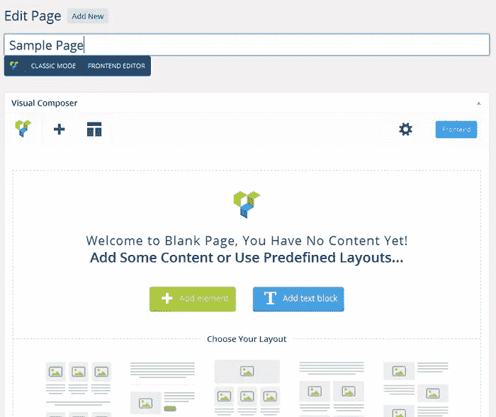
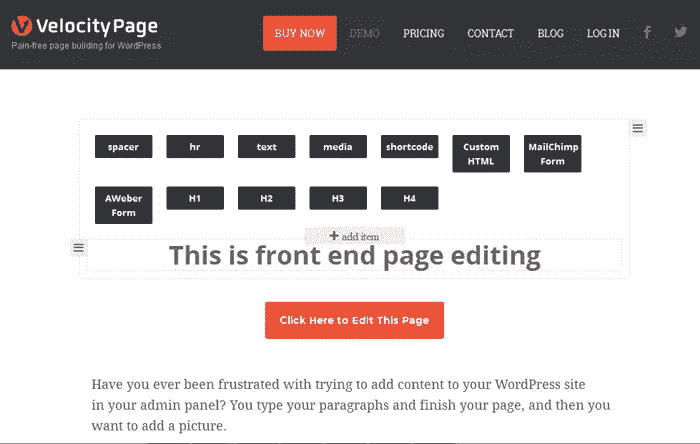
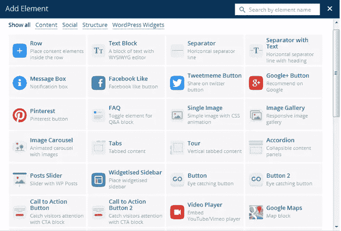
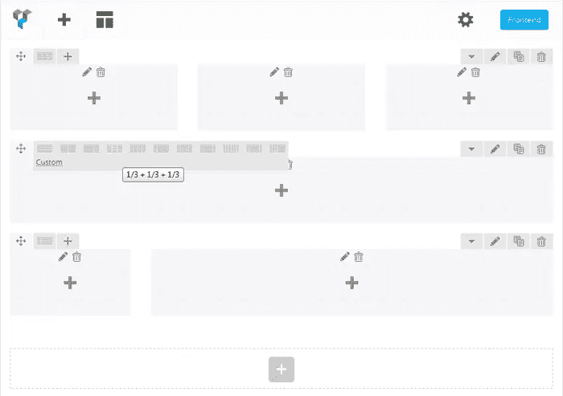
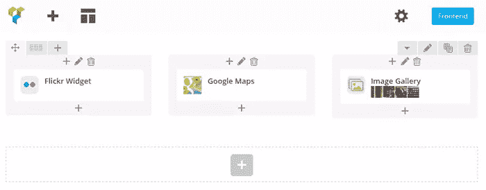
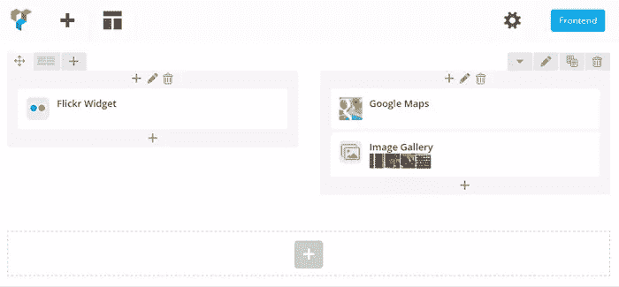
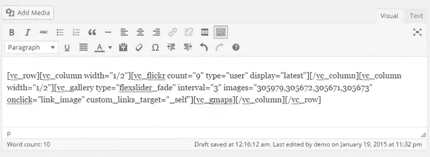
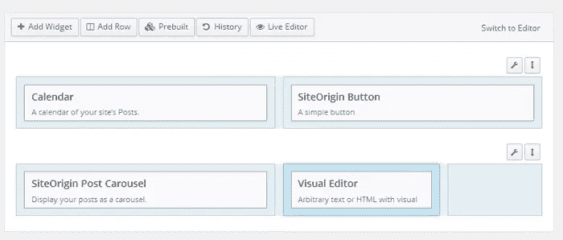
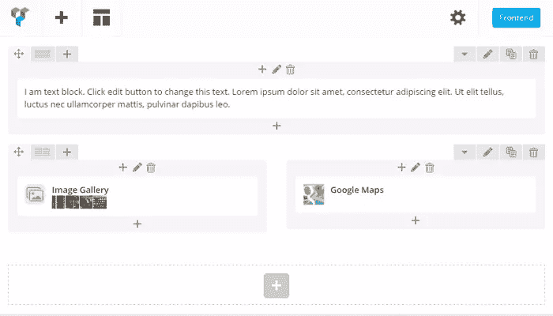
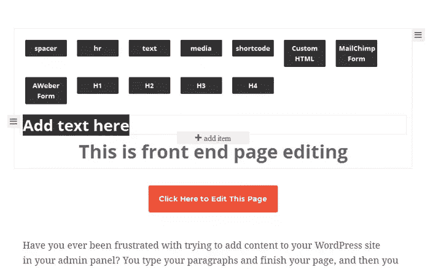

# 了解 WordPress 页面生成器的强大功能

> 原文：<https://www.sitepoint.com/understanding-the-power-of-wordpress-page-builders/>

近年来，我们已经看到 WordPress 插件开发的巨大增长，包括免费和高级版本。页面生成器是开发者和 WordPress 普通用户中最流行的插件之一。在这篇文章中，我们将看看 WordPress 页面生成器的强大功能及其用法。

### 什么是页面生成器

页面生成器是一个主题的插件或组件，可以让你用最少的精力和时间来构建和设计页面。许多读者已经熟悉了“文本”视图的 HTML 组件和 WordPress 可视化编辑器中内容的实际“可视化”预览。页面生成器可以被视为可视化编辑器的高级版本。

页面生成器使用组件在网格视图中构建响应性页面布局。WordPress 主题的 widget 化侧边栏是理解页面生成器概念的一个很好的例子。

在 WordPress 主题中，我们可以将可用的小部件拖放到侧边栏中，然后轻松地重新排列它们。一旦我们保存了侧边栏小部件，我们就可以在我们的网站上得到一个侧边栏，它有许多内置的特性，不需要任何编码。

页面生成器提供了与页面/文章内容区域类似的结构和功能，而不是侧边栏。我们既可以使用现有的组件，也可以创建自己的组件，用页面生成器来设计页面。

简而言之，页面生成器是快速设计网站的完美工具，具有高质量的设计，并且不需要了解代码。

### 为什么我们需要页面生成器

多年来，WordPress 一直是创建网站最受欢迎的选择之一。现在，在高级插件和工具的支持下，它正在以更快的速度扩展。

由于这些工具的支持，许多人愿意在没有设计师或开发人员的情况下创建自己的网站。页面生成器为技术知识有限的用户简化了网站设计过程。

让我们来看看为你的 WordPress 站点选择页面生成器的主要原因:

*   事半功倍的快速开发
*   避免专业设计师的费用和可用性问题
*   用有限的或没有编码知识设计网站
*   能够在没有重大影响的情况下切换主题

页面生成器可以满足设计网站的许多主要要求。

## 了解页面生成器的工作流程

通常，我们在 WordPress 页面和帖子的默认“可视”或“文本”编辑器视图中编辑内容。页面生成器有自己的可视化编辑器，具有强大的组件。

大多数页面生成器插件用一个新的插件特有的可视化编辑器替换了默认的 WordPress 编辑器。在编辑页面布局时，我们可以在默认编辑器和特定插件编辑器之间切换。下面的屏幕截图显示了从一个流行的页面生成器创建的页面编辑器。

大多数页面生成器都支持前端和后端页面编辑。如果你还没有使用过页面生成器，你可能不知道前端编辑是如何工作的。

标准页面编辑是一个繁琐的过程。我们必须使用可视化编辑器进行更改，将更改保存到页面，并切换到前端查看输出。

这些页面生成器的前端编辑功能允许我们在前端视图上编辑页面，并立即获得输出。下面的屏幕截图显示了页面生成器的前端编辑器。

内容元素是任何页面生成器的核心。这些元素从基本的 HTML 元素到高级组件，如图像滑块。考虑下面的示例内容元素预览图像。

一般来说，大多数页面生成器都提供一个称为“行”的内容元素来构建页面布局。“列”也作为行元素中的子组件或设置提供。

首先，我们必须使用必要的行来构建页面。然后，我们通过使用列将这些行分成多个内容区域来跟进。一旦页面由行和列构成，我们就可以在这些列中使用其他内容元素。现在让我们来看看下面的行和列的预览。

在正常情况下，更改布局的列大小是一项繁琐的任务，涉及大量的 CSS 和 HTML 修改。有了页面生成器，我们只需点击一个按钮，就可以自定义列的大小和数量。列中的所有内容元素会立即重新排列以匹配布局。更改结构不会影响主容器中的组件。以下两幅图像展示了使用页面生成器更改页面设计是多么容易。

首先，我们有一行 3 列和 3 个内容元素。

现在，假设我们想将布局改为两列。第 3 列中的组件将自动调整，如下图所示。

通常，页面构建者将添加内容的能力限制在两个级别。我们可以添加行作为第一级元素。然后，我们可以在一行中添加元素。然而，页面生成器很少允许我们在行内创建行并支持 2 个以上的级别。考虑这样一种情况，您的设计太复杂，无法使用默认特性来处理。在这种情况下，您所要做的就是插入一个文本块，并在该文本块中手动放置短代码。

我们可以保存前端和后端编辑器的内容。一旦保存，您的数据库 post 表内容将包含一组短代码。如果你切换到默认的 WordPress 编辑器，你可以看到所有这些短代码以及它们是如何构成的。

在大多数情况下，页面生成器会比默认编辑器慢。因此，人们倾向于使用默认编辑器来调整内容和短代码，这些编辑器是使用页面生成器创建的。我强烈建议你只在页面生成器视图中编辑页面，而不是默认的 WordPress 编辑器视图。同时使用页面生成器和默认编辑器可能会产生重大冲突。

在这一节中，我们看了页面生成器的一般工作流程。但是，这可以根据不同页面生成器的功能而有所不同。

## 免费和高级页面生成器

短代码多年来一直是构建 WordPress 页面的流行选择。我们可以找到数以千计使用短代码来提供特定功能的插件，我们甚至可以[创建我们自己的定制短代码](https://www.sitepoint.com/custom-shortcodes-for-wordpress/)。

页面生成器的引入也扩展了短代码插件的使用。如今，页面生成器在为非技术人员设计网站时已经成为一种规范。你会发现大量的免费和优质页面生成器。

在这一部分，我们将看看 WordPress 用户中最受欢迎的一些选择。

### 按站点来源的页面生成器

SiteOrigin 的页面生成器是 WordPress 最流行的免费页面创建插件。使用您熟悉和喜爱的小部件，可以很容易地创建基于响应列的内容。

这个插件提供了前端和后端编辑功能。但是，与其他高级页面生成器相比，可用的组件有限。

**类型**–免费

**网站**–【https://siteorigin.com/page-builder/ 

### 视觉作曲家

Visual Composer 是 WordPress 最流行的高级页面创建插件之一。这个插件还提供了前端和后端编辑功能。

Visual Composer 被集成到许多高级主题中，因此拥有非常庞大的用户群。它由许多高级组件组成，并且这个插件有一些令人敬畏的特性，伴随着它的各种插件。目前，这里有 50 多个插件，有各种各样的设计组件。

**类型**–高级

**网站**–【http://vc.wpbakery.com/ 

### 速度页面

VelocityPage 是 WordPress 核心开发者 Mark Jaquith 最近添加到页面生成器中的一个。

这个插件还提供了前端和后端编辑功能。它目前提供有限数量的基本组件，预计将来会增加。简单和性能是这个插件的主要特点。VelocityPage 真的有潜力成为最强大的页面生成器。

**类型**–高级

**网站**–【http://velocitypage.com 

上面我介绍了 3 个最流行的页面生成器。有几十个免费和高级版本的页面生成器，其中一些是主题的一部分，如 [Divi](https://www.sitepoint.com/divi-the-drag-and-drop-wordpress-theme/) 。基于以下需求，我选择涵盖以上 3 个页面构建器:

*   我想为那些没有能力花钱购买高级插件的人介绍一个免费的页面生成器。因此，SiteOrigin 的页面生成器是最受欢迎的免费版本。
*   接下来，我想介绍一个低成本的全功能页面生成器。Visual Composer 是最完整、最具成本效益的解决方案之一。
*   最后，我想介绍一个简单和高性能的页面生成器，因此 VelocityPage 是最终的选择。

请随意试用其他流行的页面生成器来比较更多的功能和性能。

## 页面生成器的利与弊

在使用任何新的插件或服务之前，辨别利弊是一项重要的任务。即使是最强大、最稳定的插件，在某些场景下也会有局限性。让我们来探讨一下使用页面生成器的利与弊。

### 赞成的意见

*   默认情况下，大多数页面生成器组件都会响应，因此不需要额外的设计工作。如果你的主题是响应式的，通过页面生成器创建的页面会自动变成响应式的。
*   一个完整的网站可以在短时间内设计使用拖放组件。
*   创造令人敬畏的设计不需要编码知识。
*   许多页面生成器提供了添加我们自己的短代码作为设计页面的组件的能力。
*   使用页面生成器创建的组件和布局独立于主题。因此，我们可以在不进行大的修改的情况下切换主题。

### 骗局

*   页面生成器使用自己的短代码和结构。一旦使用了页面生成器，就几乎不可能迁移到另一个页面生成器或默认的 HTML 内容。
*   使用大量的短代码使得维护页面变得困难。编辑页面时的一个小错误可能会导致整个页面不可用。
*   页面生成器的一个主要缺点是缺乏性能。大量短代码的使用和内容编辑器的复杂性会导致性能问题。

## 结论

页面生成器似乎是设计现代 WordPress 网站的终极解决方案。作为用户，在选择页面生成器之前，您需要做出两个艰难的决定。

首先，你要考虑页面生成器是否是你网站的正确选择。如果你的答案是肯定的，那么你需要决定使用哪一个页面生成器。

对于 WordPress 页面构建者来说，现在还是早期，因此我们可能还没有完美的解决方案。然而，随着 WordPress 核心开发者参与创建页面生成器，未来似乎是光明的。我们很多人都希望在 WordPress 核心编辑器中有类似的页面生成器功能。我们希望 WordPress 核心编辑器在未来的版本中能够得到改进，以支持这些拖放页面构建功能。

请随时让我们知道您的想法和建议。

## 分享这篇文章