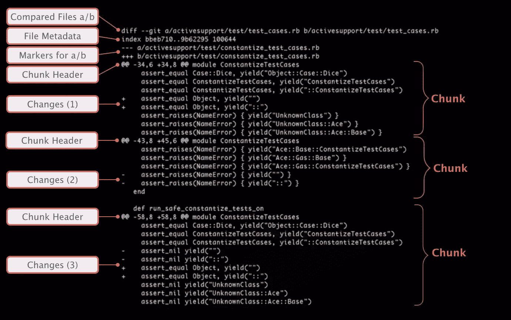
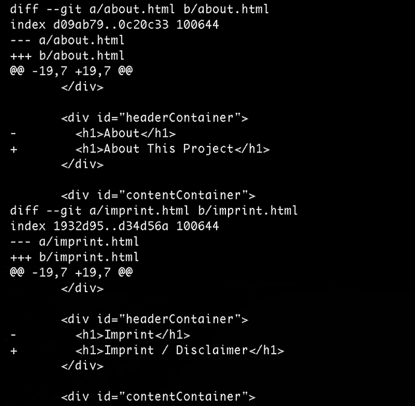

# 了解版本控制与差异

> 原文：<https://www.sitepoint.com/understanding-version-control-diffs/>

每个项目都是由无数个小变化组成的。运气好的话，他们最终会形成一个网站，一个 app，或者其他一些产品。您的版本控制系统会跟踪这些更改。但是只有当你理解了如何阅读它们，你才能跟踪你的项目进展。

本文以流行的版本控制系统 Git 为例，帮助您理解这些变化。

## 差异代表变化

在版本控制中，一个版本和另一个版本之间的差异被称为“差异”(或“补丁”)。在命令行这样的技术环境中工作时，你会遇到不同，但在图形工具如[“乌龟 Git”](http://code.google.com/p/tortoisegit/)(Win)或[“Tower”](http://www.git-tower.com)(Mac)以及代码托管平台如[“GitHub”](http://www.github.com)中工作时也会遇到不同。差异是可视化变化最常用的方法。

让我们用一个例子来学习阅读差异。

### 比较的文件 A/B

我们的例子 diff 相互比较两个条目:条目 A 和条目 B，理论上，A 和 B 可以是*任何*文件。然而，在大多数情况下，您会想要比较同一个文件，但是在两个不同的版本中。

为了设置场景，diff 输出总是从声明哪些文件由“A”和“B”表示开始。

### 文件元数据

下面是您很少需要的技术性信息:文件元数据。

前两个字符串代表我们两个文件的对象散列(或“id”)。在后台，Git 不仅保存项目的版本，还将每个文件项保存为一个对象。像这里看到的哈希用于识别特定版本的文件。

最后，右边的数字是内部文件模式标识符；“100644”只是一个“普通文件”，“100755”指定一个可执行文件，“120000”代表一个符号链接。

### a/b 的标记

稍后，在输出中会显示实际的变更。为了能够识别哪个来自哪个版本(A 或 B)，每个被比较的条目被分配一个符号:减号(“-”)用于版本 A，而加号(“+”)用于版本 B

### 矮胖的人或物

如果 diff 一次显示文件的全部内容，那么检查一个只有两行修改过的 10，000 行文件将是一个乏味的过程。相反，只显示实际上已经更改的部分。在 Git 中，这样的部分被称为“chunk”(或“hunk”)。实际更改的行被修改前后未更改的行包围。这些被称为“上下文”，因为它们帮助用户理解进行这些修改的上下文。

### 块标题

每个块前面都有一个头。标题的第一部分告诉您哪些行受到了影响，每个行用两个“@”符号括起来。让我们看看在示例 diff 的第一部分中修改了哪些行:

*   从文件 A(用“-”表示)中，从第 34 行开始提取 6 行
*   从文件 B(用“+”表示)开始，显示 8 行，也是从第 34 行开始

在“@@”的结束对之后，给出了另一段上下文:Git 试图显示一个方法名或其他上下文信息，这些信息是关于这个块在文件中的位置。然而，这因编程语言的不同而不同，并不是在所有场景中都适用。

### 变化

要理解变更，您必须能够看到它的两种状态——修改前和修改后。这就是为什么 Git 用“+”或“-”符号标记实际被更改的行:前面加了“-”符号的行来自 A，而带“+”符号的行来自 b。

Git 友好地选择了“A”和“B”，以至于(在大多数情况下)您可以将 A(或“-”)视为“旧”内容，将 B(或“+”)视为“新”内容。

我们的例子有助于我们理解这一点:

变更#1 包含两个以“+”开头的行。因为这些行在 A 中没有对应的行(没有带“-”的行)，这意味着这些行已被添加。

变化#2 是完全相反的:我们在 a 中有两行标有“-”符号。由于 B 没有对应的符号(没有“+”行)，这意味着它们被删除了。

最后，实际上修改了一些行:在修改#3 中，两个“-”行被修改为下面的两个“+”行。

您现在知道了如何阅读和理解 diff 输出。现在让我们看看如何在 Git 中*生成*一些这样的输出。

## 检查本地更改

在提交更改之前，您会想看看您到底做了什么。“git diff”命令将向您显示尚未添加到 git 的“暂存区”中的所有本地更改:$ git diff

相反，如果您只想查看已经暂存的更改，可以通过在命令中添加“–staged”参数来实现。

## 检查提交的更改

已经提交到存储库中的变更可以使用“git log”命令进行检查。默认情况下，它只给出提交元数据的概述(如作者、消息和日期)。如果添加“-p”标志，您还可以请求关于确切更改的详细信息:

## 比较分支和修订

当您想了解某个分支(或者甚至某个特定的提交)与另一个分支有何不同时，差异也很有用。例如，您可能有兴趣查看“联系人-表单”分支中的所有更改，而这些更改在“主”分支中还没有。要实现这一点，请使用“git diff”命令，如下所示:$ git diff master..接触形式

但是你并不局限于比较分支。您甚至可以比较两个任意的提交..fcd6199

## 更清晰的可视化工具

当考虑更大更复杂的修改时，你可能需要所有你能得到的帮助。一个专门的 diff 工具应用程序将提供一个改进的可视化——从而使理解变化变得更加容易。

为了帮助你从这一领域的众多可用工具中进行选择，请看一下这个推荐应用的概述。

## 结论

我希望这篇文章向您展示了差异(尽管它们在第一次检查时可能会有不同的暗示)不仅仅是晦涩的 ASCII 艺术。一旦您学会了如何阅读它们，它们会让您理解您的项目是如何发展的。这使得它们成为开发团队每个成员的必备工具。

## 分享这篇文章