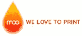
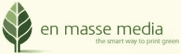

# 独特而又实惠的名片的 8 个创意

> 原文：<https://www.sitepoint.com/unique-business-card-ideas/>

有很多帖子收集了非常酷和独特的名片设计。我最喜欢的是 [CreativeBits](http://creativebits.org/cool_business_card_designs) 、 [CrazyLeaf 设计博客](http://www.crazyleafdesign.com/blog/35-cool-and-inspirational-business-card-designs/)和[每日诗论](http://dailypoetics.typepad.com/photos/business_cards_and_other_/index.html)。虽然这些卡片看起来肯定是独特和有趣的，但是就生产成本而言，它们中的许多作为日常卡片使用是不现实的。更不用说有些东西很难放在口袋或钱包里随身携带。

还有其他更实惠的方法让你的名片流行起来。最简单的方法之一是制作一张设计精美、内容清晰、令人难忘的卡片。这里有一些[彩色名片](http://blog.uprinting.com/21-colorful-business-cards/)和其他简单而[有效设计](http://www.smallbizsurvival.com/2008/10/ideas-for-great-business-cards.html)的例子(还有一些名片设计技巧！).

你想要一张更有活力但同时又划算的名片吗？这里有一些其他的元素，你可以将它们融入到你的名片中，使它们更加独特和令人印象深刻…并确保它们在进入收件人的口袋后得到第二次审视。

**1。圆角**

将名片上的所有或部分边角弄圆，可以使名片的整体外观和感觉有很大的不同。

*哪里可以买到:*
[隔夜印刷品](http://www.overnightprints.com/)，500 张卡片大约 45 美元

**2。磁铁**

这不是一个新的想法，但用名片制作磁铁是一种利用你的联系信息创造有用产品的方法。它们更可能被贴在冰箱上，而不太可能被扔进垃圾桶。

*从哪里得到它们:*
[印刷费用少](https://www.printingforless.com/cardsbusinesscards.html)，500 张卡 100 美元左右

 ** 3。折叠**

折叠卡片可以让你把它们竖起来，就像展览或展示中的桌子帐篷一样，你还可以把它们做成小册子，上面有关于你的公司或服务的额外信息。

*哪里可以买到:*
[48 小时打印](http://www.48hourprint.com/folded-business-cards-offset-fold.html)(带胶版印刷)，500 张卡大约 70 美元

 ** 4。迷你卡**

迷你卡是比标准尺寸小的名片。这可以让名片显得与众不同，但是收到名片的人仍然可以把它们放在口袋里，或者和其他名片放在一起。

哪里可以买到:
[Moo](http://www.moo.com/en/products/minicards.php) ，100 张卡大约 20 美元

 ** 5。模切**

就像迷你卡片一样，不同形状的名片会特别令人难忘。你可以尝试像圆形卡片这样简单的东西，或者创建一个定制的形状。

从哪里得到这些卡:
[PsPrint](http://www.psprint.com/die-cut-cards) ，500 张卡大约 90 美元

 ** 6。Rip 卡**

Rip 卡传统上用作门挂钩或货架卡，底部有一个可撕下的部分，可以是优惠券或名片。但是您可以创建自己的名片大小的 rip 卡。用它来做一个简单的 HTML 备忘单，一个十六进制代码颜色表，甚至是一个资源站点列表。你也可以用卡片的背面来做到这一点。

*从哪里获得:*
[Jakprints](http://www.jakprints.com/perforation/) ，每 1000 张卡加收 20 美元

 ** 7。塑料**

对于一个突出的卡，尝试一个清晰的塑料设计。它们不仅富有创意，与大多数其他卡片不同，而且非常耐用。

从哪里得到这些卡:
[AllTimePRINT](http://www.alltimeprint.com/pvc_clear.php) ，500 张卡大约 280 美元

 ** 8。回收**

回收卡是减少碳足迹的好方法，同时为你的企业创造独特的形象。有很多选择，从再生纸到大豆墨水，再到重复使用的纸张和材料。

*哪里可以买到:*
[可持续集团](http://www.sustainablegroup.net/store/green-event-and-presentation-meterials/business-card-recycled-cards)(100%回收纤维制成的纸张)，500 张卡片大约 115 美元
[大众媒体](http://www.enmassemedia.com/recycled-business-cards.html) (100%消费后回收纸张)，1000 张卡片大约 150 美元
[美国名片公司](http://www.usbcards.net/cards.html)(纸张来自早餐麦片盒)，500 张卡片大约 235 美元

如何让自己的名片脱颖而出？你认为最有效的形式是什么？

*图片来源:[布莱恩拉里](http://www.sxc.hu/photo/1022838)*

## 分享这篇文章