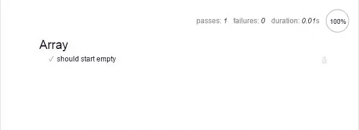
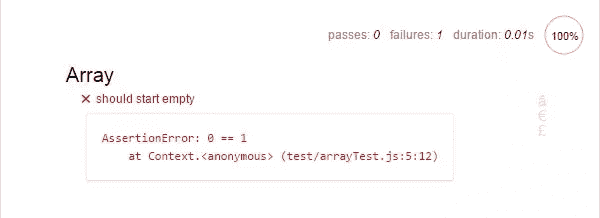

# 使用 Mocha 和 Chai 对您的 JavaScript 进行单元测试

> 原文：<https://www.sitepoint.com/unit-test-javascript-mocha-chai/>

*本文由[Panayiotis pvgr Velisarakos](https://github.com/pvgr)、[马克·布朗](https://www.sitepoint.com/author/mbrown)和 [Tom Greco](https://www.sitepoint.com/author/tgreco/) 进行同行评审。感谢 SitePoint 的所有同行评审员使 SitePoint 的内容尽可能做到最好！*

你是否曾经对你的代码做了一些修改，然后发现它导致了其他东西的破坏？

我相信我们大多数人都经历过。这几乎是不可避免的，尤其是当您有大量代码时。一个事物依赖于另一个事物，然后改变它会破坏其他事物。

但是如果那没有发生呢？如果你有办法知道什么时候由于一些变化而导致一些东西断裂，那会怎么样？那太好了。你可以修改你的代码，而不必担心破坏任何东西，你会有更少的错误，你会花更少的时间调试。

这就是单元测试的亮点。他们会自动为你检测代码中的任何问题。做出改变，运行您的测试，如果有任何问题，您将立即知道发生了什么，问题在哪里*和*正确的行为应该是什么。这完全消除了任何猜测！

在本文中，我将向您展示如何开始对您的 JavaScript 代码进行单元测试。本文中展示的示例和技术可以应用于基于浏览器的代码和 Node.js 代码。

本教程的代码可以从我们的 [GitHub repo](https://github.com/sitepoint-editors/mocha-unit-testing) 获得。

## 什么是单元测试

当您测试您的代码库时，您获取一段代码—通常是一个函数—并验证它在特定情况下的行为是否正确。单元测试是一种结构化和自动化的方法。因此，你写的测试越多，你得到的好处就越大。随着您继续开发代码库，您也会对它有更大的信心。

单元测试的核心思想是当给一个函数一组特定的输入时，测试它的行为。你用某些参数调用一个函数，并检查你得到了正确的结果。

```
// Given 1 and 10 as inputs...
var result = Math.max(1, 10);

// ...we should receive 10 as the output
if(result !== 10) {
  throw new Error('Failed');
} 
```

实际上，测试有时会更复杂。例如，如果您的函数发出一个 Ajax 请求，测试需要更多的设置，但是同样的原则“给定某些输入，我们期望一个特定的结果”仍然适用。

## 设置工具

对于这篇文章，我们将使用摩卡。它很容易上手，可用于基于浏览器的测试和 Node.js 测试，并且与其他测试工具配合良好。

安装 Mocha 最简单的方法是通过 npm(为此我们还需要安装 [Node.js](https://nodejs.org/en/) )。如果您不确定如何在您的系统上安装 npm 或 Node，请参考我们的教程:[NPM 初学者指南——节点包管理器](https://www.sitepoint.com/beginners-guide-node-package-manager/)

安装节点后，在项目目录中打开终端或命令行。

*   如果你想在浏览器中测试代码，运行`npm install mocha chai --save-dev`
*   如果你想测试 Node.js 代码，除了上面的，运行`npm install -g mocha`

这将安装软件包`mocha`和`chai`。 [Mocha](https://mochajs.org/) 是允许我们运行测试的库， [Chai](http://chaijs.com/) 包含一些有用的函数，我们将使用它们来验证我们的测试结果。

### 在 Node.js 上测试与在浏览器中测试

下面的例子是为在浏览器中运行测试而设计的。如果您想对 Node.js 应用程序进行单元测试，请遵循以下步骤。

*   对于 Node，您不需要测试运行器文件。
*   为了包含 Chai，在测试文件的顶部添加`var chai = require('chai');`。
*   使用`mocha`命令运行测试，而不是打开浏览器。

## 设置目录结构

您应该将测试放在与主代码文件不同的目录中。这使得构建它们变得更加容易，例如，如果你想要在将来添加其他类型的测试(比如[集成测试](https://en.wikipedia.org/wiki/Integration_testing)或者[功能测试](https://en.wikipedia.org/wiki/Functional_testing))。

JavaScript 代码最流行的做法是在项目的根目录中有一个名为`test/`的目录。然后，将每个测试文件放在`test/someModuleTest.js`下。可选地，您也可以使用`test/`中的目录，但是我建议保持简单——如果需要，您可以随时更改它。

## 设置测试运行器

为了在浏览器中运行我们的测试，我们需要设置一个简单的 HTML 页面作为我们的*测试运行器*页面。该页面加载了 Mocha、测试库和我们实际的测试文件。要运行测试，我们只需在浏览器中打开转轮。

如果使用 Node.js，可以跳过这一步。Node.js 单元测试可以使用命令`mocha`运行，假设您遵循了推荐的目录结构。

下面是我们将用于测试运行程序的代码。我将把这个文件保存为`testrunner.html`。

```
<!DOCTYPE html>
<html>
  <head>
    <title>Mocha Tests</title>
    <link rel="stylesheet" href="node_modules/mocha/mocha.css">
  </head>
  <body>
    <div id="mocha"></div>
    <script src="node_modules/mocha/mocha.js"></script>
    <script src="node_modules/chai/chai.js"></script>
    <script>mocha.setup('bdd')</script>

    <!-- load code you want to test here -->

    <!-- load your test files here -->

    <script> mocha.run(); </script>
  </body>
</html> 
```

测试运行程序中的重要部分是:

*   我们加载 Mocha 的 CSS 样式来给我们的测试结果提供良好的格式。
*   我们创建一个 ID 为`mocha`的 div。这是插入测试结果的地方。
*   我们装上摩卡和柴。它们位于`node_modules`文件夹的子文件夹中，因为我们是通过 npm 安装的。
*   通过调用`mocha.setup`，我们可以使用 Mocha 的测试助手。
*   然后，我们加载我们想要测试的代码和测试文件。我们这里暂时还没有任何东西。
*   最后，我们调用`mocha.run`来运行测试。确保在加载源文件和测试文件后调用这个*。*

## 基本的测试构建块

现在我们可以运行测试了，让我们开始写一些。

我们将从创建一个新文件`test/arrayTest.js`开始。像这样的单个测试文件被称为*测试用例*。我称之为`arrayTest.js`是因为在这个例子中，我们将测试一些基本的数组功能。

每个测试用例文件都遵循相同的基本模式。首先，您有一个`describe`块:

```
describe('Array', function() {
  // Further code for tests goes here
}); 
```

`describe`用于对单个测试进行分组。第一个参数应该表明我们正在测试什么——在本例中，因为我们要测试数组函数，所以我已经传入了字符串`'Array'`。

其次，在`describe`中，我们将有`it`块:

```
describe('Array', function() {
  it('should start empty', function() {
    // Test implementation goes here
  });

  // We can have more its here
}); 
```

`it`用于创建实际的测试。`it`的第一个参数应该提供人类可读的测试描述。例如，我们可以将上面的内容理解为“它应该以空开始”，这很好地描述了数组应该如何表现。实现测试的代码被写入传递给`it`的函数中。

所有的 Mocha 测试都是从这些相同的构件构建的，并且遵循相同的基本模式。

*   首先，我们使用`describe`来说明我们正在测试什么——例如，“描述数组应该如何工作”。
*   然后，我们使用大量的`it`函数来创建单独的测试——每个`it`应该解释一个特定的行为，例如对于上面的数组案例,“它应该从空开始”。

## 编写测试代码

现在我们知道了如何构建测试用例，让我们进入有趣的部分——实现测试。

因为我们正在测试数组应该从空开始，所以我们需要创建一个数组，然后确保它是空的。这个测试的实现非常简单:

```
var assert = chai.assert;

describe('Array', function() {
  it('should start empty', function() {
    var arr = [];

    assert.equal(arr.length, 0);
  });
}); 
```

注意，在第一行，我们设置了`assert`变量。这只是为了让我们不需要到处都输入`chai.assert`。

在`it`函数中，我们创建一个数组并检查它的长度。虽然简单，但这是测试如何工作的一个很好的例子。

首先，你有一些你正在测试的东西——这被称为测试中的*系统*或 *SUT* 。然后，如果有必要的话，你可以对 SUT 做一些事情。在这个测试中，我们不做任何事情，因为我们检查数组开始时是空的。

测试中的最后一件事应该是验证——一个检查结果的*断言*。在这里，我们使用`assert.equal`来做这件事。大多数断言函数以相同的顺序接受参数:首先是“实际”值，然后是“预期”值。

*   *实际的*值是测试代码的结果，所以在这个例子中`arr.length`
*   *预期的*值就是结果*应该是*的值。因为数组应该以空开始，所以这个测试中的期望值是`0`

Chai 还提供了两种不同风格的断言，但是为了简单起见，我们现在使用 [assert](http://chaijs.com/api/assert/) 。当你对编写测试更有经验时，你可能想使用[期望断言](http://chaijs.com/api/bdd/)，因为它们提供了更多的灵活性。

## 运行测试

为了运行这个测试，我们需要将它添加到我们之前创建的测试运行器文件中。

如果您使用 Node.js，您可以跳过这一步，使用命令`mocha`来运行测试。你会在终端看到测试结果。

否则，要向跑步者添加这个测试，只需添加:

```
<script src="test/arrayTest.js"></script> 
```

如下图:

```
<!-- load your test files here --> 
```

一旦您添加了脚本，您就可以在您选择的浏览器中加载 test runner 页面。

## 测试结果

当您运行测试时，测试结果将如下所示:



请注意，我们输入到`describe`和`it`函数中的内容显示在输出中——测试被分组在描述下。注意，也可以嵌套`describe`块来创建进一步的子分组。

让我们来看看失败的测试是什么样子的。

测试中的那一行写着:

```
assert.equal(arr.length, 0); 
```

将数字`0`替换为`1`。这使得测试失败，因为数组的长度不再与预期值匹配。

如果您再次运行测试，您将会看到失败的测试以红色显示，并带有出错原因的描述。



测试的一个好处是它们可以帮助你更快地找到 bug，但是这个错误在这方面没有太大的帮助。不过，我们可以修好它。

大多数断言函数也可以带一个可选的`message`参数。这是断言失败时显示的消息。最好使用这个参数来使错误消息更容易理解。

我们可以像这样给我们的断言添加一条消息:

```
assert.equal(arr.length, 1, 'Array length was not 0'); 
```

如果重新运行测试，将出现自定义消息，而不是默认消息。

让我们将断言切换回原来的样子——用`0`替换`1`,并再次运行测试以确保它们通过。

## 把它放在一起

到目前为止，我们已经看了相当简单的例子。让我们将所学付诸实践，看看如何测试一段更真实的代码。

这是一个向元素添加 CSS 类的函数。这应该放在一个新文件`js/className.js`中。

```
function addClass(el, newClass) {
  if(el.className.indexOf(newClass) === -1) {
    el.className += newClass;
  }
} 
```

为了让它更有趣一点，我让它只在一个类不存在于元素的`className`属性中时才添加一个新类——毕竟谁想看到`<div class="hello hello hello hello">`?

在最好的情况下，我们应该在编写代码之前为这个函数编写测试。但是[测试驱动开发](https://en.wikipedia.org/wiki/Test-driven_development)是一个复杂的话题，现在我们只想专注于编写测试。

首先，让我们回忆一下单元测试背后的基本思想:我们给函数一些输入，然后验证函数的行为是否符合预期。那么这个函数的输入和行为是什么呢？

给定一个元素和一个类名:

*   如果元素的`className`属性不包含类名，应该添加。
*   如果元素的`className`属性包含类名，就不应该添加。

让我们把这些案例翻译成两个测试。在`test`目录中，创建一个新文件`classNameTest.js`并添加以下内容:

```
describe('addClass', function() {
  it('should add class to element');
  it('should not add a class which already exists');
}); 
```

我们稍微修改了一下措辞，改成了测试中使用的“它应该做 X”的形式。这意味着它读起来更好，但本质上仍然是我们上面列出的人类可读的形式。从想法到测试，通常不会比这更难。

但是等等，测试函数在哪里？嗯，当我们省略第二个参数`it`时，Mocha 在测试结果中将这些测试标记为*待定*。这是一种设置大量测试的便捷方式——有点像您打算编写的待办事项列表。

让我们继续实现第一个测试。

```
describe('addClass', function() {
  it('should add class to element', function() {
    var element = { className: '' };

    addClass(element, 'test-class');

    assert.equal(element.className, 'test-class');
  });

  it('should not add a class which already exists');
}); 
```

在这个测试中，我们创建了一个`element`变量，并将其作为参数传递给`addClass`函数，同时传递的还有一个字符串`test-class`(要添加的新类)。然后，我们使用断言检查该类是否包含在值中。

同样，我们从最初的想法出发——给定一个元素和一个类名，它应该被添加到类列表中——并以一种相当简单的方式将其翻译成代码。

尽管这个函数是为处理 DOM 元素而设计的，但是我们在这里使用的是普通的 JS 对象。有时我们可以以这种方式利用 JavaScript 的动态特性来简化我们的测试。如果我们不这样做，我们将需要创建一个实际的元素，这将使我们的测试代码变得复杂。另一个好处是，因为我们不使用 DOM，所以如果我们愿意，也可以在 Node.js 中运行这个测试。

### 在浏览器中运行测试

要在浏览器中运行测试，您需要将`className.js`和`classNameTest.js`添加到 runner:

```
<!-- load code you want to test here -->
<script src="js/className.js"></script>

<!-- load your test files here -->
<script src="test/classNameTest.js"></script> 
```

您现在应该看到一个测试通过，另一个测试显示为待定，如下面的代码所示。请注意，为了使代码在 CodePen 环境中工作，代码与示例略有不同。

参见 [CodePen](http://codepen.io) 上 SitePoint ( [@SitePoint](http://codepen.io/SitePoint) )用 Mocha (1) 进行的 Pen [单元测试。](http://codepen.io/SitePoint/pen/XXzXLX/)