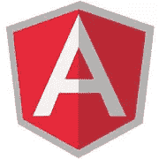

# AngularJS 中的单元测试:服务、控制器和提供者

> 原文：<https://www.sitepoint.com/unit-testing-angularjs-services-controllers-providers/>



AngularJS 的设计考虑到了可测试性。依赖注入是框架的[显著特征之一，它使得单元测试更加容易。AngularJS 定义了一种方法，可以灵活地将应用模块化，并将其划分为不同的组件，如控制器、指令、过滤器或动画。这种开发模式意味着各个部分独立工作，应用程序可以在很长一段时间内轻松扩展。随着可扩展性和可测试性携手并进，测试 AngularJS 代码变得很容易。](https://docs.angularjs.org/guide/di)

根据[单元测试](http://en.wikipedia.org/wiki/Unit_testing)的定义，被测系统应进行隔离测试。因此，系统需要的任何外部对象都必须用模拟对象来替换。顾名思义，模拟对象并不执行实际的任务；相反，它们是用来满足被测系统的期望的。如果你需要复习嘲讽，请参考我以前的一篇文章:[嘲讽 AngularJS 测试中的依赖](https://www.sitepoint.com/mocking-dependencies-angularjs-tests/)。

在这篇文章中，我将分享一组在 AngularJS 中测试服务、控制器和提供者的技巧。代码片段是用 [Jasmine](http://jasmine.github.io/2.0/introduction.html) 编写的，可以用 [Karma 测试运行程序](http://karma-runner.github.io/0.12/index.html)运行。您可以从[我们的 GitHub repo](https://github.com/sitepoint-editors/angular-js-unit-testing-services-controllers-providers) 下载本文中使用的代码，在那里您也可以找到运行测试的说明。

## 测试服务

服务是 AngularJS 应用程序中最常见的组件之一。它们提供了一种在中心位置定义可重用逻辑的方法，这样就不需要一遍又一遍地重复相同的逻辑。服务的单例性使得在多个控制器、指令甚至其他服务之间共享相同的数据成为可能。

服务可以依赖一组其他服务来执行其任务。比方说，名为 A 的服务依赖于服务 B、C 和 D 来执行其任务。在测试服务 A 时，依赖项 B、C 和 D 必须用模拟替换。

我们通常会模仿所有的依赖关系，除了某些实用服务，比如`$rootScope`和`$parse`。我们使用将返回一个全新函数的`jasmine.createSpy()`在测试中创建必须被检查的方法的间谍(在 Jasmine 中，模仿被称为间谍)。

让我们考虑以下服务:

```
angular.module('services', [])
  .service('sampleSvc', ['$window', 'modalSvc', function($window, modalSvc){
    this.showDialog = function(message, title){
      if(title){
        modalSvc.showModalDialog({
          title: title,
          message: message
        });
      } else {
        $window.alert(message);
      }
    };
  }]);
```

这个服务只有一个方法(`showDialog`)。根据该方法接收的输入值，它调用作为依赖项注入其中的两个服务之一(`$window`或`modalSvc`)。

为了测试`sampleSvc`,我们需要模拟两个相关的服务，加载包含我们服务的 angular 模块，并获取对所有对象的引用:

```
var mockWindow, mockModalSvc, sampleSvcObj;
beforeEach(function(){
  module(function($provide){
    $provide.service('$window', function(){
      this.alert= jasmine.createSpy('alert');
    });
    $provide.service('modalSvc', function(){
      this.showModalDialog = jasmine.createSpy('showModalDialog');
    });
  });
  module('services');
});

beforeEach(inject(function($window, modalSvc, sampleSvc){
  mockWindow=$window;
  mockModalSvc=modalSvc;
  sampleSvcObj=sampleSvc;
}));
```

现在我们可以测试`showDialog`方法的行为。我们可以为该方法编写的两个测试用例如下:

*   如果没有参数传入，它就调用`alert`
*   如果`title`和`message`参数都存在，它调用`showModalDialog`

以下代码片段显示了这些测试:

```
it('should show alert when title is not passed into showDialog', function(){
  var message="Some message";
  sampleSvcObj.showDialog(message);

  expect(mockWindow.alert).toHaveBeenCalledWith(message);
  expect(mockModalSvc.showModalDialog).not.toHaveBeenCalled();
});

it('should show modal when title is passed into showDialog', function(){
  var message="Some message";
  var title="Some title";
  sampleSvcObj.showDialog(message, title);

  expect(mockModalSvc.showModalDialog).toHaveBeenCalledWith({
    message: message,
    title: title
  });
  expect(mockWindow.alert).not.toHaveBeenCalled();
});
```

这种方法没有太多需要测试的逻辑，而典型的 web 应用程序中的服务通常包含很多功能。您可以使用本技巧中演示的技术来模仿和获取对服务的引用。服务测试应该覆盖编写服务时假设的每一个可能的场景。

工厂和值也可以使用相同的技术进行测试。

## 测试控制器

测试控制器的设置过程与服务的设置过程非常不同。这是因为控制器是不可注入的，而是在加载路由或编译`ng-controller`指令时自动实例化的。由于我们没有在测试中加载视图，我们需要在测试中手动实例化控制器。

由于控制器通常被绑定到一个视图，控制器中方法的行为依赖于视图。此外，在视图被编译后，一些额外的对象可能会被添加到范围中。最常见的例子之一是表单对象。为了使测试按预期工作，必须手动创建这些对象并将其添加到控制器中。

控制器可以是以下类型之一:

*   与`$scope`一起使用的控制器
*   与`Controller as`语法一起使用的控制器

如果你不确定其中的区别，你可以[在这里](http://www.johnpapa.net/do-you-like-your-angular-controllers-with-or-without-sugar/)了解更多。不管怎样，我们都将讨论这两种情况。

### 用$scope 测试控制器

考虑以下控制器:

```
angular.module('controllers',[])
  .controller('FirstController', ['$scope','dataSvc', function($scope, dataSvc) {
    $scope.saveData = function () {
      dataSvc.save($scope.bookDetails).then(function (result) {
        $scope.bookDetails = {};
        $scope.bookForm.$setPristine();
      });
    };

    $scope.numberPattern = /^\d*$/;
  }]);
```

为了测试这个控制器，我们需要通过传入服务的一个`$scope`对象和一个模拟对象(`dataSvc`)来创建一个控制器实例。由于服务包含异步方法，我们需要使用我在上一篇文章中概述的[模仿承诺技术](https://www.sitepoint.com/mocking-dependencies-angularjs-tests/#mocking-methods-returning-promises)来模仿它。

下面的代码片段模仿了`dataSvc`服务:

```
module(function($provide){
  $provide.factory('dataSvc', ['$q', function($q)
    function save(data){
      if(passPromise){
        return $q.when();
      } else {
        return $q.reject();
      }
    }
    return{
      save: save
    };
  }]);
});
```

然后我们可以使用`$rootScope.$new`方法为控制器创建一个新的范围。在创建了控制器的实例之后，我们拥有了这个新的`$scope`的所有字段和方法。

```
beforeEach(inject(function($rootScope, $controller, dataSvc){
  scope=$rootScope.$new();
  mockDataSvc=dataSvc;
  spyOn(mockDataSvc,'save').andCallThrough();
  firstController = $controller('FirstController', {
    $scope: scope, 
    dataSvc: mockDataSvc
  });
}));
```

当控制器向`$scope`添加一个字段和一个方法时，我们可以检查它们是否被设置为正确的值，以及这些方法是否具有正确的逻辑。上面的示例控制器添加了一个正则表达式来检查有效的数字。让我们添加一个规范来测试正则表达式的行为:

```
it('should have assigned right pattern to numberPattern', function(){
    expect(scope.numberPattern).toBeDefined();
    expect(scope.numberPattern.test("100")).toBe(true);
    expect(scope.numberPattern.test("100aa")).toBe(false);
});
```

如果控制器用默认值初始化任何对象，我们可以在规范中检查它们的值。

为了测试`saveData`方法，我们需要为`bookDetails`和`bookForm`对象设置一些值。这些对象将被绑定到 UI 元素，因此在运行时编译视图时创建。正如已经提到的，在调用`saveData`方法之前，我们需要用一些值手动初始化它们。

下面的代码片段测试了这个方法:

```
it('should call save method on dataSvc on calling saveData', function(){
    scope.bookDetails = {
      bookId: 1, 
      name: "Mastering Web application development using AngularJS", 
      author:"Peter and Pawel"
    };
    scope.bookForm = {
      $setPristine: jasmine.createSpy('$setPristine')
    };
    passPromise = true;
    scope.saveData();
    scope.$digest();
    expect(mockDataSvc.save).toHaveBeenCalled();
    expect(scope.bookDetails).toEqual({});
    expect(scope.bookForm.$setPristine).toHaveBeenCalled();
});
```

### 使用“Controller as”语法测试控制器

测试使用`Controller as`语法的控制器比测试使用`$scope`语法的控制器更容易。在这种情况下，控制器的实例扮演模型的角色。因此，所有操作和对象在此实例上都可用。

考虑以下控制器:

```
angular.module('controllers',[])
  .controller('SecondController', function(dataSvc){
    var vm=this;

    vm.saveData = function () {
      dataSvc.save(vm.bookDetails).then(function(result) {
        vm.bookDetails = {};
        vm.bookForm.$setPristine();
      });
    };

    vm.numberPattern = /^\d*$/;
  });
```

调用这个控制器的过程类似于前面讨论的过程。唯一的区别是，我们不需要创建一个`$scope`。

```
beforeEach(inject(function($controller){
  secondController = $controller('SecondController', {
    dataSvc: mockDataSvc
  });
}));
```

当控制器中的所有成员和方法都被添加到这个实例中时，我们可以使用实例引用来访问它们。

下面的代码片段测试了添加到上述控制器中的`numberPattern`字段:

```
it('should have set pattern to match numbers', function(){
  expect(secondController.numberPattern).toBeDefined();
  expect(secondController.numberPattern.test("100")).toBe(true);
  expect(secondController.numberPattern.test("100aa")).toBe(false);
});
```

`saveData`方法的断言保持不变。这种方法的唯一区别是我们初始化`bookDetails`和`bookForm`对象的方式。

以下代码片段显示了该规范:

```
it('should call save method on dataSvc on calling saveData', function () 
  secondController.bookDetails = {
    bookId: 1,
    name: "Mastering Web application development using AngularJS",
    author: "Peter and Pawel"
  };
  secondController.bookForm = {
    $setPristine: jasmine.createSpy('$setPristine')
  };
  passPromise = true;
  secondController.saveData();
  rootScope.$digest();
  expect(mockDataSvc.save).toHaveBeenCalled();
  expect(secondController.bookDetails).toEqual({});
  expect(secondController.bookForm.$setPristine).toHaveBeenCalled();
});
```

## 测试提供商

提供程序用于公开应用程序范围配置的 API，这必须在应用程序启动之前进行。一旦 AngularJS 应用程序的配置阶段结束，就不允许与提供者进行交互。因此，只能在配置块或其他提供程序块中访问提供程序。我们不能使用注入块获得提供者实例，而是需要向模块块传递回调。

让我们考虑以下依赖于常量(`appConstants`)的第二个提供者(`anotherProvider`):

```
angular.module('providers', [])
  .provider('sample', function(appConstants, anotherProvider){

    this.configureOptions = function(options){
      if(options.allow){
        anotherProvider.register(appConstants.ALLOW);
      } else {
        anotherProvider.register(appConstants.DENY);
      }
    };

    this.$get = function(){};
  });
```

为了测试这一点，我们首先需要模拟依赖关系。您可以在示例代码中看到[如何做到这一点。](https://github.com/sitepoint-editors/angular-js-unit-testing-services-controllers-providers/blob/master/tests/providerSpec.js)

在测试提供程序之前，我们需要确保模块已经加载并准备好了。在测试中，模块的加载被推迟，直到执行了一个注入块或者执行了第一个测试。在几个项目中，我看到了一些使用空的第一个测试来加载模块的测试。我不喜欢这种方法，因为这个测试不会做任何事情，只会增加你的测试总数。相反，我使用一个空的注入块来加载模块。

以下代码片段获取引用并加载模块:

```
beforeEach(module("providers"));
beforeEach(function(){
  module(function(anotherProvider, appConstants, sampleProvider){
    anotherProviderObj=anotherProvider;
    appConstantsObj=appConstants;
    sampleProviderObj=sampleProvider;
  });
});
beforeEach(inject());
```

现在我们有了所有的引用，我们可以调用提供者中定义的方法并测试它们:

```
it('should call register with allow', function(){
  sampleProviderObj.configureOptions({allow:true});
  expect(anotherProviderObj.register).toHaveBeenCalled();
  expect(anotherProviderObj.register).toHaveBeenCalledWith(appConstantsObj.ALLOW);
});
```

## 结论

单元测试有时会变得棘手，但花时间在上面是值得的，因为它确保了应用程序的正确性。AngularJS 使得对使用框架编写的代码进行单元测试变得更加容易。我希望这篇文章能给你足够的思路来扩展和增强应用程序中的测试。在以后的文章中，我们将继续研究如何测试代码的其他部分。

## 分享这篇文章