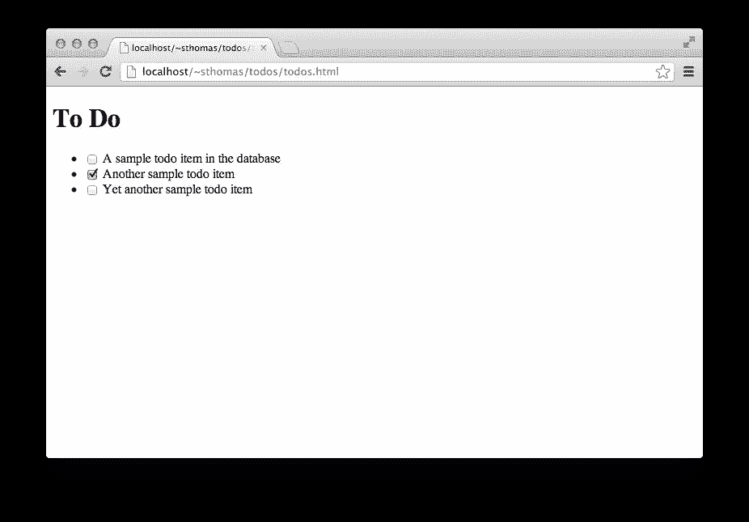
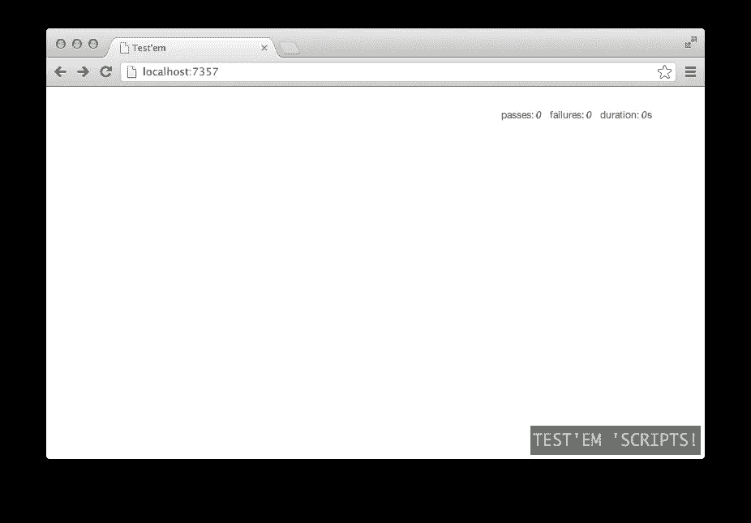
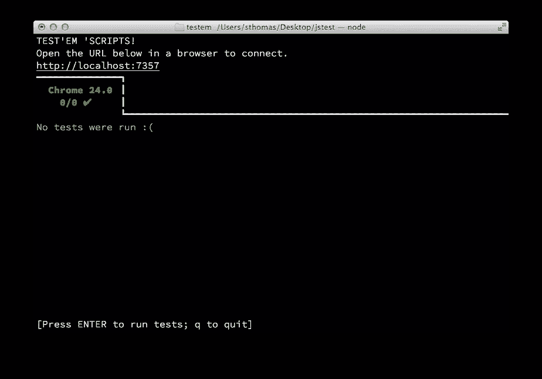
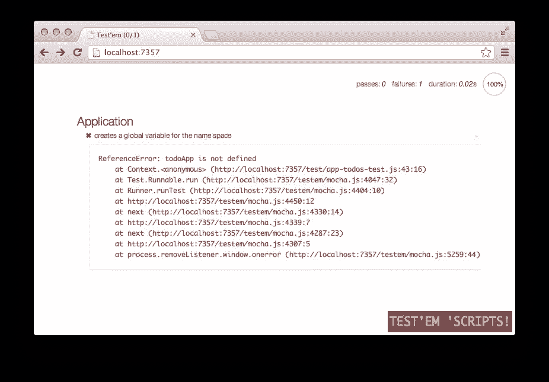
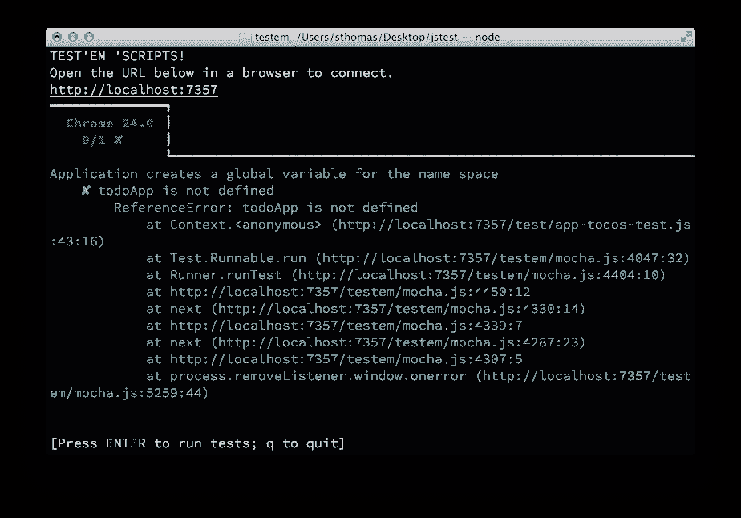
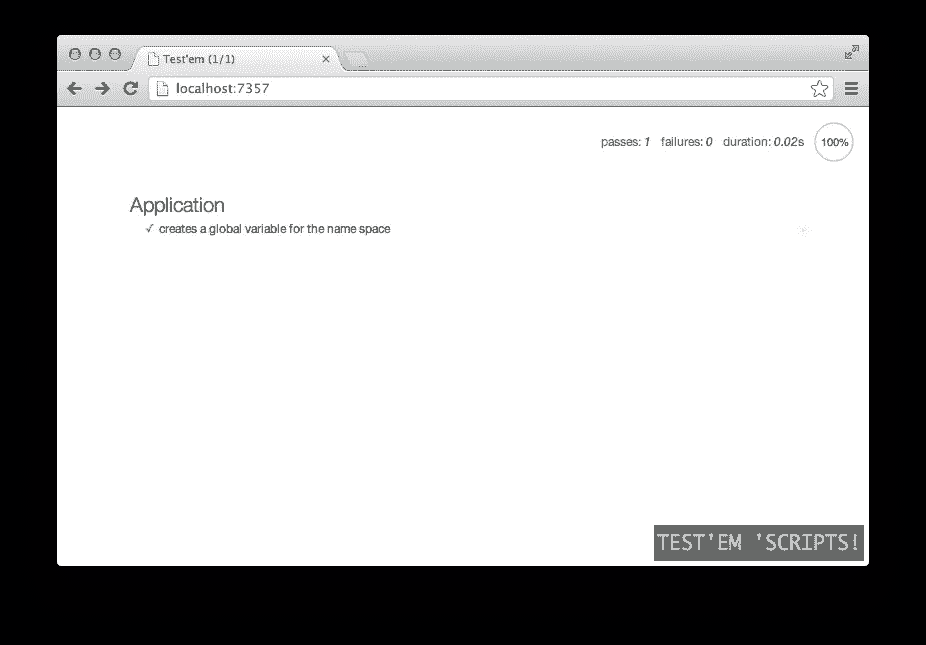
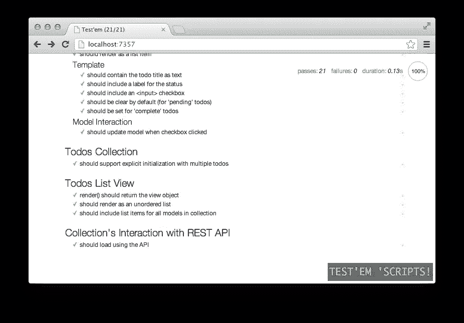
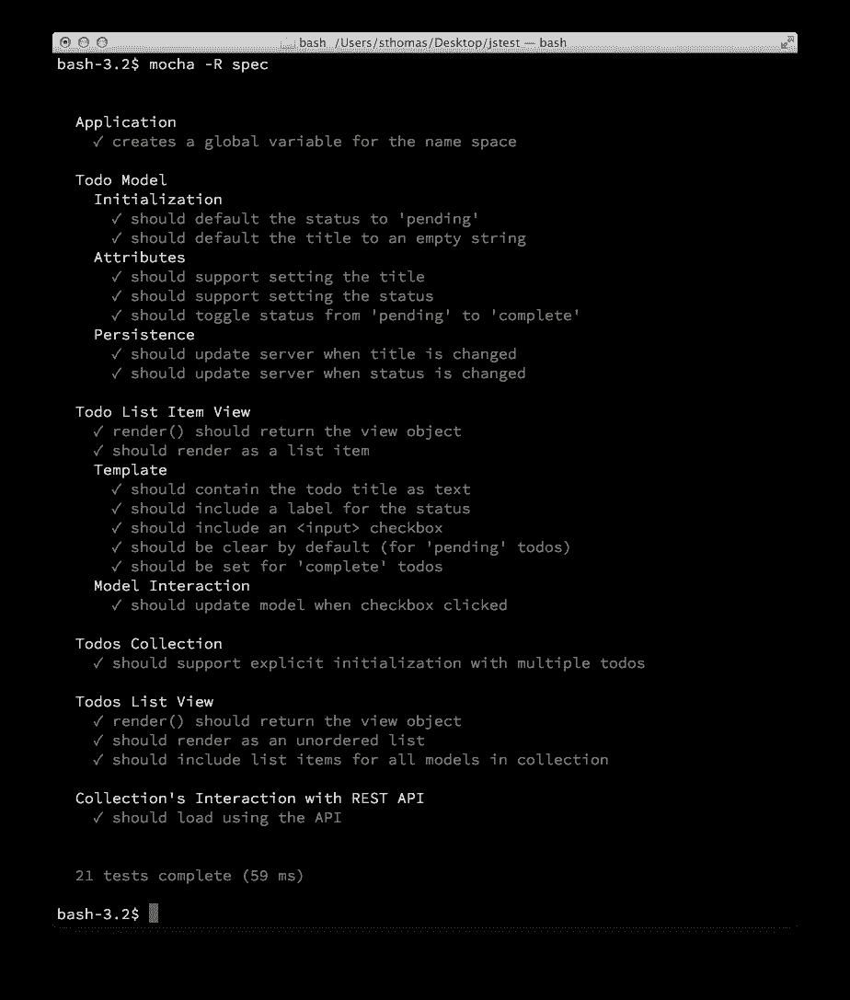

# 单元测试 Backbone.js 应用

> 原文：<https://www.sitepoint.com/unit-testing-backbone-js-applications/>

在花了几个小时，也许是*天*的时间，为你的 web 应用程序添加了一个令人敬畏的新特性，你终于准备好看到它的运行了。您将新代码添加到您的 JavaScript 库，构建发布候选，启动您的浏览器，期望获得惊喜。然后……啊哦……新功能可能工作得很好，但你的应用程序的其他一些关键部分——在开发新版本时你没有*碰过*的部分——已经严重出错。现在，您面临的挑战是回溯几天的工作，试图找出您是如何破坏现有代码的。快乐的日子肯定不会再来了。

这种情况对我的打击比我愿意承认的还要大。如果你已经写了一段时间的代码，你可能也看到了。然而，想想是什么让这一场景如此痛苦。这并不是因为我们的新代码破坏了现有的代码；那是发展中不可避免的。真正的痛苦是过了这么久才注意到破损。自从我们知道我们的应用程序工作以来，已经有了这么多的开发，有大量的代码中可能隐藏着 bug。虽然这看起来有点像大海捞针，但我们别无选择，只能潜水。

在本文中，我们真的要在 JavaScript 开发中消除这种情况。不再需要花费数小时、数天或数周的时间在代码中寻找指针。我们将采用的原则很简单:一旦我们创建了任何 bug *,就发现它。没错；我们将建立一个开发环境和过程，当我们编写引入 bug 的代码时，它会立即告诉我们。此外，一旦初始开发完成，我们投入到过程中的额外努力不会浪费。捕捉我们开发错误的相同测试代码将在集成环境中完全可重用。我们可以很容易地将测试整合到我们的源代码管理系统中，在错误进入我们的代码库之前阻止它们。*

在接下来的四个部分中，我们将首先看看 JavaScript 测试环境所需的工具。然后，我们将考虑一个简单的应用程序，这个应用程序简单易懂，但是具有真实的生产 web 应用程序中可能存在的所有特性和功能。最后两部分演示了我们如何在开发过程中使用我们的环境来测试示例应用程序，以及在初始开发完成后，如何在集成过程中测试示例应用程序。

## 组装 JavaScript 测试环境

我们的单元测试 nirvana 需要一些开发工具，这些工具可能还不在您的工作台中。好消息和坏消息都是，有很多选择。这是好消息，因为它给了我们选择，这是坏消息，因为前端开发的速度意味着有太多的选择。为了集中我们的评估，让我们明确一下我们的两大目标。其他一切都是次要的:

1.  我们的环境必须支持开发期间的无摩擦、连续测试。
2.  开发过程中创建的测试必须同样适用于集成。

### 执行环境

对于 JavaScript 编码，没有比现代 web 浏览器更好的开发环境了。无论您喜欢 Firebug 还是 Webkit 的开发人员工具，浏览器都支持动态 DOM 检查和编辑、完全交互式调试和复杂的性能分析。Web 浏览器非常适合开发，因此我们的测试工具和环境必须与浏览器内开发相集成。然而，Web 浏览器并不适合集成测试。集成测试通常发生在云中某处的服务器上(或者至少发生在数据中心的某处)。这些系统甚至没有图形用户界面，更不用说现代的网络浏览器了。对于高效的集成测试，我们需要简单的命令行脚本和支持它们的 JavaScript 执行环境。对于那些需求，选择的工具是 [node.js](http://nodejs.org) 。尽管有其他命令行 JavaScript 环境，但没有一个具有与 node.js 相匹配的支持广度和深度。在集成阶段，我们的测试工具必须与 node.js 集成

### 测试框架

既然我们已经确定了我们的测试工具必须同时支持 web 浏览器和 node.js 环境，那么我们可以缩小选择范围，选择一个核心测试框架。存在许多 JavaScript 测试框架，但是大多数严重偏向于浏览器测试；让他们使用 node.js 通常是可能的，但通常需要笨拙的技巧或调整。一个没有这个问题的框架是 [Mocha](http://visionmedia.github.com/mocha/) ，它恰如其分地将自己描述为:

> Mocha 是一个功能丰富的 JavaScript 测试框架，运行在 node 和浏览器上，使得异步测试变得简单而有趣。

Mocha 最初是为 node.js 开发的，现在已经被扩展到支持 web 浏览器。通过使用 Mocha 作为我们的测试框架，我们可以编写支持开发和集成的测试，而无需修改。

### 断言库

与一些 JavaScript 测试框架不同，Mocha 旨在实现最大的灵活性。因此，我们将不得不选择一些额外的部分来使它完整。特别是，我们需要一个 JavaScript 断言库。为此，我们将依赖于 [Chai 断言库](http://chaijs.com)。Chai 有些独特，因为它支持所有常见的断言样式——*断言*、*期望、*和*应该。断言风格决定了我们如何在测试代码中编写测试。在封面下，它们都是等价的；很容易将测试从一种断言风格转换成另一种。断言风格的主要区别在于它们的可读性。断言风格的选择主要取决于您(或您的团队)认为哪种风格最具可读性，以及哪种风格产生了最容易理解的测试。要了解差异，请考虑为以下代码开发一个简单的测试:*

```
var sum = 2 + 2;
```

传统的断言式测试可以写成:

```
assert.equal(sum, 4, "sum should equal 4");
```

这个测试完成了工作，但是除非你已经习惯了老派的单元测试，否则阅读和解释它可能有点挑战性。另一种断言风格使用`expect`:

```
expect(sum).to.equal(4);
```

大多数开发人员发现 expect 风格的断言比 assert 风格的测试更容易阅读和理解。第三种选择，`should`，让测试断言更像自然语言:

```
sum.should.equal(4);
```

Chai 库支持所有三种断言风格。在本文中，我们将坚持使用`should`。

### 间谍、树桩和仿制品

大多数 web 应用程序，包括我们将在本文中考虑的小例子，都依赖于第三方库和服务。在许多情况下，测试我们的代码需要观察——甚至控制——那些库和服务。[兴农。JS](http://sinonjs.org) 库提供了很多测试这些交互的工具。这些工具分为三大类:

*   ***间谍*** 。测试代码观察被测代码之外的函数调用。间谍不干涉那些外部功能的操作；它们仅仅记录调用和返回值。
*   ***存根*** 。代表被测代码之外的函数调用的测试代码。存根代码没有试图复制外部函数；它只是在测试中的代码访问外部函数时防止未解决的错误。
*   ***嘲弄*** 。模拟测试代码之外的功能或服务的测试代码。通过模拟，测试代码可以指定这些函数或服务的返回值，从而验证代码的响应。

和西农一起。JS 库本身，我们可以用 [Sinon 扩充标准的 Chai 断言库。JS 断言为柴](https://github.com/domenic/sinon-chai)。

### 单元测试开发环境

我们测试工作台的最后一个工具是单元测试的开发环境。对于我们的例子，我们将使用[测试它们](https://github.com/airportyh/testem)。Test'em 是一个方便的脚本集合，用于设置和运行连续的测试环境。如果我们愿意，我们可以自己编写脚本并手动管理环境；然而，Toby Ho (Test'em 的创造者)已经整理了一个很棒的包，可以省去我们的麻烦。

## 示例应用程序

为了查看我们的测试环境的运行情况，让我们考虑一个简单的应用程序。尽管这个应用程序被删减到了最基本的部分，但是它包含了一个真正的应用程序所需要的所有功能。(该应用的完整源代码可在 [GitHub](https://github.com/jsprodotcom/source/blob/master/jsunittest.zip) 上获得。)



用户可以看到他们的待办事项列表，他们可以点击复选框来切换任何待办事项的状态。

### Todos 数据库

我们的应用程序从保存 todos 信息的数据库表开始。下面是我们可以用来创建该表的 SQL。

```
CREATE TABLE `todos` (
  `id`       int(11)      NOT NULL AUTO_INCREMENT COMMENT 'Primary key for the table.',
  `title`    varchar(256) NOT NULL DEFAULT ''     COMMENT 'The text for the todo item.',
  `complete` bit(1)       NOT NULL DEFAULT b'0'   COMMENT 'Boolean indicating whether or not the item is complete.',
  PRIMARY KEY (`id`)
) ENGINE=InnoDB DEFAULT CHARSET=utf8 COMMENT='To Do items.' 
```

这是我们放入一些测试数据后，表格的样子。

| 身份证明（identification） | 标题 | 完成 |
| --- | --- | --- |
| one | 数据库中的 todo 项示例 | Zero |
| Two | 另一个 todo 项目示例 | one |
| three | 另一个示例待办事项 | Zero |

正如表中所示，我们的 todos 只包含一个主键(`id`)、一个标题和一个状态位来指示它们是否完整。

### REST API

我们的 web 应用程序需要访问这个数据库，所以我们将提供一个标准的 REST 接口。该 API 遵循 Ruby 约定，但可以通过任何服务器技术轻松实现。特别是:

*   `GET api/todos`返回数据库中所有行的 JSON 编码数组。
*   `GET api/todos/NNN`返回 todo 的 JSON 表示，其中`id`等于`NNN`。
*   `POST api/todos`使用请求中 JSON 编码的信息向数据库添加新的 todo。
*   `PUT api/todos/NNN`使用请求中 JSON 编码的信息用等于`NNN`的`id`更新 todo。
*   `DELETE api/todos/NNN`从数据库中删除`id`等于`NNN`的待办事项。

如果您不是特别喜欢 Ruby，源代码中包含了这个 API 的完整 PHP 实现。

### JavaScript 库

我们适度的应用程序足够简单，不用任何库就可以用纯 JavaScript 实现，但是我们有更大的计划。我们可能会开始小，但最终该应用程序将具有惊人的功能和令人愉快的用户界面。为了迎接这一天，我们将构建一个能够支持我们终极杀手级应用的框架:

*   jQuery 用于 DOM 操作、事件处理和服务器通信。
*   用许多不可或缺的实用程序来增强核心语言。
*   [Backbone.js](http://backbonejs.org/) 根据模型和视图定义应用程序的结构。

### 一个 HTML 框架

既然我们知道了组成应用程序的组件，我们就可以定义支持它的 HTML 框架了。它没有什么特别的，只是一个最小的 HTML5 文档、一些 JavaScript 文件和一小段代码。

```
<!DOCTYPE html>
<html lang="en">
  <head>
    <meta charset="utf-8">
    <title></title>
  </head>
  <body>
    <h1>List of Todos</h1>

    <script src="lib/jquery-1.9.0.min.js"></script>
    <script src="lib/underscore-min.js"></script>
    <script src="lib/backbone-min.js"></script>
    <script src="src/app-todos.js"></script>
    <script>
      $(function () {
        var todos = new todoApp.Todos();
        todos.fetch();
        var list = new todoApp.TodosList({collection: todos});
        $("body").append(list.el);
      })
    </script>
  </body>
</html>
```

## 开发期间的测试

现在我们已经选择了工具并指定了应用程序，是时候开始开发了。我们的首要任务是安装工具。

### 安装工具

尽管我们将在浏览器中开发，但我们的测试环境依赖于 node.js。因此，第一步是安装 node.js 和节点包管理器(npm)。在 node.js 网站上有 OS X、Windows、Linux 和 SunOS 的可执行二进制文件，以及其他操作系统的源代码。运行安装程序后，您可以从命令行验证 node.js 和 npm。

```
bash-3.2$ node --version
v0.8.18
bash-3.2$ npm --version
1.2.2
bash-3.2$ 
```

我们需要的所有其他东西都可以作为节点包方便地获得。节点包管理器可以处理它们的安装以及任何依赖关系。

```
bash-3.2$ npm install jquery jsdom underscore backbone mocha chai sinon sinon-chai testem -g 
```

### 创建项目结构

此示例的源代码包括一个完整的项目结构，包含以下 15 个文件:

```
todos.html
testem.json

api/htaccess
api/todos.php

lib/backbone-min.js
lib/chai.js
lib/jquery-1.9.0.min.js
lib/sinon-1.5.2.js
lib/sinon-chai.js
lib/underscore-min.js

mysql/todos.sql

php-lib/dbconfig.inc.php

src/app-todos.js

test/app-todos-test.js
test/mocha.opts 
```

以下是每个文件夹和文件包含的内容:

*   `todos.html`:我们的应用程序的框架 HTML 文件，如上所示。
*   `testem.json`:测试它们的配置文件；我们稍后将详细讨论这一点。
*   `api/`:我们 REST API 实现的文件夹。
    *   `api/htaccess`:支持 REST API 的 Apache web 服务器的配置示例。
    *   `api/todos.php`:实现 REST API 的 PHP 代码。
*   `lib/`:app 本身和测试框架使用的 JavaScript 库的文件夹。
    *   `lib/backbone-min.js`:backbone . js 缩小版。
    *   `lib/chai.js`:柴断言库。
    *   `lib/jquery-1.9.0.min.js`:jQuery 的缩小版。
    *   `lib/sinon-1.5.2.js`:否则。js library(js 库)。
    *   `lib/sinon-chai.js`:西农。JS 断言为柴。
    *   `lib/underscore-min.js`:下划线. js 的缩小版
*   `mysql/`:应用程序的 MySQL 代码的文件夹。
    *   `mysql/todos.sql`:创建应用数据库的 MySQL 命令。
*   `php-lib/`:PHP 库的文件夹，应用的 REST API 的配置。
    *   `php-lib/dbconfig.inc.php`:REST API 的 PHP 数据库配置。
*   `src/`:我们客户端应用代码的文件夹。
    *   我们的应用程序。
*   `test/`:测试代码的文件夹。
    *   我们的应用程序的测试代码。
    *   `test/mocha.opts`:摩卡的配置选项；我们将在下一节中讨论这一点。

在开发过程中，我们只对其中的三个文件感兴趣，`testem.json`、`src/app-todos.js`和`test/app-todos-test.js`。

### 配置测试它们

实际开发之前的最后一步是定义测试配置。该配置驻留在 JSON 格式的`testem.json`中，在任何文本编辑器中创建都非常简单。我们简单地指定我们正在使用 Mocha (Test'Em 支持几种框架)，并且我们列出了我们的应用程序和测试代码需要的 JavaScript 文件。

```
{
  "framework": "mocha",
  "src_files": [
    "lib/jquery-1.9.0.min.js",
    "lib/underscore-min.js",
    "lib/backbone-min.js",
    "src/*.js",
    "lib/chai.js",
    "lib/sinon-chai.js",
    "lib/sinon-1.5.2.js",
    "test/*.js"
  ]
}
```

### 开始开发

最后，我们准备编码。在命令 shell 中，导航到我们项目的根文件夹并执行命令`testem`。Test'Em 脚本将运行，清空终端窗口，并在右上角给我们一个 URL。将该 URL 复制并粘贴到我们选择的浏览器中，然后我们就可以开始了。


一旦我们启动网络浏览器，它将自动执行我们定义的任何测试。由于我们刚刚开始开发，我们不会有任何代码，也没有任何测试用例。浏览器会友好地向我们指出这一点。



我们启动 Test'Em 的终端窗口也会给出状态。



### 第一个测试案例

本着真正测试驱动开发的精神，我们将从在`test/app-todos-test.js`文件中编写第一个测试用例开始。像任何优秀的网络应用一样，我们希望将全球域名空间污染降至最低。为此，我们将依赖一个全局变量`todoApp`来包含我们所有的代码。我们的第一个测试用例将确保全局名称空间变量存在。

```
var should = chai.should();

describe("Application", function() {
  it("creates a global variable for the name space", function () {
    should.exist(todoApp);
  })
})
```

如您所见，我们需要一个初步声明来告诉 Mocha 我们正在使用 Chai 断言。然后我们可以开始编写测试。按照惯例，JavaScript 测试被组织到块中(块可以嵌套到子块中，依此类推)。每个块都以一个`describe()`函数调用开始，以识别我们正在测试的代码部分。在本例中，我们测试的是整个应用程序，所以这是`describe()`的第一个参数。

在一个测试块中，我们根据测试的内容记录每个测试用例。这就是`it()`函数的目的。阅读任何测试用例的方法是将`describe()`和`it()`字符串组合成一条语句。因此，我们的第一个测试案例是

> 应用程序为名称空间创建一个全局变量

测试代码本身在`it()`块中。我们的测试案例是

```
should.exist(todoApp);
```

现在我们有了一个完整的测试用例。我们一保存文件，Test`Em 就会自动接管。它注意到我们的一个文件已经改变，所以它立即重新运行测试。毫不奇怪(因为我们还没有为应用程序编写任何代码)，我们的第一次测试失败了。



终端窗口也会自动更新。



为了通过测试，我们必须创建全局名称空间变量。我们转移到`srcapp-todos.js`文件并添加必要的代码。

```
if (typeof todoApp === "undefined") todoApp = {};
```

我们一保存文件，Test`Em 就会再次开始工作。我们立即获得测试用例的更新结果。



退一步想想发生了什么！每当我们对测试代码或应用程序进行更改时，Test`Em 会立即重新运行我们的整个测试套件。我们所要做的就是让 Test'Em 的浏览器或终端窗口在我们屏幕的一角保持可见，这样我们就可以实时地看到我们代码的健康状况，就像我们正在开发的一样。只要我们引入了一个 bug，我们就会知道，即使这个 bug 出现在不同于我们工作的代码部分。不再需要花数小时、数天或数周的时间去挖掘新代码，找出我们何时引入了一个 bug。

### 测试模型

现在我们的开发环境已经完全建立，我们可以开始开发应用程序了。由于我们的应用程序显示了待办事项列表，因此为这些待办事项创建一个模型可能会很好。该模型将需要跟踪 todo 的标题及其状态。让我们添加一个单元测试来验证我们可以用合理的默认值创建一个 todo。

```
describe("Todo Model", function(){
  describe("Initialization", function() {
    beforeEach(function() {
      this.todo = new todoApp.Todo();
    })
    it("should default the status to 'pending'",function() {
      this.todo.get('complete').should.be.false;
    })
    it("should default the title to an empty string",function() {
      this.todo.get('title').should.equal("");
    })
  })
})
```

这些测试有几个方面毫无价值。

*   我们可以互相嵌套测试块。一个测试块将包含 todo 模型的所有单元测试，这些测试的子块关注初始化。
*   在一个测试块中，我们可以定义在每次测试之前执行的功能。这就是`beforeEach()`块的目的。在上面的例子中，我们在每次测试之前创建一个新的 Todo 实例。
*   Mocha 框架自动确保 JavaScript 上下文(即`this`的值)对于我们所有的测试用例都是一致的。这就是为什么我们可以在一个函数中定义`this.todo`(`beforeEach()`参数)，并在其他函数中安全地引用它(比如`it()`参数)。如果没有 Mocha 在幕后提供这种一致性，JavaScript 将为每个函数定义不同的上下文。

当然，由于我们还没有编写模型代码，所以我们所有的测试都会失败。(我们马上就会知道。)但是一旦我们为模型添加了代码，测试就通过了，我们就上路了。

```
todoApp.Todo = Backbone.Model.extend({
  defaults: {
    title: "",
    complete:  false
  }
})
```

### 将存根用于第三方功能

现在我们有了一个简单的 todos 模型，我们可以开始定义它的行为了。我们的模型应该做的一件事是每当数据库的任何属性发生变化时更新数据库。然而，在单元测试环境中，我们没有实际的数据库来检查。另一方面，我们实际上并没有编写任何代码来更新数据库。相反，我们依靠主干来处理这种交互。这为这个测试用例提出了一个单元测试策略。我们需要知道的是主干模型使用`save()`方法来更新任何支持存储持久化模型的内容。在我们的例子中，后备存储器是数据库。下面是我们可以使用的单元测试代码:

```
describe("Persistence", function() {
  beforeEach(function() {
    this.todo = new todoApp.Todo();
    this.save_stub = sinon.stub(this.todo, "save");
  })
  afterEach(function() {
    this.save_stub.restore();
  })
  it("should update server when title is changed", function() {
    this.todo.set("title", "New Summary");
    this.save_stub.should.have.been.calledOnce;
  })
  it("should update server when status is changed", function() {
    this.todo.set('complete',true);
    this.save_stub.should.have.been.calledOnce;
  })
})
```

我们在每次测试之前都添加了一些额外的代码，并且在每次测试之后都添加了一段要执行的代码。这些额外的代码管理一个 sinon `stub`，这个函数实际上使代码中的另一个函数无效。在我们的例子中，存根使`this.todo`的`save()`方法无效。有了存根，对该方法的调用实际上不会进入 Backnone 库。取而代之的是，sinon 拦截了这些电话，然后立即返回。这个行为很重要。如果我们试图在单元测试环境中执行实际的主干`save()`方法，调用将会失败，因为没有可用的数据库或服务器 API。

有了存根，我们的测试用例可以用它来验证模型的行为。在第一个测试用例中，我们立即将 todo 的`title`设置为一个新值。因为这改变了`title`属性，我们希望我们的模型更新它的后备存储。检查我们是否简单地验证了存根被调用。为了让我们的模型通过这些测试，我们可以寻找变更事件并做出适当的响应。

```
todoApp.Todo = Backbone.Model.extend({
  defaults: {
    title: "",
    complete:  false
  },
  initialize: function() {
    this.on("change", function(){ this.save(); });
  }
})
```

### 测试视图

当然，如果我们的应用程序不能真正向用户显示待办事项，它对任何人都没有好处，这需要创建一些 HTML。我们将使用主干视图来实现这一功能。在我们简单的应用程序中，我们只是希望将每个待办事项呈现为一个列表项。以下是让我们开始的测试案例。

```
describe("Todo List Item View", function() {
  beforeEach(function(){
    this.todo = new todoApp.Todo({title: "Summary"});
    this.item = new todoApp.TodoListItem({model: this.todo});
  })
  it("render() should return the view object", function() {
    this.item.render().should.equal(this.item);
  });
  it("should render as a list item", function() {
    this.item.render().el.nodeName.should.equal("LI");
  })
})
```

我们从两个测试案例开始我们的视图测试。首先，我们确保视图的`render()`方法返回视图本身。这是 Backbone 中常见且非常方便的约定，因为它允许方法链接。我们的第二个测试用例验证呈现创建的 HTML 元素是一个列表项(`<li>`)。通过这些测试所需的代码是一个简单的主干视图。

```
todoApp.TodoListItem = Backbone.View.extend({
  tagName: "li",
  render: function() {
    return this;
  }
})
```

接下来，我们可以开发列表项视图的详细内容。例如，我们希望完整的列表项看起来像下面这样。

```
<li>
  <label>
    <input type='checkbox'/>
    Summary
  </label>
</li>
```

对于我们的测试用例，我们可以利用 jQuery 从视图的主元素中提取单个元素。

```
describe("Todo List Item View", function() {
  beforeEach(function(){
    this.todo = new todoApp.Todo({title: "Summary"});
    this.item = new todoApp.TodoListItem({model: this.todo});
  })
  describe("Template", function() {
    beforeEach(function(){
      this.item.render();
    })  
    it("should contain the todo title as text", function() {
      this.item.$el.text().should.have.string("Summary");
    })
    it("should include a label for the status", function() {
      this.item.$el.find("label").should.have.length(1);
    })
    it("should include an <input> checkbox", function() {
      this.item.$el.find("label>input[type='checkbox']").should.have.length(1);
    })
    it("should be clear by default (for 'pending' todos)", function() {
      this.item.$el.find("label>input[type='checkbox']").is(":checked").should.be.false;
    })
    it("should be set for 'complete' todos", function() {
      this.save_stub = sinon.stub(this.todo, "save");
      this.todo.set("complete", true);
      this.item.render();
      this.item.$el.find("label>input[type='checkbox']").is(":checked").should.be.true;
      this.save_stub.restore();
    })
  })
})
```

注意，在上一个测试案例中，我们已经放弃了模型的`save()`方法。因为我们正在改变一个属性的默认值，所以我们的模型会尽职尽责地尝试将这个改变保存到它的后备存储中。然而，在单元测试环境中，我们没有数据库或服务器 API。存根代替了丢失的组件，并允许测试无错误地进行。为了通过这些测试，我们必须向视图添加一些额外的代码。

```
todoApp.TodoListItem = Backbone.View.extend({
  tagName: "li",
  template: _.template(
    "<label>"
    +   "<input type='checkbox' <% if(complete) print('checked') %>/>"
    +   " <%= title %> "
    + "</label>"),
  render: function() {
    this.$el.html(this.template(this.model.attributes));
    return this;
  }
})
```

### 测试模型/视图交互

既然我们已经验证了视图实现创建了正确的 HTML 标记，我们就可以测试它与模型的交互了。特别是，我们希望确保用户可以通过单击复选框来切换待办事项的状态。我们的测试环境不需要实际的人类用户，所以我们将使用 jQuery 来生成 click 事件。然而，要做到这一点，我们必须向一个真实的动态 DOM 添加内容。该内容被称为测试*夹具*。下面是单元测试代码。

```
describe("Todo List Item View", function() {
  beforeEach(function(){
    this.todo = new todoApp.Todo({title: "Summary"});
    this.item = new todoApp.TodoListItem({model: this.todo});
    this.save_stub = sinon.stub(this.todo, "save");
  })
  afterEach(function() {
    this.save_stub.restore();
  })
  describe("Model Interaction", function() {
    it("should update model when checkbox clicked", function() {
      $("<div>").attr("id","fixture").css("display","none").appendTo("body");
      this.item.render();
      $("#fixture").append(this.item.$el);
      this.item.$el.find("input").click();
      this.todo.get('complete').should.be.true;
      $("#fixture").remove();
    })
  })
})
```

请注意，我们再次删除了 todo 的`save()`方法。否则，当我们用模拟点击改变 todo 状态时，Backbone 将试图更新一个不存在的后备存储。

对于测试用例本身，我们首先创建一个带有`fixture`的`id`的`<div>`元素，并将该元素添加到我们的 live 文档中。在这种情况下，live 文档是显示我们测试结果的网页。尽管我们在验证测试用例后立即删除了元素，但我们也将其`display`属性设置为`none`，这样它就不会干扰 Mocha 显示测试结果。实现该功能的代码包括对 todo 模型的一个小的添加。加法是一种新的`toggleStatus()`方法。

```
todoApp.Todo = Backbone.Model.extend({
  defaults: {
    title: "",
    complete:  false
  },
  initialize: function() {
    this.on("change", function(){ this.save(); });
  },
  toggleStatus: function() {
    this.set("complete",!this.get("complete""));
  }
})
```

在视图中，我们想要捕捉`<input>`元素上的点击事件，并为模型调用这个方法。

```
todoApp.TodoListItem = Backbone.View.extend({
  tagName: "li",
  template: _.template(
    "<label>"
    +   "<input type='checkbox' <% if(complete) print('checked') %>/>"
    +   " <%= title %> "
    + "</label>"),
  events: {
    "click input": "statusChanged"
  },
  render: function() {
    this.$el.html(this.template(this.model.attributes));
    return this;
  },
  statusChanged: function() {
    this.model.toggleStatus();
  }
})
```

### 测试系列

至此，我们的应用程序接近完成。唯一剩下的功能是收集所有的待办事项。自然，我们将使用主干集合。我们实际上不会对我们的集合做任何特别的事情，所以我们真的不需要任何单元测试。

```
todoApp.Todos = Backbone.Collection.extend({
  model: todoApp.Todo,
  url:   "api/todos"
})
```

然而，我们可以验证我们对集合视图的实现是适当的。我们希望该视图呈现为一个无序列表(`<ul>`)。测试用例不需要任何我们以前没有见过的功能。

```
describe("Todos List View", function() {
  beforeEach(function(){
    this.todos = new todoApp.Todos([
      {title: "Todo 1"},
      {title: "Todo 2"}
    ]);
    this.list = new todoApp.TodosList({collection: this.todos});
  })
  it("render() should return the view object", function() {
    this.list.render().should.equal(this.list);
  });
  it("should render as an unordered list", function() {
    this.list.render().el.nodeName.should.equal("UL");
  })
  it("should include list items for all models in collection", function() {
    this.list.render();
    this.list.$el.find("li").should.have.length(2);
  })
})
```

视图实现也很简单。它跟踪对集合的任何添加并更新视图。对于最初的`render()`,它只是一次添加一个集合中的所有模型。

```
todoApp.TodosList = Backbone.View.extend({
  tagName: "ul",
  initialize: function() {
    this.collection.on("add", this.addOne, this);
  },
  render: function() {
    this.addAll();
    return this;
  },
  addAll: function() {
    this.collection.each(this.addOne, this);
  },
  addOne: function(todo) {
    var item = new todoApp.TodoListItem({model: todo});
    this.$el.append(item.render().el);
  }
})
```

### 额外测试:验证 API

因为我们的 REST API 与 Backbone 期望的 API 完美匹配，所以我们不需要任何定制代码来管理 API 交互。因此，我们不需要任何单元测试用例。在现实世界中，你可能没有这么幸运。如果您的 API 不符合主干约定，您可能需要覆盖或扩展一些主干代码来处理非标准 API。额外的代码也需要单元测试。幸运的是，测试 API 交互相对容易，即使是在单元测试环境中。

测试 API 交互的最简单方法依赖于 Sinon.JS 的假服务器功能。不幸的是，该功能仅在 Sinon 的浏览器实现中可用(目前)。它被明确排除在 node.js 实现之外。有一些方法可以让它在 node.js 中运行，但是这些方法非常脆弱，并且依赖于内部实现细节。如果可能的话，最好避开它们。幸运的是，没有西农的假服务器我们也能过得去。

秘诀在于知道 Backbone 依赖 jQuery 的`$.ajax()`函数来实现 REST APIs。我们可以通过截断该函数来拦截 API 交互。当我们 stub 函数时，我们想要替换我们自己的响应。存根的`yieldsTo()`方法正好给了我们这个机会。它告诉 sinon 当存根被调用时应该采取什么额外的动作。下面是一个完整的测试案例，它验证了我们的集合使用 REST API 正确地初始化了自己。

```
describe("Collection's Interaction with REST API", function() {
  it("should load using the API", function() {
    this.ajax_stub = sinon.stub($, "ajax").yieldsTo("success", [
      { id: 1, title: "Mock Summary 1", complete: false },
      { id: 2, title: "Mock Summary 2", complete: true  }
    ]);
    this.todos = new todoApp.Todos();
    this.todos.fetch();
    this.todos.should.have.length(2);
    this.todos.at(0).get('title').should.equal("Mock Summary 1");
    this.todos.at(1).get('title').should.equal("Mock Summary 2");
    this.ajax_stub.restore();
  })
})
```

### 完了！

正如您从下面的屏幕截图中看到的，我们现在已经编写了通过所有单元测试用例的代码。至少就目前而言，开发已经完成。



## 集成期间的测试

现在，我们的应用程序的客户端开发已经完成(我们有测试来证明这一点)，我们可以安全地将 JavaScript 放入源代码管理系统中。然后可以将它集成到整个应用程序的构建过程中。作为该过程的一部分，我们希望执行我们开发的所有测试用例。这将确保组成最终部署的代码通过我们定义的所有测试。它还可以防止对代码的“小调整”无意中引入新的错误。

在构建过程中，我们可能希望从命令行执行测试，而不是在 web 浏览器中。我们不需要单个测试用例的细节，只需要保证它们都通过。Node.js 可以很容易地满足这一需求。我们只需要对我们的源代码和单元测试代码文件做一些小的补充。

我们的代码需要这些修改，因为 node.js 处理全局变量的方式与 web 浏览器不同。在 web 浏览器中，默认情况下，JavaScript 变量在范围上是全局的。另一方面，Node.js 默认将变量限制在本地模块中。在那种环境下，我们的代码将无法找到它需要的第三方库(jQuery、下划线和主干)。但是，如果我们在开头添加以下语句，node.js 将适当地解析对这些库的引用。我们已经构建了这些语句，这样它们在 web 浏览器中就不会造成损害，所以我们可以将它们永久地保留在代码中。

```
var jQuery   = jQuery   || require("jquery");
var _        = _        || require("underscore");
var Backbone = Backbone || require("backbone");
Backbone.$   = jQuery;
```

我们还需要调整我们的测试代码。测试脚本需要访问它们自己的库(jQuery，Chai，Sinon。JS，和 sinon-chai)。此外，我们需要添加一些额外的东西来模拟 web 浏览器的文档对象模型(DOM)。回想一下，我们的点击处理测试需要我们临时添加一个“fixture”`<div>`到网页中。当然，Node.js 通常没有网页。然而，jsdom 节点包让我们模拟一个。下面的代码为我们的测试创建了一个最小的模拟网页。

```
if (typeof exports !== 'undefined' && this.exports !== exports) {
  global.jQuery = require("jquery");
  global.$ = jQuery;
  global.chai = require("chai");
  global.sinon = require("sinon");
  chai.use(require("sinon-chai"));
  global.jsdom = require("jsdom").jsdom;
  var doc = jsdom("<html><body></body></html>");
  global.window = doc.createWindow();
}
```

包装这些语句的条件语句测试我们是否在 node.js 环境中运行，而不是在 web 浏览器中运行。在浏览器中，额外的语句是不必要的，所以我们可以安全地跳过它们。

有了这些改变，我们可以从命令行执行完整的测试套件。只需导航到项目的根文件夹并执行命令`mocha`。结果看着挺眼熟的。



当然，`mocha`返回一个退出级别来指示是否所有的测试都通过了。这让我们能够将测试自动化，作为持续集成过程的一部分，或者简单地作为本地预提交脚本来保护我们自己的理智。

## 结论

至此，我们已经完成了我们的目标。我们有一个单元测试环境，它在开发过程中在后台运行，当任何测试失败时会立即通知我们。测试在网络浏览器中执行，当我们编码时，让我们可以完全访问浏览器的开发工具。同样的测试也可以从命令行脚本中很好地运行，因此我们可以在构建或集成过程中自动执行它们。

## 资源

下面是本文中使用的主要单元测试资源。

*   命令行 JavaScript 执行环境: [node.js](http://nodejs.org/)
*   JavaScript 单元测试框架: [Mocha](http://visionmedia.github.com/mocha/)
*   测试开发环境:[测试他们](https://github.com/airportyh/testem)
*   JavaScript 断言库:[柴断言库](http://chaijs.com/)
*   间谍、树桩和仿制品。JS
*   附加断言: [Sinon。JS 断言为柴](https://github.com/domenic/sinon-chai)

## 分享这篇文章