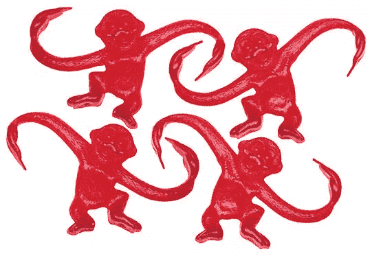
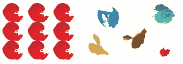
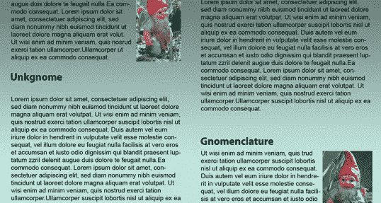
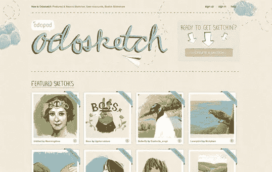

# 设计的统一性

> 原文：<https://www.sitepoint.com/unity-in-design/>

设计理论将统一描述为一个作品中不同元素相互作用的方式。统一的布局是作为一个整体工作，而不是被识别为单独的部分。以下面的猴子为例。它们相似的形状(更不用说它们相同的颜色)使它们能够被认为是一个群体，而不是四个不同的元素。

尽管如今统一性已经不是什么问题了，但它却是网页设计者一直鄙视 HTML 框架的众多原因之一。重要的是，统一性不仅存在于网页的每个元素中，而且存在于整个网页中——网页本身必须作为一个整体工作。我们可以使用一些方法来实现布局的统一(除了避免框架):**接近**和**重复**。

## 接近度

接近是一个显而易见，但经常被忽视的方法，使一组对象感觉像一个单一的单位。在一个布局中，将对象紧密地放置在一起，可以创建一个焦点，吸引眼球。看看下面的数码画。虽然由看似随机的笔画组合而成，但彼此最接近的五个笔画似乎形成了一个统一的对象。

当我们开始为元素设置边距和填充时，我们在 Web 上实践了邻近性的概念。例如，当我为网站定义 <acronym title="Cascading Style Sheets">CSS</acronym> 样式规则时，我通常会更改常见的 <acronym title="HyperText Markup Language">HTML</acronym> 元素之间的默认边距，如标题(`h1`、`h2`、`h3`……)、段落、块引号，甚至图像。通过改变这些值，我可以使元素之间出现更多或更少的空间，从而创建组。

如果你看下面的两列文字，你会发现它们看起来很相似。唯一的区别是标题的位置。在左边的列中，单词“Unkgnome”与顶部和底部段落的距离相等。结果是它看起来更像一个分隔符，而不是下一段的标题。在第二列中,“Gnomenclature”标题被放置在更靠近它后面的段落的位置。根据邻近规则，该标题似乎属于该文本块。

## 重复

一群鹅，一群鱼，一群狮子。任何时候你把一组相似的东西放在一起，它们就形成了一个组。同样，颜色、形状、纹理或类似对象的重复有助于将网页设计结合在一起，使其看起来像一个有凝聚力的单位。下面的图像示例说明了重复。即使存在其他类似的笔画，左手边的九个红色笔画看起来是一个统一的组，因为它们重复了形状、颜色和纹理。该组右侧的笔画没有重复的模式，因此它们看起来是孤立的，即使附近有其他形状。

不管你是否注意到，网站设计中经常使用重复来统一布局元素。这一概念在未修改的 <acronym title="HyperText Markup Language">HTML</acronym> 元素中的一个例子是项目符号列表。每个列表项前面的项目符号是一个视觉指示器，指示项目符号项是整体的一部分。重复的图案和纹理也有助于统一设计。看看 [Odosketch](http://sketch.odopod.com/) 的截图，这是一个由 Odopod 创建的数字画布应用和艺术社区。这种布局包含许多引人注目的元素，但带有“特色”横幅的重复缩略图创建了一个统一的画廊，而粗略的标题元素使用户创建的缩略图适合网站。

## 美丽网页设计的原则

这篇文章来自杰森·比厄德的 [*美丽网页设计的原则*一书](https://www.sitepoint.com/books/design2/ "SitePoint.com: The Principles of Beautiful Web Design, 2nd Edition")(第二版现已出版)。这是第一章的第六部分。

整个色彩章节已经被数字化了，所以如果你更喜欢色彩，请在设计节上点击[查看色彩章节。](https://www.sitepoint.com/design-ux/color/ "DesignFestival.com: Everything on Color")

## 分享这篇文章