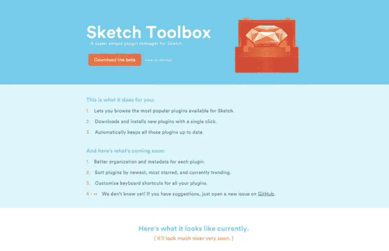
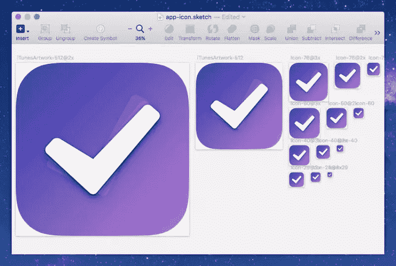
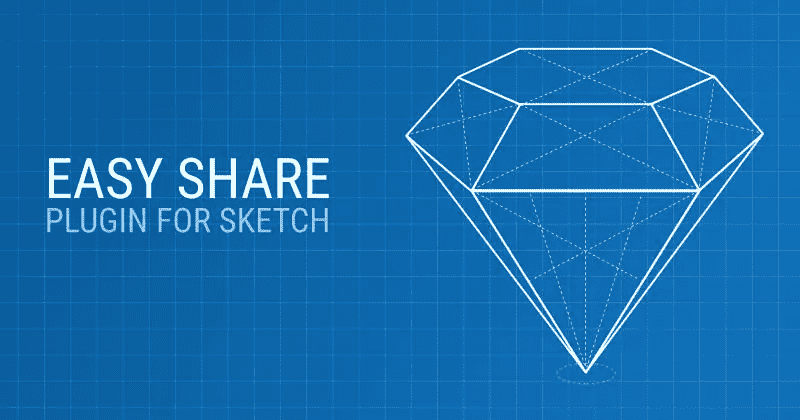
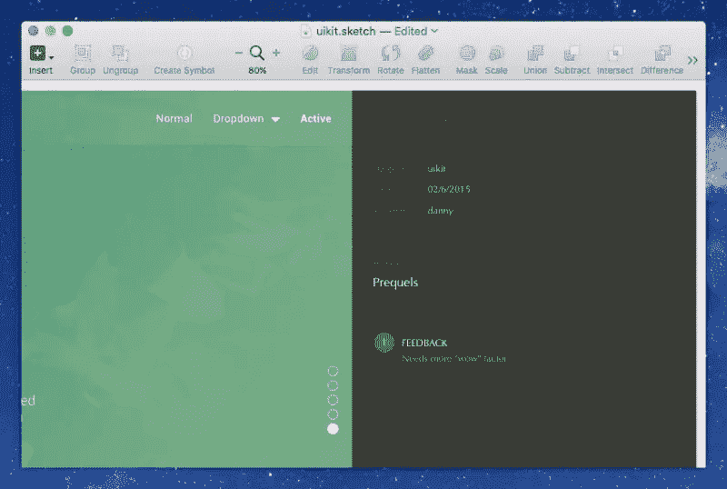

# 7 个神奇的插件来提升你的素描应用能力

> 原文：<https://www.sitepoint.com/unleash-your-sketch-app-powers-with-7-fantastic-plugins/>

有时候我发现自己在想，Sketch App 的核心基础是否可以通过插件功能来改进。使用*sketch App 轻而易举，因为*它的功能很少。

虽然这可能是真的，但这并不意味着我们不能用 Sketch 应用插件来扩展它的有用性。在这篇文章中，我将讨论用 Sketch Toolbox 和一些我日常喜欢的插件来管理插件。先说素描工具箱。

## 使用草图工具箱管理插件

如果你还没有，下载 [Sketch Toolbox](http://sketchtoolbox.com/) ，这是 Shahruz Shauka 创建的一个单独的 Mac 应用程序，用于管理 Sketch 的插件。如果你使用过 Sublime 扩展或者 Atom 包，Sketch Toolbox 应该感觉很熟悉。

它提供了一种令人难以置信的简单方法，可以从它自己管理的令人敬畏的附加组件数据库中安装和卸载 Sketch 插件。

草图工具箱

## 可以显著加快工作流程的插件

这些草图插件中的一些只需要一个键盘快捷键就可以激活，而另一些则需要更多的解释。其中之一是 **AEIconizer** ，它复制你的图标设计画板，并创建多个 iOS 就绪的克隆——这个名字一直让我困惑，但它的有效性非常突出。

在 Photoshop 中设计 iOS 图标时，你可能正在使用*智能对象*。Sketch App 没有那个功能(可能因为会妨碍性能)，所以用 Sketch Toolbox 搜索并安装“AEIconizer”，然后使用 *command+shift+i* ，同时主动聚焦任意大小的正方形画板。我们现在有 14 种不同尺寸的图标设计。

如果您决定对设计进行更改(现在标记为“Icon-Original”)，只需再次运行该键盘快捷键。

漂亮。

AEIconizer

[**Sketch Commands**](https://github.com/bomberstudios/sketch-commands) 是另一个键盘快捷工具，它为 Sketch App 已经丰富的功能添加了大量方便的按键。执行大量的任务，从快速选择到应用复杂的图像效果，只需轻敲几下键盘。

[**内容生成器**](https://github.com/timuric/Content-generator-sketch-plugin) 没有任何关联的快捷方式，但您可以选择一个层(或多个类似的层)，从菜单栏导航到*插件→内容生成器草图插件*，然后从位置、电子邮件地址、姓名、图像、“时间之前”日期和“lorem ipsum”中选择任何内容。

## 与您已经使用的应用程序协作的插件

[脸书折纸](https://github.com/tarngerine/sketch-origami-export)、[松弛](https://github.com/shahruz/Send-to-Slack)、[框架](https://github.com/bomberstudios/sketch-framer)、[泽普林](https://github.com/zeplin/zeplin-sketch-plugin)和[漫威应用](https://marvelapp.com/prototype-with-sketch/)是一些非常知名且广受好评的工具，我们许多设计师都离不开它们，所以这些插件的存在几乎是不可避免的，以帮助弥合这些史诗*主要是*原型工具和草图应用之间的差距。

每一个“助手扩展”都使用一个快捷的方式，将你的设计上传到那些应用程序，而你不用动一根手指。根据您的工作流程，这可能是您一天需要做几次的事情。

脸书折纸、Slack、FramerJS、泽普林和漫威 App

## 快速但高效的插件

[**easy . cc**](http://easier.cc/)并不知名，但就像上面提到的一些应用程序一样，它对于与其他团队成员或客户共享画板很有用。最大的区别是 Easier.cc 根本不需要注册，而是提供一个 24 小时内过期的链接。

这非常简单！

easy . cc

CSS 好友 在这个阶段有点试验性，但对我来说一直很好。如果你真的不喜欢界面(或者你只是有一颗书呆子的心)，你可能会喜欢用代码来设计。按下*命令+shift+a* ，将你的原始 CSS 直接写入对话框，然后观察你的图层变换。

[**复制填充颜色**](https://github.com/poyi/copy-fill-color) 就像 CSS Buddy 的反义词……对于颜色。选择一个层，使用*命令+shift+f* ，该层的十六进制颜色代码将被复制到剪贴板，准备粘贴到您的代码编辑器中。

[**速写笔记本**](https://github.com/marcosvidal/Sketch-Notebook) 是一个单独的键盘快捷键( *command+option+control+9* )，它将为您的画板创建一个侧栏，其中包含您选择的注释。这对于在设计中添加注释非常有用，甚至可以直接在。草图文件本身。

素描笔记本

## 结论

在我在本文中提到的所有精彩的草图应用插件中，只有少数可能对你的特定工作流程有用。然而，这份名单仅仅代表了 Sketch Toolbox 所提供的一小部分——如果你愿意浏览 GitHub，还有更有用、更省时的附加组件。

但是要注意:在使用这些宝石一段时间后，你可能会想没有它们你怎么生活！

## 分享这篇文章