# 启动并运行 Camaleon CMS

> 原文：<https://www.sitepoint.com/up-and-running-with-camaleon-cms/>

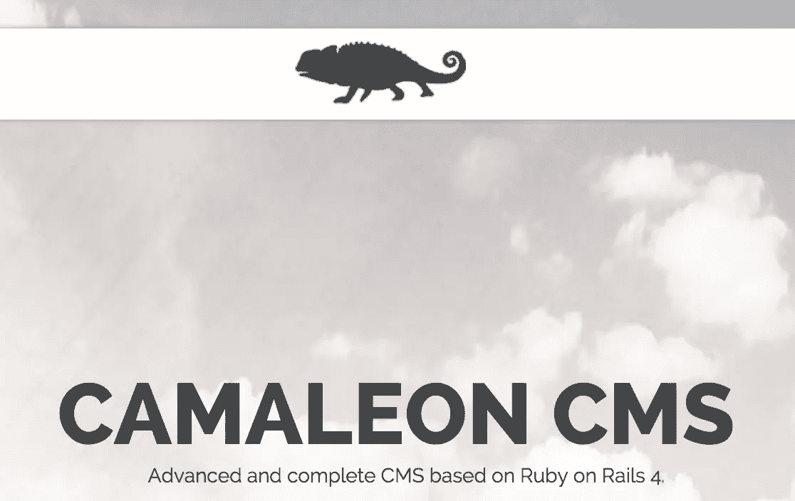

*这篇文章由[弗雷德·希斯](https://www.sitepoint.com/author/fheath)进行了同行评审。感谢 SitePoint 的所有同行评审员使 SitePoint 的内容尽可能做到最好！*

只是另一个内容管理系统？如果这是你脑海中闪过的问题，那就等着看完这篇文章吧。我一直在寻找一个构建在 Ruby on Rails 上的内容管理系统(CMS ),但是像 WordPress 一样。我发现的所有内容管理系统都以不同的方式很棒，但在我发现 Camaleon CMS 之前，没有一个符合这一要求。

### 欢迎来到 Camaleon CMS

根据[Rails carma](http://www.railscarma.com/blog/technical-articles/camaleon-cms/),[cama Leon CMS](https://github.com/owen2345/camaleon-cms)是一款基于 Ruby on Rails 的高级动态语义个人发布 CMS。它允许你在任何有网络连接的地方管理你的网站。Camaleon CMS 是一个模块化、经济高效且可扩展的网站，是一个功能丰富、成熟且编码精良的强大平台，专注于美学、网络标准和可用性。”它是由[欧文·佩雷多·迪亚兹](https://github.com/owen2345)建造和管理的。

### 特点:

*   多站点。
*   多语言:你可以用几种语言管理你的网站内容。
*   管理小部件以嵌入任何地方。
*   安全性:多种安全措施可用于保护您的站点免受各种攻击。
*   SEO & HTML5:自动站点地图生成器、SEO 配置、社交媒体 SEO 和各种设备的内容定制。
*   使用主题轻松定制网站的外观。

说够了，让我们开始工作吧！

## 装置

Camaleon CMS 需要 ImageMagick 才能工作。安装它非常简单，根据您的操作系统，打开您的终端并运行下面的命令:

对于 Mac 用户(安装了[自制软件](http://brew.sh)):

```
brew install imagemagick 
```

对于 Ubuntu 用户:

```
sudo apt-get install imagemagick 
```

Camaleon CMS 需要 Ruby on Rails 4.1+。要检查机器上运行的 Rails 版本，请打开终端并输入命令:

```
rails -v
=> Rails 4.2.1 
```

要安装最新的 [Rails 版本](https://rubygems.org/gems/rails)，打开终端并输入:

```
gem install rails 
```

这将安装 Rails 及其依赖项。在撰写本文时，最新的 Rails 版本是 4.2.4。在本教程中，我们将学习如何使用 Camaleon CMS 建立一个博客。

从您的终端创建一个新的 Rails 项目，并导航到它的主目录:

```
rails new rubyblog
cd rubyblog 
```

使用文本编辑器打开**gem 文件**,并添加 Camaleon CMS gem:

```
gem 'camaleon_cms' 
```

运行捆绑包安装:

```
bundle install 
```

幸运的是，Camaleon 配备了一些方便的发电机。让我们用它们来安装 CMS。从您的终端类型:

```
rails generate camaleon_cms:install 
```

这将复制一些基本的模板和插件到你的项目中。您可以按照终端上显示的路径来查看创建了什么。

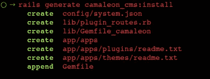

从终端输出中，您会注意到一些东西被添加到了 Gemfile 中。宝石有它自己的依赖。打开 **lib/Gemfile_camaleon** 文件查看宝石。回到您的 gem 文件，您将看到附加的内容:

```
#################### Camaleon CMS include all gems for plugins and themes ####################
require './lib/plugin_routes'
instance_eval(PluginRoutes.draw_gems) 
```

安装 gems 并迁移数据库:

```
bundle install
rake db:migrate 
```

启动您的服务器(`rails s`)并通过浏览器中的`http://localhost:3000`查看博客。

## 常规设置和自定义

您将看到一个快速设置页面。输入您的博客名称并选择一个主题。提供了三个主题，选择一个并点击提交。


### 用户设置

Camaleon CMS 提供默认用户名和密码(`admin/admin`)来登录管理仪表板。我们需要改变这种情况。登录您的仪表板。点击屏幕左侧显示的用户图像右侧的图标，如下所示。

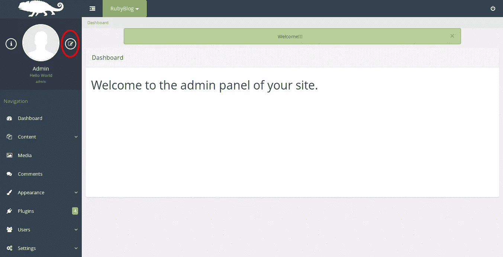

向下滚动到页面底部，选择`Change Password`。在显示的表单中输入您的旧密码(应该是`admin`)和新密码。选择`Process`，会弹出一个对话框显示你的密码已经更新。

在此面板中，您可以根据需要编辑用户配置文件。完成后，注销并登录以查看密码是否成功更改。你可以点击屏幕右上角的图标退出，然后在弹出的对话框中选择`Yes`。如果您更改了`admin`的用户名，请输入新用户名和新密码登录您的仪表板。

Camaleon CMS 允许您添加更多具有不同角色的用户，如管理员、客户、贡献者和编辑。这很容易做到。点击仪表板左侧的**用户**。从下拉菜单中选择**添加用户**。在显示的面板中，您可以在设置好配置文件后随意创建用户:

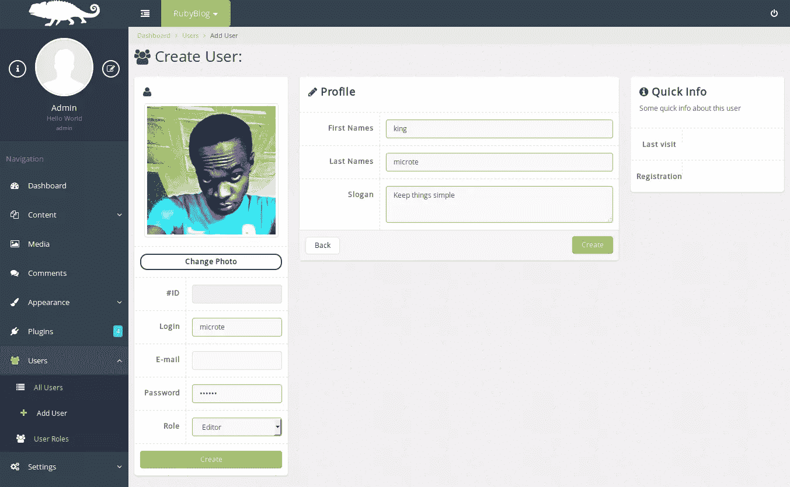

您还可以通过编辑角色的操作来控制用户可以执行的操作。为此，点击仪表板左侧**用户**下的**用户角色**。还可以添加和删除用户角色。

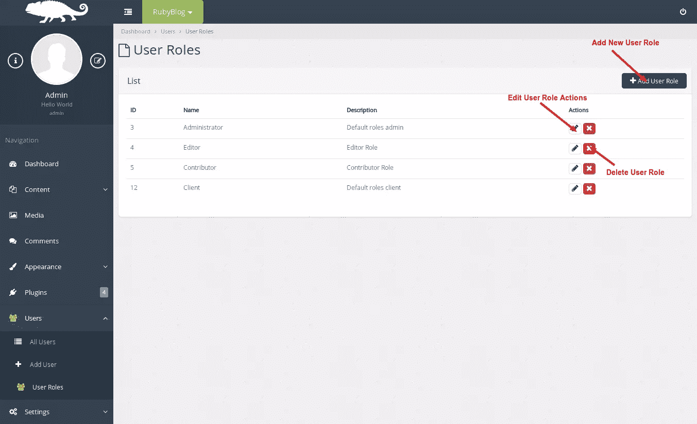

### 更改网站语言

如上所述，Camaleon CMS 的一个特性是能够管理各种语言的网站内容。让我们看看这是如何可能的。

在仪表板的左侧点击`Settings`，从下拉列表中选择`Languages`。在下一页上，为您的博客选择任意语言:

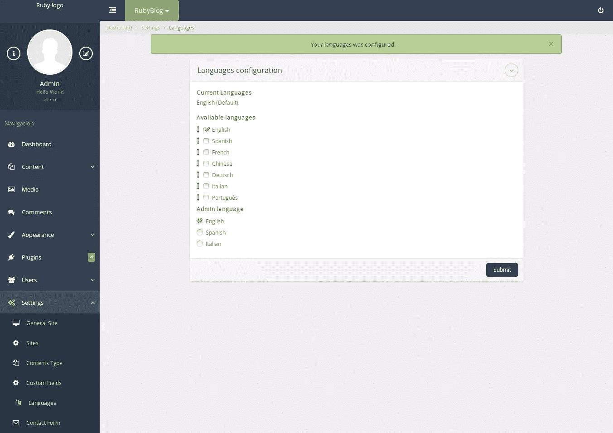

## 发布内容

### 创建帖子

当你想到博客时，你会想到帖子。要创建帖子，请在您的仪表板左侧选择`Content > Post > Add New`。

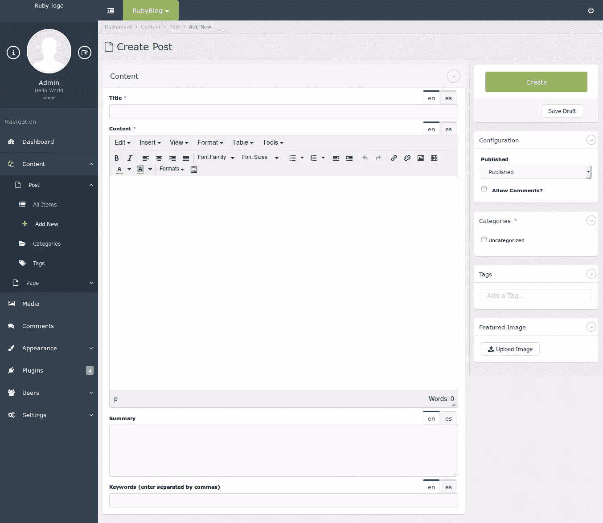

在顶部字段中，插入标题。在标题下面的大区域写下你的文章。使用格式按钮来自定义您的帖子:

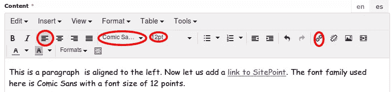

要添加图像，将光标放在想要放置图像的文本上，点击内容工具栏上的 ***插入/编辑图像*** ，如下图所示:

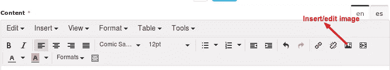

在弹出的对话框中，在`Source`字段中输入图像的链接或点击旁边的`search icon`上传图像。

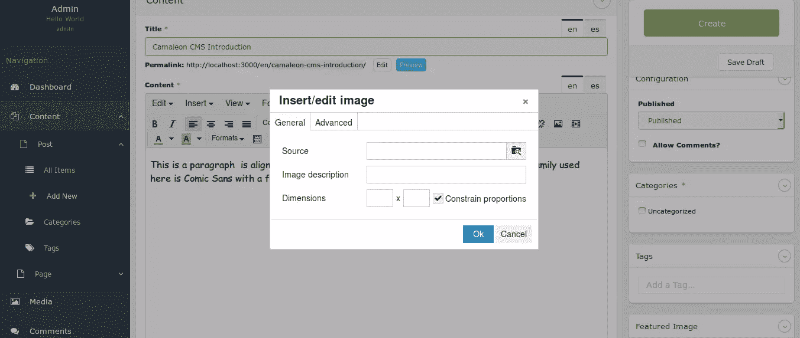

如果你点击了搜索图标，媒体管理器就会打开，让你把图片导入到你的文章中。

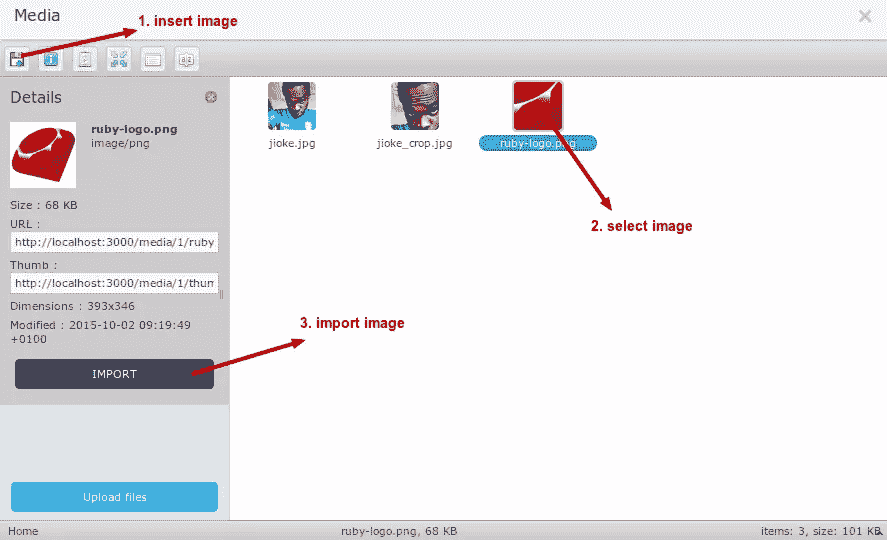

点击下一个框上的 ***确定*** 。您可以随时点击内容工具栏上的 ***插入/编辑图像*** 来编辑您的图像。

要插入分页符，请将光标放在需要分页符的位置。在内容工具栏上，将鼠标悬停在 ***上，插入*** ，并从下拉列表中选择 ***分页符*** 。

### 创建新页面

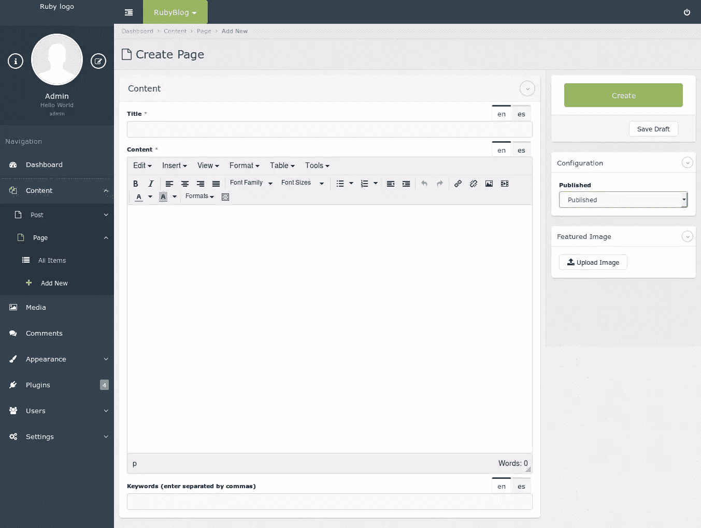

Camaleon CMS 自带创建页面的内置支持。在您的仪表板上，点击屏幕左侧的`Pages`。从下拉菜单中点击`Add New`。当你想添加新页面时，你会看到一个类似 WordPress 的页面。在文本字段中输入详细信息，然后点击`Create Page`。您可以使用屏幕右侧显示的`Featured Image`选项将图像上传到您的页面。配置选项允许您选择是否希望页面立即发布。

### 创建类别

类别是组织文章的一种便捷方式。它们提供了很大的灵活性来显示你想要的帖子，以你想要的方式。

要创建新类别，请点击`Content > Post > Categories`。在页面的左侧，有一个允许您创建类别的选项卡。填写类别名称、slug(将在类别 URL 中使用)、描述(这是可选的)并点击**提交**按钮。

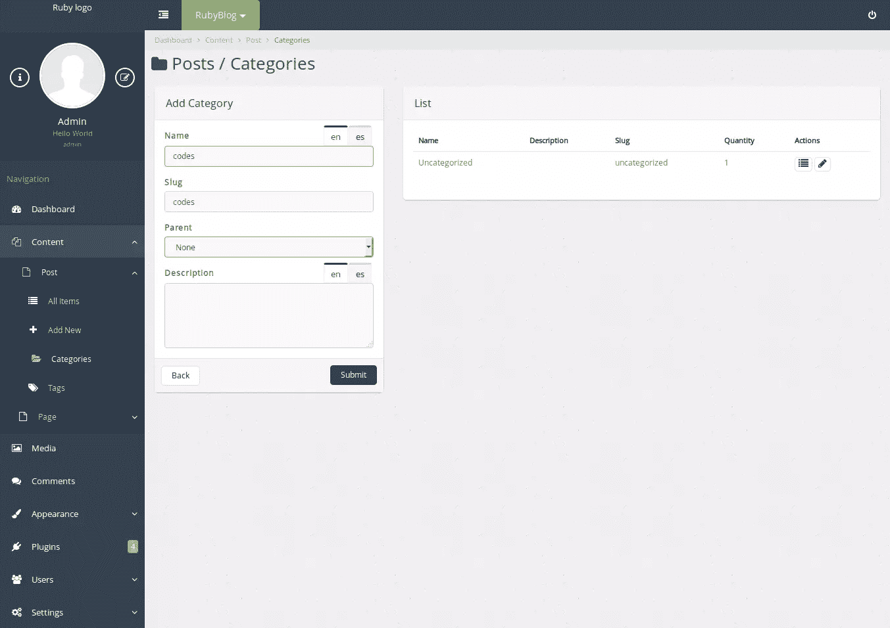

**给职位分配类别**

一旦创建了类别结构，您就可以将文章添加到类别中。点击`Content > Post > Add New`创建一篇新文章，只需选择文章的类别。


### 创建菜单

菜单是常见链接的列表，通常显示为站点的主要导航。

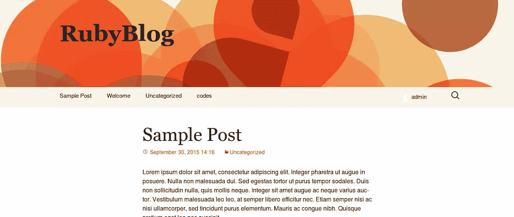

要创建自定义菜单，点击`Appearance`，从下拉选项中点击`Menus`。默认情况下，会为您创建一个菜单:**主菜单**。要更改**主菜单**的名称，请在文本框中输入您喜欢的名称，然后点击**更新菜单**。

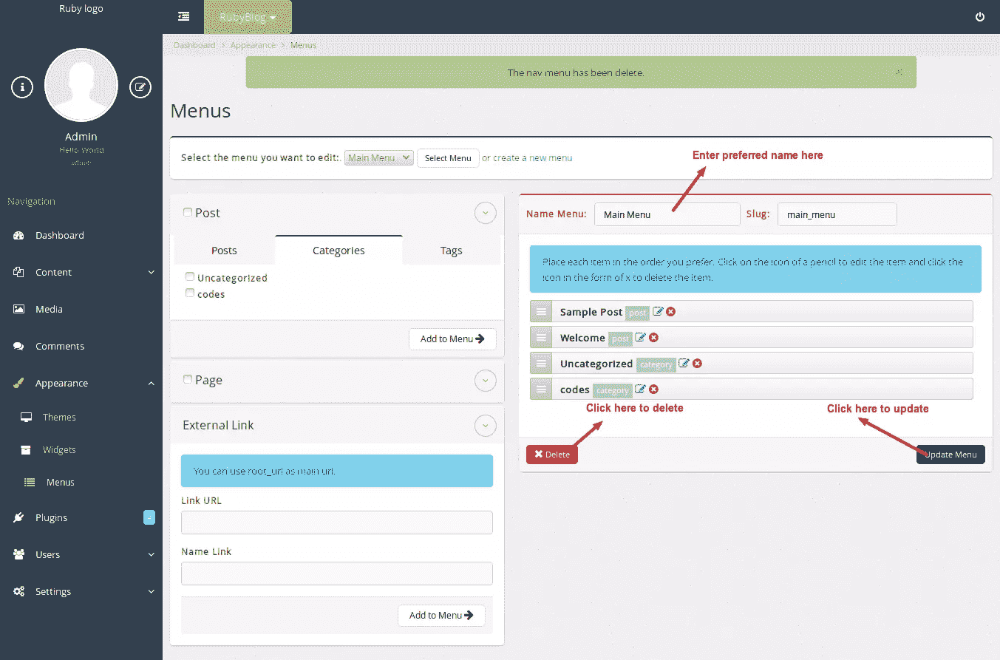

可以在你的菜单中添加页面、文章、类别、标签和外部链接。首先，您必须已经创建并发布了该项目。在上图中，请注意帖子、类别和选项卡。当您想在菜单中添加一个时:

*   选择要添加的部分(类别、页面、文章、标签、外部链接)。
*   勾选左边的方框。
*   点击**添加到菜单**。
*   点击**更新菜单**。

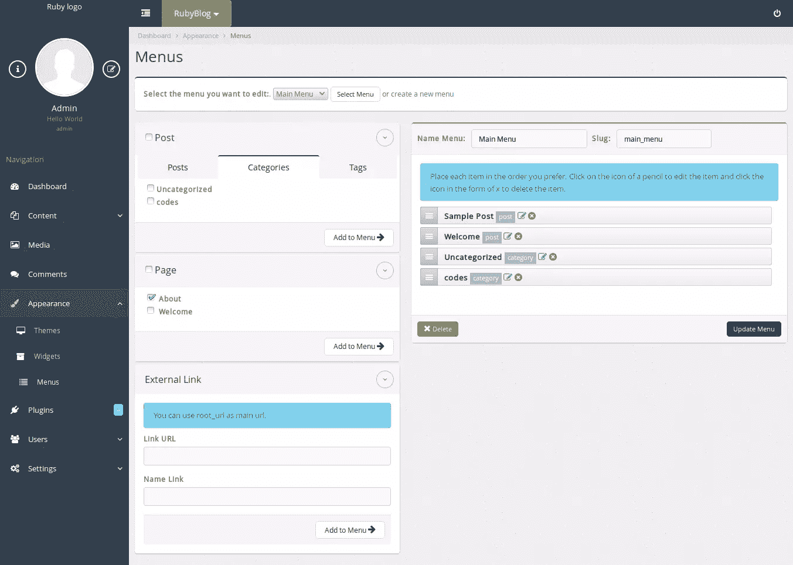

## 部署到 Heroku

让我们将我们的博客部署到 Heroku。将以下内容添加到您的 gem 文件中:

***Gemfile***

```
group :production do
  gem 'pg', '~> 0.18.3'
  gem 'rails_12factor', '~> 0.0.3'
  gem 'puma', '~> 2.14.0'
end 
```

运行`bundle install`。

在您的 **config** 目录中为 Puma 创建一个文件，并将下面的配置粘贴到其中:

***config/puma . Rb***

```
workers Integer(ENV['WEB_CONCURRENCY'] || 2)
threads_count = Integer(ENV['MAX_THREADS'] || 5)
threads threads_count, threads_count

preload_app!

rackup      DefaultRackup
port        ENV['PORT']     || 3000
environment ENV['RACK_ENV'] || 'development'

on_worker_boot do
  # Worker specific setup for Rails 4.1+
  # See: https://devcenter.heroku.com/articles/
  # deploying-rails-applications-with-the-puma-web-server#on-worker-boot
  ActiveRecord::Base.establish_connection
end 
```

为了发布到 Heroku，我们需要我们的站点在 git 源代码控制下。初始化存储库并添加文件:

```
git init
git add .
git commit -m "initial commit" 
```

如果你在 Heroku 上还没有账户，去[创建一个](http://api.heroku.com/signup)。然后检查您的系统是否已经安装了 Heroku 命令行客户端:

```
heroku version 
```

如果没有，可以在这里获得 Heroku toolbelt [。安装工具带后，登录并添加您的 SSH 密钥:](https://toolbelt.heroku.com)

```
heroku login
heroku keys:add 
```

接下来，使用`heroku create`命令在 Heroku 上创建一个应用程序:

```
heroku create 
```

通过将主分支推送到 Heroku 来部署应用程序:

```
git push heroku master 
```

最后运行数据库迁移:

```
heroku run db:migrate 
```

在 [nerdnoob](http://nerdnoob.herokuapp.com) 有一个演示应用程序(您的 heroku 应用程序名称会有所不同)。仪表板可在 [nerdnoob 仪表板](http://nerdnoob.herokuapp.com/admin)处获得。您可以使用以下详细信息登录:

```
username: admin
password: admin 
```

你的应用程序现在应该是活动的。

## 结论

随着时间的推移，Rails 的世界已经成为了几个 CMS 框架的家园。Camaleon CMS 是一个可靠的补充，它的插件框架和主题，它可以做你想做的任何事情。今天，我向你展示了如何使用 Camaleon CMS 建立一个简单而实用的博客。欢迎您的反馈。谢谢你陪我到最后:)

## 分享这篇文章