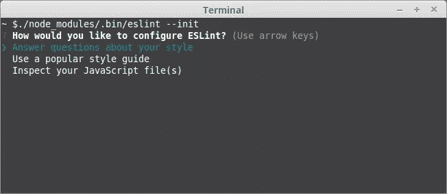
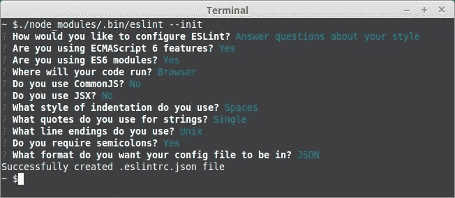
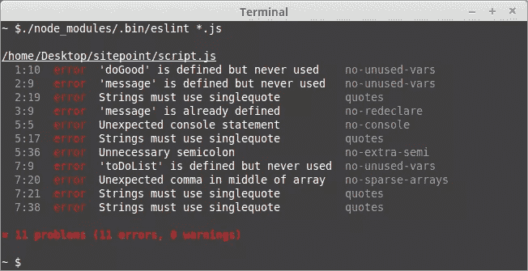

# 启动并运行 ESLint——可插入的 JavaScript Linter

> 原文：<https://www.sitepoint.com/up-and-running-with-eslint-the-pluggable-javascript-linter/>


这篇文章由 Tim Severien 进行了同行评审。感谢 SitePoint 的所有同行评审员使 SitePoint 的内容尽可能做到最好！

“林挺”这个词你听起来熟悉吗？这是一个使用工具自动检查代码潜在问题的过程。使用这样的工具有几个主要的好处。

*   保持代码风格的一致性。 Linters 允许你检查你的代码风格，比如间距、缩进和括号的位置。一旦您的团队就编码风格达成一致，就可以将其记录在配置文件中并自动检查。
*   发现潜在的错误和不良模式。 Linters 还可以用于执行更高级的检查，以发现可能的错误，如重复的变量、不可达的代码或无效的正则表达式。来自 linter 的警告将允许您在错误到达运行时之前修复它们。
*   加强质量。当你在项目中遵循某种[风格指南](https://www.sitepoint.com/why-use-javascript-style-guide/)时，重要的是用明面强制执行，否则总会有人忍不住偷工减料。如果一个林挺工具被连接到您的构建过程中，如果有未修复的错误，您可以简单地阻止项目开始或者提交到您的存储库中。
*   **节省时间。**来自前三个的主要好处是 linters 在开发过程中节省了您的精力。你将不再需要花费宝贵的时间与你的同事争论一个错位的支架，你可能会在早期发现一两个 bug。

已经有一篇关于 JavaScript 的可用 linters 的文章，但是今天我们将关注作者提到的工具之一——ESLint。

## 埃斯林特

ESLint 是 Nicholas C. Zakas 在 2013 年创建的林挺工具，是目前 JavaScript 可用的最强大和可扩展的 linter。它提供了丰富的功能，使其成为您的下一个林挺工具的理想选择。这些功能包括:

*   众多的规则，可以额外配置你的口味。
*   创建你自己的规则的 API。
*   针对特定库、框架和实践的规则的众多插件。
*   内置对 ES6、ES7 和 JSX 的支持。
*   推荐的一组规则以及第三方配置可帮助您快速入门。
*   可以集成多个编辑器和 ide，如 Sublime、Vim、JetBrains 产品和 Visual Studio 代码。

## 设置项目

在您自己的现有项目中实现 ESLint 之前，明智的做法是在一些简单的项目上进行试运行。让我们建立一个测试项目，作为进一步探索的平台。它只有一个 JavaScript 文件、所需的 npm 模块和几个 npm 命令来运行 linter。

首先，我们将生成一个 npm 项目(如果你不确定安装或使用 npm，请参见[本教程](https://www.sitepoint.com/beginners-guide-node-package-manager/))。创建一个新文件夹，在终端中打开并运行`npm init`。您将被提示输入一些关于您的项目的信息，一旦您回答了所有的问题，npm 将在同一个文件夹中生成一个新的`package.json`文件。

一旦我们完成了 npm，我们还需要一个 JavaScript 文件来 lint。让我们创建一个名为`scripts.js`的文件，并在其中保存一些代码:

```
function doGood() {
    var message = "doing good!";
    var message = 'or am i?';

    console.log("doing something");;

    var toDoList = ["List",,'things',"to do"];
} 
```

你不需要 linter 就能发现代码中的一些问题。但是，嘿，我们不想听你或我说，而是想听 ESLint 自己说。

## 安装和配置

要安装 ESLint，你需要做的就是从你的项目文件夹里面运行`npm i eslint --save-dev`。我们可以在全球范围内安装 ESLint，但我坚信每个项目都应该捆绑自己的依赖项，以确保每个从事该项目的开发人员都使用相同的工具。

一旦安装了 ESLint，我们需要在第一次运行它之前对它进行配置。这可以通过运行带有`--init`标志的 ESLint 来方便地完成。因为我们没有在全球范围内安装 ESLint，所以该命令将如下所示:

```
./node_modules/.bin/eslint --init 
```

此命令将启动配置向导。向导将为您提供三种创建配置的方法:



*   选择**回答关于您的风格的问题**将要求您回答一些关于您的项目设置的问题，例如您的目标环境、ECMAScript 版本、模块、CommonJS 或 JSX 的用法以及一些风格偏好。这是用一组最少的推荐规则建立项目的快速方法。
*   选择**使用流行风格指南**将允许您根据谷歌、Airbnb 和其他公司的流行风格指南进行配置。如果你已经遵循或计划基于这些风格指南中的一个，那么这个选项很有效
*   **检查您的 JavaScript 文件**将尝试从您现有的代码库中导出林挺规则。当您已经有了不想更改的现有代码库时，这种方法很有效。

由于我们刚刚开始一个新项目，让我们选择第一个选项并注册最新的 ECMAScript 功能:



最后一个问题将允许您选择配置文件的格式。选项有 JSON、YAML 和 JavaScript，但我们会选择 JSON，因为它可能是大家最熟悉的。

回答完所有问题后，ESLint 将生成一个包含以下内容的`.eslint.json`文件:

```
{
    "env": {
        "browser": true,
        "es6": true
    },
    "extends": "eslint:recommended",
    "parserOptions": {
        "sourceType": "module"
    },
    "rules": {
        "indent": [
            "error",
            4
        ],
        "linebreak-style": [
            "error",
            "unix"
        ],
        "quotes": [
            "error",
            "single"
        ],
        "semi": [
            "error",
            "always"
        ]
    }
} 
```

如您所见，它包含一些环境配置以及它询问您的规则。`extends`属性被设置为`eslint:recommended`,这意味着 ESLint 将使用它自己的推荐规则集作为基础，您可以在以后覆盖它。出于演示目的，我们将保留它，但是以后您可以删除它，或者用不同的第三方规则集替换它。

## 运行 ESLint

现在我们已经有了一个基本的配置，让我们试着运行这个东西，看看它是否工作。

要运行 ESLint，我们可以使用以下命令，该命令将 Lint 项目根文件夹中的所有`.js`文件:

```
./node_modules/.bin/eslint *.js 
```

为了避免在终端中重复输入，我们可以将其保存为 npm 脚本。打开`package.json`，在`test`旁边添加另一个脚本。

```
"scripts": {
    "test": "echo \"Error: no test specified\" && exit 1",
    "lint": "eslint *.js"
}, 
```

请注意，我们不需要将完整路径写到`./node_modules/.bin`，因为当运行 npm 脚本时，该文件夹会自动添加到 path 中。

我们现在可以使用

```
npm run lint 
```

去试试吧。您应该会在`scripts.js`中看到一个错误报告，警告我们各种问题:



当节点脚本本身报告错误时，不要担心，这是应该发生的，因为 ESLint 返回了一个非零的退出代码。如果需要，可以通过在脚本中添加`exit 0`来抑制这种情况(正如这里讨论的)。

在推荐的规则集中，只有部分规则被启用。有更多的可用。

## 规则概述

ESLint 有超过 100 条规则。我们不会一一列举，因为列表实在太多了。我们将带您浏览一些更常见的方法，让您了解 ESLint 的能力。

您可以通过在配置文件的`rules`属性下列出这些规则来启用它们。每个规则都可以被设置为特定的严重性:`0`(或`off`)禁用规则，`1`或(`warn`)发出警告，`2`(或`error`)触发错误。一些规则，比如我们配置文件中的规则，可以接受一个数组，将 severity 作为第一个元素，后面跟着其他选项。如果您不确定特定规则支持哪些值，请查阅文档。0

### 文体规则

有些规则非常简单，只是用来实施特定的代码风格:

*   [块间距](http://eslint.org/docs/rules/block-spacing)–强制代码块内的空格`{ ... }`；
*   [逗号悬挂](http://eslint.org/docs/rules/comma-dangle)–要求或禁止在数组或对象中悬挂逗号；
*   [eol-last](http://eslint.org/docs/rules/eol-last)–在每个文件的末尾强制换行。

只要整个团队都同意，你如何配置这些规则并不重要。

### 最佳实践

有许多规则涵盖了被认为是改进源代码的指导方针，并在开发人员社区中受到好评。一些有趣的提及是:

*   [复杂度](http://eslint.org/docs/rules/complexity)–您的源中允许的最大圈复杂度阈值；
*   [默认情况](http://eslint.org/docs/rules/default-case)——在你的`switch`语句中总是需要一个`default`块；
*   [eqeqeq](http://eslint.org/docs/rules/eqeqeq)–要求使用严格的比较运算符:`===`和`!==`；
*   [无隐式强制](http://eslint.org/docs/rules/no-implicit-coercion)–不允许隐式类型转换方法，如`!!false`或`+'2'`；
*   [无幻数](http://eslint.org/docs/rules/no-magic-numbers)–禁止使用“幻数”:出现在代码中但没有相关标识符的数字；
*   [yoda](http://eslint.org/docs/rules/yoda)–要求或不允许“Yoda”条件语句；
*   [无阴影](http://eslint.org/docs/rules/no-shadow)–不允许“隐藏”变量:声明与父作用域中现有变量同名的变量。

尽管这些规则中的一些在某些情况下可能有例外，但它们通常被认为是有益的，并建议予以考虑。

### 潜在错误

另一组规则帮助您避免编写过于复杂或可能导致错误的代码。当然，它不能保证您的应用程序没有错误或逻辑缺陷，但它至少会帮助您避免常见的陷阱。一些例子是:

*   [no-cond-assign](http://eslint.org/docs/rules/no-cond-assign)–禁止条件语句中的赋值；
*   [no-dupe-args](http://eslint.org/docs/rules/no-dupe-args)–不允许函数声明中出现重复的参数；
*   [no-inner-declarations](http://eslint.org/docs/rules/no-inner-declarations)–禁止嵌套块中的函数 ar 变量声明；
*   no-invalid-regexp–检查您的正则表达式是否有效；
*   [no-unreachable](http://eslint.org/docs/rules/no-unreachable)–检查`return`、`throw`、`continue`或`break`语句后是否有不可达代码。

### ECMAScript 6

还有另一组规则，由特定于 ECMAScript 6 标准的检查组成。如果你喜欢使用最新的功能，你可能会觉得这些很有趣。几个例子是:

*   [构造函数-超级](http://eslint.org/docs/rules/constructor-super)–需要在构造函数中调用`super()`；
*   [no-dupe-class-members](http://eslint.org/docs/rules/no-dupe-class-members)-检查重复的类成员；
*   [no-var](http://eslint.org/docs/rules/no-var)–需要`let`或`const`而不是`var`。

还有许多其他的规则需要探索，所以我们建议你在完成这篇文章后，自己查看一下完整的列表。

## 在不同的环境中运行

当我们最初配置 ESLint 时，我们期望我们的代码在浏览器中运行。但是假设我们也想在 Node.js 环境中使用它。例如，我们希望通过向示例中添加以下代码片段来使用 Node 的`module.exports`功能:

```
if (module && module.exports) {
    module.exports = doGood;
} 
```

再次运行 linter 将导致出现新的错误:

```
10:5   error  'module' is not defined               no-undef
10:15  error  'module' is not defined               no-undef
11:5   error  'module' is not defined               no-undef 
```

这是因为 linter 不希望特定于节点的变量出现在代码中。要解决这个问题，我们可以指示它了解节点环境:

```
"env": {
    "browser": true,
    "es6": true,
    "node": true
}, 
```

如果你再次运行棉绒，它会像魔咒一样工作。还有一小组特定于节点环境的[规则。](http://eslint.org/docs/rules/#nodejs-and-commonjs)

## 配置注释

有时有必要从源代码内部覆盖配置。这可能发生在不同的情况下。例如，如果您的代码包含一个不符合您的编码标准的第三方库的副本。或者您有一段特定的代码，它必须是通用规则的例外。您可以在源代码中使用特殊注释来实现这一点。

想象一下，我们想要禁用函数中的`no-sparse-arrays`规则。我们可以通过向该行添加以下注释来实现这一点:

```
var toDoList = ["List",,"things","to do"]; // eslint-disable-line no-sparse-arrays 
```

如果我们想抑制函数的所有错误，我们可以将它包装到一个`eslint-disable/eslint-enable`块中。

```
/* eslint-disable */
function doGood() {
    var message = "doing good!";
    var message = "or am i?";

    console.log("doing something");

    var toDoList = ["List",,"things","to do"]; // eslint-disable-line no-sparse-arrays
}
/* eslint-enable */ 
```

或者，要禁用整个文件的林挺，我们可以只在文件的开头添加一个单独的`/* eslint-disable */`注释。

尽管有这种覆盖的有效案例，但不要让异常成为常态。你仍然应该致力于修复错误，而不是压制它们。

## 自动纠错

ESLint 有一个有趣的能力，可以自动修复它发现的一些错误。可以自动修复代码的规则在整个[规则列表](http://eslint.org/docs/rules/)中用扳手图标标出。目前，这些规则大部分都是纯粹的文体。让我们试着通过自动校正来运行我们的初始示例。为此，将`--fix`标志添加到我们用来运行 ESLint 的命令中:

```
./node_modules/.bin/eslint *.js --fix 
```

下面是我们的示例在修复了一些错误后的样子:

```
function doGood() {
    var message = 'doing good!';
    var message = 'or am i?';

    console.log('doing something');

    var toDoList = ['List',,'things','to do'];
} 
```

如您所见，它已经成功地将所有的引号改为单引号，并删除了多余的分号。这是一个有用的特性，但是要小心使用。在某些情况下，已知会破坏代码的格式。在提交更改之前，请始终检查它已经执行的更改。

## 创建自定义规则

如果您觉得可用的内置和第三方规则不能满足您的所有需求，那么您可以考虑编写自己的规则。ESLint 提供了一个 API，允许您创建自定义规则。这个主题技术性更强，需要对 JavaScript、Node 有更深入的了解，并对解析器有基本的了解，因此值得单独撰写一篇文章。一般的想法是每个规则包含两件事:元信息，比如名称和描述，以及实际的实现。该规则实现为一个包含一组回调的对象，当 ESLint 遍历 JavaScript 代码的抽象语法树以提供对当前节点的访问时调用这些回调。这本质上是“访问者”模式的一种实现。ESLint 开发者指南提供了更多关于如何实现你自己的规则的细节和例子。

## 最后

希望这篇文章能让你了解在你的项目中设置 ESLint 是多么简单，它能极大地改善你的工作过程。如果你意识到你的项目需要这样做，我建议你尽快尝试一下。你越早采用这个工具，你将获得越大的好处。从推荐的一组规则开始，慢慢地为您的特定工作流程调整规则。终有一天，ESLint 会成为您值得信赖的合作伙伴，成为任何项目的重要组成部分。

你在用 ESLint 吗？如果没有，你会考虑试一试吗？请在下面的评论中告诉我。

## 分享这篇文章