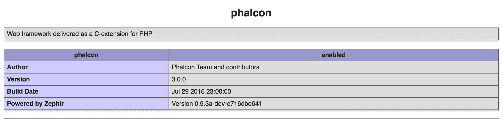

# 在 5 分钟内在 PHP7 上运行最快的 PHP 框架

> 原文：<https://www.sitepoint.com/up-and-running-with-the-fastest-php-framework-on-php7-in-5-mins/>

你可能还记得我们过去对最快的 PHP 框架 Phalcon 的迷恋。

在本帖中，我们将在 5 分钟内完成我们的一个[家园改进版](https://www.sitepoint.com/quick-tip-get-homestead-vagrant-vm-running/)实例的启动和运行过程。如果你对为什么或什么是 Phalcon 不感兴趣，直接跳到“设置它”。


## 概述

如果你不熟悉它，Phalcon 是一个用 Zephir 编写的 PHP 框架，这是一种介于 C 和 PHP 之间的语言，有助于开发 PHP 扩展，而无需了解 C。它是一个黄金中间地带，让 PHP 开发人员为他们的编程语言环境开发高度优化的模块，而无需学习一种全新的语言，因为 Zephir 编译成 C，这是 PHP 扩展的组成部分。

最初，Phalcon 是用纯 C 编写的扩展——这使得它非常快。然而，这也带来了巨大的开销，比如修复 bug，或者当某些东西不能正常工作时，检查到底发生了什么。添加新功能也花了很长时间，因为用 C 开发要困难得多。在版本 2 中，Phalcon 在 Zephir 中被重写，但随着 PHP 7 的出现，并宣布与 PHP 5+的扩展 API 的戏剧性背离，Zephir 无法将代码编译成 PHP 7 兼容的扩展，并被留在了 PHP 5 的土地上。

我们试着在这里游走，我们的军火库里已经没有更多的空间给 Phalcon 了。随着我们的 [Homestead 改进的](https://www.sitepoint.com/quick-tip-get-homestead-vagrant-vm-running/) box 开始运行并为我们所有的教程提供动力，随着 PHP 7 的性能进步弥补了 Phalcon 在 PHP 5 时代可能提供的任何速度增益，安装 Phalcon 的成本无论如何都不再值得了。

最近，事情发生了变化:[费尔康 3.0 LTS](https://blog.phalconphp.com/post/phalcon-3-0-0-released) 。

除了从现在开始遵循 Semver，在未来 3 年支持 3.0 版本，以及你可以在帖子中读到的各种新功能和变化，到目前为止最大的更新是 Zephir 现在支持 PHP 7，不仅允许编译 Phalcon，还允许将任何其他 Zephir 代码编译成 PHP 7。现在，您可以轻松地将您的自定义扩展移植到 Zephir，并在瞬间将它们编译成 PHP 7。编译后的框架与 PHP 7 的性能增益相结合，在速度和资源节约方面提供了无与伦比的优势。

## 设置它

我们现在将在 PHP 7 驱动的 [Homestead 改进的](https://www.sitepoint.com/quick-tip-get-homestead-vagrant-vm-running/)实例上完成设置 Phalcon 3 的过程。你可以使用任何你觉得舒服的环境，但是下面的说明将会针对一个安装了 PHP 7+的 Ubuntu 16.04 实例，以及 Git 和 Wget 之类的东西。我们还将通过`Homestead.yaml`文件使用 [Homestead 改进的](https://www.sitepoint.com/quick-tip-get-homestead-vagrant-vm-running/)方式定义新站点。

### 安装 Phalcon

```
sudo apt-get install software-properties-common
sudo apt-add-repository ppa:phalcon/stable
sudo apt-get update
sudo apt-get install php7.0-phalcon
sudo phpenmod -v 7.0 -s ALL phalcon
sudo service php7.0-fpm restart 
```

倒数第二个命令是启用 PHP 扩展的快捷命令。`-v`标志告诉它激活哪个 PHP 版本(这里我们只想要 7.0)和哪个 SAPI(命令行，FPM，或者两者都要——我们都想要)。

如果您的系统上没有这个工具，那么只需将`ini`文件复制到 extensions 文件夹中，如下所示:

```
sudo cp /etc/php/7.0/mods-available/phalcon.ini /etc/php/7.0/fpm/conf.d/20-phalcon.ini
sudo cp /etc/php/7.0/mods-available/phalcon.ini /etc/php/7.0/cli/conf.d/20-phalcon.ini 
```

前缀`20`表示*优先级*，以防某些扩展需要在其他扩展之前加载。这里的情况不是这样。

我们现在已经*释放了野兽*。看着`phpinfo()`，就在那里。



## 演示 Phalcon 应用程序

我们可以在一个演示的 Phalcon 应用程序上进行测试——完成的 [Invo 应用程序](https://github.com/phalcon/invo)。

### 为 Phalcon 配置 Nginx

我们需要将我们的应用程序添加到`Homestead.yaml`的`Sites`块中:

```
 - map: phalcon-tut.app
      to: /home/vagrant/Code/phalcon-tut/public 
```

确保将`phalcon-tut.app`或您选择的任何 vhost 名称添加到您的主机操作系统`/etc/hosts`文件中，以便解析为虚拟机的 IP 地址。

当然，为了应用这个 Nginx 设置，我们还需要在 VM 之外运行`vagrant provision`。

最后，我们编辑 Nginx 的`location`块，并将

```
location / {
        try_files $uri $uri/ /index.php?$query_string;
    } 
```

到

```
location / {
        try_files $uri $uri/ /index.php?_url=$uri&$args;
    } 
```

我们需要重启 Nginx 来应用更改:

```
sudo service nginx restart 
```

这负责服务器端的事情。

### 引导应用程序

```
cd /home/vagrant/Code
git clone https://github.com/phalcon/invo phalcon-tut 
```

一旦应用程序被克隆，我们需要初始化它的数据库，按照[指令](https://github.com/phalcon/invo)。我们将通过使用`utf8mb4`而不是`utf8`来更新它们，使它们更现代一些。

```
echo 'CREATE DATABASE invo CHARSET=utf8mb4 COLLATE=utf8mb4_unicode_ci' | mysql -u homestead -psecret
cat schemas/invo.sql | mysql -u homestead -psecret invo 
```

还有一个步骤没有在应用程序的报告中描述——在配置中更改 baseUri。我们必须进入`app/config/config.ini`并将`baseUri`改为`/`，否则资产(JS/CSS)将无法加载。

在这样做之后，INVO 肯定已经开始运行了。


## 结论

在本教程中，我们快速配置了 Phalcon，使其运行在经过改进的和 PHP 7 上，并获得了一个演示应用程序。与以前相比，安装说明大大简化了，并且有现成的应用程序可以彻底测试，为什么不进行一次 Phalcon 测试并告诉我们您的想法呢？

现在 Phalcon 已经可以在 PHP 7 上使用了，你会在你的新项目中使用它吗？你对 Zephir 有什么看法——你会用它来关闭或超级优化你的任何微服务/模块吗，或者你仍然觉得它开销太大？

## 分享这篇文章