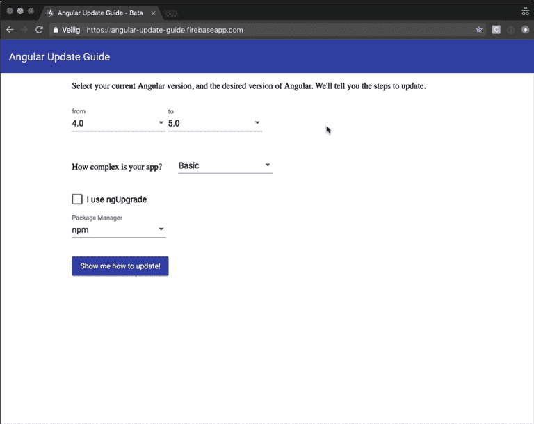
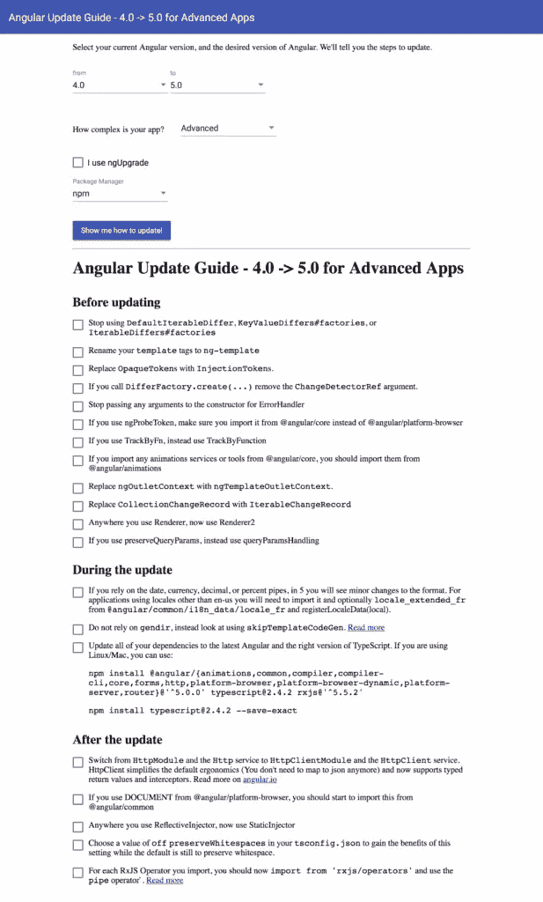
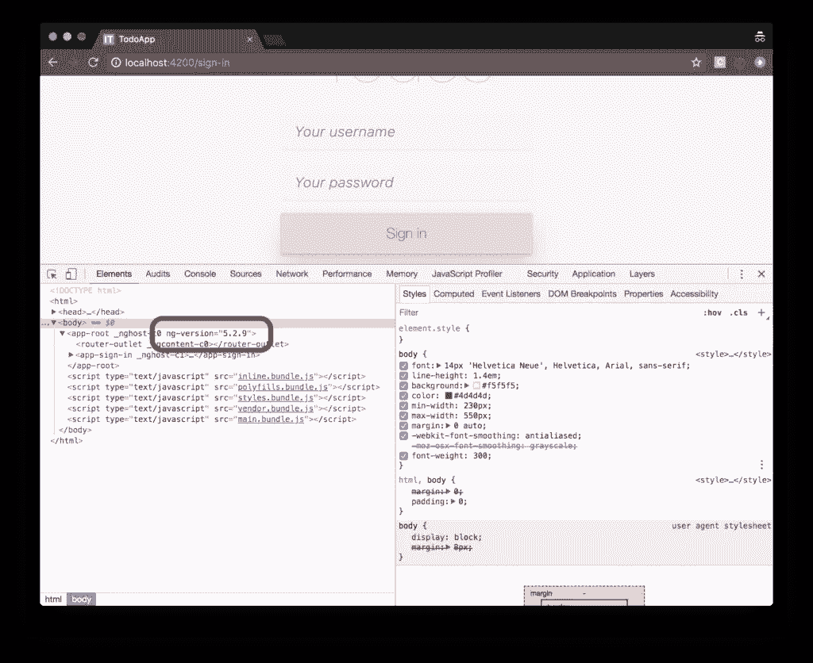

# 如何将 Angular 项目更新到最新版本

> 原文：<https://www.sitepoint.com/update-angular-projects/>

在本文中，我们将了解如何将 Angular 项目更新到最新版本。

本文是 SitePoint [Angular 2+教程](https://www.sitepoint.com/angular-2-tutorial/)的第 6 部分，讲述如何用 [Angular CLI](https://github.com/angular/angular-cli) 创建 CRUD 应用。

1.  [第 0 部分—极限角度 CLI 参考指南](https://www.sitepoint.com/ultimate-angular-cli-reference/)
2.  [第 1 部分—启动并运行我们的第一个 Todo 应用程序版本](https://www.sitepoint.com/angular-2-tutorial/)
3.  [第 2 部分—创建单独的组件来显示待办事项列表和单个待办事项](https://www.sitepoint.com/understanding-component-architecture-angular/)
4.  [第 3 部分—更新 Todo 服务以与 REST API 通信](https://www.sitepoint.com/angular-rxjs-create-api-service-rest-backend/)
5.  [第 4 部分—使用角度路由器解析数据](https://www.sitepoint.com/component-routing-angular-router/)
6.  [第 5 部分—添加身份验证以保护私人内容](https://www.sitepoint.com/angular-2-authentication-protecting-private-content/)
7.  第 6 部分——如何将 Angular 项目更新到最新版本。

在第 1 部分中，我们学习了如何启动并运行我们的 Todo 应用程序，并将其部署到 GitHub 页面。这工作得很好，但不幸的是，整个应用程序被塞进了一个组件。

在[第 2 部分](https://www.sitepoint.com/understanding-component-architecture-angular/)中，我们研究了一个更加模块化的组件架构，并学习了如何将单个组件分解成更小的组件的结构化树，以便于理解、重用和维护。

在第 3 部分中，我们更新了我们的应用程序，使用 RxJS 和 Angular 的 HTTP 服务与 REST API 后端进行通信。

在[第 4 部分](https://www.sitepoint.com/component-routing-angular-router/)中，我们介绍了 Angular Router，并了解了当浏览器 URL 改变时路由器如何更新我们的应用程序，以及我们如何使用路由器解析来自后端 API 的数据。

在[第 5 部分](https://www.sitepoint.com/angular-2-authentication-protecting-private-content/)中，我们在应用程序中添加了身份验证，并了解了如何保护应用程序的各个部分免受未经授权的访问。

不要担心！你不需要遵循本教程的第 1、2、3、4 或 5 部分来理解 6。你可以简单地拿一份[我们的回购](https://github.com/sitepoint-editors/angular-todo-app)的副本，检查第 5 部分的代码，并以此为起点。这将在下面更详细地解释。

## 运行正常的

为了开始我们更新 Angular 的目标，请确保您安装了最新版本的 Angular CLI。如果没有，可以使用以下命令安装它:

```
npm install -g @angular/cli@latest 
```

如果需要删除以前版本的 Angular CLI，您可以:

```
npm uninstall -g @angular/cli angular-cli
npm cache clean
npm install -g @angular/cli@latest 
```

之后，您将需要第 5 部分代码的副本。这个可以在 [GitHub](https://github.com/sitepoint-editors/angular-todo-app) 上找到。本系列中的每篇文章在存储库中都有一个相应的标记，因此您可以在应用程序的不同状态之间来回切换。

我们在第 5 部分结束、在本文开始的代码被标记为 [part-5](https://github.com/sitepoint-editors/angular-todo-app/tree/part-5) 。我们结束这篇文章的代码被标记为[第 6 部分](https://github.com/sitepoint-editors/angular-todo-app/tree/part-6)。

*您可以将标签想象成特定提交 ID 的别名。您可以使用`git checkout`在它们之间切换。你可以在这里阅读《T2》。*

因此，要启动并运行(安装了最新版本的 Angular CLI ),我们应该这样做:

```
git clone git@github.com:sitepoint-editors/angular-todo-app.git
cd angular-todo-app
git checkout part-5
npm install
ng serve 
```

然后访问 [http://localhost:4200/](http://localhost:4200/) 。如果一切正常，你应该看到工作的应用程序。

## 更新 Angular:我们的攻击计划

在本文中，随着我们更新 Angular，我们将了解以下内容:

*   有角度的版本如何工作
*   哪里可以找到如何更新 Angular 的说明
*   如何将我们的代码从 Angular 4 更新到 Angular 5 (Angular 5 是撰写本文时的最新版本)。

到本文结束时，您会明白:

*   特定角度版本的潜在含义
*   在哪里可以找到关于如何更新 Angular 应用程序的确切说明
*   如何找出 Angular 5 需要哪些代码更改(如果有的话)？

我们开始吧！

## 角形版本的含义

为了支持一个繁荣的生态系统，Angular 需要既稳定又进化。

一方面，Angular 旨在为开发人员提供任务关键型应用程序的最大稳定性。另一方面，它需要不断适应和进步，以支持 web 技术的最新变化。

因此，Angular 团队决定使用基于时间的发布周期和语义版本。

基于时间的发布周期意味着我们可以期待 Angular 的新版本(Angular 5，Angular 6，Angular 7 等。)每隔几周或几个月。

语义版本化意味着 Angular 的版本号允许我们预测如果我们升级到它，它是否会破坏我们的应用程序。

本质上，一个语义版本看起来是这样的:`Major.Minor.Patch`。

所以版本`v1.3.8`有一个值为 1 的主要组件、一个值为 3 的次要组件和一个值为 1 的补丁组件。

当一个新版本发布时，新版本隐含地指出了对代码所做的更改的类型。

当语义版本增加时，应用以下规则:

1.  每次递增都以数字形式发生，增量为 1。

2.  当一个 bug 被修复并且代码保持向后兼容时，补丁组件被增加:

    ```
    v0.0.3 // Before bugfix
    v0.0.4 // After bugfix 
    ```

3.  当添加功能且代码保持向后兼容时，次要组件增加，补丁组件重置为零:

    ```
    v0.2.4 // Before addition of new functionality
    v0.3.0 // After addition of new functionality 
    ```

4.  当实现的更改导致代码变得向后不兼容时，也称为**中断更改**，主要组件增加，次要组件和补丁组件重置为零:

    ```
    v7.3.5 // Before implementing backwards incompatible changes
    v8.0.0 // After implementing backwards incompatible changes 
    ```

如果你不熟悉语义版本控制，一定要看看这个简单的语义版本控制指南。

Angular 团队将语义版本控制与基于时间的发布周期相结合，旨在:

*   每周发布一个新的补丁
*   每月发布一个新的次要版本
*   每 6 个月发布一个新的主要版本

发布时间表并不是一成不变的，因为可能会有假期或特殊事件，但这是一个很好的指标，我们可以期待即将到来的版本。

你可以关注[官方 Angular 博客](https://blog.angular.io)和[官方变更日志](https://github.com/angular/angular/blob/master/CHANGELOG.md)来了解最新进展。

语义版本的一个巨大好处是，我们可以用补丁或小版本安全地更新 Angular 应用程序，而不必担心破坏我们的应用程序。

但是如果有一个新的主要版本呢？

## 角度更新指南

我们已经知道一个主要的发布会伴随着突破性的变化。那么，如果我们更新现有的应用程序，我们如何知道它是否会崩溃呢？

一种方法是读取官方变更日志并浏览变更列表。

更简单的方法是使用[角度更新向导](https://angular-update-guide.firebaseapp.com/)来更新角度。您选择当前的 Angular 版本和希望升级到的版本，应用程序会告诉您需要采取的具体步骤:



对于我们的 Angular Todo 应用程序，我们希望从 Angular 4.0 升级到 Angular 5.0。

让我们选择应用程序复杂性级别*高级*，这样我们就可以看到我们需要采取的所有可能的措施:



我们获得了更新应用程序所需的所有步骤的完整概述。

多甜蜜啊！

## 更新前

更新前的*列表包含 12 个项目。没有一项适用于我们的 Angular Todo 应用程序，所以我们可以安全地继续下一步。*

## 在更新期间

从*期间更新*列表，只有最后一项适用于我们的应用程序。我们需要更新我们的依赖项，所以让我们在项目的根目录中运行建议的命令:

```
$ npm install @angular/{animations,common,compiler,compiler-cli,core,forms,http,platform-browser,platform-browser-dynamic,platform-server,router}@'^5.0.0' typescript@2.4.2 rxjs@'^5.5.2'

$ npm install typescript@2.4.2 --save-exact 
```

因为我们在*启动并运行*部分将 Angular CLI 更新为最新版本，所以我们也更新了本地版本:

```
$ npm install @angular/cli@latest --save-dev 
```

为了验证我们的应用程序运行正确，我们运行:

```
$ ng serve 
```

如果`ng serve`无法启动，尝试删除您的`node_modules`目录和`package-lock.json`文件，并运行`npm install`重新创建一个干净的`node_modules`目录和`package-lock.json`文件。

## 更新后

更新后的列表包含四项，其中第一项和最后一项适用于我们的应用程序:

*   从`HttpModule`切换到`HttpClientModule`
*   从`rxjs/operators`导入 RxJS 操作符，并使用 RxJS 管道操作符

让我们一个一个地解决它们。

## 从 HttpModule 切换到 HttpClientModule

角度更新指南告诉我们应该从`HttpModule`切换到`HttpClientModule`。

如果我们检查一下[Angular 5 . 0 . 0 版本发布说明](https://blog.angular.io/version-5-0-0-of-angular-now-available-37e414935ced)，我们会了解到 Angular 4.3 和更高版本附带了一个新的`HttpClient`，它可以自动处理 JSON 响应并支持 HTTP 拦截器。

它指出，为了更新我们的代码，我们必须用`HttpClientModule`替换`HttpModule`，注入`HttpClient`服务并移除所有的`map(res => res.json())`调用，因为新的`HttpClient`会自动解析 JSON 响应。

让我们打开`src/app/app.module.ts`并更换`HttpModule`:

```
// ...
import { HttpModule } from '@angular/http';

@NgModule({
  declarations: [
    // ...
  ],
  imports: [
    // ...
    HttpModule,
  ],
  providers: [
    // ...
  ],
  bootstrap: [AppComponent]
})
export class AppModule {
} 
```

用`HttpClientModule`:

```
// ...
import { HttpClientModule } from '@angular/common/http';

@NgModule({
  declarations: [
    // ...
  ],
  imports: [
    // ...
    HttpClientModule,
  ],
  providers: [
    // ...
  ],
  bootstrap: [AppComponent]
})
export class AppModule {
} 
```

接下来，我们必须使用`HttpClient`服务而不是`Http`服务，并删除我们代码中的所有`map(res => res.json())`调用，因为新的`HttpClient`会自动为我们解析响应。

在[第 3 部分](https://www.sitepoint.com/angular-rxjs-create-api-service-rest-backend/)中，我们将所有与 HTTP 相关的代码集中在一个名为`ApiService`的服务中，现在我们获得了这种方法的好处。

因此，我们只需更新一个文件，所以让我们打开`src/app/api.service.ts`并替换:

```
import {
  Http,
  Headers,
  RequestOptions,
  Response
} from '@angular/http';

// ...

@Injectable()
export class ApiService {

  constructor(
    private http: Http,
    private session: SessionService
  ) {
  }

  public signIn(username: string, password: string) {
    return this.http
      .post(API_URL + '/sign-in', {
        username,
        password
      })
      .map(response => response.json())
      .catch(this.handleError);
  }

  public getAllTodos(): Observable<Todo[]> {
    const options = this.getRequestOptions();
    return this.http
      .get(API_URL + '/todos', options)
      .map(response => {
        const todos = response.json();
        return todos.map((todo) => new Todo(todo));
      })
      .catch(this.handleError);
  }

  public createTodo(todo: Todo): Observable<Todo> {
    const options = this.getRequestOptions();
    return this.http
      .post(API_URL + '/todos', todo, options)
      .map(response => {
        return new Todo(response.json());
      })
      .catch(this.handleError);
  }

  public getTodoById(todoId: number): Observable<Todo> {
    const options = this.getRequestOptions();
    return this.http
      .get(API_URL + '/todos/' + todoId, options)
      .map(response => {
        return new Todo(response.json());
      })
      .catch(this.handleError);
  }

  public updateTodo(todo: Todo): Observable<Todo> {
    const options = this.getRequestOptions();
    return this.http
      .put(API_URL + '/todos/' + todo.id, todo, options)
      .map(response => {
        return new Todo(response.json());
      })
      .catch(this.handleError);
  }

  public deleteTodoById(todoId: number): Observable<null> {
    const options = this.getRequestOptions();
    return this.http
      .delete(API_URL + '/todos/' + todoId, options)
      .map(response => null)
      .catch(this.handleError);
  }

  private handleError(error: Response | any) {
    console.error('ApiService::handleError', error);
    return Observable.throw(error);
  }

  private getRequestOptions() {
    const headers = new Headers({
      'Authorization': 'Bearer ' + this.session.accessToken
    });
    return new RequestOptions({ headers });
  }
} 
```

随着

```
import {
  HttpClient,
  HttpErrorResponse,
  HttpHeaders
} from '@angular/common/http';

// ...

@Injectable()
export class ApiService {

  constructor(
    private http: HttpClient,
    private session: SessionService
  ) {
  }

  public signIn(username: string, password: string) {
    return this.http
      .post(API_URL + '/sign-in', {
        username,
        password
      })
      .catch(this.handleError);
  }

  public getAllTodos(): Observable<Todo[]> {
    const options = this.getRequestOptions();
    return this.http
      .get(API_URL + '/todos', options)
      .map(response => {
        const todos = <any[]> response;
        return todos.map((todo) => new Todo(todo));
      })
      .catch(this.handleError);
  }

  public createTodo(todo: Todo): Observable<Todo> {
    const options = this.getRequestOptions();
    return this.http
      .post(API_URL + '/todos', todo, options)
      .map(response => {
        return new Todo(response);
      })
      .catch(this.handleError);
  }

  public getTodoById(todoId: number): Observable<Todo> {
    const options = this.getRequestOptions();
    return this.http
      .get(API_URL + '/todos/' + todoId, options)
      .map(response => {
        return new Todo(response);
      })
      .catch(this.handleError);
  }

  public updateTodo(todo: Todo): Observable<Todo> {
    const options = this.getRequestOptions();
    return this.http
      .put(API_URL + '/todos/' + todo.id, todo, options)
      .map(response => {
        return new Todo(response);
      })
      .catch(this.handleError);
  }

  public deleteTodoById(todoId: number): Observable<null> {
    const options = this.getRequestOptions();
    return this.http
      .delete(API_URL + '/todos/' + todoId, options)
      .map(response => null)
      .catch(this.handleError);
  }

  // ...
} 
```

我们用来自`HttpClientModule`的新类替换来自`HttpModule`的旧类。

更具体地说，我们替换:

*   `import { Http, Headers, RequestOptions, Response } from '@angular/http';`同`import { HttpClient, HttpErrorResponse, HttpHeaders } from '@angular/common/http';`
*   第 81 行:`Response`带`HttpErrorResponse`
*   第 90 行:`Headers`带`HttpHeaders`
*   第 93 行:`return new RequestOptions({ headers });`带`return { headers };`

如果我们跑:

```
$ ng serve 
```

将我们的浏览器导航到`http://localhost:4200`，我们看到我们的应用程序仍然像预期的那样工作，但是现在在幕后使用了`HttpClientModule`。

是时候处理第 2 项了:从`rxjs/operators`导入 RxJS 操作符，并使用 RxJS 管道操作符。

## 使用 RxJS 管道运算符

Angular 5 更新为使用 RxJS 5.5.2 或更高版本。

从 5.5 版本开始，RxJS 配备了[管道操作器](https://github.com/ReactiveX/rxjs/blob/master/doc/pipeable-operators.md)。[官方文件](https://github.com/ReactiveX/rxjs/blob/master/doc/pipeable-operators.md#what)说:

> 可管道操作符是返回带有签名的函数的任何函数:`<T, R>(source: Observable<T>) => Observable<R>` …
> 
> 在`rxjs/operators`(复数)下，你可以从一个地方找到任何你需要的操作员。).还建议直接引入您需要的可观察创作方法，如下图所示，包括范围:
> 
> ```
> import { range } from >'rxjs/observable/range';
> import { map, filter, scan } from >'rxjs/operators';
> 
> const source$ = range(0, 10);
> 
> source$.pipe(
>  filter(x => x % 2 === 0),
>  map(x => x + x),
>  scan((acc, x) => acc + x, 0)
> )
> .subscribe(x => console.log(x)) 
> ```

尽管这听起来很复杂，但它本质上意味着我们以前使用链式方法的地方:

```
source$
  .operatorOne()
  .operatorTwo()
  .subscribe() 
```

我们现在应该从`rxjs/operators`导入操作符，并使用`.pipe()`方法来应用它们:

```
source$
  .pipe(
    operatorOne(),
    operatorTwo()
  )
  .subscribe() 
```

管道化操作者的[主要好处](https://github.com/ReactiveX/rxjs/blob/master/doc/pipeable-operators.md#why)是:

1.  它们是可树摇动的，允许工具通过移除未使用的代码来减少我们的应用程序包的大小
2.  它们是简单的函数，所以我们可以[轻松地创建我们自己的自定义可管道化操作符](https://github.com/ReactiveX/rxjs/blob/master/doc/pipeable-operators.md#build-your-own-operators-easily)。

`.pipe()`方法将对我们代码的影响降低到最小。

我们的应用程序中有两项需要重构:我们的`ApiService`和`TodosComponent`。

首先，让我们打开`src/app/api.service.ts`来更新我们的`ApiService`:

```
// import operators from rxjs/operators
import { map } from 'rxjs/operators';

// ...

@Injectable()
export class ApiService {

  constructor(
    private http: HttpClient,
    private session: SessionService
  ) {
  }

  // ...

  // update .map() to .pipe(map())
  public getAllTodos(): Observable<Todo[]> {
    const options = this.getRequestOptions();
    return this.http
      .get(API_URL + '/todos', options)
      .pipe(
        map(response => {
          const todos = <any[]> response;
          return todos.map((todo) => new Todo(todo));
        })
      )
      .catch(this.handleError);
  }

  // update .map() to .pipe(map())
  public createTodo(todo: Todo): Observable<Todo> {
    const options = this.getRequestOptions();
    return this.http
      .post(API_URL + '/todos', todo, options)
      .pipe(
        map(response => {
          return new Todo(response);
        })
      )
      .catch(this.handleError);
  }

  // update .map() to .pipe(map())
  public getTodoById(todoId: number): Observable<Todo> {
    const options = this.getRequestOptions();
    return this.http
      .get(API_URL + '/todos/' + todoId, options)
      .pipe(
        map(response => {
          return new Todo(response);
        })
      )
      .catch(this.handleError);
  }

  // update .map() to .pipe(map())
  public updateTodo(todo: Todo): Observable<Todo> {
    const options = this.getRequestOptions();
    return this.http
      .put(API_URL + '/todos/' + todo.id, todo, options)
      .pipe(
        map(response => {
          return new Todo(response);
        })
      )
      .catch(this.handleError);
  }
} 
```

我们从`rxjs/operators`导入`map`可管道化操作符，并将所有事件从`.map(fn)`更新到`.pipe(map(fn))`。

接下来，让我们打开`src/app/todos/todos.component.ts`，将相同的更改应用到`TodosComponent`:

```
// import operators from rxjs/operators
import { map } from 'rxjs/operators';

// ...

@Component({
  selector: 'app-todos',
  templateUrl: './todos.component.html',
  styleUrls: ['./todos.component.css']
})
export class TodosComponent implements OnInit {

  // ... 

  // update .map() to .pipe(map())
  public ngOnInit() {
    this.route.data
      .pipe(
        map((data) => data['todos'])
      )
      .subscribe(
        (todos) => {
          this.todos = todos;
        }
      );
  }

  // ...

} 
```

同样，我们从`rxjs/operators`导入`map`可管道化操作符，并将`.map(fn)`更新为`.pipe(map(fn))`。

就是这样！正如 Angular Update Guide 所指示的那样，我们的应用程序中的链式操作符已经被管道操作符所取代。

如果我们将浏览器导航到`http://localhost:4200`，我们会看到我们的应用程序仍然运行良好。

为了验证我们真的在运行 Angular 5，我们可以打开元素检查器:



Angular 向`app-root`添加了一个`ng-version`属性，该属性带有它正在运行的版本的值。我们看到`ng-version="5.2.9"`，表明我们正在运行 Angular 5.2.9。

任务完成！我们的应用已经成功升级到 Angular 5.2.9。

我们讲了很多，所以让我们回顾一下我们所学的内容。

## 摘要

在第[篇文章](https://www.sitepoint.com/angular-2-tutorial/)中，我们学习了如何:

*   使用 Angular CLI 初始化我们的 Todo 应用程序
*   创建一个`Todo`类来表示个人待办事项
*   创建一个`TodoDataService`服务来创建、更新和删除 todos
*   使用`AppComponent`组件显示用户界面
*   将我们的应用程序部署到 GitHub 页面。

在[的第二篇文章](https://www.sitepoint.com/understanding-component-architecture-angular/)中，我们重构了`AppComponent`，将其大部分工作委托给:

*   显示待办事项列表
*   显示单个待办事项的`TodoListItemComponent`
*   创建新待办事项的`TodoListHeaderComponent`
*   显示还剩多少待办事项。

在第三篇文章中，我们学习了如何:

*   创建一个模拟 REST API 后端
*   将 API URL 存储为环境变量
*   创建一个`ApiService`来与 REST API 通信
*   更新`TodoDataService`以使用新的`ApiService`
*   更新`AppComponent`来处理异步 API 调用
*   创建一个`ApiMockService`来避免运行单元测试时真正的 HTTP 调用。

在[第四篇](https://www.sitepoint.com/component-routing-angular-router/)中，我们了解到:

*   为什么应用程序可能需要路由
*   JavaScript 路由器是什么
*   什么是角路由器，它是如何工作的，它能为你做什么
*   如何为我们的应用程序设置角度路由器和配置路由
*   如何告诉 Angular router 在 DOM 中何处放置组件
*   如何优雅地处理未知的网址
*   如何使用解析器让角路由器解析数据？

在第五篇文章中，我们了解到:

*   饼干和代币的区别
*   如何创建一个`AuthService`来实现认证逻辑
*   如何创建一个`SessionService`来存储会话数据
*   如何使用角度反应表单创建签到表单
*   如何创建一个路由保护来防止对应用程序部分的未授权访问
*   如何将用户令牌作为 HTTP 请求中的授权头发送给 API
*   为什么不应该将用户的令牌发送给第三方。

在这篇关于如何更新 Angular 的文章中，我们了解到:

*   有角度的版本如何工作
*   语义版本号意味着什么
*   语义版本化如何保护我们避免盲目地将突破性的改变引入到我们的应用程序中
*   角度更新指南如何帮助我们找到如何更新角度的详细说明
*   如何用`HttpClientModule`代替`HttpModule`
*   如何用可管道操作符更新我们的 RxJS 代码
*   属性如何让我们验证我们正在运行的 Angular 版本。

在即将到来的版本中，Angular CLI 将引入`ng update`命令来帮助更新 Angular 应用程序。一旦获得更多细节，我们将为您提供一篇后续文章，介绍这个新命令如何让我们的生活变得更加轻松。

在此之前，您可以使用本文作为指南，指导如何将 Angular 应用程序更新到最新版本。

这篇文章的所有代码都可以在 GitHub 上找到。

祝你愉快！

## 分享这篇文章