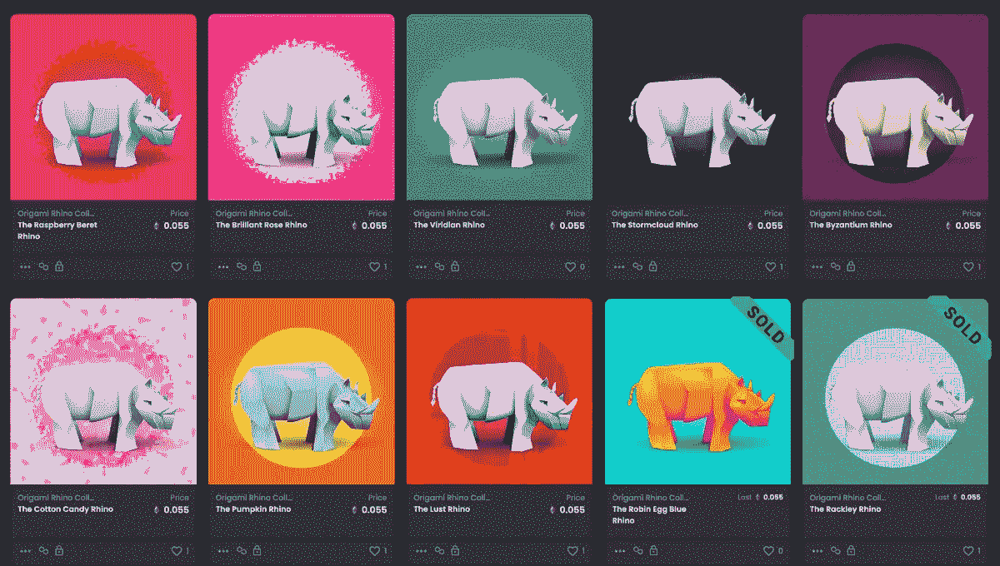

# SitePoint 折纸犀牛 NFT 下降# 2-电动布加洛

> 原文：<https://www.sitepoint.com/update-sitepoint-nft-drop-2/>

我想我应该发布一个关于我们 NFT 项目的快速更新。

首先，令我们高兴(也有些惊讶)的是，我们的第一批 10 只折纸犀牛在 4 天内就销售一空！一路走来，我们学到了很多，我将在下面介绍。

### 宣布折纸犀牛下降#2

我们的第二次发布是在 11 月 8 日星期一(T1)。

–我们再次通过 OpenSea.io 平台提供 10 个独特的、一次性的、清晰的 SVG NFTs。
–同样，每件作品都包含 12 个月的 SitePoint Premium 会员资格，所有者只能兑换一次。

来吧，让我看看你摇尾巴！

与第一次下降也有一些显著的不同。

–首先，我们使用以太坊的 Polygon 变体来出售这些作品，它提供快速、安全的以太坊交易，减去繁重的“汽油费”。为了让事情变得简单，这 10 件拍卖品最初以固定价格(0.055ETH)出售，而不是拍卖。
——第一次极少数 Rhinos 包含 SVG 动画，据我所知，这在 OpenSea 上相对不常见(大多数动画都是短视频循环)。

*   **[查看收藏，告诉我们你的想法](https://opensea.io/collection/origami-rhino-collection)**

### 到目前为止我们学到了什么？

正如我们在发布会上所说，这个项目是我们了解推动 NFT 空间的技术和社区的快速通道。没有特定的顺序，我会注意到:

–以太坊中的交易费用(即“汽油费”)在“有点高”和“绝对高”之间波动，这取决于正在处理的其他交易数量。想想优步飙升的价格。选择处理交易的最佳时间对你的成功至关重要。
–Polygon 是免费的，但不像普通以太坊那样常用。这对买家来说是一个阻碍吗？现在说还为时过早。
——NFT 空间目前有一种真正有趣的兴奋、疯狂的创造力和疯狂的炒作的混合。光是听每天滔滔不绝的谈话就需要很多精力。做好准备。
–SVG 是 OpenSea 上一种未被充分利用的格式。绝大多数动画都是短视频循环。虽然在创作 SVG 时有更多的技术要求，但也有使用 CSS、符号和动画的选项，这些在其他 NFT 格式中是不可能的。

我正在开发一些想法，我希望它们会非常独特。敬请期待！

## 分享这篇文章