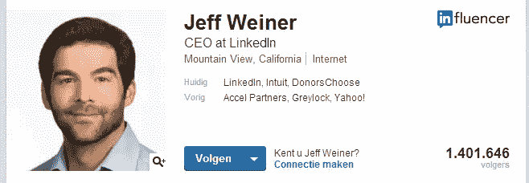
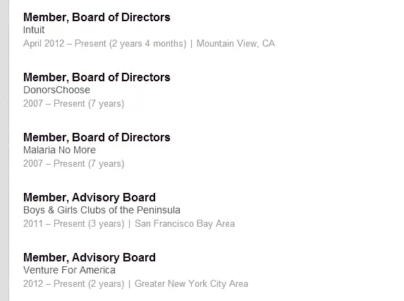
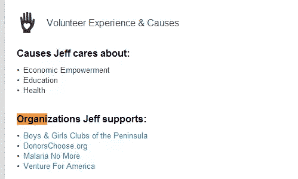

# 如何升级你的 LinkedIn 个人资料并被录用

> 原文：<https://www.sitepoint.com/upgrade-linkedin-profile-hired/>

拥有一个专业的 LinkedIn 个人资料对你作为开发人员/设计师/作家的职业生涯非常有益——有些人甚至认为这是强制性的。但是什么是专业的 LinkedIn 个人资料呢？应该包括什么，遗漏什么？

在这篇文章中，我将向你展示雇主在查看你的 LinkedIn 个人资料时发现什么是重要的。我还会告诉你什么可以作为你的发展，设计或写作技能的额外细节。最终，你将能够创建一个详细而专业的 LinkedIn 个人资料，让你引以为豪。

## 基础知识

### 个人资料图片

“一张图胜过千言万语”这句话对于你的个人资料图片尤其适用。当然，你的技能和经验远比你的长相重要，但你必须接受人类是以视觉为导向的这一事实。只要确保你看着镜头，把你的脸完全展现出来。试着笑一点，但是不要笑过头。

### 头条新闻

有许多不同的方法来填充你的标题。当你是 LinkedIn 的[首席执行官时，事情很简单:用那个头衔做开场白。但是，如果您是一名拥有多种技能的开发人员，并且不想只显示一个标题来限制自己，该怎么办呢？在这种情况下，你应该时刻记住谁会筛选你的个人资料。](https://www.linkedin.com/in/jeffweiner08)

大多数情况下，你要面试的人不会是同一个人。例如，招聘人员会浏览数百份寻找 PHP 开发人员的简介。确保你被列为其中之一，但不要在你的标题太专业。

可以肯定的是，招聘人员只具备最基本的编码知识，只够挑选候选人。他们的客户会对你的特定技能感兴趣，但这就是你的总结的目的。

### 摘要

总结简要描述你做什么样的工作，但更重要的是:为什么人们应该雇用你。

这也是你应该列出你的具体技能的地方。如果你的标题是“创意设计师”，填写你擅长的应用。如果你是一个作家，用这个空间来阐明你写的内容。还是那句话，不要过度；尽量总结。你的目标是被邀请参加面试，在那里你可以详细阐述你的技能。

### 经验

这就是我们的 LinkedIn 首席执行官有点草率的地方，因为在你的经历列表中，你需要指明的不仅仅是像他一样是会员。提供你的职位是一回事，但更重要的是你在这项特殊任务中的表现。解释你如何使公司或客户受益，并展示具体的成就或结果。

做一名自由职业者是避免个人资料空白的好方法，因为它会一直显示为“- Present”。这也是你把正在进行的客户放进去的地方，但是如果他们值得一提的话，单独展示具体的项目也是可以的。

### 教育

你的教育很重要，但没有你的经历重要。尽量保持简短，但包括重要的成就。不要在这里包括你的出版物，因为有一个专门的部分。

### 联系信息

你想包括多少就包括多少。电话号码、你的地址、你的 Twitter 和其他社交媒体账户，以及你的网站。

### 群组/关注

你应该经常加入几个小组，关注几个公司。除了一个伟大的(和视觉的)方式来显示你的兴趣，这也允许群体通知。通过这种方式，你会收到关于其他小组成员所提问题的电子邮件，在那里你可以插话展示你的专业知识。

## 让它变得新奇

曾几何时，你的 LinkedIn 个人资料只能包括上面列出的基本信息。但是现在有很多方法可以让你的个人资料脱颖而出。尝试包括以下一些项目:

### 技能和认可

这是必须的，因为它可以让你的联系人很容易认可你的技能。LinkedIn 甚至在每个页面的顶部宣传这个功能。

### 推荐

这是其他人必须为你填写的，但你可以向过去或现在的客户征求对你工作的建议。这是展示你做什么和如何做的最有力的方式。不要害怕问，你会惊讶地发现有多少人乐意给你一封好的推荐信。尤其是当你还人情的时候。

### 项目

项目基本上是以工作经验的形式显示，但在一个单独的列表中。他们在与现有客户合作时特别有用。

### 出版物

与项目一样，它们位于不同的列表中，以将它们区分开来。如果你是一名职业作家，招聘人员会寻找这一点。

### 荣誉/奖项/考试成绩/课程/专利/认证

如果你真的有什么特别的东西要展示，你可以使用这些专门的部分。明智地使用它们，因为它们可以很快让你的页面看起来拥挤不堪，但这是展示专利的最佳方式。

### 志愿者经历和原因

特别值得一提的是这一志愿服务部分。如果你真的对某项特定的事业有所贡献，不要羞于展示。它显示了你是谁，你代表什么，也可以作为相关的工作经验。

### 链接/演示文稿/图片

这些项目中的每一个都提供了包含相关链接和附件的选项，如 PDF、PowerPoint 演示文稿等。如果你喜欢，你甚至可以包括 YouTube 电影。

## 不要

为了给人留下专业的印象，有几件事你不应该放在你的 LinkedIn 个人资料里(或者尽量减少)。

*   一个电话号码作为你的标题:当人们不知道打电话给你做什么的时候，为什么要打电话给你？
*   **在你的标题中写上“找工作:**再说一遍，你是做什么的？用“有经验的 PHP 开发人员|可以接受新的挑战”这样的话来代替。
*   **过多的星号/复选标记:**在适当的地方使用它们，但只是为了突出重要的技能或经历。
*   **多次更改个人资料:**如果添加技能，尝试一次添加几个或者不通知发布。你网络中的人很快就会厌倦每周在他们的更新列表中看到你。此外，技能通常需要较长时间的学习。
*   列出你做过的每一份小工作:试着在你的清单上只展示相关的经历，试着在一家公司里结合多种职能。当你 16 岁的时候，你做了麦当劳提供给你的每一份工作，这很好，但是当你在找设计工作的时候，这又有多大的相关性呢？
*   让自己看起来比实际上更聪明:把你粗略浏览过的每一项研究或课程都包含在你的教育清单中是非常有吸引力的。但是招聘人员知道如何处理这个问题，所以你肯定会遇到一些棘手的问题。

## 结论

制作一份专业的 LinkedIn 个人资料可能会花费你几个小时，但最终这是值得的。LinkedIn 在过去的几年里确实改善了它的服务，所以即使你已经有了一个活跃的个人资料，花些时间使用一些新元素也是明智的。

当你开始推广你的个人资料时，你很快就会发现有多少人(和谁)正在浏览你的个人资料。LinkedIn 会随时通知你，但如果你因此获得了一份新工作或新客户，那就更好了。这就是一切都值得的原因。

当你想更上一层楼，变得更加专业时，也许是时候考虑建立你的个人投资组合网站了。别忘了从你的 LinkedIn 个人资料中链接到它。

对于如何创建更好的 LinkedIn 个人资料，你有什么建议吗？

## 分享这篇文章