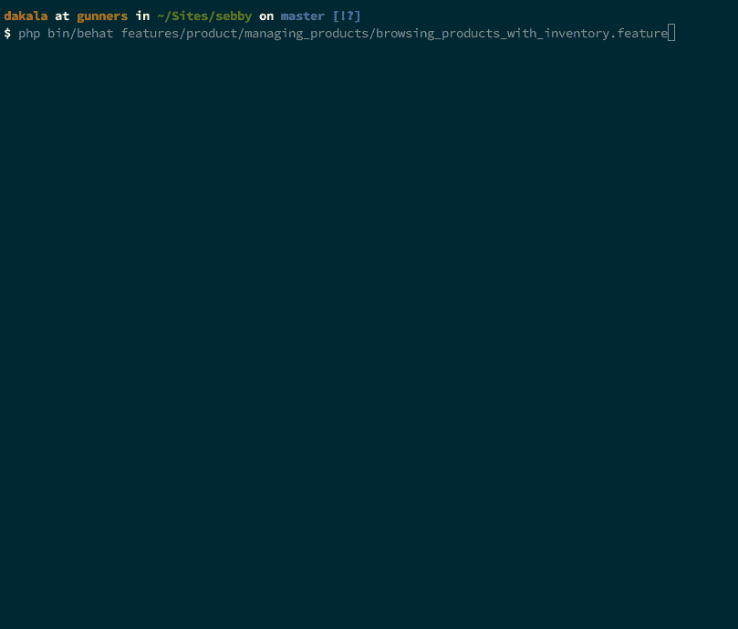
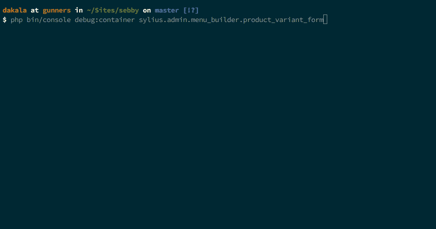

# 以 TDD 方式升级 Sylius:探索行为

> 原文：<https://www.sitepoint.com/upgrading-sylius-tdd-way-exploring-behat/>

*这篇文章由[克里斯多佛·皮特](https://www.sitepoint.com/author/assertchris)进行了同行评审。感谢 SitePoint 的所有同行评审员使 SitePoint 的内容尽可能做到最好！*

上次，[我们在 Sylius 的核心](https://www.sitepoint.com/upgrading-sylius-tdd-way-exploring-phpspec)上开发了一些新功能，以指示哪些产品及其变体库存不足，需要补充。现在，我们继续在 UI 中查看我们的更改，这意味着我们将需要做一些 StoryBDD 测试。

当浏览产品列表时，我们希望看到一个名为`Inventory`的新列，它将保存所有可用的跟踪变体的库存数量的总和。

* * *


## 编写 StoryBDD 测试

Behat 是我们想在这里使用的工具。在通过运行 Sylius 包中的任何特性来确保 Behat 运行良好之后，我们使用以下定义创建一个新的`features/product/managing_products/browsing_products_with_inventory.feature`文件:

```
@managing_inventory
Feature: Browsing products with inventory
    In order to manage my shop merchandise
    As an Administrator
    I want to be able to browse products 
    Background:
        Given the store operates on a single channel in "United States"
        And the store has a product "Kubus"
        And it comes in the following variations: | name | price | | Kubus Banana | $2.00 |
            | Kubus Carrot | $2.00 |
        And there are 3 units of "Kubus Banana" variant of product "Kubus" available in the inventory
        And there are 5 units of "Kubus Carrot" variant of product "Kubus" available in the inventory
        And I am logged in as an administrator

    @ui
    Scenario: Browsing defined products with inventory
        Given the "Kubus Banana" product variant is tracked by the inventory
        And the "Kubus Carrot" product variant is tracked by the inventory
        When I want to browse products
        Then I should see that the product "Kubus" has 8 on hand quantity 
```

同样，我们描述了测试产品的组成，说明了两种变体的名称、价格和可用库存。如果我们运行这个特性，我们会看到可用上下文的路径列表。我们对它们都不感兴趣，但是我们也得到了一个提示，所以我们选择了`None`。

```
php bin/behat features/product/managing_products/browsing_products_with_inventory.feature 
```

```
--- Use --snippets-for CLI option to generate snippets for following ui_managing_inventory suite steps:

    When I want to browse products
    Then I should see that the product "Kubus" has 18 on hand quantity 
```

我们在`src/Sylius/Behat/Context/Ui/Admin/ManagingProductsInventoryContext.php`中创建了我们的上下文，并添加了以下内容:

```
<?php

// src/Sylius/Behat/Context/Ui/Admin/ManagingProductsInventoryContext.php

namespace Sylius\Behat\Context\Ui\Admin;

use Behat\Behat\Context\Context;

class ManagingProductsInventoryContext implements Context
{
} 
```

再次运行该特性似乎没有什么帮助，因为我们得到的上下文列表和以前一样。那是因为西利乌斯对我们班一无所知。我们需要为我们的上下文以及 Sylius 在`src/Sylius/Behat/Resources/config/services/contexts/ui.xml`中的内容配置一个服务。我们现在搜索`managing_products`,并将其添加到下面:

```
<service id="sylius.behat.context.ui.admin.managing_products_inventory" class="Sylius\Behat\Context\Ui\Admin\ManagingProductsInventoryContext">
    <argument type="service" id="sylius.behat.page.admin.product.index" />
    <tag name="fob.context_service" />
</service> 
```

让我们将我们的`sylius.behat.context.ui.admin.managing_products_inventory`服务(即`ui.xml`的`id`)添加到`src/Sylius/Behat/Resources/config/suites/ui/inventory/managing_inventory.yml`的`ui_managing_inventory`套件的上下文服务中。

我们可能需要清空缓存。如果我们运行这个特性，我们现在可以选择`Sylius\Behat\Context\Ui\Admin\ManagingProductsInventoryContext`。然后我们得到:

```
--- Sylius\Behat\Context\Ui\Admin\ManagingProductsInventoryContext has missing steps. Define them with these snippets:

    /**
     * @When I want to browse products
     */
    public function iWantToBrowseProducts()
    {
        throw new PendingException();
    }

    /**
     * @Then I should see that the product :arg1 has :arg2 on hand quantity
     */
    public function iShouldSeeThatTheProductHasOnHandQuantity($arg1, $arg2)
    {
        throw new PendingException();
    } 
```

我们可以将代码片段复制并粘贴到我们创建的上下文类中。出于好奇，我们可能会导入`PendingException`来查看输出。让我们将`use Behat\Behat\Tester\Exception\PendingException;`添加到类的顶部，并重新运行该特性。

我们得到一个错误:

```
An exception occured in driver: SQLSTATE[HY000] [1049] Unknown database 'xxxx_test' (Doctrine\DBAL\Exception\ConnectionException) 
```

这是因为我们还没有创建测试数据库。现在这两个命令将为我们完成这项工作。

```
php bin/console doctrine:database:create --env=test
php bin/console doctrine:schema:create --env=test 
```

*如果您在上一篇文章中为`reorder_level`列修改`product_variant`表之前创建了测试数据库，您可能会得到一个错误:*

```
Column not found: 1054 Unknown column 'reorder_level' in 'field list' 
```

然后，让我们用以下内容更新测试数据库:

```
php bin/console doctrine:schema:update --env=test --force 
```

该特性现在可以运行了，您可以在输出中间看到这一点:

```
When I want to browse products
      TODO: write pending definition 
```



“TODO: write pending definition”是 PendingException 消息。回到我们的`ManagingProductsInventoryContext`，还少了点什么。我们配置的服务有一个参数:`<argument type="service" id="sylius.behat.page.admin.product.index" />`；但这还不是我们班的。

`sylius.behat.page.admin.product.index`服务用于访问产品管理的索引页面。如果我们在`src/Sylius/Behat/Resources/config/services/pages/admin/product.xml`(通过搜索定义`sylius.behat.page.admin.product.index`的位置找到)中查找，我们看到这个类是`Sylius\Behat\Page\Admin\Product\IndexPage`。我们需要将接口注入到我们的上下文类中。

同样在`iWantToBrowseProducts()`方法中，我们现在可以通过从我们的`IndexPageInterface`实例中调用正确的方法来访问索引页面。所以我们的`ManagingProductsInventoryContext.php`应该是这样的:

```
<?php

// src/Sylius/Behat/Context/Ui/Admin/ManagingProductsInventoryContext.php

use Behat\Behat\Context\Context;
use Sylius\Behat\Page\Admin\Product\IndexPageInterface;
use Behat\Behat\Tester\Exception\PendingException;

class ManagingProductsInventoryContext implements Context
{
    /**
     * @var IndexPageInterface
     */
    private $indexPage;

    /**
     * @param IndexPageInterface $indexPage
     */
    public function __construct(IndexPageInterface $indexPage)
    {
        $this->indexPage = $indexPage;
    }

    /**
     * @When I want to browse products
     */
    public function iWantToBrowseProducts()
    {
        $this->indexPage->open();
    }

    /**
     * @Then I should see that the product :arg1 has :arg2 on hand quantity
     */
    public function iShouldSeeThatTheProductHasOnHandQuantity($arg1, $arg2)
    {
        throw new PendingException();
    }
} 
```

它通过了，我们收到了另一个缺失定义的提示:

```
Then I should see that the product "Kubus" has 18 on hand quantity
      TODO: write pending definition 
```

首先我们想改变参数名，这样我们就知道它们指的是什么——`$product`和`$quantity`。键入提示`$product`也是一个好主意。Sylius 有许多通用方法，我们可以调用这些方法来检查我们是否有一个名为“inventory”的列，以及我们的测试产品是否有正确数量的可用项目。这是`iShouldSeeThatTheProductHasOnHandQuantity()`方法现在应该的样子:

```
/**
 * @Then I should see that the product :product has :quantity on hand quantity
 */
public function iShouldSeeThatTheProductHasOnHandQuantity(Product $product, $quantity)
{
    Assert::notNull($this->indexPage->getColumnFields('inventory'));
    Assert::true($this->indexPage->isSingleResourceOnPage([
      'name' => $product->getName(),
      'inventory' => sprintf('%d Available on hand', $quantity),
    ]));
} 
```

我们已经介绍了两个类:`Assert`和`Product`。让我们用以下命令导入它们:

```
use Webmozart\Assert\Assert;
use AppBundle\Entity\Product; 
```

同时，您可以删除不再使用的`PendingException`导入。

现在，该场景失败，并显示不同的错误消息:

```
Then I should see that the product "Kubus" has 18 on hand quantity
      Column with name "inventory" not found! (InvalidArgumentException) 
```

Behat 打开了产品列表页面，没有`Inventory`一栏。补充一下吧。列表通常与 Sylius 网格组件一起显示。SyliusGridBundle 使用描述给定网格结构的 YAML 配置文件。对于管理部分，这些位于`src/Sylius/Bundle/AdminBundle/Resources/config/grids/`。我们只需要将`product_variant.yml`中的内容复制到`product.yml`中的“库存”列。

```
inventory:
    type: twig
    path: .
    label: sylius.ui.inventory
    options:
        template: "@SyliusAdmin/ProductVariant/Grid/Field/inventory.html.twig" 
```

最重要的是，我们需要适当地覆盖`product.yml`。我们将`src/Sylius/Bundle/AdminBundle/Resources/config/grids/product.yml`复制到`app/Resources/SyliusAdminBundle/config/grids/product.yml`。我们将上面的库存列配置添加到它，可能在“名称”之后。在清除缓存并运行测试之后，一切都应该通过了。

现在，我们想用我们的再订购级别逻辑修改`inventory.html.twig`，这样我们就可以指示库存何时变少。这将照顾到`Product`和`ProductVariant`网格，因为它们的库存字段共享相同的模板。让我们将`src/Sylius/Bundle/AdminBundle/Resources/views/ProductVariant/Grid/Field/inventory.html.twig`复制到`app/Resources/SyliusAdminBundle/views/ProductVariant/Grid/Field/inventory.html.twig`，并将内容替换为:

```

    
        
    
        
    
<div class="ui {{ classes }} icon label">
    <i class="cube icon"></i>
    <span class="onHand" data-product-variant-id="{{ data.id }}">{{ data.onHand }}</span> {{ 'sylius.ui.available_on_hand'|trans }}
    
    <div class="detail">
        <span class="onHold" data-product-variant-id="{{ data.id }}">{{ data.onHold }}</span> {{ 'sylius.ui.reserved'|trans }}
    </div>
    
</div>

    <span class="ui red label">
        <i class="remove icon"></i>
        {{ 'sylius.ui.not_tracked'|trans }}
    </span>
 
```

清除缓存后，我们可以从管理 UI 中查看列表。让我们编辑某个产品的一些产品变型，更改库存水平，并查看预期结果。如果任何变体的库存中有 5 个或更少的跟踪项目，将有第三种颜色(黄色)来指示该项目的库存处于再订购水平。一切正常，只是我们无法改变再订购水平。我们将总结如何定制产品变型表单，以便我们可以更改它。这里有 3 个重要的词需要记住——类别、服务和配置。

## 自定义产品变体表单

我们通过扩展一个窗体类来定制一个窗体。Symfony 使用服务容器来标准化对象在应用程序中的构造方式。如果我们能看到服务列表就好了…也许我们能找到一些关于合适的服务的信息？让我们试试这个:

```
php bin/console debug:container product_variant 
```

您获得了一个服务 id 列表并仔细查看了它们，您将看到一个带有“sy lius . form . type . product _ variant”的列表，这看起来像是我们所需要的。选择它，注意我们需要扩展的类是`Sylius\Bundle\ProductBundle\Form\Type\ProductVariantType`。

### 创建服务

让我们创建`src/AppBundle/Resources/config/services.yml`并添加这个:

```
services:
    app.form.extension.type.product_variant:
        class: AppBundle\Form\Type\Extension\ProductVariantTypeExtension
        tags:
            - { name: form.type_extension, extended_type: Sylius\Bundle\ProductBundle\Form\Type\ProductVariantType } 
```

### 创建一个类

上面定义的服务是针对一个类的。让我们创建`src/AppBundle/Form/Type/Extension/ProductVariantTypeExtension.php`，并添加以下内容:

```
<?php

// src/AppBundle/Form/Type/Extension/ProductVariantTypeExtension.php

namespace AppBundle\Form\Type\Extension;

use Sylius\Bundle\ProductBundle\Form\Type\ProductVariantType;
use Symfony\Component\Form\AbstractTypeExtension;
use Symfony\Component\Form\Extension\Core\Type\TextType;
use Symfony\Component\Form\FormBuilderInterface;

class ProductVariantTypeExtension extends AbstractTypeExtension
{
    /**
     * {@inheritdoc}
     */
    public function buildForm(FormBuilderInterface $builder, array $options)
    {
        $builder->add(
          'reorderLevel',
          TextType::class,
          [
            'required' => false,
            'label' => 'sylius.form.variant.reorder_level',
          ]
        );
    }

    /**
     * {@inheritdoc}
     */
    public function getExtendedType()
    {
        return ProductVariantType::class;
    }
} 
```

标签需要一个消息配置文件。我们将创建`app/Resources/SyliusAdminBundle/translations/messages.en.yml`并添加以下内容:

```
sylius:
    form:
        variant:
            reorder_level: 'Reorder level' 
```

我们可以看到名字-`sylius.form.variant.reorder_level`中键的层次结构。让我们将`app/config/config.yml`中的服务告知 Sylius，将它添加到`imports`下:

```
- { resource: "@AppBundle/Resources/config/services.yml"} 
```

## 覆盖模板

现在，我们如何找到要覆盖的模板？我们转到产品变型列表并编辑其中一个，这样我们就可以确定用于显示表单的模板。页面底部是 Web 调试工具栏和分析器。

左边是 HTTP 状态代码，旁边是路由名称。单击路线名称会显示配置文件。有很多关于请求的数据，其中有请求属性部分，有以下键:`_controller`、`_route`、`_route_params`和`id`。`_sylius`的值列显示一个箭头，表示一个数组。单击它可以用“section”、“template”、“redirect”、“permission”和“vars”键展开数组。“模板”的值是位于`src/Sylius/Bundle/AdminBundle/Resources/views/Crud/update.html.twig`的`SyliusAdminBundle:Crud:update.html.twig`。

看一下`update.html.twig`，在众多包含中有这样一个——``。同样，那是在`src/Sylius/Bundle/AdminBundle/Resources/views/Crud/Update/_content.html.twig`发现的。文件里没有什么有趣的东西。死胡同！

如果我们回到请求属性，展开`_vars`然后展开`templates`键，我们会看到在`src/Sylius/Bundle/AdminBundle/Resources/views/ProductVariant/_form.html.twig`中找到的`@SyliusAdmin/ProductVariant/_form.html.twig`。在`_form.html.twig`中，有一个树枝函数`knp_menu_get()`。菜单？什么菜单？我们在找一种形式。这是一个不同类型的页面，用不同的模板构建。回头看看页面本身，我们注意到两个选项卡——“详细信息”和“税收”。标签页和菜单确实在一起，所以，也许我们是在正确的轨道上。

回到我们用`php bin/console debug:container product_variant`看到的服务列表，我们也许能找到一个带有“菜单”和“产品 _ 变体”的服务。事实上，有一个:`sylius.admin.menu_builder.product_variant_form`当我们调试时，它给我们一些有趣的信息:



对于标签选项，该值为`knp_menu.menu_builder (method: createMenu, alias: sylius.admin.product_variant_form)`。这个别名是我们的`_form.html.twig`模板中的`knp_menu_get()`方法的第一个参数。我们肯定是在正确的轨道上。

从上面的调试信息，我们也知道了`Sylius\Bundle\AdminBundle\Menu\ProductVariantFormMenuBuilder`类是负责表单的。打开这个类，查看`createMenu()`方法，我们看到`details`和`taxes`标签，以及它们各自的模板——`@SyliusAdmin/ProductVariant/Tab/_details.html.twig`和`@SyliusAdmin/ProductVariant/Tab/_taxes.html.twig`。我们可以通过检查`src/Sylius/Bundle/AdminBundle/Resources/views/ProductVariant/Tab/_details.html.twig`来确认我们已经找到了要覆盖的正确模板。

让我们将文件复制到`app/Resources/SyliusAdminBundle/views/ProductVariant/Tab/_details.html.twig`。找到库存部分，我们在任何地方添加新字段`{{ form_row(form.reorderLevel) }}`。我把我的放在`{{ form_row(form.onHand) }}`和`{{ form_row(form.tracked) }}`之间。如果我们回到产品变体表单，文本字段应该就在那里。我们可以将默认值更改为任何数字，并保存文件。

## 结论

我们系列的最后一部分已经完成——我们能够向 Sylius 添加新功能，而不会招致长期的技术债务，也不会牺牲应用程序的 100%测试覆盖率。我们涵盖了这个电子商务框架中所有可用的测试类型，并最大限度地利用了它的最佳实践。

特别是在这一部分，我们更详细地研究了如何编写 SpecBDD 测试，以及如何覆盖 Sylius 模型和表单。实现同样的目标会有不同的、更有趣的方式。让我们知道你对其中一些的看法。

你开始用 Sylius 了吗？为什么/为什么不？你在我们的方法中发现了哪些陷阱？大家讨论一下！

## 分享这篇文章