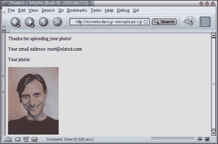

# 使用 CGI 和 Perl 上传文件

> 原文：<https://www.sitepoint.com/uploading-files-cgi-perl-3/>

##### 把所有的放在一起

***1。把文件放在你的服务器上***

将 HTML 表单放在网站的文档根目录下，将 CGI 脚本放在网站的 cgi-bin 目录下。

注意:如果你在 UNIX 服务器上，不要忘记让 CGI 脚本可执行—`chmod a+rx upload.cgi`或`chmod 755 upload.cgi`

***2。设置正确的路径和网址***

如有必要，更改`<form>`标签中的`upload.cgi` URL，以指向 CGI 脚本的正确 URL:

`<form action="/cgi-bin/upload.cgi" method="post"
enctype="multipart/form-data">`

另外，不要忘记在 CGI 脚本中设置 Perl 的正确路径，以及在服务器上创建的“上传”目录的正确绝对路径:

`my $upload_dir = "/home/mywebsite/htdocs/upload";`

***3。测试脚本***

我们来试试吧！转到服务器上文件上传表单的 URL，选择要上传的照片，然后输入您的电子邮件地址:

按“提交表格”按钮。如果一切顺利，照片将被上传到服务器，您应该会看到“谢谢！”页面，其中还会显示您的照片和电子邮件地址:

祝贺您——您已经编写了一个文件上传处理程序脚本！

如果您得到内部服务器错误，仔细检查上面描述的权限、路径和 URL，并寻找其他常见的 CGI 脚本陷阱。例如，在 Windows 上编辑一个文件，然后以二进制格式将其上传到您的 Web 服务器，这将导致脚本在 Unix 服务器上崩溃。

##### 最后的想法

关于这个脚本有几点值得一提:

如果你在一个有很多用户的真实网站上这样做，为每个用户创建一个单独的上传目录会是一个好主意，这样一个用户的照片就不会被另一个同名用户的照片覆盖！

文件上传并不完美。所有浏览器处理文件上传的方式都略有不同，有些浏览器在将文件上传到某些类型的服务器和脚本时会遇到问题。不过，总的来说，大多数用户使用最流行的浏览器不会有任何问题。

就是这样。祝您上传文件愉快！

**Go to page:** [1](https://sitepoint.com/uploading-files-cgi-perl) | [2](https://sitepoint.com/uploading-files-cgi-perl-2/) | [3](https://sitepoint.com/uploading-files-cgi-perl-3/)

## 分享这篇文章