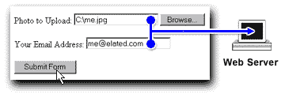

# 使用 CGI 和 Perl 上传文件

> 原文：<https://www.sitepoint.com/uploading-files-cgi-perl/>

您想让您的访问者能够将文件上传到您的网站吗？让他们用网络浏览器上传内容非常有用，也很有趣！你可以让他们向你的网站提供图片、声音和其他二进制文件。你可以在自己的网站上使用文件上传工具，通过自己的浏览器轻松更新网站内容。

如果你曾经使用过基于网络的电子邮件服务，比如雅虎！邮件或 [Hotmail](http://www.hotmail.com) ，你可能发送过带附件的邮件。要在电子邮件中添加附件，您只需点击网页上的“浏览…”按钮，从硬盘中选择文件，然后您的浏览器将文件发送到服务器。这是文件上传在行动！

但是它是如何工作的呢？在这篇文章中，我将向您介绍文件上传的过程，并向您展示如何使用 CGI 和 Perl 构建一个简单的文件上传示例——没错，Perl！尽管对其他脚本语言大肆宣传，Perl 仍然是支持网站的强大而流行的选择。我们将要经历的例子将允许人们上传他们自己的照片到你的网络服务器。

##### 你需要什么

要构建您自己的文件上传脚本，您需要以下内容:

*   访问支持 CGI 的网络服务器(几乎所有人都支持)
*   运行在 Web 服务器上的 Perl 副本
*   安装在 Web 服务器上的 Perl CGI 库 CGI.pm。这个很可能是预装的，如果不是，可以在这里抓取[。](http://stein.cshl.org/WWW/software/CGI/)

##### 它是如何工作的？

文件上传通过使用一种称为“文件”的特殊类型的表单字段和一种称为“多部分/表单数据”的特殊类型的表单编码来工作。文件表单字段显示一个文本框，用于输入要上传的文件的文件名，以及一个“浏览…”按钮:

用户点击“浏览…”按钮，调出文件选择器，选择他们希望上传的文件。然后，当他们单击表单上的“提交”按钮时，该文件的数据将与表单的其他数据一起上传到 Web 服务器:

在 Web 服务器端，软件(在我们的例子中是一个 CGI 脚本)解释从浏览器发送的表单数据，并提取文件名和内容，以及其他表单字段。通常，文件会保存到服务器上的一个目录中。

现在，让我们创建一个文件上传表单，允许您的用户将文件上传到您的 Web 服务器。

***1。*元素**

文件上传表单的第一部分是“表单”元素:

`<form action="/cgi-bin/upload.cgi" method="post"
enctype="multipart/form-data">`

注意特殊的`multipart/form-data`编码类型，这是我们用于文件上传的。还要注意，表单会将数据发送到我们的上传脚本中，这个脚本叫做`upload.cgi`，我们将在下一节中创建它。

***2。*文件上传字段**

文件上传表单的第二部分是上传字段本身。在本例中，我们正在创建一个表单，以便我们的用户可以上传他们的照片，因此我们需要一个名为“photo”的上传字段:

`
Photo to Upload: <input type="file" name="photo" />
`

***3。其他表单字段***

除了上述字段之外，您还可以在表单中包含其他常规表单字段。在这里，我们将允许用户提交他们的电子邮件地址和照片:

`
Your Email Address: <input type="text" name="email_address" />
`

***4。*提交按钮**

与常规表单一样，我们需要一个提交按钮，以便用户可以将表单发送到 Web 服务器:

`
<input type="submit" name="Submit" value="Submit Form" />
`

##### 完成的形式

我们完整的文件上传表单如下所示:

`<!DOCTYPE html PUBLIC "-//W3C//DTD XHTML 1.0 Strict//EN" "DTD/xhtml1-strict.dtd">
<html xml:lang="en" lang="en">
<head>
<meta http-equiv="Content-Type" content="text/html; charset=utf-8" />
<title>File Upload</title>
</head>
<body>
<form action="/cgi-bin/upload.cgi" method="post"
enctype="multipart/form-data">

Photo to Upload: <input type="file" name="photo" />

Your Email Address: <input type="text" name="email_address" />

<input type="submit" name="Submit" value="Submit Form" />

</form>
</body>
</html>`

将这个文件保存到您的硬盘上，并将其命名为类似于`"file_upload.html"`的名称。

到目前为止，一切顺利！现在我们来看看如何编写服务器 CGI 脚本，`upload.cgi`。

**Go to page:** [1](https://sitepoint.com/uploading-files-cgi-perl) | [2](https://sitepoint.com/uploading-files-cgi-perl-2/) | [3](https://sitepoint.com/uploading-files-cgi-perl-3/)

## 分享这篇文章