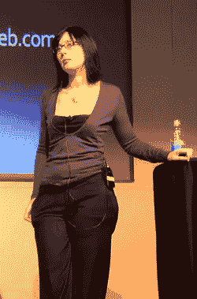
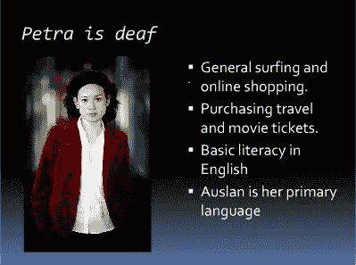

# 可用性:不仅仅是网络方向上的肤浅

> 原文：<https://www.sitepoint.com/usability-more-than-skin-deep-at-web-directions/>

在悉尼举行的 2007 年 Web Directions South 大会上，SitePoint 可用性博客作者 Lisa Herrod(又名场景女孩)提出了一种在网页设计过程中看待可用性和可访问性的新方法。她的方法不仅为更好的用户体验设计指明了方向，而且还将正式的易访问性测试带到了小型 web 开发团队的范围之内！

Lisa 大胆地提出了一个我认为对一些观众来说很难接受的观点:用户体验设计从定义上来说是不完整的，除非它在项目的每个阶段都考虑到了可访问性。然而，为了减轻这种打击，她展示了可用性工作中使用的“人物角色”是如何适应的，以包括常见的残疾，而不降低他们对衡量其他可用性因素的有用性。

当然，无论你如何处理，在网站开发中考虑可访问性都意味着更多的工作。但是*应该是谁的*作品呢？大多数企业负担不起在员工中配备一名全职的可访问性专家，他们要么请一名承包商来做最后一分钟的可访问性审查，要么将责任推给前端设计师。

Lisa 提出了一个更明智、更全面的方法:团队中的每个成员根据各自的优势共同承担创建可访问网站的责任。为了展示这可能是如何工作的，她从 W3C 的 [Web 内容可访问性指南](https://www.w3.org/TR/WAI-WEBCONTENT/) (WCAG)提供的可访问性检查清单开始，并将 16 个 WCAG [优先级 1 检查点](https://www.w3.org/TR/WAI-WEBCONTENT/#priorities)中的每一个分配给一个典型的 Web 开发团队的一个或多个成员(内容开发人员、设计人员、前端开发人员、信息架构师和脚本编写人员)。

Lisa 强调，构建可访问性网站仍然需要由专家进行正式的可访问性测试，但她建议的分担责任将使这种测试局限于由签约的可访问性专家而不是团队的全职成员进行的相对短暂的测试阶段。

Lisa 计划很快发布她的特定角色 WCAG 清单。与此同时，请查看她的演讲幻灯片，并在 Web Directions 网站上观看播客。

<object height="348" type="application/x-shockwave-flash" width="425" data="https://s3.amazonaws.com/slideshare/ssplayer.swf?id=122456&amp;doc=usability-more-than-skin-deep998"><param name="movie" value="https://s3.amazonaws.com/slideshare/ssplayer.swf?id=122456&amp;doc=usability-more-than-skin-deep998"></object>

## 分享这篇文章