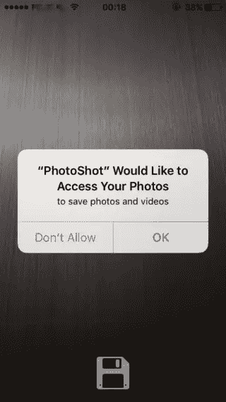
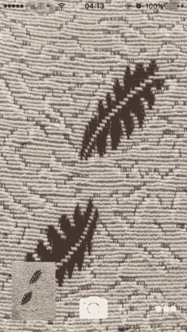
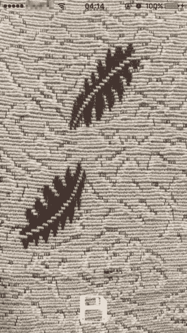
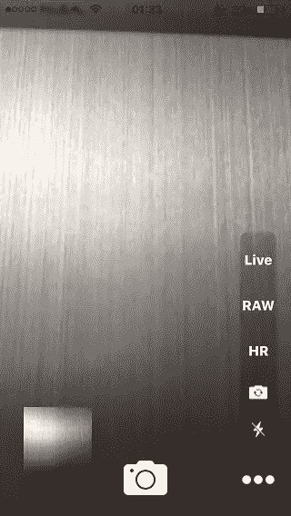

# 如何使用 AVCapturePhotoOutput 的最佳照片功能

> 原文：<https://www.sitepoint.com/use-avcapturephotooutputs-best-photo-features/>

如果你的应用程序的主要焦点是捕捉令人惊叹的风景，或者只是一张无辜的自拍，这都没有关系。对开发者来说，重要的是让用户最大限度地利用相机，并且做到毫无痛苦。为此，苹果公司做了一项出色的工作，在 iOS 10 中展示了`AVCapturePhotoOutput`。在本文中，我将展示如何实现它的一些特性。完整的项目可以从 [GitHub](https://github.com/sitepoint-editors/PhotoShot) 下载。

## 有什么新鲜事？

当然， *iOS* 应用以前也能使用相机。但是，该框架有新的特性，并改进了现有的特性。

*   *现场照片*将一张图片和一个短视频混合在一起。这使得照片“活起来”，更好地回忆起一段记忆。
*   现在可以拍摄原始照片了。
*   *缩略图*拍摄照片时，图像可用。这有助于用户预览图像。
*   此外，您还可以拍摄*宽彩色*图片。

我们开始吧。

## 简短的设置

为了保持重点，我没有包括设计`UIViewController`的步骤。它可以从整个项目的故事板中复制，或者您可以根据自己的喜好定制设计。

从导入正确的*框架*开始:

```
import UIKit
import AVFoundation
import Photos 
```

然后，声明以下变量和出口:

```
var captureSession = AVCaptureSession()
var cameraOutput = AVCapturePhotoOutput()
var previewLayer = AVCaptureVideoPreviewLayer()
var currentImage: (image: Data, imageName: String)?

var previewing = false
var highResolutionEnabled = true
var rawEnabled = false
var live = .Off
var flashMode = AVCaptureFlashMode.off
var cameraPosition = AVCaptureDevicePosition.back

@IBOutlet weak var capturedButton: UIButton!
@IBOutlet weak var previewView: UIView!
@IBOutlet weak var menuView: UIView!
@IBOutlet weak var toastLabel: UILabel!
@IBOutlet weak var saveButton: UIButton! 
```

`LiveMode`是自定义枚举。

```
enum LiveMode {
    case On, Off, Unavailable
} 
```

为了在屏幕上显示消息，使用以下功能显示一个*标签*。

```
func showToast(text: String) {
    toastLabel.text = text
    UIView.animate(withDuration: 1.0, animations: {
        self.toastLabel.alpha = 1.0
    })
    UIView.animate(withDuration: 1.0, delay: 2.0, options:
    .curveLinear, animations: {
        self.toastLabel.alpha = 0.0
    }, completion: nil)
} 
```

现在我们准备继续前进。

## 许可

当请求访问 iOS 10 中的敏感数据时，应该在 *info.plist* 文件中添加一个描述字符串，该字符串将显示给用户，让他们知道你将如何处理这些数据。以下按键分别描述了照片图库和相机的用法。这应该有助于用户更好地理解为什么要访问这些组件。

```
<key>NSPhotoLibraryUsageDescription</key>
<string>to save photos and videos</string>
<key>NSCameraUsageDescription</key>
<string>to take photos</string> 
```

第一次消息会显示如下截图。那么用户的选择将被记住。

 

## 加载相机

在用户可以与应用程序交互之前，相机应该加载。这是在`viewDidLoad`方法中完成的

```
override func viewDidLoad() {
    super.viewDidLoad()
    loadCamera()
} 
```

我们应该首先确保照相机是可用的。使用用户设置的摄像机位置初始化`AVCaptureDevice`。这会启动前置或后置摄像头。

```
func loadCamera() {
        let device = AVCaptureDevice.defaultDevice(withDeviceType: .builtInWideAngleCamera, mediaType: AVMediaTypeVideo, position: cameraPosition) 
```

在使用`captureSession`之前，任何先前的输入都被删除。当摄像机从前面切换到后面时，这是需要的，反之亦然。

```
captureSession.removeInput(captureSession.inputs.first as! AVCaptureInput!) 
```

将`cameraOutput`加到`AVCaptureSession`上。这是我们检查*实时照片*捕捉是否可用，并将*高分辨率*捕捉设置为用户选择的时候。

```
if let input = try? AVCaptureDeviceInput(device: device) {
    if (captureSession.canAddInput(input)) {
        captureSession.addInput(input)
        if (captureSession.canAddOutput(cameraOutput)) {

            cameraOutput.isHighResolutionCaptureEnabled = self.highResolutionEnabled
            captureSession.addOutput(cameraOutput)

            if !cameraOutput.isLivePhotoCaptureSupported {
                self.live = .Unavailable
            }
            // Next, the previewLayer is setup to show the camera content with the size of the view.

            previewLayer = AVCaptureVideoPreviewLayer(session: captureSession)
            previewLayer.frame = previewView.bounds
            previewLayer.videoGravity = AVLayerVideoGravityResizeAspectFill
            previewView.clipsToBounds = true
            previewView.layer.addSublayer(previewLayer)
            captureSession.startRunning()
        }
    } else {
        print("Cannot add output")
    }
} 
```

一个好的做法是当视图不再可见时停止`captureSession`:

```
override func viewDidDisappear(_ animated: Bool) {
    if captureSession.isRunning {
        captureSession.stopRunning()
    } else {
        captureSession.startRunning()
    }
} 
```

现在我们让摄像机工作了。该拍照了。

## 第一次捕获

要拍照只需添加下面的`IBAction`。当按下带有相机图标的按钮时，会触发此操作。其次是经典的相机快门音效。

```
@IBAction func didPressTakePhoto(_ sender: UIButton) {
    var settings = AVCapturePhotoSettings()

    cameraOutput.capturePhoto(with: settings, delegate: self)
} 
```

在请求的参数中有两件事需要注意。设置是我们刚刚创建的对象(属性将在另一个步骤中添加)。*委托*就是类应该遵守的`AVCapturePhotoCaptureDelegate` *协议*。这是在类的`extension`中完成的。

```
extension ViewController : AVCapturePhotoCaptureDelegate {

    func capture(_ captureOutput: AVCapturePhotoOutput,
        didFinishProcessingPhotoSampleBuffer photoSampleBuffer: CMSampleBuffer?,
        previewPhotoSampleBuffer: CMSampleBuffer?,
        resolvedSettings: AVCaptureResolvedPhotoSettings,
        bracketSettings: AVCaptureBracketedStillImageSettings?,
        error: Error?)
    {
        if let error = error {
            print("Capture failed: \(error.localizedDescription)")
        }
    }
} 
```

当所有的过程都完成了，照片准备好了，就调用这个方法。

## 极小的

当捕捉一张照片时，下一件自然要做的事情是显示它的预览。使这变得容易。它提供了指定图像尺寸的可能性，并在处理完成时获得预览。

我们只需要修改上面的`capture`函数，就可以把图片显示在左下角，如图所示。



```
if let error = error {
    print("Capture failed: \(error.localizedDescription)")
}

if  let sampleBuffer = photoSampleBuffer,
    let previewBuffer = previewPhotoSampleBuffer,
    let dataImage =  AVCapturePhotoOutput
        .jpegPhotoDataRepresentation(forJPEGSampleBuffer: sampleBuffer, previewPhotoSampleBuffer: previewBuffer) {

    self.currentImage = (dataImage, "\(resolvedSettings.uniqueID).jpg")
    showImage()
} 
```

这里，缓冲区被转换成一个`Data`对象，并被设置为当前图像。函数`showImage`只是将这个对象设置为`capturedButton`图像。

```
func showImage() {
    let dataProvider = CGDataProvider(data: self.currentImage!.image as CFData)
    let cgImageRef: CGImage! = CGImage(jpegDataProviderSource: dataProvider!, decode: nil, shouldInterpolate: true, intent: .defaultIntent)
    let image = UIImage(cgImage: cgImageRef, scale: 1.0, orientation: UIImageOrientation.right)

    self.capturedButton.imageView?.contentMode = .scaleAspectFill
    self.capturedButton.setImage(image, for: .normal)
    self.capturedButton.isHidden = false
} 
```

要设置预览的尺寸，我们需要给`AVCapturePhotoSettings`对象添加一个预览格式。

```
var settings = AVCapturePhotoSettings()
let previewPixelType = settings.availablePreviewPhotoPixelFormatTypes.first!
let previewFormat = [
    kCVPixelBufferPixelFormatTypeKey as String: previewPixelType,
    kCVPixelBufferWidthKey as String: self.capturedButton.frame.width,
    kCVPixelBufferHeightKey as String: self.capturedButton.frame.height
] as [String : Any]
settings.previewPhotoFormat = previewFormat 
```

## 保存数据

当预览*缩略图*时，将捕获的照片保存在库中的选项在该项目中可用。一个简单的动画被放置在适当的位置，用于从缩略图到全屏的转换，反之亦然。这也显示和隐藏了*保存*按钮。

```
@IBAction func previewClicked() {
    UIView.animate(withDuration: 0.5, animations: {
        if !self.previewing {
            self.capturedButton.frame = self.view.frame
            self.saveButton.isHidden = false
        } else {
            let x: CGFloat = 20.0
            let y: CGFloat = self.view.frame.height - 100.0 - 20.0
            self.capturedButton.frame = CGRect(x: x, y: y, width: 75.0, height: 100.0)
            self.saveButton.isHidden = true
        }
    })
    previewing = !previewing
} 
```

当点击`Save`按钮时，用户被要求*许可*以访问照片库。只有在获得许可后，我们才会继续尝试保存照片。在主线程中调用`showToast`函数，因为它修改了 UI。

```
@IBAction func saveClicked() {
    if let image = currentImage {
        PHPhotoLibrary.requestAuthorization({ (status) in
            if status == .authorized {
                do {
                    try self.save(image: image.image, withName: image.imageName)
                } catch let error {
                    print(error.localizedDescription)
                }
            } else {
                DispatchQueue.main.async {
                    self.showToast(text: "Not authorized!")
                }
            }
        })
    }
} 
```

最后，真正的工作是在`save`函数中完成的。首先，图像被保存到一个临时文件中。

```
func save(image: Data, withName: String) throws {
    let url = URL(fileURLWithPath: NSTemporaryDirectory().appending(withName))

    try image.write(to: url, options: .atomicWrite) 
```

然后，`PHPhotoLibrary`用于添加图像作为资源。`performChanges`函数也有一个`completionHandler`来进行 UI 修改或其他工作。

```
 PHPhotoLibrary.shared().performChanges({
        let request = PHAssetCreationRequest.forAsset()
        request.addResource(with: .photo, data: image, options: nil)

        let creationOptions = PHAssetResourceCreationOptions()
        creationOptions.shouldMoveFile = true
        request.addResource(with: .alternatePhoto, fileURL: url, options: nil)

    }, completionHandler: { (success, error) in

        if let error = error {
            print(error.localizedDescription)
            return
        } 
```

确保一切正常后，临时文件被删除，并显示一条成功消息。

```
 if FileManager.default.fileExists(atPath: url.absoluteString) {
            do {
                try FileManager.default.removeItem(at: url)
            }
            catch let err {
                print(err.localizedDescription)
            }
        }

        DispatchQueue.main.async {
            self.saveButton.isHidden = true
            self.showToast(text: "Image saved")
        }
    })
} 
```



## 生的

iPhone 6s、6s+、SE 和 9.7 英寸 iPad Pro 都提供 RAW 图像捕捉和*实时照片*。 *RAW* 照片未经压缩，每像素位数更多，允许更多编辑选项。

要捕捉一张 *RAW* 照片需要`AVCaptureSessionPresetPhoto`格式和后置摄像头。该代码非常类似于普通的图像捕捉。本例中的`AVCapturePhotoSettings`使用原始像素格式初始化。

```
 if rawEnabled {
        if let rawFormat = cameraOutput.availableRawPhotoPixelFormatTypes.first {
            settings = AVCapturePhotoSettings(rawPixelFormatType: OSType(rawFormat))
        }
    } 
```

现在，下面的回调被添加到类的扩展中。这种情况下文件的格式是`.dng`。

```
func capture(_ captureOutput: AVCapturePhotoOutput,
            didFinishProcessingRawPhotoSampleBuffer rawSampleBuffer: CMSampleBuffer?,
            previewPhotoSampleBuffer: CMSampleBuffer?,
            resolvedSettings: AVCaptureResolvedPhotoSettings,
            bracketSettings: AVCaptureBracketedStillImageSettings?,
            error: Error?) {

    if let error = error {
        print("Capture failed: \(error.localizedDescription)")
    }

    if  let sampleBuffer = rawSampleBuffer,
        let previewBuffer = previewPhotoSampleBuffer,
        let dataImage =  AVCapturePhotoOutput
            .dngPhotoDataRepresentation(forRawSampleBuffer: sampleBuffer, previewPhotoSampleBuffer: previewBuffer) {
        self.currentImage = (dataImage, "\(resolvedSettings.uniqueID).dng")
        showImage()
    }
} 
```

## 更多选项

为了改变一些设置，如闪光灯或相机的位置，我在右下角添加了一个菜单。通过这个函数它是可见的。

```
@IBAction func moreClicked() {
    UIView.animate(withDuration: 1.0, animations: {
        self.menuView.alpha = 1.0 - self.menuView.alpha
    })
} 
```



每个按钮都有其被触发的`IBAction`。

### 高分辨率

更改按钮文本的布尔值和字体。

```
@IBAction func toggleHR(button: UIButton) {
    highResolutionEnabled = !highResolutionEnabled
    button.titleLabel?.font = highResolutionEnabled ?
        UIFont (name: "System-Heavy", size: 15) :
        UIFont (name: "System-Thin", size: 15)

    showToast(text: "High resolution: \(highResolutionEnabled)")
} 
```

然后将以下参数设置为`AVCapturePhotoSettings`。

```
settings.isHighResolutionPhotoEnabled = self.highResolutionEnabled 
```

### 摄像机位置

改变位置并重新加载相机。

```
@IBAction func toggleCamera() {
    if cameraPosition == .back {
        cameraPosition = .front
        showToast(text: "Camera: front")
    } else {
        cameraPosition = .back
        showToast(text: "Camera: back")
    }

    loadCamera()
} 
```

### 闪光

因为闪光模式有三种可能的值，所以使用一个开关盒来循环选择。相应地设置按钮上的图像。

```
@IBAction func toggleFlash(button: UIButton) {
    switch self.flashMode {
    case .off:
        self.flashMode = .on
        showToast(text: "Flash mode: on")
        button.setImage(UIImage(named: "FlashOn"), for: .normal)
        break
    case .on:
        self.flashMode = .auto
        showToast(text: "Flash mode: auto")
        button.setImage(UIImage(named: "FlashAuto"), for: .normal)
        break
    case .auto:
        self.flashMode = .off
        showToast(text: "Flash mode: off")
        button.setImage(UIImage(named: "FlashOff"), for: .normal)
        break
    }
} 
```

在拍摄图像之前，如果可用的话，使用闪光模式更新设置。

```
if cameraOutput.supportedFlashModes.contains(NSNumber(value: self.flashMode.rawValue)) {
    settings.flashMode = self.flashMode
} 
```

### 生的

之前我们看到了如何捕捉一张 *RAW* 图像，但是要在 *RAW* 和普通照片之间切换，我们需要下面的函数。首先，我们检查是否可以捕捉一个*原始*图像，然后进行类似高分辨率切换功能。

```
@IBAction func toggleRAW(button: UIButton) {
    if cameraOutput.availableRawPhotoPixelFormatTypes.count == 0 {
        showToast(text: "RAW not available")
        return
    }

    rawEnabled = !rawEnabled
    button.titleLabel?.font = rawEnabled ?
    UIFont (name: "System-Heavy", size: 15) :
    UIFont (name: "System-Thin", size: 15)

    showToast(text: "RAW: \(rawEnabled)")
} 
```

### 活着

加载相机时设置`live`变量的值。不可用时为-1，开或关时为 0 或 1。

```
@IBAction func toggleLive(button: UIButton) {
    switch live {
    case .Unavailable:
        showToast(text: "Live photo not supported")
        break

    case .On:
        live = .Off
        showToast(text: "Live: off")
        button.titleLabel?.font = UIFont (name: "System-Thin", size: 15)
        break

    case .Off:
        live = .On
        showToast(text: "Live on")
        button.titleLabel?.font = UIFont (name: "System-Heavy", size: 15)
        break
    }
} 
```

在拍摄照片之前，我们还需要在设置中为视频文件设置 *url* 。

```
if self.live == .On {
    let path = "\(NSTemporaryDirectory())/Photoshot_\(settings.uniqueID)"
    settings.livePhotoMovieFileURL = URL(fileURLWithPath: path)
} 
```

## 结论

`AVCapturePhotoOutput`简化了在应用程序中实现相机功能的过程。本文简要介绍了如何使用这些函数。

希望你觉得有趣，有帮助。

愿法典与你同在。

### 参考

*   [iOS 摄影技术的进步](https://developer.apple.com/videos/play/wwdc2016/501/)
*   [AVCapturePhotoOutput–超越基础](https://developer.apple.com/videos/play/wwdc2016/511/)
*   [AVCapture 照片输出](https://developer.apple.com/reference/avfoundation/avcapturephotooutput)

## 分享这篇文章