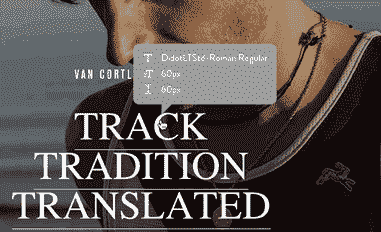

# 使用忍者来分析网页字体

> 原文：<https://www.sitepoint.com/use-ninja-analyze-web-fonts/>

好的排版总是艺术和科学的微妙平衡。当然，数学和网格会让你走得更远。但是伟大的字体——像绘画或诗歌——也常常有一种天生的、难以定义的美，这种美通常只来自工艺和来之不易的经验。

换句话说，你需要看很多字体——并且知道你在看什么——才能真正理解它。

几周前，我们谈到了一个为字体爱好者设计的伟大的小工具，叫做[字体样本](http://www.typesample.com/ "Type Sample site")。这个星期我偶然发现了另一个很酷的小工具——[font face 忍者](http://fontface.ninja/ "Fontface Ninja")。

字体忍者将字体、大小和行高的印刷信息放在你的“光标提示”上。只需按下忍者按钮，指向某个类型，所有内容就会立即显示出来。

单击任何文本元素都会将该文本样式复制到屏幕顶部的面板上，然后您可以在那里尝试不同大小的样本字体。

当然，这里没有你不能通过 Firebug 或 Chrome 开发工具面板找到的信息。

但有时真正的诀窍是让事情变得如此简单，以至于它变得几乎无意识。即使你只是对一些漂亮的字体设计有一点点好奇，Fontface Ninja 在让它变得微不足道方面做得很好。

目前[字体忍者](http://fontface.ninja/ "Fontface Ninja")可以作为 Chrome 和 Safari 的扩展，或者作为其他浏览器的书签。

看看这个。

*最初发表于 [SitePoint 设计通讯](http://sitepointnewsletters.createsend1.com/t/ViewEmail/y/1EA52C5F6D30155C)。*

## 分享这篇文章