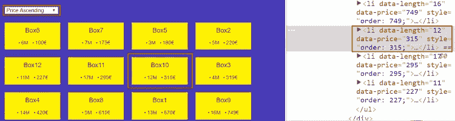
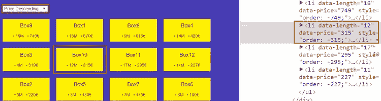

# 快速提示:使用 Flexbox 和 jQuery 的用户可排序列表

> 原文：<https://www.sitepoint.com/user-sortable-lists-flexbox-jquery/>

在本文中，我们将一步一步地学习如何构建一个简单的 jQuery 插件，该插件根据元素的自定义数据属性值对元素进行排序。

如果你对最终结果感兴趣，可以看看相应的 CodePen 演示:

参见 [CodePen](http://codepen.io) 上通过 SitePoint ( [@SitePoint](http://codepen.io/SitePoint) )对元素进行排序的 Pen [简单 jQuery 插件。](http://codepen.io/SitePoint/pen/jyJwXO/)


> **注意:**本文假设你对 [flexbox](https://www.sitepoint.com/flexbox-css-flexible-box-layout/) ，以及如何[开发 jQuery 插件](https://www.sitepoint.com/developing-jquery-plugins/)有基本的了解。如果您不熟悉这些主题，请务必查看相关链接。

## 无障碍问题

为了构建我们的插件，我们将利用 flexbox 的强大功能。

默认情况下，弹性项目根据其源顺序进行布局。但是，通过使用 [order](https://www.w3.org/TR/css-flexbox-1/#order-property) 属性，我们能够改变它们在父 flex 容器中的顺序。具有较低`order`值的项目首先出现。请参见下面的示例:

在 [CodePen](http://codepen.io) 上通过 SitePoint ( [@SitePoint](http://codepen.io/SitePoint) )查看 Pen [Flexbox 的“订单”属性](http://codepen.io/SitePoint/pen/rjXzzN/)。

如果有多个项目具有相同的`order`值，这些项目的顺序取决于它们的源顺序。

虽然`order`属性允许我们很容易地对元素进行重新排序，但是它有一个可访问性限制:它造成了源顺序和视觉顺序之间的脱节。为了更好地理解这个问题，请看一下[这篇文章](https://webdesign.tutsplus.com/tutorials/a-few-different-css-methods-for-column-ordering--cms-27079)(特别是在“源顺序与视觉顺序”部分)。

因此，在继续研究如何构建我们的插件之前，请注意它是不可访问的。

## 加价

首先，我们定义一个包含 12 个列表项的无序列表:

```
<ul class="boxes">
  <li>
    <a href="#">
      Box1
      <div class="details">
        <span class="length">13M</span>
        <span class="price">670€</span>
      </div>
    </a>
  </li>

  <!-- more list items here -->

</ul> 
```

注意，在我们的每个列表项中有一个`.details`元素，它显示了相应项的一些信息。正如我们稍后将看到的，我们还将添加自定义的 HTML 属性来存储这些信息。

> **注意:**`.details`元素并不是真正必要的。我们使用它只是为了更好地理解目标元素是如何排序的。

接下来，我们确定我们想要排序的属性。在我们的项目中，这些是`price`和`length`属性。考虑到这一点，我们使用它们的名字将定制属性(`data-price`和`data-length`)应用到我们的列表项。这些属性的值匹配属于`.details`元素的`.length`和`.price`元素的文本值(只有数字)。

例如，下面是第一个列表项的属性:

```
<li data-length="13" data-price="670">
  <a href="#">
    Box1
    <div class="details">
      <span class="length">13M</span>
      <span class="price">670€</span>
    </div>
  </a>
</li> 
```

此时，我们指定了负责列表项排序的元素。我们使用一个`<select>`元素来做这件事:

```
<select class="b-select">
  <option disabled selected>Sort By</option>
  <option data-sort="price:asc">Price Ascending</option>
  <option data-sort="price:desc">Price Descending</option>
  <option data-sort="length:asc">Length Ascending</option>
  <option data-sort="length:desc">Length Descending</option>
</select> 
```

如您所见，所有的`<option>`元素(除了第一个)都包含了`data-sort`属性。该属性的值使用以下约定:

```
<option data-sort="price:asc"> 
```

因此，作为值，我们有我们想要排序的属性，后跟一个冒号以及“asc”或“desc”指示符。

## CSS 样式

准备好标记后，让我们为页面添加一些基本样式。具体来说，我们将无序列表定义为一个 flex 容器，并给出列表项`width: 25%`。以下是相关的 CSS 规则:

```
.boxes {
  display: flex;
  flex-wrap: wrap;
}

.boxes li {
  width: 25%;
} 
```

## 构建插件

我们称我们的插件为`numericFlexboxSorting`。在展示我们将遵循的构建它的过程之前，让我们从最终目标开始，并解释我们如何初始化它。

### 正在初始化插件

通常，插件应该按如下方式初始化:

```
$("your-select-tag").numericFlexboxSorting(); 
```

例如，在我们的例子中:

```
$(".b-select").numericFlexboxSorting(); 
```

默认情况下，插件将使用类`.boxes li`对元素进行排序。我们可以通过更改`elToSort`配置属性的值来覆盖这种行为:

```
$(".b-select").numericFlexboxSorting({
  elToSort: "the-elements-you-want-to-sort"
}); 
```

### 步骤分解

现在我们准备好描述开发过程了！

作为第一步，我们通过添加`numericFlexboxSorting`方法来扩展 jQuery 的原型(`$.fn`)对象:

```
$.fn.numericFlexboxSorting = function() {
  const $select = this;

  // do stuff here

  return $select; 
}; 
```

在该方法中，`this`关键字引用了我们的`<select>`元素。一旦我们创建了插件，我们必须返回这个元素。如果我们不这样做，方法链接将不起作用。

例如，考虑以下代码:

```
$(".b-select").numericFlexboxSorting().css("background", "red"); 
```

这里，除非我们返回目标元素，否则 [css](http://api.jquery.com/css/) 方法不会做任何事情。

正如我们已经提到的，默认情况下，插件将使用类`.boxes li`对元素进行排序。然而，如果我们愿意，我们应该能够覆盖这种行为。为此，我们利用 jQuery 的[扩展](https://api.jquery.com/jquery.extend/)方法:

```
$.fn.numericFlexboxSorting = function(options) {
  const settings = $.extend({
    elToSort: ".boxes li"
  }, options);

  // do stuff here
}; 
```

该插件将按升序或降序排列数字。考虑到这一点，我们定义了稍后将使用的相应变量:

```
$.fn.numericFlexboxSorting = function(options) {
  const ascOrder = (a, b) => a - b;
  const descOrder = (a, b) => b - a;

  // do stuff here
}; 
```

一旦用户从下拉列表中选择了一个选项(除了第一个)，我们就应该检索并评估它的值。为此，我们使用了 [change](https://api.jquery.com/change/) 事件:

```
$.fn.numericFlexboxSorting = function(options) {
  const $select = this;

  $select.on("change", () => {
    const selectedOption = $select.find("option:selected").attr("data-sort");
    sortColumns(settings.elToSort, selectedOption);
  });

  // do stuff here
}; 
```

在事件处理程序中，我们做两件事:

1.  检索所选选项的`data-sort`属性的值(例如`price:asc`)。
2.  调用`sortColumns`函数。

`sortColumns`函数接受两个参数:

1.  我们要排序的元素。
2.  所选选项的`data-sort`属性值。

下面是这个函数的主体:

```
function sortColumns(el, opt) {
  const attr = "data-" + opt.split(":")[0];
  const sortMethod = (opt.includes("asc")) ? ascOrder : descOrder;
  const sign = (opt.includes("asc")) ? "" : "-";

  // 1
  const sortArray = $(el).map((i, el) => $(el).attr(attr)).sort(sortMethod);

  // 2
  for (let i = 0; i < sortArray.length; i++) {
    $(el).filter(`[${attr}="${sortArray[i]}"]`).css("order", sign + sortArray[i]);
  } 
} 
```

让我们解释一下里面发生了什么:

1.  根据用户想要排序的属性(即`price`或`length`)，我们获得每个目标元素的相关`data-* attribute`的值，并将其存储在一个数组中。另外，根据用户希望如何对目标元素进行排序，我们可以按升序或降序对数组进行排序。

2.  我们遍历数组，找到相关的元素，并给它们分配一个`order`属性值(正的或负的),该属性值由它们对应的`data-* attribute`的值决定。
    因此，例如，如果用户选择了`price:asc`选项，带有`data-price: 315`的元素将接收到`order: 315`。

    

    另一方面，如果用户选择了`price:desc`选项，它接收`order: -315`。

    

最后，为了防止与使用`$`变量的其他库发生冲突，我们将代码包装在一个立即调用的函数表达式中，如下所示:

```
(function($) {
  $.fn.numericFlexboxSorting = function(options) {
    // do stuff here
  };
})(jQuery); 
```

我们的插件准备好了。您可以在下面的 Codepen 演示中看到它的实况:

参见 [CodePen](http://codepen.io) 上通过 SitePoint ( [@SitePoint](http://codepen.io/SitePoint) )对元素进行排序的 Pen [简单 jQuery 插件。](http://codepen.io/SitePoint/pen/jyJwXO/)