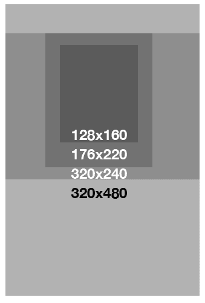
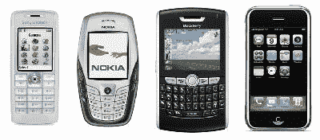
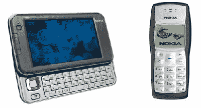

# 如何增强移动网络的用户定位

> 原文：<https://www.sitepoint.com/user-targeting-for-the-mobile-web/>

任何网站的目标都应该是了解你的客户，以便向他们提供最合适的内容。

这个目标对于移动网站来说更加重要——你不仅需要了解你的客户，还需要知道他们可能在你的移动网站上做什么，以及当他们做的时候他们会在哪里。传统网站的客户最有可能坐在办公桌前，面对一个分辨率不错的大显示器。浏览你的移动网站的访问者不太可能处于同样的情况——他们可能在排队等候，乘坐火车或公共汽车，奔向登机口，或者在深夜迷失在一个陌生的城镇并试图到达某个地方。

谷歌是一家投入大量精力简化其网络应用程序以适应移动用户的公司。Google 的 web 开发人员已经确定并专注于三个主要群体，他们试图将他们的应用程序定位于这些客户的需求。这是三个坚实的类别，值得为您自己的移动网站检查。现在让我们来看看它们。

## 1.偶然的冲浪者

这些客户的行为方式与传统网站的客户类似。偶尔上网的人对任何一件事都不感兴趣，但在任务间隙会有几分钟的空闲时间四处看看。在台式电脑的世界里，这几分钟可能发生在会议间隙，或者用户短暂休息的时候。对于移动用户来说，这几分钟可能发生在用户坐在外面等着见朋友的时候，在去某个地方的汽车或出租车里，甚至在早上的通勤时间。如果你的网站专注于吸引休闲冲浪爱好者的内容，那么就要注意手机用户的时间和屏幕大小的限制。

目标应该是让你的内容更“有粘性”，这样偶尔上网的人会回来看更多。例如，你不应该提供很长的内容。相反，目标应该是小块的，一口大小的，足以让客户保持兴趣，但不要太长，以至于用户不能在他们有空的时候浏览你的网站。

## 2.回头客

回头客是指那些不断回来购买某种特定新闻或数据的人。如果你的网站是那种提供股票、天气或体育比分信息的网站，你可能会有很多回头客。移动设备的界面是非常有限的，所以如果你知道你的回头客一次又一次回来的原因，让它自然地出现在网站的顶部。避免将客户想要的内容隐藏在 3 到 4 次点击之后。

移动网站定制可能很困难，但并非不可能。传统网站可能会要求您登录，但在移动设备上，数据输入不容易执行，所以最好避免。

一种选择是允许访问者使用他们的台式机来简化他们的移动体验。以苹果 iTunes 音乐商店的一个页面为例。一个回头客可能在台式机上定制他或她的移动站点版本；这可以生成一个特殊的 URL，其中编码了用户的所有偏好。下次用户从移动设备访问您的网站时，他或她可以利用这个特殊的 URL，享受完全根据他或她的偏好定制的体验。

## 3.“紧急，现在！”访问者

取决于你的业务，你对“紧急，现在！”会有所不同。对于在线商店，客户可能认为以下消息很紧急:

我的书应该昨天就到了。他们迟到了。他们在哪里？”

更严重的紧急情况可能是:

“我迟到了 15 分钟。我能赶上我的航班吗？”

对于一些客户来说，一切都是紧急的！但是，通过识别客户最重要的需求，并使相关信息在一次点击或更少的时间内即可访问，您将极大地增加您的移动网站的有用性。

当然，用户定位的另一个方面是知道他们将使用哪种设备。

## 了解你的手机

随着等离子电视和高清电视慢慢进入市场，广播公司遇到了在哪里放置他们的标志和新闻标签的问题。以前，他们知道所有的电视都是相同的 3×2 尺寸，所以他们知道屏幕的相对宽度。现在，他们开始感受到处理各种电视分辨率和尺寸的痛苦——这是 web 开发人员每天都要处理的问题。

当然，移动世界更糟糕！我们不仅要适应不同的屏幕尺寸和分辨率，还要适应不同的形状，如图 1 所示。从短而长的矩形，到高而瘦的矩形，再到完美的正方形，移动世界包含了丰富的变化，几乎让你想拔光头发！

如果你考虑最常见的手机，它们可以根据屏幕大小进行分类——上下相差几个像素:

*   128 x 160 像素
*   176 x 220 像素
*   240 x 320 像素
*   320 x 480 像素

For the iPhone 4 and 4S, you’ll need to cater for the Retina Display, which squeezes a 960 by 640 resolution into a 3.5″ area.

了解这些屏幕尺寸有助于你优化你的一些内容，但是最好保持你的网站的形状和风格尽可能的简单和线性。手机上没有鼠标——只有上下移动的功能——所以你不能要求用户在页面上跳来跳去。

## 智能手机和平板电脑与绿屏手机

手机市场有几个例外。它们是真正的高端设备，如 iPhone、iPad 或诺基亚互联网平板电脑，以及非常基本的老式“绿屏”单色点阵设备，如[诺基亚 3310](http://en.wikipedia.org/wiki/Nokia_3310) ，两者都显示在图 3 中。

低端手机有几个局限性，包括屏幕分辨率和呈现 XHTML 文档的能力非常有限。正如我在前面提到的，如果你的大多数客户都属于这一类，那么 WML 可能仍然适合你。

另一方面，高端设备通常能够运行类似于台式机的网络浏览器。向这些设备提供高质量的用户体验可能很棘手——虽然设备可能完全能够呈现完整的传统网页设计，但它可能通过蜂窝网络传输数据，这比标准的宽带互联网速度慢得多。因此，即使设备可以处理正常的网站，客户的情况和他们请求您的服务的原因可能意味着向他们发送您的网站的正常版本不是最佳解决方案。

在你开始设计一个移动网站之前，有很多关于你的客户或用户的信息需要了解。有什么建议或者小技巧可以补充？你如何获得你正在开发的网站的移动用户数据？

## 分享这篇文章