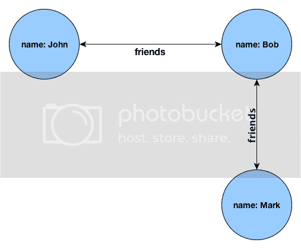
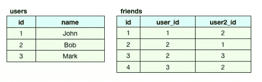
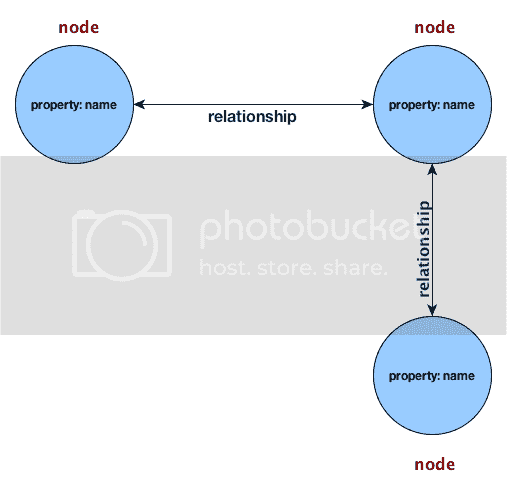

# 用 Ruby 使用图形数据库。第一部分:导言

> 原文：<https://www.sitepoint.com/using-a-graph-database-with-ruby-part-i-introduction/>

免责声明:有几个可用的图形数据库项目，包括开源和商业项目，旨在成为图形数据库 API 的项目，以及专门从事分布式图形处理的项目。在“使用 Ruby 的图形数据库”系列文章中，我将专门讨论和使用 ***Neo4j*** 。

在我们深入研究 Neo4j 的优点、差异和复杂性以及如何与 Ruby 一起使用之前，我们首先需要了解什么是图形数据库，它相对于传统数据库的优势，以及我们可以成功使用图形数据库的一些场景。

## 什么是图形数据库？

图形数据库*不是*顾名思义，是存储图形或图像的数据库。它是一个数据库，使用节点、属性和边等图形结构来表示和存储数据。此外，它允许您表示任何类型的数据，而不受常规数据库的限制。

为了更好地理解，我们来分别讨论一下这些结构以及它们所代表的含义:

**节点**:节点可以用来表示你能想到的任何类型的实体，可以是一家企业、一篇博客文章、一个地点、一个石油钻井平台、一个城市等等。图形数据库不关心它们表示什么类型的数据。

**属性**:属性，有时称为属性，是与节点相关的命名值。例如，如果我们考虑一个节点的城市表示，其中一个属性是“名称”，另一个属性是“人口”，依此类推。

边缘(Edges):边缘，有时被称为关系，连接节点到节点，并将它们组织成任意的结构，如地图、列表或树。值得注意的是，当一个节点是一个关系的开始节点时，从该节点的角度来看，该关系将是一个 ***传出*** 关系。并且当一个节点处于一个关系的末端时，从该节点的角度来看，该关系将是一个 ***传入*** 关系。理解这一点将使你更容易理解这些例子。

## 图形数据库可以用来做什么？

有许多场景可以考虑使用图形数据库。在我列举一些例子之前，与任何架构和技术决策一样，您需要分析所有可能的解决方案。然后，您可以根据自己的需求选择最适合自己的产品。

其中一些场景包括:社交网络、欺诈检测、人物/电影/音乐推荐、制造业等。以社交网络为例，做类似“假设 Bob 是我的朋友，给我所有朋友，他们是 Bob 的朋友的朋友的朋友的朋友”这样的事情可能有点琐碎。这是可能的，因为所涉及的路径查找算法很容易通过遍历图来实现。想象一下通过关系数据库来做这件事？一场噩梦！

使用图形数据库的另一个优点是，您可以使用白板或一张纸轻松、自然地对领域建模。具体来说，被使用的名词成为节点，动词成为关系，形容词和副词成为属性。

## 图形数据库示例

让我们看看下面的场景，以及我们如何使用图形数据库来构建它: *John 是 Bob 的朋友，Bob 是 Mark 的朋友。*从视觉上来说，我们可以这样描述场景:

你会注意到视觉表现几乎就是我们口头表达场景的方式。这是一个非常简单的例子，我们可以用它来比较传统 SQL 数据库结构和图形数据库结构的实现:

### 传统 SQL

在传统的 SQL 结构中， *users* 表中的每一行代表一个用户， *friends* 表中的每一行代表两个用户之间的关系。如果我们决定以后向*用户*表添加额外的属性，我们将不得不改变该表的基本结构。如果我们只想向用户子集添加新属性，我们仍然需要修改整个 *users* 表，或者创建一个新表来容纳用户子集的新值。在处理数千万条记录时，这不是一个理想的场景。

### 图形数据库

另一方面，图形数据库没有固定的数据结构或模式，很像 NoSQL 数据库。现在，让我们理解上面的图代表了什么:每个节点代表一个实体——在我们的例子中是一个用户；每个节点都包含属性值，在本例中是用户名；每条线代表节点之间的关系。这再简单不过了。为了补充传统 SQL 示例中描述的场景，如果我们决定向用户子集添加额外的属性，我们可以很容易地在每个节点的级别上执行该操作，而不是在整个表范围内执行事务。

## 什么是 Neo4j

据该项目的开发者 Neo Technology 称，Neo4j 是“世界领先的图形数据库”。这是一个受商业支持的开源图形数据库，用 Java 实现，一些关键特征包括:

*   使用直观的面向图形的模型表示数据。
*   多种语言的绑定，包括 Ruby、Python 和 Closure。
*   基于磁盘的本机存储管理器针对存储图形结构进行了完全优化，以实现最高的性能和可扩展性。
*   巨大的可伸缩性，它可以在一台机器上处理几十亿个节点/关系/属性的图表。
*   易于使用和方便的面向对象的 API。
*   使用持久性和完全持久的事务存储来处理不适合内存的大型图形。
*   强大的遍历框架，用于节点空间中的高速遍历。
*   针对高度关联的数据进行了优化。
*   占用空间小，只有 750k 左右的 jar 文件。
*   它为其绑定不支持的语言提供了一个 REST 接口。
*   它能够以毫秒的速度穿越超过 1000 级的深度。
*   它提供了双重许可:开源和商业。
*   它与 Lucene 无缝集成，提供对节点和关系的全文搜索，包括短语查询、通配符查询、邻近查询、分级搜索、排序等等。

## 将 Neo4j 与 Ruby 一起使用

将 Neo4j 与 Ruby(或 Rails)应用程序集成有不同的方式，在我在这里列出它们之前，下面是一些可用解决方案的组合特性:

*   面向对象的映射
*   主动模型的“嵌入式”替代品
*   嵌入式数据库
*   Neo4j REST Api 的瘦 Ruby 包装器
*   全文搜索的索引
*   可链接的方法，例如:*方法(x)。方法(y)。*(z 法)…
*   当与 Rails 一起使用时，语法非常类似于 ActiveRecord

很整洁，不是吗？话不多说，下面是我们将在下一篇文章中使用的评估工具:

*   neo4j . Rb:JRuby 的图形数据库
*   Neoid: 使用 Neo4j.rb 来支持它的可搜索对象
*   **Neography:**Neo4j 服务器的 Rest API

如果你很好奇，我鼓励你看看这些项目，以便更好地理解它们做什么，以及它们有多复杂或简单。这样你将有更好的机会理解下一篇文章中的例子。

## 下一步是什么

本系列的第二部分将介绍使用上述方法将 Neo4j 与 Ruby 集成的不同方式。相信我，你不会想错过的。

## 分享这篇文章