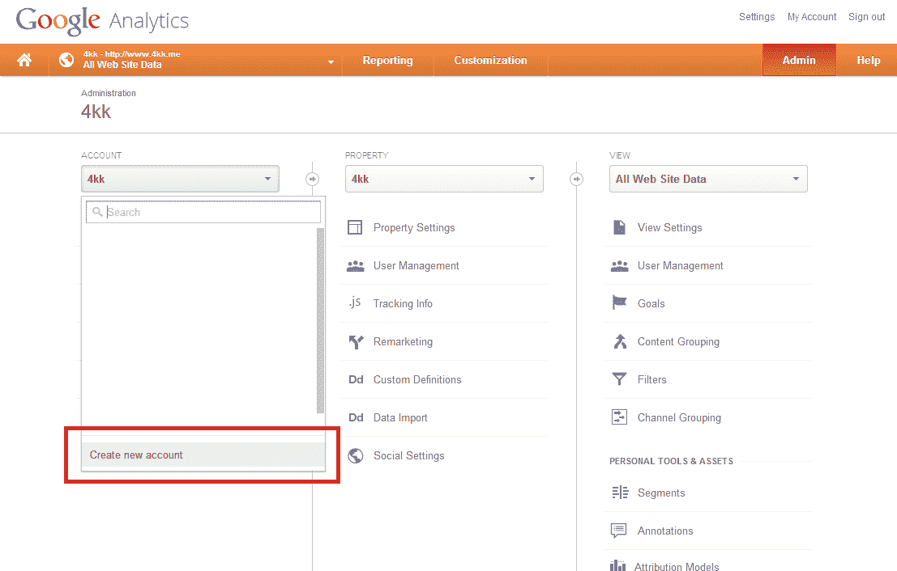
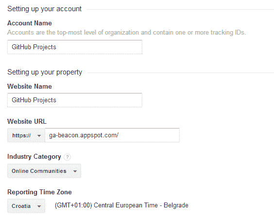
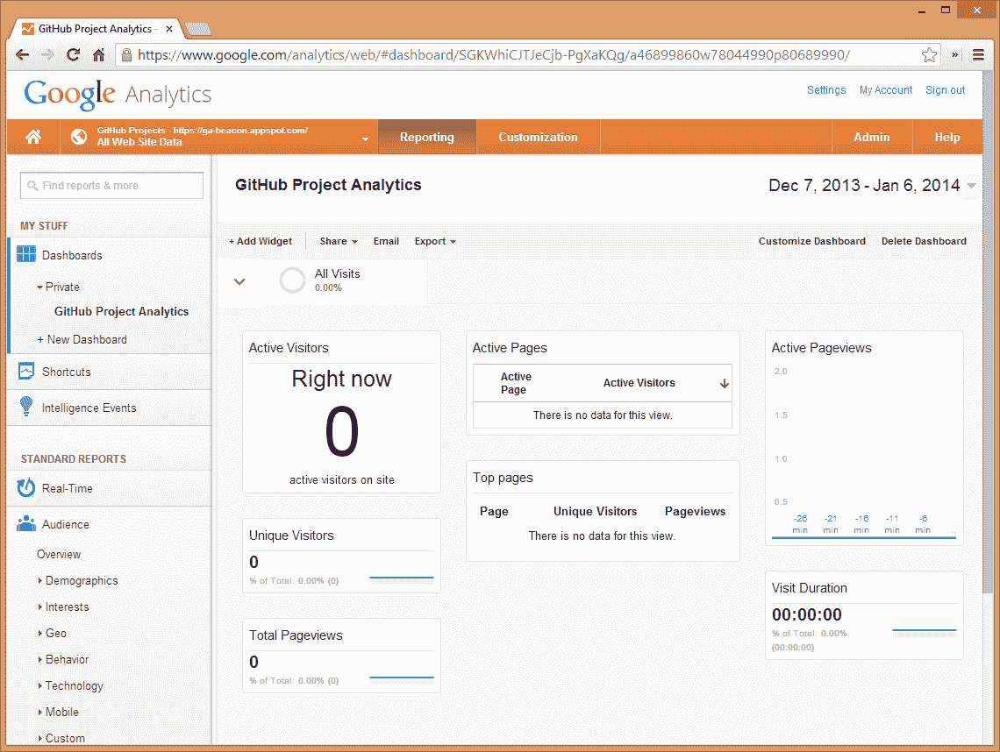
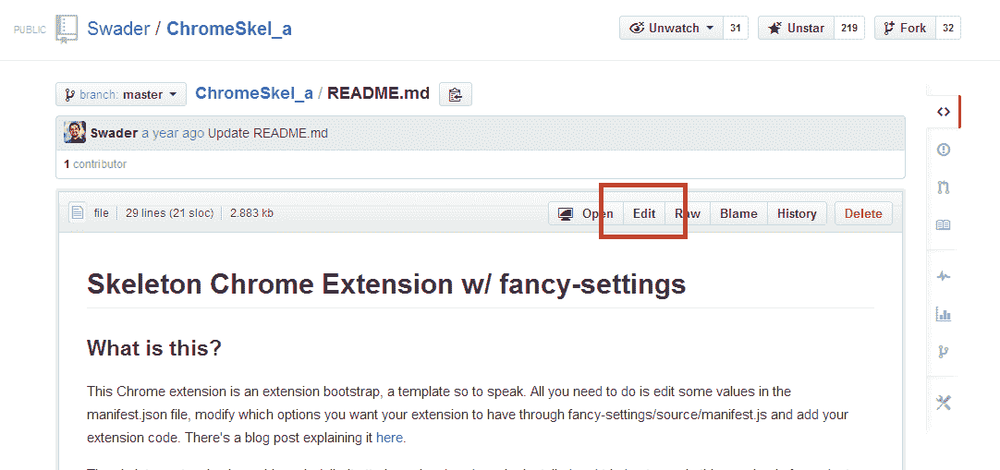
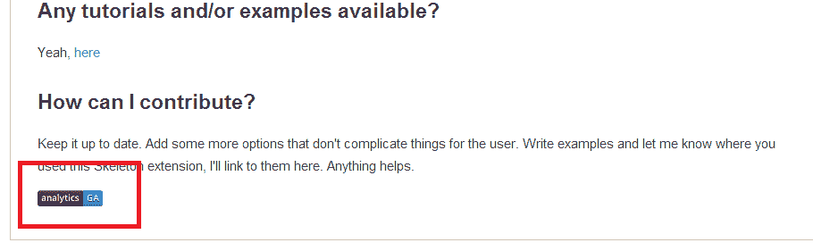
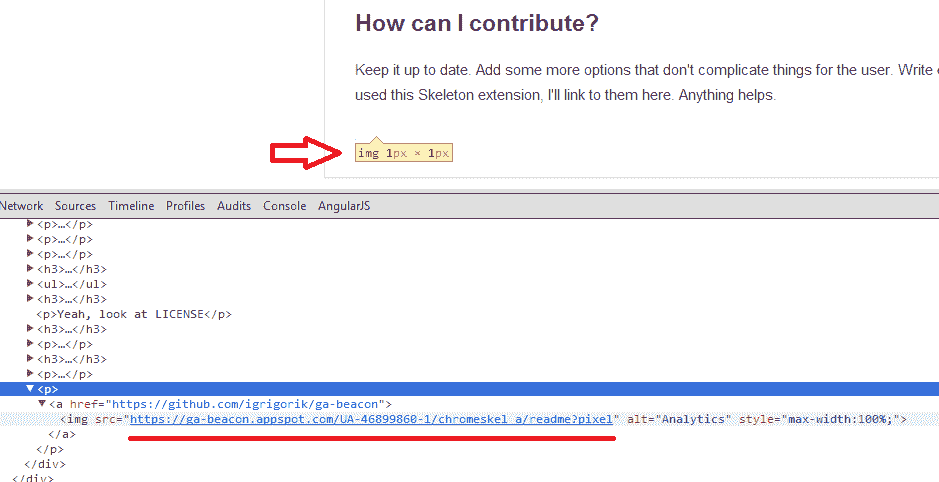
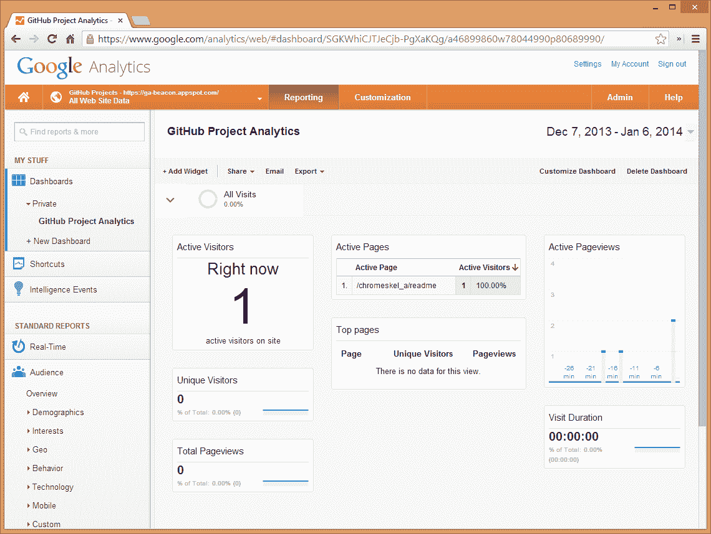
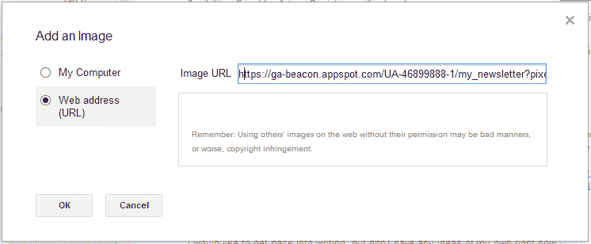
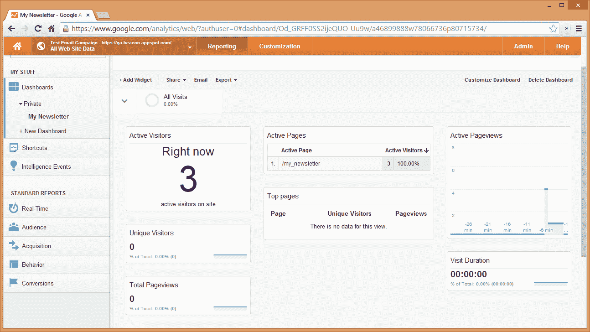

# 将信标图像用于 GitHub、网站和电子邮件分析

> 原文：<https://www.sitepoint.com/using-beacon-image-github-website-email-analytics/>

## 介绍

有很多方法可以追踪你网站的流量。到目前为止，最受欢迎的一个是谷歌分析，当你注册时，它会为你提供一个嵌入在 JavaScript 代码片段中的跟踪代码，然后你可以将它包含在你想要跟踪的每个页面上。这是一个非常简单有效的解决方案，大多数其他分析提供商或多或少都在做同样的事情。

然而，当处理不能简单地粘贴一块工作 JavaScript 代码的内容时，事情就变得复杂了——例如，GitHub 存储库和页面、电子邮件等等。然而，这些资源确实支持嵌入图像——这是我们可以利用的。

## 信标图像

传统上，信标图像是这样工作的:

*   在你的邮件/页面中嵌入图片资源
*   图像的`src`属性指向服务器上的一个 URL
*   客户端(浏览器、电子邮件客户端)然后像往常一样请求 URL，期待一个正常的图像
*   服务器不是直接提供图像，而是首先通过一组指令记录 HTTP 请求的详细信息——访问者 IP、时间等——并将这些统计数据保存到数据库中
*   然后，服务器返回一个图像，或者一个使其不可见的假图像——通常是 1×1 的透明像素(例如在文本电子邮件的底部很有用——没有必要在那里放一个实际可见的图像，这样会显得很垃圾)。

然而，这并不是很容易实现，而且几乎不可能复制 Google Analytics 默认提供的仪表板和详细的国家统计数据，因此这是值得的。

信标图像的另一个方面，也是它们最常见的用途，是电子邮件——在你的电子邮件中包含它们可以让你跟踪打开与发送的比率。电子邮件永远不会在正文中包含活动的 JS 片段，因此信标图像或多或少是唯一的解决方案，通过这种方式收集的数据充其量也是不可靠的——默认情况下关闭 HTML 的人永远不会加载图像，即使他们阅读了电子邮件，也会被跟踪为未打开。尽管如此，还是可以通过这种方式收集一些数据。

如果我们的信标自动将数据上传到谷歌分析，并在一个定制的仪表板上为我们展示出来，这不是很好吗？

## 嘎-灯塔

谷歌的开发者代言人兼性能工程师伊利亚·格里戈利克(如果你关心你网站的性能，一定要追随他)，决定将封闭资源的*信标*带到另一个更简单的层次，并解决上一段提到的问题。他创建了 [ga-beacon](https://github.com/igrigorik/ga-beacon) ，这是一个快速的解决方案，可以将 beacon 图像实现到任何网络资源中，并在定制的 ga 仪表板中自动进行结构化报告。

他的例子使用 ga-beacon 来跟踪他的 GitHub repos 和页面的访问，但它也可以用于任何其他 web 资源，在这些资源中，您可以访问内容，但不能访问源代码。请看下图中的仪表板样本，是从回购中抓取的:


请注意，由于信标跟踪只是一个`src`请求，它无法跟踪推荐——实际访问的页面(无论是 GitHub 还是其他)确实有此信息，但从图像 URL 获取内容是一个完全独立的请求，因此无法访问推荐信息。

## 实施 ga-beacon

虽然回购自述文件中有说明，但我认为最好是我们在这里用截图一步一步地介绍它们，这样你就可以自己尝试了。稍后，我们还将在电子邮件中实现 ga-beacon。

### 步骤 1: GA 帐户和代码

如果您还没有 Analytics 帐户，请在此处获取一个[。进入管理，并添加一个新帐户:](http://www.google.com/analytics/)



选择“网站”，保留所有默认选项，并填写以下内容:

*   帐户名/网站名:随便你。因为我将把它实现到我的 GitHub repos 中，就像例子中 Ilya 所做的那样，所以我将选择“GitHub 项目”作为名称。
*   网址:按照说明，放“[https://ga-beacon.appspot.com/](https://ga-beacon.appspot.com/)



通过完成该过程并接受弹出的许可协议来获得跟踪代码。

在这一步之前，该过程与您设置一个常规的跟踪网站(您可以访问该网站的源代码)的过程是一样的。事实上，在下一个屏幕上生成的代码可以粘贴到任何网站的源代码中，它会进行全面和适当的跟踪-推荐和所有。然而，我们只需要跟踪 ID。立即复制此跟踪 ID。

在将 beacon 映像添加到我们的属性之前，让我们首先为我们的 GA 帐户安装一个自定义仪表板。自定义仪表板是为显示的数据预先配置的布局和样式，保存为他人的模板。自定义仪表板可从[此链接](https://www.google.com/analytics/web/importing#importing/a46800313w77913436p80554334/%3F_.objectId%3DMQS4cmZdSh2OWUVqRntqXQ%26_.selectedProfile%3D/)安装。在弹出窗口提供的下拉列表中，选择新创建的属性及其“所有网站数据”选项。

默认仪表板现在将被自定义仪表板替换。如果没有，请查看左侧边栏中的 Dashboard 菜单，并在那里选择此自定义仪表板。



现在，我们已经准备好将信标图像实现到页面中。

对于这个例子，我将把信标添加到我的 [ChromeSkel_a repo](https://github.com/Swader/ChromeSkel_a/) 中。它现在有点过时了，有一段时间没玩了，但它似乎仍然有一些流量，我对此很感兴趣。我甚至不需要克隆、编辑和推送，我可以通过编辑按钮即时进行更改。



我为图像添加了 MarkDown 语法，``并使用了`https://ga-beacon.appspot.com/UA-XXXXX-X/your-repo/page-name`，其中 UA-XXXXX-X 是之前的跟踪 ID，`your-repo/page-name`是一个任意路径，用于在 GA 仪表板中更好地对数据进行分组。综上所述，我在上面提到的 repo 中添加到我的自述文件中的文本是:

```
[](https://github.com/igrigorik/ga-beacon)
```

并制作了以下徽章:



如果您希望徽章不可见，可以向 URL 添加一个无值查询参数`?pixel`,如下所示:

```
[](https://github.com/igrigorik/ga-beacon)
```

这使得信标图像成为 1×1 透明像素。见下图——徽章是不可见的，但开发工具告诉我们它显然在那里。



我更喜欢徽章，所以我将不带`?pixel`参数。

就是这样。ga-beacon 现已安装在 README 页面中。我们现在可以保存并提交它，每个访问 chromeskel_a repo 根页面的人都将被记录下来，并在我们新的 GA 控制面板中可见。如果我现在刷新页面，并在保持页面打开的同时查看仪表板，我就被注册为“主动访问者”。



### 电子邮件实施

在电子邮件中使用 ga-beacon 就像在网站和 GitHub 页面上使用它一样简单。首先，创建一个新的 GA 属性，再次创建一个网站，这次给它起一个名字“我的时事通讯”或类似的名字。

之前的仪表板已经安装，所以不需要设置。拿起追踪 ID，开始写电子邮件。内嵌一张图片——使用之前相同的 URL，只需更改跟踪代码和路径——路径可以是电子邮件主题、时事通讯活动的标题或任何您认为合适的内容。例如，我使用了这个 URL:

```
https://ga-beacon.appspot.com/UA-46899888-1/my_newsletter?pixel
```

这一次，我们使用了`?pixel`参数，因为我们希望图像保持不可见。该电子邮件可能与徽章所代表的内容毫无关系，如果最终用户看到它，可能会觉得可疑或不好。



现在，将电子邮件发送给几个收件人(当然，要事先征得他们的同意)，然后观察仪表板。如果一切顺利，您应该看到“访问”计数上升。您可以修改仪表板中的小部件，将“访问”改为“已打开”，等等。



如果您正在发送多个简讯活动，您只需更改 URL 的路径部分，它将反映在仪表板中，无需获取新的跟踪 ID。

## 结论

信标图像对于追踪统计数据非常有用，因为统计数据通常是不可追踪的。他们帮助我们保持在我们的受众之上，并帮助我们提高我们的在线存在。本文介绍了在内容中实现 beacon images 并使用 Google Analytics 分析接收到的数据的最简单方法之一。试一试，并在下面的评论中留下任何反馈！

编辑:就在这篇文章写完不久，GitHub 引入了实际分析:[https://GitHub . com/blog/1672-introducing-GitHub-traffic-analytics](https://github.com/blog/1672-introducing-github-traffic-analytics)。无论如何，你仍然可以使用这种方法来跟踪对任何其他资源的访问，在这些资源中，你可以控制内容，但不能控制源代码——如果你是某个地方的客座博主，在电子邮件中，或者如果你有一个 Ghost.org 博客，它还不允许自定义编辑源文件，等等。

## 分享这篇文章