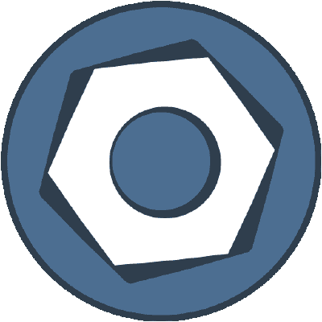

# 使用 bootcms 构建小型商业网站

> 原文：<https://www.sitepoint.com/using-boltcms-build-small-business-website/>

随着网络的不断成熟和对内容传递效率的需求的增加，越来越多的超薄型 CMS 进入了竞争。开发人员(前端和后端)正从 WordPress 和 Drupal 等重量级软件转向更精简、定制的解决方案。Bolt CMS 就是这些 CMS 中的一个，它为自己是设计者、开发者和内容编辑者的梦想而自豪。



在前端方面，Bolt 使用越来越流行的 [Twig](http://twig.sensiolabs.org/) 模板语言，允许前端开发人员以他们想要的方式和方式快速而整洁地生成模板。在事物的后端，自定义类型和字段给了我们以我们想要的方式组织事物的自由。Bolt 也是基于 [Silex](https://www.sitepoint.com/introduction-silex-symfony-micro-framework/) 和 [Symfony](http://symfony.com/) 组件构建的，使其稳定、强大、开源、免费。Twig、Silex 和 Symfony 都在 Sensio Labs 的保护伞下，所以你可以保证其中一个永远不会离开另一个。这是一个伟大的组合！

Bolt 在他们的网站上有一个布局非常好的文档，以及一个帖子数量不断增加的[堆栈溢出标签](http://stackoverflow.com/)。其他提高分数或获得支持的方式包括 [GitHub 问题追踪](https://github.com/bolt/bolt/issues)。阅读[社区页面](https://bolt.cm/page/community)了解更多信息。

## 带螺栓的建筑

在本文中，我们将了解以下要点，这些要点将帮助我们用 Bolt 构建第一个项目:

1.  要求、设置和安装
2.  主要配置和主题设置
3.  将文件分割成模板
4.  介绍和创建内容类型
5.  从数据库记录中检索内容

从现在开始，我建议你保持[文档](https://docs.bolt.cm/introduction)在浏览器中打开，因为我们会经常引用它。好吧，我们开始吧！

## 要求、设置和安装

Bolt 需要满足以下条件才能运行:

*   PHP 5.3.3 或更高版本
*   访问 SQLite、MySQL 或 PostgreSQL
*   使用`mod_rewrite`或 Nginx 的 Apache

PHP 安装也有一些更多的要求，但是你可以在这里阅读这些。为了让管理面板高效、优化地运行，推荐使用现代浏览器。当然，这只是为了管理方面的事情。前端将根据您构建它的方式在各种浏览器上提供服务。

有三种方法安装螺栓。我将使用选项 1，命令行方式。让我们打开终端，从那里开始，运行以下命令:

```
curl -O http://bolt.cm/distribution/bolt-latest.tar.gz
tar -xzf bolt-latest.tar.gz --strip-components=1
```

从现在开始，确保正确的文件和目录具有正确的权限。为此，请运行以下命令:

```
chmod -R 777 files/ app/database/ app/cache/ app/config/ theme/ extensions/
```

### 关于 777 权限的快速说明

777 是野兽的[号，这个我们都应该清楚。您应该知道为什么 Bolt 在某些目录上需要 777:](http://www.dionysopoulos.me/777-the-number-of-the-beast/)

1.  它需要在`/files/`目录中，因为 Bolt 需要在通过 admin 上传媒体时写入这个目录。
2.  这是`app/cache/`目录所要求的，因为 Bolt 会自动从这个目录中缓存和检索缓存的材料。
3.  `app/database/`权限是完全可选的，除非使用 SQLite，否则完全没有必要。如果您使用的是 sqlite，Bolt 将需要写入这个目录来更新 SQLite 文件。
4.  `app/config/`和`theme/`权限也是可选的，只有当用户想通过 bolt admin 编辑主题和配置文件时才需要。
5.  `extensions/`目录也是可选的，只有在通过 Bolt admin 上传扩展时才需要。

您应该完全了解使用 777 权限的含义，并尝试配置您的服务器以避免这样做。继续前进。

### 继续安装

开箱即用，Bolt 与 SQLite(一个基于文件的数据库)配合得很好。不过，我们将把它配置为与 MySQL 一起工作，这可能是一个更有可能出现在生产网站中的场景。让我们赶快把它安装好。既然我们已经在终端中，让我们进入`app/config`目录。Bolt 为我们提供了默认的`config.yml.dist`文件作为开始，它已经准备好与 SQLite 一起使用了。让我们复制它并将其重命名为`config.yml`，这样我们就可以使用 MySQL，并在编辑器中打开它。

我们根据 Bolt 文档编辑数据库部分，但请确保输入您自己的值:

```
database:
  driver: mysql
  username: root
  password: password
  databasename: bolt
  host: localhost
  port: 3306
```

将虚拟主机指向项目的根目录(最简单的方法参见 [Homestead Improved](https://www.sitepoint.com/quick-tip-get-homestead-vagrant-vm-running/) )并在浏览器中访问所需的 URL。现在您应该看到 Bolt 启动页面，提示您创建第一个用户。去做吧。现在，你可以登录到管理面板，也可以查看前端！太棒了，让我们来看看内容类型 Bolt 的核心。

### 主要配置和主题设置

默认情况下，Bolt 会加载`base-2014`主题。这是四处窥探和开始的好方法，但很可能你会想要创建自己的主题，并从头开始构建。首先，在您选择的编辑器中打开项目。导航到`theme`目录，并创建一个名为`my-theme`的新目录(您可以随意命名)。现在，我们想改变我们后端的主题。

还记得我们在第一次加载项目之前编辑的配置文件吗？现在可以通过管理员访问了。转到`Configuration > Main configuration`，它将加载文件。这里有一大堆配置选项，但我们现在只坚持三个:

1.  编辑`sitename`到你的站点名称。
2.  编辑`payoff`到你网站的标语
3.  编辑新创建主题的`theme`(在我的例子中是`my-theme`)

之后，保存配置文件。现在，在你的主题中创建一个`index.twig`文件，输入一些样板代码，如下所示:

```
<!DOCTYPE html>
<html lang="en">
<head>
  <meta charset="UTF-8">
  <meta name="viewport" content="width=device-width, initial-scale=1">
  <title>My Website</title>
  <link rel="stylesheet" href="http://bootswatch.com/superhero/bootstrap.min.css">
</head>
<body>

<nav class="navbar navbar-default">
  <div class="container">
    <div class="navbar-header">
      <button type="button" class="navbar-toggle collapsed" data-toggle="collapse" data-target="#bs-example-navbar-collapse-1">
        <span class="sr-only">Toggle navigation</span>
        <span class="icon-bar"></span>
        <span class="icon-bar"></span>
        <span class="icon-bar"></span>
      </button>
      <a class="navbar-brand" href="#">Site Title</a>
    </div>
    <div class="collapse navbar-collapse" id="bs-example-navbar-collapse-1">
      <ul class="nav navbar-nav">
        <li><a href="#">Lorem</a></li>
        <li><a href="#">Ipsum</a></li>
        <li><a href="#">Dolor</a></li>
      </ul>
    </div><!-- /.navbar-collapse -->
  </div><!-- /.container -->
</nav>

<main>
  <div class="container">
    <div class="jumbotron">
      <h1>Hello, world!</h1>
      <p>Welcome to my first bolt site.</p>
    </div>
  </div>
</main>

<script src="https://ajax.googleapis.com/ajax/libs/jquery/1.11.2/jquery.min.js"></script>
<script src="https://maxcdn.bootstrapcdn.com/bootstrap/3.3.2/js/bootstrap.min.js"></script>

</body>
</html>
```

请注意，我已经包含了一个[引导模板](http://bootswatch.com/superhero/)，这样我们就有了一些美感。您可能想要链接到您自己的 CSS 文件，不要担心，我将很快向您展示如何做到这一点。点击前端窗口的刷新，瞧，你的全新网站正等待着充满美味的模板和内容！但是，由于混合了许多页面，一遍又一遍地将大块可重用的模板代码复制粘贴到新文件中是一种非常不可持续的可怕做法。让我们稍微了解一下模板。

## 将文件分割成模板

正如任何现代网站，特别是 CMSs，我们希望根据需要调用不同的模板文件。如果你去文档的[“构建模板”](https://docs.bolt.cm/building-templates)部分，你会得到一些有价值的信息来帮助你。基于 Bolt 推荐的文件结构和我们当前的模板，我们可以很容易地从现有的`index.twig`文件中提取两个主要部分:

*   `_header.twig`
*   `_footer.twig`

现在，我们的主索引文件应该如下所示:

```


<main>
  <div class="container">
    <div class="jumbotron">
      <h1>Hello, world!</h1>
      <p>Welcome to my first bolt site.</p>
    </div>
  </div>
</main>


```

相关的部分已经被提取到各自的文件中，但是我不会在这里包含它们来夸大显而易见的内容。既然我们已经触及了模板的基础，让我们继续讨论内容类型和记录，即内容创建、存储和检索。

## 介绍和创建内容类型

我们在这里谈论的是 CMS，所以很自然，我们将从数据库中提取某种内容和记录。让我们假设我们正在建立一个小型商业网站，我们希望有三个静态页面和一个带有多个证明条目的证明页面。所以我们在看这种导航:

```
- home
- about
- testimonials
    - single testimonial
    - ...
- contact
```

让我们在本文的剩余部分继续这个想法，这样我们就有了一个更好的基础。这就把我们带到了 Bolt CMS 的下一个主要特性，也可能是主要特性 T1——内容类型和记录。他们在文档中将这两个词连接起来，因为这是我们在代码中引用它们的方式，所以从现在开始我们将称它们为“contenttypes”。

那么什么是内容类型呢？以下是博尔特文件的一小段摘录:

> Bolt 中的所有内容都以逻辑和灵活的方式存储在数据库中。总的来说……你知道你要管理什么样的内容。所有这些不同类型的内容在 Bolt 中都称为 Contenttypes，您可以根据需要添加任意多的不同内容类型。

除了内部使用的几个必需的“字段”,我们可以自由定义 Contenttype 的结构。在我们的静态页面中，我们可能想要包含`title`、`teaser`、`image`和`body`字段。在我们的推荐案例中，我们可能需要类似于`name`、`position`、`body`和`date`的东西。让我们更深入地研究一下。

如果我们转到我们的管理控制面板，您会注意到在内容部分，我们可以输入三种不同类型的内容:

*   页
*   进入
*   显示优点的东西

这些实际上是内容类型，都是在我们的`contenttypes.yml`文件中定义的。Bolt 让我们很容易，我们可以通过 admin ( `Configuration > Contenttypes`)直接访问这个文件。在研究了这个文件的当前内容之后，让我们继续删除除了`pages`内容类型之外的所有内容。我们的文件现在应该如下所示:

```
# Pages - used for the static pages like about, contact, etc.

pages:
    name: Pages
    singular_name: Page
    fields:
        title:
            type: text
            class: large
            group: content
        slug:
            type: slug
            uses: title
        image:
            type: image
        teaser:
            type: html
            height: 150px
        body:
            type: html
            height: 300px
        template:
            type: templateselect
            filter: '*.twig'
    taxonomy: [ chapters ]
    recordsperpage: 100
```

当您保存它时，您应该注意到您不再能够访问`entries`和`showcases`内容类型。在添加任何内容之前，让我们尝试创建自己的评价。转到文档中的[“定义内容类型”](https://docs.bolt.cm/contenttypes-and-records#defining-contenttypes)部分，让我们通读一下。我们肯定会想要一个`name`和`singular_name`，我们的领域会像我们上面提到的那样。让我们添加我们的证明内容类型:

```
# Testimonials

testimonials:
    name: Testimonials
    singular_name: Testimonial
    fields:
        name:
            type: text
            class: large
        position:
            type: text
        body:
            type: textarea
            height: 150px
```

保存，现在您可能会得到一个警报，提示您更新数据库。按照说明，刷新，现在我们可以添加一个证明。让我们快速创建一个新的证明，添加一些虚拟数据，并保存它。我们刚刚创建了第一个 contenttype，添加了一个新条目，并将其存储在数据库中。不过，我们还没到那一步。您可能想知道如何访问和显示这些记录。好吧，让我们在下一节看看。

## 从数据库记录中检索内容

我们在这里稍微回溯一下，因为我们忽略了几个重要的特性。默认情况下，Bolt 会寻找一个`record.twig`模板文件来输出“记录”，或者 contenttype 条目。如果我们预览我们刚刚创建的证明，我们将得到一个错误，告诉我们 Bolt 试图使用`record.twig`，但它并不存在。让我们创建它并加入一些虚拟内容:

```


<main>
  <div class="container">
    <div class="page-header">
      <h1>Record!</h1>
      <p>This is a generic record.</p>
    </div>
    <div class="page-content">
      <h2>Record Stuff Here</h2>
      <p>Lorem ipsum dolor sit amet, consectetur adipisicing elit. Sint eum tempore optio corporis aspernatur tempora temporibus vero maxime consectetur dolorum dolore vel numquam aut iure, esse, repudiandae nemo animi, vitae.</p>
    </div>
  </div>
</main>


```

现在，如果我们在预览中点击“刷新”,我们将看到我们已经生成了包含虚拟数据的通用记录页面。不过，这让我们想到了第二点。推荐的模板与静态页面的模板不太可能相同，所以让我们来解决这个问题。回到[定义内容类型文档](https://docs.bolt.cm/contenttypes-and-records#defining-contenttypes)，我们将看到一些其他有趣的东西:

*   `record_template`–显示内容类型的单个记录的模板
*   `listing_template`–显示内容类型的记录集合的模板

我们已经知道，默认情况下，`record_template`会默认使用`record.twig`模板文件。对于`listing_template`，默认会搜索`listing.twig`文件。但是，我们可以在 contenttype 的配置中覆盖这些。让我们这样更新它:

```
# Testimonials

testimonials:
    name: Testimonials
    singular_name: Testimonial
    fields:
        name:
            type: text
            class: large
        position:
            type: text
        body:
            type: textarea
            height: 150px
    listing_template: testimonials.twig
    record_template: testimonial.twig
```

现在，让我们创建各自的`testimonials.twig`和`testimonial.twig`文件。以下是我创建的两个文件:

#### 证明书. twig

```


<main>
  <div class="container">
    <div class="page-header">
      <h1>Testimonials!</h1>
      <p>All the testimonials be here.</p>
    </div>
    <div class="page-content">
      <p>All testimonials...</p>
    </div>
  </div>
</main>


```

#### 证明书. twig

```


<main>
  <div class="container">
    <div class="page-header">
      <h1>Testimonial!</h1>
      <p>This is a testimonial.</p>
    </div>
    <div class="page-content">
      <p>Testimonial content...</p>
    </div>
  </div>
</main>


```

现在，我们可以通过`/testimonials`访问浏览器中的概览页面，通过`/testimonial/1`访问我们的第一条记录(这是记录的默认 slug 结构)。现在让我们把注意力集中在单个证明上，并检索数据。在单个记录页面中，我们可以访问`record`值。为了增加代码的可读性，我们可以通过记录名来访问它，在我们的例子中是`testimonial`。如果我们在记录模板中输入`{{ dump(testimonial) }}`,我们会看到整个记录都显示在屏幕上。

那么我们如何访问它的一部分呢？使用 Twig 模板，我们可以通过简单的点符号来访问不同的值。换句话说，如果我们想要写推荐的人的“名字”(如我们的 contenttype 配置中所定义的)，我们应该像这样访问它:

```
{{ testimonial.name }}
```

记住这一点，让我们配置模板以获取内容:

```


<main>
  <div class="container">
    <div class="page-header">
      <h1>{{ testimonial.name }} | {{ testimonial.position }}</h1>
      <time>{{ testimonial.datecreated|date("jS F, Y") }}</time>
    </div>
    <div class="page-content">
      {{ testimonial.body }}
    </div>

  </div>
</main>


```

现在，创建和查看更多推荐应该轻而易举。现在让我们转到我们的`testimonials.twig`模板，尝试检索所有的评价。就像以前一样，我们可以通过名称来访问“记录”。我们可以召唤`records`，或者在这种情况下，召唤`testimonials`。继续把它转储到你的页面上，你会看到它们全部。

Twig 模板提供了迭代数组的简洁方法，以及一些过滤器。我不会在这里讲太多的细节，但是你已经看到了当我们格式化日期时第一个过滤器的作用。我将使用另一个过滤器将证明正文截断为 100 个字符。我们的推荐模板现在应该是这样的:

```


<main>
  <div class="container">
    <div class="page-header">
      <h1>Testimonials</h1>
      <p>All the testimonials for this great company be here.</p>
    </div>
    <div class="page-content">
      
        <div class="testimonial">
          <h3>{{ testimonial.name }} | {{ testimonial.position }}</h3>
          <p>{{ testimonial.body|excerpt(100) }}</p>
        </div>
      
    </div>
  </div>
</main>


```

这就对了。导航到`/testimonials`，您将看到循环的格式化输出。现在继续填充您的 about 页面和 contact 页面，并尝试输出通用`record.twig`模板文件中的记录。如果你想为页面创建一个特定的模板，创建一个`page.twig`文件，然后按照上面的方法开始。你现在已经完全按照你想要的方式建立了你的网站。

## 图像与媒体笔记

有一点我们在这里还没有涉及到，那就是 Bolt 是如何处理媒体上传的。如果你有 WordPress 的背景，你很可能对 WordPress 处理媒体的方式感兴趣，因为它有强大的，而且(个人来说)易于使用的媒体库。Bolt 是一项不断发展的工作，毫无疑问，这里还有一些改进的空间。但是一旦你习惯了文件管理系统，事情就变得简单多了。

在 Bolt 术语中，图像保存在“堆栈上”。这只是意味着有一堆你手动上传的图片。如果你看一下目录结构，你会看到`files`目录。这里是上传的存储位置。当你在 admin 中上传一个文件时，它会把它保存在一个子目录中，并注明上传的年份和月份。现在，如果您的 contenttype 中有一个常规的 HTML 字段，并且您试图在其中获取一个图像，此时您可能会有点困惑。没有上传图片的按钮！这是为什么呢？

默认情况下，Bolt 禁用 WYSIWYG 编辑器中的图像按钮。幸运的是，这很容易从主配置文件中访问。在管理中，进入`settings -> configuration -> main configuration`，向下滚动到所见即所得部分。在那里，您可以将图像设置更改为 true。回到您的记录编辑器，您现在可以按照您期望的方式插入图像。

## 从这里去哪里

除了我们所看到的，还有更多值得一试的东西，这也是它工作起来如此美妙的原因。它的功能丰富，但只有当你想它是。在整个开发和生产过程中，它保持了轻量级和快速性，并且感觉自然和易于使用。从现在开始，我建议通读文档。它写得真的很好，很容易理解，而且它回答了你的很多问题。在文档中，我最喜欢的两个部分是[内容获取](https://docs.bolt.cm/content-fetching)和[模板标签](https://docs.bolt.cm/templatetags)，以提升你的知识和工作流程。之后，您将看到分页、搜索、扩展 Bolt 等功能。

感谢您的阅读，我希望这篇文章能让您对使用 Bolt CMS 进行构建有所了解。如果你是 WordPress 或 Drupal 开发人员，我强烈建议你向 Bolt 这样的新平台敞开心扉。你一点也不会失望！

u = swader