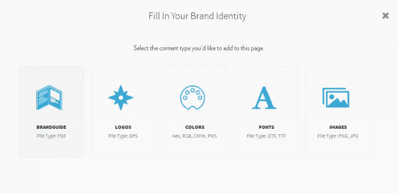
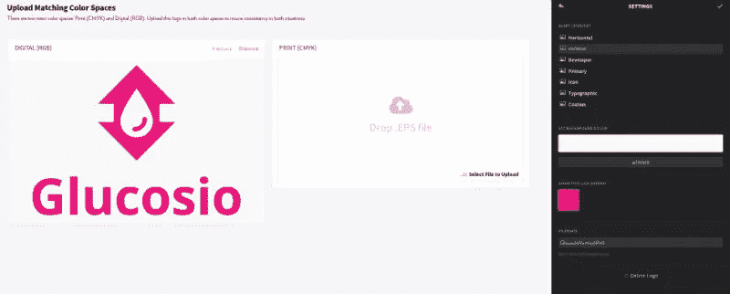
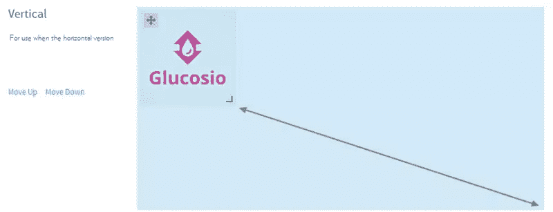
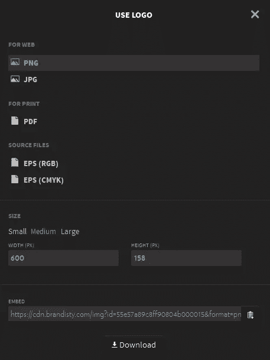
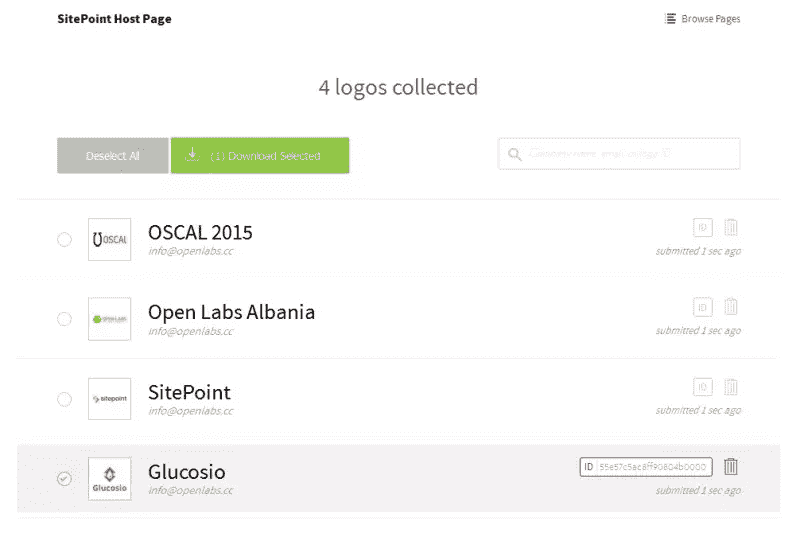
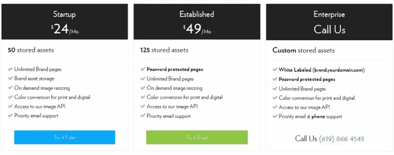

# 使用 Brandisty 托管您的品牌资产

> 原文：<https://www.sitepoint.com/using-brandisty-host-brand-assets/>

作为设计师，很容易忘记，不是每个人都能够在眨眼之间轻松转换/调整徽标的大小。对于大多数客户来说，不得不麻烦你的设计师访问你自己的标志资产是一件令人恼火的事情——更不用说他们可能会为此特权而被开发票。

对于双方来说，这也可能是一个既耗时又混乱的过程，因为 ZIP 文件需要来回转换以进行小格式或大小调整。

众所周知，一些客户甚至会通过学习 Photoshop 来自己解决问题——这可能不是一种理想的情况。然而，没有多少第三方工具可以帮助非设计人员简化这个过程。

品牌托管服务 [Brandisty](https://brandisty.com/) 就是其中之一。该服务无需 Photoshop 或 Illustrator 即可处理矢量图像的大小调整、排版、调色板生成、数码和印刷的色彩空间转换。

## 入门指南

您可以创建一个免费的 Brandisty 帐户，允许您存储多达 10 项资产，这本身对大多数小规模的品牌项目非常有帮助。一旦你为你的品牌空间起了名字，你就可以开始添加资产了。你可以添加标志，颜色样本，字体，图像，甚至整个风格指南。Brandisty 的灵活特性也允许添加图标和其他设计资产，如果你觉得有必要的话。

请注意，一个 Brandisty 帐户可以存放不同品牌或子品牌的页面。值得注意的是，这个选项可能对 Brandisty 的付费定价层更有意义，因为免费服务总共只允许 10 项资产。

### 现在来加个 logo 吧。

如你所知，大多数客户都要求他们的徽标同时使用两种颜色空间 **RGB(数字)**和 **CMYK(印刷)**，Brandisty 提供了这两种颜色空间。您可以在这里指定类别，更改文件名，如果不想使用默认的背景色 _(#f9f9f9)_，还可以给它一个不同的背景色。

上传后，您可以重新定位、缩放、重新排序或将其拖入其他类别。如果你正在管理品牌资产的汇编，这将是一个你经常使用的功能。我必须承认，一旦你在网上有了一个坚实的资产收藏，它也很容易上瘾，因为它会调整你的资产，使你的空间看起来漂亮整洁。拖放功能可能有点小问题，但是没有什么是你不能使用的。

调整您的资产

这是一个类似的过程来处理其他资产，如字体，色板，图像，甚至完整的样式指南。Brandisty 提供了一个中立而有吸引力的空间，在这里你可以展示你的品牌，而不受 Brandisty 自己的品牌的干扰。很高兴看到你的品牌成为焦点，而不是产品本身。

此外，Brandisty 还允许您将团队成员添加到您的品牌空间。这对于组织来说尤其有用，因为品牌管理不应该只由一个人来完成。

如果你不是设计师，你也可以注册一个 Brandisty 账户，然后邀请设计师来处理剩下的事情，从一开始就保持对你的资产的控制。

一旦资产就位，任何人都可以以他们想要的格式下载您的资产。徽标可以按比例缩放，并通过嵌入到网站中直接使用。

这种嵌入功能实际上是一个令人惊叹的功能:您的徽标现在可以嵌入到 web 上的任何地方，然后可以随时从中央存储库进行更新。是的，Brandisty 就像 Github 中的 logos。

不幸的是，仍然缺乏 SVG 支持，但几乎可以肯定的是，将来会添加。

## 收集徽标

Brandisty 提供的另一个简洁的功能是 logo 主页，它对会议特别有帮助。

想象以下场景:你正在组织一个会议，需要几十个合作伙伴和赞助商的品牌资产。

你可以为你的会议创建一个 brandity 主机页面，并向赞助商发送一个链接，从他们的 brandity 页面链接他们的徽标，而不是一个一个地收集它们。您也可以通过插入徽标的外观链接来手动将徽标添加到主页。所有标识都可以批量导出，然后由主机下载。

管理多个品牌和子品牌。

遗憾的是，Brandisty 不允许您将徽标直接上传到此主页，除非您首先创建了自己的独立品牌空间。虽然这可能会被视为一些合作伙伴的负担，但这也让他们能够完全控制自己的品牌——这对大多数公司来说肯定是一个胜利。

实际上，这只需要几分钟，但我仍然可以想象一些人对此有所抱怨。

我在这里注意到的另一点是，管理员无法更改主机徽标的名称或电子邮件。如果你从一个拥有各种标识的品牌空间添加一个标识，比如阿尔巴尼亚开放实验室项目的品牌空间，这可能会很烦人。

这绝对是我想看到的一个特性。

## 定价

根据你的具体需求，Brandisty 的定价模式可能会被视为从负担得起到价格有点偏高。大多数品牌将需要 10 项以上的资产来利用这项服务，这意味着**创业**层最适合“新人”。

后者会让你花费 288 美元/年。如果你发现在任何情况下都需要一个品牌空间，自己托管/编码可能会更贵。根据我的经验，Brandisty 对于更小的组织来说是有意义的，因为它节省了设计师可以做更有价值的工作时不必要的麻烦。你自己看吧。

> **注意:** Brandisty 为非营利组织提供 25%的折扣。

## 品牌解码

我不得不承认，我已经成为 Brandisty 简化品牌使命的忠实粉丝。作为一名设计师，我知道帮助人们以正确的方式使用你的资产有多难——任何简化这一过程的产品都非常受欢迎。

## 分享这篇文章