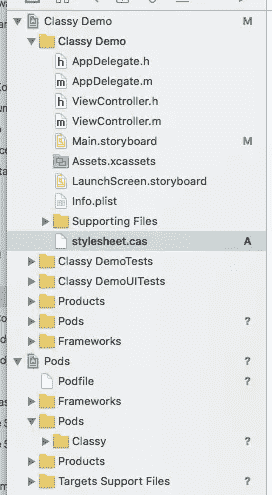
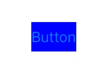
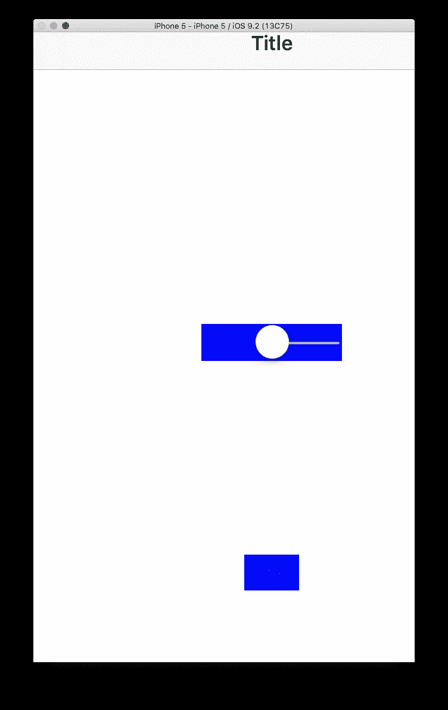
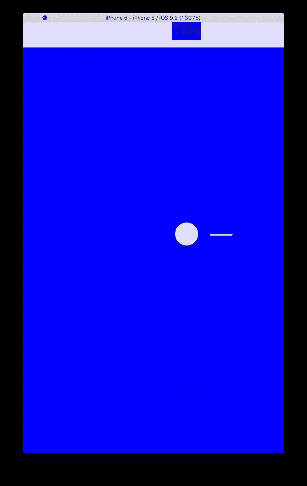
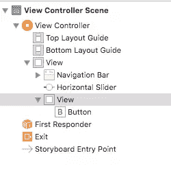
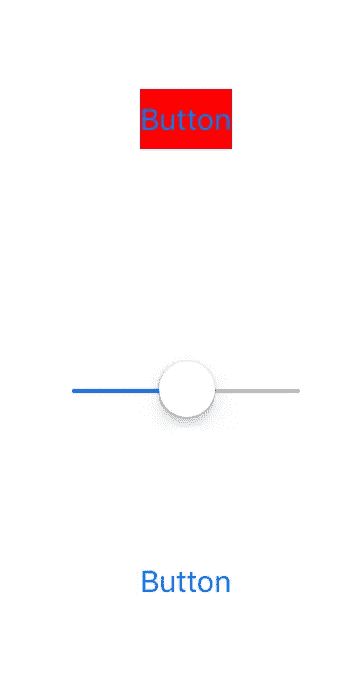
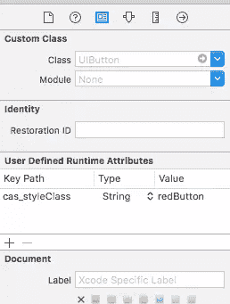
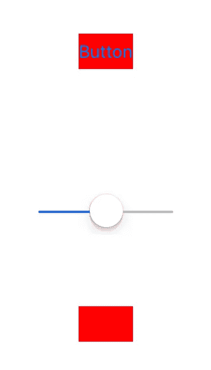
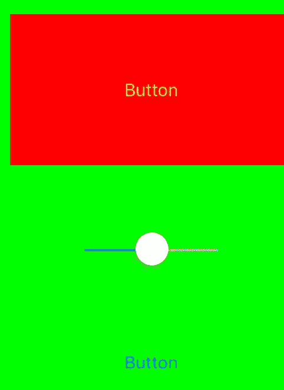

# 使用 Classy 为原生 iOS 应用程序创建样式表

> 原文：<https://www.sitepoint.com/using-classy-to-create-stylesheets-for-native-ios-apps/>

Classy 是一个有趣的项目，希望能够弥合更习惯于 web 或前端项目的设计师和应用程序开发人员之间的一些差距。Classy 允许使用“CSS-esque”样式表来设计本地 iOS 应用程序界面组件。

## 入门指南

在 Xcode 中为我们的经典实验创建一个基本项目，现在我们需要坚持 Objective-C，还没有快速支持。

用 CocoaPods 安装 Classy，你可以在这里找到[安装、设置和使用说明](https://cocoapods.org/)，我假设你已经阅读并遵循了它们。要安装 Classy，将其作为一个依赖项添加到您的 *Podfile* 中，并运行 install 命令。

```
pod 'Classy'
```

```
pod install
```

与启用了 CocoaPods 的项目一样，关闭当前的 XCode 项目，而是打开生成的*。xcworkspace* 文件。

## 让你的界面更优雅

Classy 在默认情况下会在项目包中查找一个名为 *stylesheet.cas* [的样式表，但这可以被覆盖](http://classykit.github.io/Classy/getting-started/#default-stylesheet):



让我们尝试一些简单的方法，将按钮的背景设置为蓝色:

```
UIButton {
    background-color #0000ff
}
```



## 选择器

Classy 以一种 CSS 样式的方式处理选择器，可以通过 Objective-C UIKit 类、视图层次结构(一个元素相对于其他元素的位置)和用户定义的样式类来实现。

为了这些例子的目的，我创建了一个简单的界面，有一个导航栏，一个按钮和一个滑块。

### 目标-C UIKit 类

普通的 Objective-C 继承适用于使用 classy 设计 UIKit 元素的样式，但默认情况下会被忽略，因此:

```
UIControl {
  background-color #0000ff
}
```

什么也不做，只是用一个插入符号反转这个默认行为:

```
^UIControl {
  background-color #0000ff
}
```



导致改变滑块和按钮的背景颜色，但不改变导航栏，因为它不直接继承`UIControl`。如果我们尝试:

```
^UIView {
    background-color #0000ff
}
```

然后一切都是蓝色的！



### 视图层次结构

如果你习惯了元素的 CSS 选择器和它们在文档层次中的位置，那么 Classy 的工作方式与此类似。在这里，我在另一个视图中添加了第二个按钮，即`superview`。



为了在一个视图中定位这个按钮，我们需要使用一个更精确的选择器，因为包含`UIButton`的`UIView`本身在故事板的主`UIView`中:

```
UIView > UIView > UIButton {
    background-color #ff0000
}
```



在这种情况下，插入符号匹配直接后代的元素，而不是所有匹配的后代。

### 风格类

有时候你可能需要更精确地选择界面元素，或者当你弄清楚如何定位一个元素太令人困惑的时候，在这些情况下，我们可以给元素一个特殊的“类”。

在接口构建器中添加该属性，其中*值*等于类名:



现在可以在您的经典样式表中引用它:

```
UIButton.redButton {
    background-color #ff0000
}
```

## 样式分组

这与 CSS 的工作原理相同，所以要给两个按钮赋予相同的样式，并只给一个按钮添加一个额外的样式:

```
UIView > UIView > UIButton,
UIButton.redButton {
    background-color #ff0000
}

UIButton.redButton {
    title-color #ff0000
}
```



## 嵌套

Classy 支持 Less 或 Sass 样式嵌套，用于概括样式声明，例如:

```
> UIView {

    background-color #00ff00

    > UIView {
        background-color #ff0000

        UIButton {
            title-color #ffff00
        }
    }
}
```

创建以下内容:



## 性能

Classy 支持标准`UIAppearance`(以及其他一些)中所有可用的属性和方法，并使用相同的命名约定。所以回到我们之前的例子，改变按钮的背景颜色通常是:

```
@property(nonatomic,copy) UIColor *backgroundColor;
```

到目前为止，我们在示例中一直使用 **kebab case** 属性，这更像 CSS，但是您可以直接使用 Objective-C 属性名称:

```
UIButton {
    backgroundColor #0000ff
}
```

## 争论

有时`UIAppearance`需要参数，例如为`UIToolBar`设置背景图像:

```
- (void)setBackgroundImage:(UIImage *)backgroundImage
        forToolbarPosition:(UIBarPosition)topOrBottom
        barMetrics:(UIBarMetrics)barMetrics;

- (void)setShadowImage:(UIImage *)shadowImage
        forToolbarPosition:(UIBarPosition)topOrBottom;
```

对于 Classy，这些参数是用枚举样式的参数对设置的，因此上面的示例变成了:

```
UIToolBar {
  background-image[barMetrics:landscape-phone, toolbarPosition:top] imageFile
  shadow-image[barMetrics:landscape-phone, toolbarPosition:bottom] imageFile
}
```

## 变量和方程

我将介绍的最后一个经典特性是减少重复和集中属性的变量，就像 CSS 预处理器一样。所以我们之前的:

```
> UIView {

    background-color #00ff00

    > UIView {
        background-color #ff0000

        UIButton {
            title-color #ffff00
        }
    }
}
```

可能会变成:

```
$example-color = #00ff00

> UIView {

    background-color $example-color

    > UIView {
        background-color $example-color

        UIButton {
            title-color $example-color
        }
    }
}
```

Classy 还允许使用基于多个值的公式计算数字属性，非常适合基于屏幕大小或增量变化的样式。

## 嵌套

iOS 中的许多界面元素是嵌套的对象，它们有自己的属性，Classy 在对这些元素的样式进行逻辑分割方面做得很好。例如:

```
UIButton {
  title-text-attributes: @{
    foreground-color: #00ff00
  }
}
```

## 喜欢你看到的吗？介入

Classy 的创建者做了出色的工作，将 CSS(和相关框架)的精华带入了 iOS 世界，反之亦然，我只是触及了该项目的特性、潜力和灵活性。对于拥有强大设计美学和团队的应用程序开发人员来说，这是一个整合设计和风格资产的好方法，让设计团队感觉自己是实际应用程序开发周期的一部分，而通常他们在交付一些界面原型后会被忽略。

坏消息是，Classy 正在积极寻找新的项目维护者，所以如果你喜欢你所看到的，并希望这个项目有一个长期的未来，那么我建议你[响应号召](https://github.com/ClassyKit/Classy/issues/108)并参与进来。

我很想听听你对使用 Classy 的看法和经验。

## 分享这篇文章