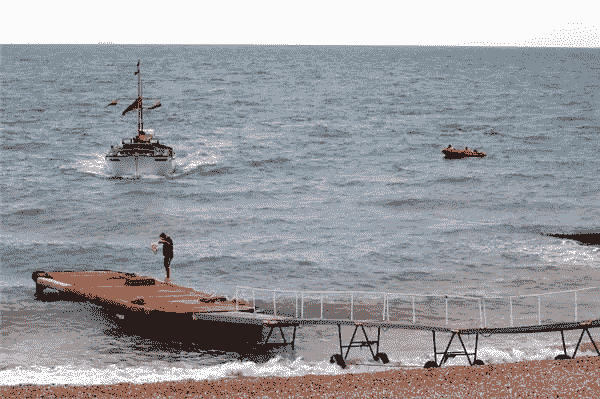
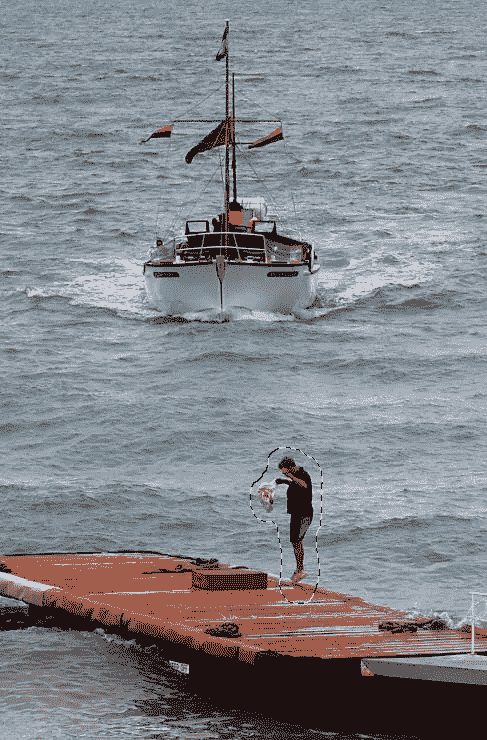
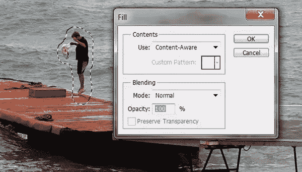
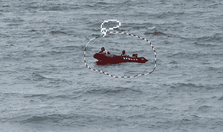
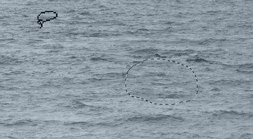
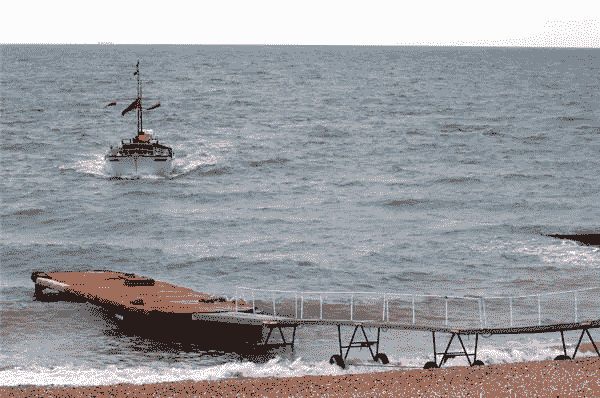

# 使用内容感知填充从照片中移除不需要的对象

> 原文：<https://www.sitepoint.com/using-content-aware-fill-to-remove-unwanted-objects-from-photographs/>

内容感知填充允许您修复或替换照片中的大型复杂区域，方法是首先在它们周围绘制选区，然后让 Photoshop 发挥它的魔力。

使用内容感知填充不同于克隆。您不能像使用克隆工具那样将图像的一部分复制到另一部分。您可以用与其周围内容相似的内容填充任何选区，以移除对象和人物。这是令人难以置信的快速和容易。

1.  在 Photoshop 中打开你的图片。我用的是今年早些时候在英国拍的一张照片。码头上有一个人在空中跳跃，还有一艘红色的小船，我想把它从图片中移除。
    T3
2.  在一个单独的图层上进行修改总是一个好主意(以防万一)，所以按 Ctrl + J / Cmd + J 复制你的原始图层。原来的照片现在是安全的背景，你可以在新的层编辑。
3.  在要移除的对象周围绘制选区。在这种情况下，我使用套索工具(L)并绘制了一个松散的选择周围的人。
4.  选择编辑>填充。
5.  In the Fill dialog box, choose Content-Aware from the Use menu, and click OK. The selection changes to match the area around it.And as if by magic … he’s gone.

    

6.  选择“选择”>“取消选择”或按 Ctrl + D
7.  现在要摆脱小船了。使用套索工具绘制一个松散的选择周围。
8.  选择“编辑”>“填充”,从“使用”菜单中选择“内容感知”,然后单击“确定”。
9.  选择“选择”>“取消选择”或按 Ctrl + D.
    ，瞧！没有跳跃者和红船的修饰照片。 

现在你知道了。又快又简单。内容感知填充不会取代克隆、修复画笔或修补工具。它只是 Photoshop 中现有修图工具的一个很好的补充。

## 分享这篇文章